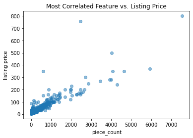

# Exploring Our Data

## Introduction 

In this lab we'll perform a full linear regression on our data. We'll take a stepwise approach and we'll try to improve our model as we go.

## Objectives
You will be able to:

* Remove predictors with p-values too high and refit the model
* Examine and interpret the model results
* Split data into training and testing sets
* Fit a regression model to the data set using statsmodel library


## Build single linear regression models

From the previous steps, it is pretty clear that we have quite a few predictors, but there are some issues with them. Linearity with the target "Weekly_Sales" wasn't apparent. If that's the case, it's always smart to start small, and go ahead and build linear regression models with just one input at the time. Somewhat like what we've done in section 10, let's look at some statistics for single linear regression models for all our *continuous* variables with the outcome.

**Note: for now, we will not use holdout validation, as we're just trying to gauge interpretation and a sense of predictive capacity for each of the candidate predictors**

### Load the cleaned dataset "walmart_dataset.csv", and check its contents 


```python
import pandas as pd
import matplotlib.pyplot as plt
import numpy as np
import seaborn as sns
plt.style.use('seaborn')
walmart = pd.read_csv('walmart_dataset_cleaned.csv')
walmart.head()
```


<div>
<style scoped>
    .dataframe tbody tr th:only-of-type {
        vertical-align: middle;
    }

    .dataframe tbody tr th {
        vertical-align: top;
    }

    .dataframe thead th {
        text-align: right;
    }
</style>
<table border="1" class="dataframe">
  <thead>
    <tr style="text-align: right;">
      <th></th>
      <th>Weekly_Sales</th>
      <th>IsHoliday</th>
      <th>Size</th>
      <th>Temperature</th>
      <th>Fuel_Price</th>
      <th>CPI</th>
      <th>Unemployment</th>
      <th>Store_1</th>
      <th>Store_10</th>
      <th>Store_2</th>
      <th>...</th>
      <th>binned_markdown_4_41-60%</th>
      <th>binned_markdown_4_61-80%</th>
      <th>binned_markdown_4_81-100%</th>
      <th>binned_markdown_4_NaN</th>
      <th>binned_markdown_5_0-20%</th>
      <th>binned_markdown_5_21-40%</th>
      <th>binned_markdown_5_41-60%</th>
      <th>binned_markdown_5_61-80%</th>
      <th>binned_markdown_5_81-100%</th>
      <th>binned_markdown_5_NaN</th>
    </tr>
  </thead>
  <tbody>
    <tr>
      <th>0</th>
      <td>24924.50</td>
      <td>False</td>
      <td>0.283436</td>
      <td>-1.301205</td>
      <td>-1.56024</td>
      <td>0.40349</td>
      <td>0.913194</td>
      <td>1</td>
      <td>0</td>
      <td>0</td>
      <td>...</td>
      <td>0</td>
      <td>0</td>
      <td>0</td>
      <td>1</td>
      <td>0</td>
      <td>0</td>
      <td>0</td>
      <td>0</td>
      <td>0</td>
      <td>1</td>
    </tr>
    <tr>
      <th>1</th>
      <td>50605.27</td>
      <td>False</td>
      <td>0.283436</td>
      <td>-1.301205</td>
      <td>-1.56024</td>
      <td>0.40349</td>
      <td>0.913194</td>
      <td>1</td>
      <td>0</td>
      <td>0</td>
      <td>...</td>
      <td>0</td>
      <td>0</td>
      <td>0</td>
      <td>1</td>
      <td>0</td>
      <td>0</td>
      <td>0</td>
      <td>0</td>
      <td>0</td>
      <td>1</td>
    </tr>
    <tr>
      <th>2</th>
      <td>13740.12</td>
      <td>False</td>
      <td>0.283436</td>
      <td>-1.301205</td>
      <td>-1.56024</td>
      <td>0.40349</td>
      <td>0.913194</td>
      <td>1</td>
      <td>0</td>
      <td>0</td>
      <td>...</td>
      <td>0</td>
      <td>0</td>
      <td>0</td>
      <td>1</td>
      <td>0</td>
      <td>0</td>
      <td>0</td>
      <td>0</td>
      <td>0</td>
      <td>1</td>
    </tr>
    <tr>
      <th>3</th>
      <td>39954.04</td>
      <td>False</td>
      <td>0.283436</td>
      <td>-1.301205</td>
      <td>-1.56024</td>
      <td>0.40349</td>
      <td>0.913194</td>
      <td>1</td>
      <td>0</td>
      <td>0</td>
      <td>...</td>
      <td>0</td>
      <td>0</td>
      <td>0</td>
      <td>1</td>
      <td>0</td>
      <td>0</td>
      <td>0</td>
      <td>0</td>
      <td>0</td>
      <td>1</td>
    </tr>
    <tr>
      <th>4</th>
      <td>32229.38</td>
      <td>False</td>
      <td>0.283436</td>
      <td>-1.301205</td>
      <td>-1.56024</td>
      <td>0.40349</td>
      <td>0.913194</td>
      <td>1</td>
      <td>0</td>
      <td>0</td>
      <td>...</td>
      <td>0</td>
      <td>0</td>
      <td>0</td>
      <td>1</td>
      <td>0</td>
      <td>0</td>
      <td>0</td>
      <td>0</td>
      <td>0</td>
      <td>1</td>
    </tr>
  </tbody>
</table>
<p>5 rows × 127 columns</p>
</div>


Let's pull up the info.


```python
walmart.info()
```

    <class 'pandas.core.frame.DataFrame'>
    RangeIndex: 97839 entries, 0 to 97838
    Columns: 127 entries, Weekly_Sales to binned_markdown_5_NaN
    dtypes: bool(1), float64(6), int64(120)
    memory usage: 94.1 MB


Note that the output for info is much smaller compared to what we usually see. Because we have so many columns, pandas is intentionally not showing the data types for each column. Let's use `info()` again, but now just on the first 15 columns of the data.


```python
walmart.iloc[:,0:15].info()
```

    <class 'pandas.core.frame.DataFrame'>
    RangeIndex: 97839 entries, 0 to 97838
    Data columns (total 15 columns):
    Weekly_Sales    97839 non-null float64
    IsHoliday       97839 non-null bool
    Size            97839 non-null float64
    Temperature     97839 non-null float64
    Fuel_Price      97839 non-null float64
    CPI             97839 non-null float64
    Unemployment    97839 non-null float64
    Store_1         97839 non-null int64
    Store_10        97839 non-null int64
    Store_2         97839 non-null int64
    Store_3         97839 non-null int64
    Store_4         97839 non-null int64
    Store_5         97839 non-null int64
    Store_6         97839 non-null int64
    Store_7         97839 non-null int64
    dtypes: bool(1), float64(6), int64(8)
    memory usage: 10.5 MB


Remember that all the columns from store_1 onwards are actually dummies, so categorical variables. Because we stored the data and loaded it in again, this information was lost. Let's make sure they become categorical again. You can write a for-loop to do this.


```python
for cat_names in walmart.iloc[:,7:].columns:
         walmart[cat_names] = walmart[cat_names].astype('category')
```

Let's make sure IsHoliday is a categorical variable as well.


```python
walmart["IsHoliday"] = walmart["IsHoliday"].astype('category')
```

Let's check the info again to make sure everything is OK now.


```python
walmart.iloc[:,0:15].info()
```

    <class 'pandas.core.frame.DataFrame'>
    RangeIndex: 97839 entries, 0 to 97838
    Data columns (total 15 columns):
    Weekly_Sales    97839 non-null float64
    IsHoliday       97839 non-null category
    Size            97839 non-null float64
    Temperature     97839 non-null float64
    Fuel_Price      97839 non-null float64
    CPI             97839 non-null float64
    Unemployment    97839 non-null float64
    Store_1         97839 non-null category
    Store_10        97839 non-null category
    Store_2         97839 non-null category
    Store_3         97839 non-null category
    Store_4         97839 non-null category
    Store_5         97839 non-null category
    Store_6         97839 non-null category
    Store_7         97839 non-null category
    dtypes: category(9), float64(6)
    memory usage: 5.3 MB


Great! you should see that the datatypes have changed to categories now! If you use `.describe` now, you should see only the remaining continuous variables in the data set.


```python
walmart.describe()
```


<div>
<style scoped>
    .dataframe tbody tr th:only-of-type {
        vertical-align: middle;
    }

    .dataframe tbody tr th {
        vertical-align: top;
    }

    .dataframe thead th {
        text-align: right;
    }
</style>
<table border="1" class="dataframe">
  <thead>
    <tr style="text-align: right;">
      <th></th>
      <th>Weekly_Sales</th>
      <th>Size</th>
      <th>Temperature</th>
      <th>Fuel_Price</th>
      <th>CPI</th>
      <th>Unemployment</th>
    </tr>
  </thead>
  <tbody>
    <tr>
      <th>count</th>
      <td>97839.000000</td>
      <td>9.783900e+04</td>
      <td>9.783900e+04</td>
      <td>9.783900e+04</td>
      <td>9.783900e+04</td>
      <td>9.783900e+04</td>
    </tr>
    <tr>
      <th>mean</th>
      <td>17223.235591</td>
      <td>-8.044340e-14</td>
      <td>2.339480e-13</td>
      <td>4.784098e-13</td>
      <td>-9.181116e-15</td>
      <td>1.795967e-12</td>
    </tr>
    <tr>
      <th>std</th>
      <td>25288.572553</td>
      <td>1.000000e+00</td>
      <td>1.000000e+00</td>
      <td>1.000000e+00</td>
      <td>1.000000e+00</td>
      <td>1.000000e+00</td>
    </tr>
    <tr>
      <th>min</th>
      <td>-1098.000000</td>
      <td>-1.611999e+00</td>
      <td>-3.843452e+00</td>
      <td>-1.691961e+00</td>
      <td>-1.958762e+00</td>
      <td>-2.776898e+00</td>
    </tr>
    <tr>
      <th>25%</th>
      <td>2336.485000</td>
      <td>-1.028620e+00</td>
      <td>-7.087592e-01</td>
      <td>-1.053793e+00</td>
      <td>-1.266966e-01</td>
      <td>-6.503157e-01</td>
    </tr>
    <tr>
      <th>50%</th>
      <td>7658.280000</td>
      <td>2.834360e-01</td>
      <td>1.340726e-01</td>
      <td>1.180741e-01</td>
      <td>4.995210e-01</td>
      <td>-4.621274e-02</td>
    </tr>
    <tr>
      <th>75%</th>
      <td>20851.275000</td>
      <td>1.113495e+00</td>
      <td>8.680410e-01</td>
      <td>8.243739e-01</td>
      <td>6.346144e-01</td>
      <td>7.089160e-01</td>
    </tr>
    <tr>
      <th>max</th>
      <td>693099.360000</td>
      <td>1.171380e+00</td>
      <td>1.738375e+00</td>
      <td>2.745691e+00</td>
      <td>8.517705e-01</td>
      <td>2.361469e+00</td>
    </tr>
  </tbody>
</table>
</div>


### Use a for-loop to look at some results for each linear regression model 

Let's use ordinary least squares in statsmodels at this stage.
Import `statsmodels.formula.api` to get started


```python
import statsmodels.formula.api as smf
```

Create a loop that for each iteration:
* Runs a simple OLS regression between (continuous) independent and dependent variables
* Store following values in array for each iteration
    * Target variable
    * R_squared
    * intercept
    * slope
    * p-value
* Comment on each output 


```python
walmart.describe().columns.drop(['Weekly_Sales'])
```


    Index(['Size', 'Temperature', 'Fuel_Price', 'CPI', 'Unemployment'], dtype='object')


```python
col_names = walmart.describe().columns.drop(['Weekly_Sales'])
results = [['ind_var', 'r_squared', 'intercept', 'slope', 'p-value' ]]
for idx, val in enumerate(col_names):
    print ("Walmart: Weekly_Sales~" + val)
    print ("------------------------------")

    f = 'Weekly_Sales~' + val
    model = smf.ols(formula=f, data=walmart).fit()
    X_new = pd.DataFrame({val: [walmart[val].min(), walmart[val].max()]});
    preds = model.predict(X_new)
    results.append([val, model.rsquared, model.params[0], model.params[1], model.pvalues[1] ])
    print(results[idx+1])
```

    Walmart: Weekly_Sales~Size
    ------------------------------
    ['Size', 0.08577198301194688, 17223.235590817574, 7406.227377928731, 0.0]
    Walmart: Weekly_Sales~Temperature
    ------------------------------
    ['Temperature', 0.0010145286600620196, 17223.235590817378, 805.4831797034258, 2.160985815455031e-23]
    Walmart: Weekly_Sales~Fuel_Price
    ------------------------------
    ['Fuel_Price', 0.0008029403665876789, 17223.23559081722, 716.5821103232286, 7.649612001164972e-19]
    Walmart: Weekly_Sales~CPI
    ------------------------------
    ['CPI', 0.039410515354354136, 17223.235590817498, -5020.308120380828, 0.0]
    Walmart: Weekly_Sales~Unemployment
    ------------------------------
    ['Unemployment', 0.0008517114683166405, 17223.235590816257, 738.024132974606, 6.825456986291679e-20]


```python
pd.DataFrame(results)
```


<div>
<style scoped>
    .dataframe tbody tr th:only-of-type {
        vertical-align: middle;
    }

    .dataframe tbody tr th {
        vertical-align: top;
    }

    .dataframe thead th {
        text-align: right;
    }
</style>
<table border="1" class="dataframe">
  <thead>
    <tr style="text-align: right;">
      <th></th>
      <th>0</th>
      <th>1</th>
      <th>2</th>
      <th>3</th>
      <th>4</th>
    </tr>
  </thead>
  <tbody>
    <tr>
      <th>0</th>
      <td>ind_var</td>
      <td>r_squared</td>
      <td>intercept</td>
      <td>slope</td>
      <td>p-value</td>
    </tr>
    <tr>
      <th>1</th>
      <td>Size</td>
      <td>0.085772</td>
      <td>17223.2</td>
      <td>7406.23</td>
      <td>0</td>
    </tr>
    <tr>
      <th>2</th>
      <td>Temperature</td>
      <td>0.00101453</td>
      <td>17223.2</td>
      <td>805.483</td>
      <td>2.16099e-23</td>
    </tr>
    <tr>
      <th>3</th>
      <td>Fuel_Price</td>
      <td>0.00080294</td>
      <td>17223.2</td>
      <td>716.582</td>
      <td>7.64961e-19</td>
    </tr>
    <tr>
      <th>4</th>
      <td>CPI</td>
      <td>0.0394105</td>
      <td>17223.2</td>
      <td>-5020.31</td>
      <td>0</td>
    </tr>
    <tr>
      <th>5</th>
      <td>Unemployment</td>
      <td>0.000851711</td>
      <td>17223.2</td>
      <td>738.024</td>
      <td>6.82546e-20</td>
    </tr>
  </tbody>
</table>
</div>


Think about your results. 
- What do the parameter estimates mean? Do they make sense? 
- What do the p-values tell us?
- What does the R-squared tell us?

## Our R-squared values are low, let's try to solve this

Something we haven't considered before, is taking log-transformations to make certain data less skewed. Let's take a quick look at our summarizing histograms. 


```python
walmart.hist(figsize= [8,8]);
```





Interestingly the most problematic variable in terms of skewness seems to be weekly sales itself. Does it make sense to log-transform this variable? It definitely doesn't hurt to try! Let's have a look below. what do you see?


```python
np.log(walmart["Weekly_Sales"]).describe()
```

    /Users/lore.dirick/anaconda3/lib/python3.6/site-packages/ipykernel_launcher.py:1: RuntimeWarning: divide by zero encountered in log
      """Entry point for launching an IPython kernel.
    /Users/lore.dirick/anaconda3/lib/python3.6/site-packages/ipykernel_launcher.py:1: RuntimeWarning: invalid value encountered in log
      """Entry point for launching an IPython kernel.


    count    9.763100e+04
    mean             -inf
    std               NaN
    min              -inf
    25%      7.765571e+00
    50%      8.948268e+00
    75%      9.947998e+00
    max      1.344893e+01
    Name: Weekly_Sales, dtype: float64


That's right, we have some negative `Weekly_Sales` values! Let's check how many we have.


```python
sum(walmart["Weekly_Sales"]<=0)
```


    224


Let's remove these 224 rows so we can take the log


```python
walmart_log= walmart[walmart["Weekly_Sales"]>0]
```


```python
walmart_log["Weekly_Sales"]= np.log(walmart_log["Weekly_Sales"])
```

    /Users/lore.dirick/anaconda3/lib/python3.6/site-packages/ipykernel_launcher.py:1: SettingWithCopyWarning: 
    A value is trying to be set on a copy of a slice from a DataFrame.
    Try using .loc[row_indexer,col_indexer] = value instead
    
    See the caveats in the documentation: http://pandas.pydata.org/pandas-docs/stable/indexing.html#indexing-view-versus-copy
      """Entry point for launching an IPython kernel.


```python
walmart_log["Weekly_Sales"].hist()
```


    <matplotlib.axes._subplots.AxesSubplot at 0x1a1738ed30>


```python
col_names = walmart_log.describe().columns.drop(['Weekly_Sales'])
results_log = [['ind_var', 'r_squared', 'intercept', 'slope', 'p-value' ]]
for idx, val in enumerate(col_names):
    print ("Walmart: Weekly_Sales~" + val)
    print ("------------------------------")

    f = 'Weekly_Sales~' + val
    model = smf.ols(formula=f, data=walmart_log).fit()
    X_new = pd.DataFrame({val: [walmart_log[val].min(), walmart_log[val].max()]});
    preds = model.predict(X_new)
    results_log.append([val, model.rsquared, model.params[0], model.params[1], model.pvalues[1] ])
    print(results_log[idx+1])
```

    Walmart: Weekly_Sales~Size
    ------------------------------
    ['Size', 0.13842560369451928, 7.0105699064147915, 0.0003543955481406758, 0.0]
    Walmart: Weekly_Sales~Temperature
    ------------------------------
    ['Temperature', 0.0013008289800108264, 7.010569906414789, 3.435501531059851e-05, 1.5562756540636607e-29]
    Walmart: Weekly_Sales~Fuel_Price
    ------------------------------
    ['Fuel_Price', 0.0009842247688323091, 7.010569906414787, 2.9883206073272025e-05, 9.672971254505951e-23]
    Walmart: Weekly_Sales~CPI
    ------------------------------
    ['CPI', 0.04205486723652241, 7.010569906414787, -0.00019533864812340703, 0.0]
    Walmart: Weekly_Sales~Unemployment
    ------------------------------
    ['Unemployment', 0.0009194339667438767, 7.010569906414791, 2.8882868074166605e-05, 2.3869265126488507e-21]


```python
pd.DataFrame(results)
```


<div>
<style scoped>
    .dataframe tbody tr th:only-of-type {
        vertical-align: middle;
    }

    .dataframe tbody tr th {
        vertical-align: top;
    }

    .dataframe thead th {
        text-align: right;
    }
</style>
<table border="1" class="dataframe">
  <thead>
    <tr style="text-align: right;">
      <th></th>
      <th>0</th>
      <th>1</th>
      <th>2</th>
      <th>3</th>
      <th>4</th>
    </tr>
  </thead>
  <tbody>
    <tr>
      <th>0</th>
      <td>ind_var</td>
      <td>r_squared</td>
      <td>intercept</td>
      <td>slope</td>
      <td>p-value</td>
    </tr>
    <tr>
      <th>1</th>
      <td>Size</td>
      <td>0.085772</td>
      <td>17223.2</td>
      <td>7406.23</td>
      <td>0</td>
    </tr>
    <tr>
      <th>2</th>
      <td>Temperature</td>
      <td>0.00101453</td>
      <td>17223.2</td>
      <td>805.483</td>
      <td>2.16099e-23</td>
    </tr>
    <tr>
      <th>3</th>
      <td>Fuel_Price</td>
      <td>0.00080294</td>
      <td>17223.2</td>
      <td>716.582</td>
      <td>7.64961e-19</td>
    </tr>
    <tr>
      <th>4</th>
      <td>CPI</td>
      <td>0.0394105</td>
      <td>17223.2</td>
      <td>-5020.31</td>
      <td>0</td>
    </tr>
    <tr>
      <th>5</th>
      <td>Unemployment</td>
      <td>0.000851711</td>
      <td>17223.2</td>
      <td>738.024</td>
      <td>6.82546e-20</td>
    </tr>
  </tbody>
</table>
</div>


```python
pd.DataFrame(results_log)
```


<div>
<style scoped>
    .dataframe tbody tr th:only-of-type {
        vertical-align: middle;
    }

    .dataframe tbody tr th {
        vertical-align: top;
    }

    .dataframe thead th {
        text-align: right;
    }
</style>
<table border="1" class="dataframe">
  <thead>
    <tr style="text-align: right;">
      <th></th>
      <th>0</th>
      <th>1</th>
      <th>2</th>
      <th>3</th>
      <th>4</th>
    </tr>
  </thead>
  <tbody>
    <tr>
      <th>0</th>
      <td>ind_var</td>
      <td>r_squared</td>
      <td>intercept</td>
      <td>slope</td>
      <td>p-value</td>
    </tr>
    <tr>
      <th>1</th>
      <td>Size</td>
      <td>0.138426</td>
      <td>7.01057</td>
      <td>0.000354396</td>
      <td>0</td>
    </tr>
    <tr>
      <th>2</th>
      <td>Temperature</td>
      <td>0.00130083</td>
      <td>7.01057</td>
      <td>3.4355e-05</td>
      <td>1.55628e-29</td>
    </tr>
    <tr>
      <th>3</th>
      <td>Fuel_Price</td>
      <td>0.000984225</td>
      <td>7.01057</td>
      <td>2.98832e-05</td>
      <td>9.67297e-23</td>
    </tr>
    <tr>
      <th>4</th>
      <td>CPI</td>
      <td>0.0420549</td>
      <td>7.01057</td>
      <td>-0.000195339</td>
      <td>0</td>
    </tr>
    <tr>
      <th>5</th>
      <td>Unemployment</td>
      <td>0.000919434</td>
      <td>7.01057</td>
      <td>2.88829e-05</td>
      <td>2.38693e-21</td>
    </tr>
  </tbody>
</table>
</div>


- compare and contract the results with the results obtained when we did not take the log(sales)
- Which one would you want to proceed with based on this?

## Build a model with each categorical variable as a predictor

- Use it on the log-transformed, and the regular `Weekly_Sales`
- put all categories for one categorical variable in 1 model, so we want 4 models.
- remember that we have 4 categorical variables: `Store`,  `Dept`, `IsHoliday` and `Type`( we're for now ignoring the `binned_markdown` categories, you can add then later on as an extension)
- IMPORTANT: remember that we made dummies for `Type`, `Dept` and `Store` columns. You'll need to drop 1 column for each of these if you want good results. The reason for this is that singularity will occur and . This is related to what we mentioned earlier on in section 11. Don't worry about the "why" for now, just make sure to drop 1 column and you should be fine! The parameter value for the dropper "base category" will be absorbed in the intercept.


```python
cols_store= walmart.columns[7:16]
cols_dept = walmart.columns[17:95]
cols_type = walmart.columns[96:97]
cols_holiday = walmart.columns[1:2] 

cols = [cols_store, cols_dept , cols_type, cols_holiday]
for col in cols:
    sum_cols = "+".join(col)
    form = "Weekly_Sales ~" + sum_cols
    model = smf.ols(formula= form, data= walmart).fit()
    print(model.summary())
```

                                OLS Regression Results                            
    ==============================================================================
    Dep. Variable:           Weekly_Sales   R-squared:                       0.123
    Model:                            OLS   Adj. R-squared:                  0.123
    Method:                 Least Squares   F-statistic:                     1519.
    Date:                Wed, 17 Oct 2018   Prob (F-statistic):               0.00
    Time:                        04:35:32   Log-Likelihood:            -1.1243e+06
    No. Observations:               97839   AIC:                         2.249e+06
    Df Residuals:                   97829   BIC:                         2.249e+06
    Df Model:                           9                                         
    Covariance Type:            nonrobust                                         
    =================================================================================
                        coef    std err          t      P>|t|      [0.025      0.975]
    ---------------------------------------------------------------------------------
    Intercept      8772.8904    251.567     34.873      0.000    8279.823    9265.958
    Store_1[T.1]   1.294e+04    343.605     37.653      0.000    1.23e+04    1.36e+04
    Store_10[T.1]  1.756e+04    343.056     51.185      0.000    1.69e+04    1.82e+04
    Store_2[T.1]   1.813e+04    343.652     52.743      0.000    1.75e+04    1.88e+04
    Store_3[T.1]  -2399.8564    354.101     -6.777      0.000   -3093.891   -1705.822
    Store_4[T.1]   2.039e+04    343.388     59.374      0.000    1.97e+04    2.11e+04
    Store_5[T.1]  -3719.4746    354.462    -10.493      0.000   -4414.216   -3024.734
    Store_6[T.1]   1.314e+04    343.863     38.214      0.000    1.25e+04    1.38e+04
    Store_7[T.1]   -414.1242    347.519     -1.192      0.233   -1095.257     267.009
    Store_8[T.1]   4360.1244    346.405     12.587      0.000    3681.174    5039.075
    ==============================================================================
    Omnibus:                    71899.334   Durbin-Watson:                   1.297
    Prob(Omnibus):                  0.000   Jarque-Bera (JB):          2578164.480
    Skew:                           3.158   Prob(JB):                         0.00
    Kurtosis:                      27.342   Cond. No.                         11.4
    ==============================================================================
    
    Warnings:
    [1] Standard Errors assume that the covariance matrix of the errors is correctly specified.
                                OLS Regression Results                            
    ==============================================================================
    Dep. Variable:           Weekly_Sales   R-squared:                       0.503
    Model:                            OLS   Adj. R-squared:                  0.503
    Method:                 Least Squares   F-statistic:                     1269.
    Date:                Wed, 17 Oct 2018   Prob (F-statistic):               0.00
    Time:                        04:35:33   Log-Likelihood:            -1.0965e+06
    No. Observations:               97839   AIC:                         2.193e+06
    Df Residuals:                   97760   BIC:                         2.194e+06
    Df Model:                          78                                         
    Covariance Type:            nonrobust                                         
    ================================================================================
                       coef    std err          t      P>|t|      [0.025      0.975]
    --------------------------------------------------------------------------------
    Intercept      423.7693   1270.654      0.334      0.739   -2066.698    2914.236
    Dept_1[T.1]   2.031e+04   1355.355     14.986      0.000    1.77e+04     2.3e+04
    Dept_10[T.1]  2.737e+04   1355.355     20.196      0.000    2.47e+04       3e+04
    Dept_11[T.1]  1.909e+04   1355.355     14.083      0.000    1.64e+04    2.17e+04
    Dept_12[T.1]  6230.4916   1355.355      4.597      0.000    3574.012    8886.971
    Dept_13[T.1]  3.356e+04   1355.355     24.763      0.000    3.09e+04    3.62e+04
    Dept_14[T.1]  1.631e+04   1355.355     12.035      0.000    1.37e+04     1.9e+04
    Dept_16[T.1]  1.846e+04   1355.355     13.617      0.000    1.58e+04    2.11e+04
    Dept_17[T.1]  1.011e+04   1355.355      7.460      0.000    7454.922    1.28e+04
    Dept_18[T.1]  7901.0587   1379.372      5.728      0.000    5197.506    1.06e+04
    Dept_19[T.1]  1567.0310   1366.897      1.146      0.252   -1112.071    4246.133
    Dept_2[T.1]   4.739e+04   1355.355     34.968      0.000    4.47e+04    5.01e+04
    Dept_20[T.1]  5171.2095   1355.355      3.815      0.000    2514.730    7827.689
    Dept_21[T.1]  5417.0979   1355.355      3.997      0.000    2760.618    8073.578
    Dept_22[T.1]  1.029e+04   1355.355      7.593      0.000    7634.078    1.29e+04
    Dept_23[T.1]  2.459e+04   1355.355     18.146      0.000    2.19e+04    2.73e+04
    Dept_24[T.1]  5680.9937   1355.355      4.192      0.000    3024.514    8337.473
    Dept_25[T.1]  9594.6328   1355.355      7.079      0.000    6938.153    1.23e+04
    Dept_26[T.1]  7337.3558   1355.355      5.414      0.000    4680.876    9993.836
    Dept_27[T.1]  1086.3982   1355.355      0.802      0.423   -1570.082    3742.878
    Dept_28[T.1]   110.0078   1355.355      0.081      0.935   -2546.472    2766.488
    Dept_29[T.1]  4861.8289   1355.355      3.587      0.000    2205.349    7518.309
    Dept_3[T.1]   1.307e+04   1355.355      9.645      0.000    1.04e+04    1.57e+04
    Dept_30[T.1]  3549.3742   1355.355      2.619      0.009     892.894    6205.854
    Dept_31[T.1]  2108.9331   1355.355      1.556      0.120    -547.547    4765.413
    Dept_32[T.1]  8473.6476   1355.355      6.252      0.000    5817.168    1.11e+04
    Dept_33[T.1]  5841.9874   1355.355      4.310      0.000    3185.508    8498.467
    Dept_34[T.1]  1.388e+04   1355.355     10.243      0.000    1.12e+04    1.65e+04
    Dept_35[T.1]  2502.9555   1355.355      1.847      0.065    -153.524    5159.435
    Dept_36[T.1]  1487.4397   1355.412      1.097      0.272   -1169.153    4144.032
    Dept_37[T.1]  3101.2589   1408.996      2.201      0.028     339.643    5862.875
    Dept_38[T.1]  7.396e+04   1355.355     54.571      0.000    7.13e+04    7.66e+04
    Dept_39[T.1]  -421.5853   8076.403     -0.052      0.958   -1.63e+04    1.54e+04
    Dept_4[T.1]   2.892e+04   1355.355     21.338      0.000    2.63e+04    3.16e+04
    Dept_40[T.1]  5.132e+04   1355.355     37.865      0.000    4.87e+04     5.4e+04
    Dept_41[T.1]  1884.4462   1355.355      1.390      0.164    -772.034    4540.926
    Dept_42[T.1]  6517.9654   1355.355      4.809      0.000    3861.486    9174.445
    Dept_44[T.1]  4402.3272   1355.355      3.248      0.001    1745.847    7058.807
    Dept_45[T.1]  -398.7865   1488.565     -0.268      0.789   -3316.356    2518.783
    Dept_46[T.1]  2.182e+04   1355.355     16.103      0.000    1.92e+04    2.45e+04
    Dept_47[T.1]  -446.0262   1849.803     -0.241      0.809   -4071.617    3179.565
    Dept_48[T.1]  1197.6152   1412.133      0.848      0.396   -1570.148    3965.378
    Dept_49[T.1]  8384.9021   1378.527      6.083      0.000    5683.005    1.11e+04
    Dept_5[T.1]   2.605e+04   1355.355     19.217      0.000    2.34e+04    2.87e+04
    Dept_50[T.1]  3833.8910   1959.290      1.957      0.050      -6.295    7674.076
    Dept_51[T.1]  -403.9200   1783.648     -0.226      0.821   -3899.850    3092.010
    Dept_52[T.1]  2176.8167   1355.355      1.606      0.108    -479.663    4833.296
    Dept_54[T.1]  -319.3397   1366.971     -0.234      0.815   -2998.587    2359.908
    Dept_55[T.1]  1.102e+04   1355.355      8.132      0.000    8364.924    1.37e+04
    Dept_56[T.1]  3660.4750   1355.470      2.701      0.007    1003.770    6317.180
    Dept_58[T.1]  5198.1371   1383.191      3.758      0.000    2487.099    7909.175
    Dept_59[T.1]   443.0442   1362.310      0.325      0.745   -2227.067    3113.156
    Dept_6[T.1]   4913.1605   1355.355      3.625      0.000    2256.681    7569.640
    Dept_60[T.1]   -87.7371   1363.329     -0.064      0.949   -2759.846    2584.372
    Dept_67[T.1]  7068.8597   1355.355      5.216      0.000    4412.380    9725.340
    Dept_7[T.1]   2.662e+04   1355.355     19.642      0.000     2.4e+04    2.93e+04
    Dept_71[T.1]  3997.6752   1355.355      2.950      0.003    1341.195    6654.155
    Dept_72[T.1]  5.894e+04   1355.355     43.489      0.000    5.63e+04    6.16e+04
    Dept_74[T.1]  1.419e+04   1355.355     10.473      0.000    1.15e+04    1.69e+04
    Dept_77[T.1]    67.4900   3547.174      0.019      0.985   -6884.930    7019.910
    Dept_78[T.1]  -416.0115   2739.475     -0.152      0.879   -5785.350    4953.326
    Dept_79[T.1]  2.286e+04   1355.355     16.868      0.000    2.02e+04    2.55e+04
    Dept_8[T.1]   3.713e+04   1355.355     27.398      0.000    3.45e+04    3.98e+04
    Dept_80[T.1]  1.153e+04   1386.639      8.314      0.000    8810.613    1.42e+04
    Dept_81[T.1]  1.391e+04   1355.355     10.263      0.000    1.13e+04    1.66e+04
    Dept_82[T.1]   1.59e+04   1355.355     11.734      0.000    1.32e+04    1.86e+04
    Dept_83[T.1]  3595.9717   1390.305      2.586      0.010     870.990    6320.953
    Dept_85[T.1]  1853.0516   1355.355      1.367      0.172    -803.428    4509.531
    Dept_87[T.1]  2.024e+04   1355.355     14.935      0.000    1.76e+04    2.29e+04
    Dept_9[T.1]    2.77e+04   1355.355     20.440      0.000     2.5e+04    3.04e+04
    Dept_90[T.1]  3.938e+04   1355.355     29.057      0.000    3.67e+04     4.2e+04
    Dept_91[T.1]  3.096e+04   1355.355     22.840      0.000    2.83e+04    3.36e+04
    Dept_92[T.1]  7.213e+04   1355.355     53.222      0.000    6.95e+04    7.48e+04
    Dept_93[T.1]  3.974e+04   1389.848     28.594      0.000     3.7e+04    4.25e+04
    Dept_94[T.1]  3.367e+04   1376.696     24.456      0.000     3.1e+04    3.64e+04
    Dept_95[T.1]  7.317e+04   1355.355     53.988      0.000    7.05e+04    7.58e+04
    Dept_96[T.1]  1.729e+04   1365.726     12.661      0.000    1.46e+04       2e+04
    Dept_97[T.1]  1.789e+04   1365.151     13.102      0.000    1.52e+04    2.06e+04
    Dept_98[T.1]  7545.9584   1385.890      5.445      0.000    4829.630    1.03e+04
    ==============================================================================
    Omnibus:                    71368.627   Durbin-Watson:                   0.888
    Prob(Omnibus):                  0.000   Jarque-Bera (JB):          8933238.469
    Skew:                           2.697   Prob(JB):                         0.00
    Kurtosis:                      49.500   Cond. No.                         201.
    ==============================================================================
    
    Warnings:
    [1] Standard Errors assume that the covariance matrix of the errors is correctly specified.
                                OLS Regression Results                            
    ==============================================================================
    Dep. Variable:           Weekly_Sales   R-squared:                       0.050
    Model:                            OLS   Adj. R-squared:                  0.050
    Method:                 Least Squares   F-statistic:                     5097.
    Date:                Wed, 17 Oct 2018   Prob (F-statistic):               0.00
    Time:                        04:35:33   Log-Likelihood:            -1.1282e+06
    No. Observations:               97839   AIC:                         2.256e+06
    Df Residuals:                   97837   BIC:                         2.257e+06
    Df Model:                           1                                         
    Covariance Type:            nonrobust                                         
    ===============================================================================
                      coef    std err          t      P>|t|      [0.025      0.975]
    -------------------------------------------------------------------------------
    Intercept    1.137e+04    113.749     99.941      0.000    1.11e+04    1.16e+04
    Type_A[T.1]  1.126e+04    157.767     71.392      0.000     1.1e+04    1.16e+04
    ==============================================================================
    Omnibus:                    73545.565   Durbin-Watson:                   1.197
    Prob(Omnibus):                  0.000   Jarque-Bera (JB):          2462495.982
    Skew:                           3.299   Prob(JB):                         0.00
    Kurtosis:                      26.675   Cond. No.                         2.67
    ==============================================================================
    
    Warnings:
    [1] Standard Errors assume that the covariance matrix of the errors is correctly specified.
                                OLS Regression Results                            
    ==============================================================================
    Dep. Variable:           Weekly_Sales   R-squared:                       0.000
    Model:                            OLS   Adj. R-squared:                  0.000
    Method:                 Least Squares   F-statistic:                     21.05
    Date:                Wed, 17 Oct 2018   Prob (F-statistic):           4.47e-06
    Time:                        04:35:33   Log-Likelihood:            -1.1307e+06
    No. Observations:               97839   AIC:                         2.261e+06
    Df Residuals:                   97837   BIC:                         2.261e+06
    Df Model:                           1                                         
    Covariance Type:            nonrobust                                         
    =====================================================================================
                            coef    std err          t      P>|t|      [0.025      0.975]
    -------------------------------------------------------------------------------------
    Intercept          1.712e+04     83.851    204.184      0.000     1.7e+04    1.73e+04
    IsHoliday[T.True]  1448.6105    315.703      4.589      0.000     829.837    2067.384
    ==============================================================================
    Omnibus:                    72236.950   Durbin-Watson:                   1.138
    Prob(Omnibus):                  0.000   Jarque-Bera (JB):          2092730.538
    Skew:                           3.265   Prob(JB):                         0.00
    Kurtosis:                      24.696   Cond. No.                         3.93
    ==============================================================================
    
    Warnings:
    [1] Standard Errors assume that the covariance matrix of the errors is correctly specified.


```python
cols_store= walmart.columns[7:16]
cols_dept = walmart.columns[17:95]
cols_type = walmart.columns[96:97]
cols_holiday = walmart.columns[1:2] 

cols = [cols_store, cols_dept , cols_type, cols_holiday]
for col in cols:
    sum_cols = "+".join(col)
    form = "Weekly_Sales ~" + sum_cols
    model = smf.ols(formula= form, data= walmart_log).fit()
    print(model.summary())
```

                                OLS Regression Results                            
    ==============================================================================
    Dep. Variable:           Weekly_Sales   R-squared:                       0.128
    Model:                            OLS   Adj. R-squared:                  0.128
    Method:                 Least Squares   F-statistic:                     1591.
    Date:                Wed, 17 Oct 2018   Prob (F-statistic):               0.00
    Time:                        04:37:43   Log-Likelihood:            -1.9258e+05
    No. Observations:               97615   AIC:                         3.852e+05
    Df Residuals:                   97605   BIC:                         3.853e+05
    Df Model:                           9                                         
    Covariance Type:            nonrobust                                         
    =================================================================================
                        coef    std err          t      P>|t|      [0.025      0.975]
    ---------------------------------------------------------------------------------
    Intercept         8.1670      0.019    441.138      0.000       8.131       8.203
    Store_1[T.1]      0.8717      0.025     34.489      0.000       0.822       0.921
    Store_10[T.1]     1.0649      0.025     42.165      0.000       1.015       1.114
    Store_2[T.1]      1.1722      0.025     46.365      0.000       1.123       1.222
    Store_3[T.1]     -0.4928      0.026    -18.923      0.000      -0.544      -0.442
    Store_4[T.1]      1.2261      0.025     48.556      0.000       1.177       1.276
    Store_5[T.1]     -0.5693      0.026    -21.833      0.000      -0.620      -0.518
    Store_6[T.1]      1.0678      0.025     42.213      0.000       1.018       1.117
    Store_7[T.1]     -0.1389      0.026     -5.431      0.000      -0.189      -0.089
    Store_8[T.1]      0.4945      0.025     19.411      0.000       0.445       0.544
    ==============================================================================
    Omnibus:                    28899.366   Durbin-Watson:                   1.536
    Prob(Omnibus):                  0.000   Jarque-Bera (JB):           101987.299
    Skew:                          -1.476   Prob(JB):                         0.00
    Kurtosis:                       7.045   Cond. No.                         11.4
    ==============================================================================
    
    Warnings:
    [1] Standard Errors assume that the covariance matrix of the errors is correctly specified.
                                OLS Regression Results                            
    ==============================================================================
    Dep. Variable:           Weekly_Sales   R-squared:                       0.624
    Model:                            OLS   Adj. R-squared:                  0.624
    Method:                 Least Squares   F-statistic:                     2074.
    Date:                Wed, 17 Oct 2018   Prob (F-statistic):               0.00
    Time:                        04:37:44   Log-Likelihood:            -1.5153e+05
    No. Observations:               97615   AIC:                         3.032e+05
    Df Residuals:                   97536   BIC:                         3.040e+05
    Df Model:                          78                                         
    Covariance Type:            nonrobust                                         
    ================================================================================
                       coef    std err          t      P>|t|      [0.025      0.975]
    --------------------------------------------------------------------------------
    Intercept        3.5250      0.082     42.947      0.000       3.364       3.686
    Dept_1[T.1]      6.1872      0.087     70.738      0.000       6.016       6.359
    Dept_10[T.1]     6.5483      0.087     74.867      0.000       6.377       6.720
    Dept_11[T.1]     6.2272      0.087     71.195      0.000       6.056       6.399
    Dept_12[T.1]     5.1626      0.087     59.024      0.000       4.991       5.334
    Dept_13[T.1]     6.7177      0.087     76.803      0.000       6.546       6.889
    Dept_14[T.1]     5.9002      0.087     67.457      0.000       5.729       6.072
    Dept_16[T.1]     5.9452      0.087     67.971      0.000       5.774       6.117
    Dept_17[T.1]     5.4518      0.087     62.330      0.000       5.280       5.623
    Dept_18[T.1]     3.2716      0.089     36.700      0.000       3.097       3.446
    Dept_19[T.1]     3.6106      0.088     40.925      0.000       3.438       3.784
    Dept_2[T.1]      7.0202      0.087     80.261      0.000       6.849       7.192
    Dept_20[T.1]     4.8027      0.087     54.909      0.000       4.631       4.974
    Dept_21[T.1]     4.8653      0.087     55.625      0.000       4.694       5.037
    Dept_22[T.1]     5.4612      0.087     62.438      0.000       5.290       5.633
    Dept_23[T.1]     6.3335      0.087     72.411      0.000       6.162       6.505
    Dept_24[T.1]     4.8686      0.087     55.663      0.000       4.697       5.040
    Dept_25[T.1]     5.4723      0.087     62.565      0.000       5.301       5.644
    Dept_26[T.1]     5.1058      0.087     58.374      0.000       4.934       5.277
    Dept_27[T.1]     3.4421      0.087     39.353      0.000       3.271       3.613
    Dept_28[T.1]     2.4321      0.087     27.806      0.000       2.261       2.604
    Dept_29[T.1]     4.6629      0.087     53.311      0.000       4.491       4.834
    Dept_3[T.1]      5.6884      0.087     65.035      0.000       5.517       5.860
    Dept_30[T.1]     4.3979      0.087     50.281      0.000       4.226       4.569
    Dept_31[T.1]     3.9783      0.087     45.483      0.000       3.807       4.150
    Dept_32[T.1]     5.2895      0.087     60.472      0.000       5.118       5.461
    Dept_33[T.1]     4.9206      0.087     56.257      0.000       4.749       5.092
    Dept_34[T.1]     5.7016      0.087     65.186      0.000       5.530       5.873
    Dept_35[T.1]     4.1091      0.087     46.977      0.000       3.938       4.281
    Dept_36[T.1]     3.4955      0.087     39.956      0.000       3.324       3.667
    Dept_37[T.1]     4.6055      0.091     50.675      0.000       4.427       4.784
    Dept_38[T.1]     7.6361      0.087     87.303      0.000       7.465       7.808
    Dept_39[T.1]    -3.1953      0.518     -6.171      0.000      -4.210      -2.180
    Dept_4[T.1]      6.5681      0.087     75.093      0.000       6.397       6.740
    Dept_40[T.1]     7.1694      0.087     81.967      0.000       6.998       7.341
    Dept_41[T.1]     3.5359      0.087     40.425      0.000       3.364       3.707
    Dept_42[T.1]     5.2128      0.087     59.598      0.000       5.041       5.384
    Dept_44[T.1]     4.7871      0.087     54.730      0.000       4.616       4.958
    Dept_45[T.1]    -0.6790      0.096     -7.066      0.000      -0.867      -0.491
    Dept_46[T.1]     6.2029      0.087     70.918      0.000       6.031       6.374
    Dept_47[T.1]     0.6717      0.140      4.804      0.000       0.398       0.946
    Dept_48[T.1]     3.5379      0.091     38.834      0.000       3.359       3.716
    Dept_49[T.1]     4.2582      0.089     47.864      0.000       4.084       4.433
    Dept_5[T.1]      6.4041      0.087     73.218      0.000       6.233       6.576
    Dept_50[T.1]     4.8240      0.126     38.286      0.000       4.577       5.071
    Dept_51[T.1]    -1.4362      0.115    -12.497      0.000      -1.661      -1.211
    Dept_52[T.1]     4.0841      0.087     46.693      0.000       3.913       4.256
    Dept_54[T.1]     0.5819      0.088      6.586      0.000       0.409       0.755
    Dept_55[T.1]     5.6058      0.087     64.091      0.000       5.434       5.777
    Dept_56[T.1]     3.9199      0.087     44.810      0.000       3.748       4.091
    Dept_58[T.1]     4.4686      0.089     50.075      0.000       4.294       4.644
    Dept_59[T.1]     2.0382      0.088     23.157      0.000       1.866       2.211
    Dept_6[T.1]      4.7478      0.087     54.277      0.000       4.576       4.919
    Dept_60[T.1]     1.9082      0.088     21.688      0.000       1.736       2.081
    Dept_67[T.1]     5.1331      0.087     58.687      0.000       4.962       5.305
    Dept_7[T.1]      6.3196      0.087     72.252      0.000       6.148       6.491
    Dept_71[T.1]     4.3701      0.087     49.963      0.000       4.199       4.542
    Dept_72[T.1]     7.1710      0.087     81.986      0.000       7.000       7.342
    Dept_74[T.1]     5.7770      0.087     66.048      0.000       5.606       5.948
    Dept_77[T.1]     2.3249      0.239      9.738      0.000       1.857       2.793
    Dept_78[T.1]    -1.4447      0.191     -7.568      0.000      -1.819      -1.071
    Dept_79[T.1]     6.2467      0.087     71.418      0.000       6.075       6.418
    Dept_8[T.1]      6.7632      0.087     77.324      0.000       6.592       6.935
    Dept_80[T.1]     4.7921      0.089     53.555      0.000       4.617       4.967
    Dept_81[T.1]     5.5694      0.087     63.674      0.000       5.398       5.741
    Dept_82[T.1]     5.9775      0.087     68.341      0.000       5.806       6.149
    Dept_83[T.1]     4.2251      0.090     47.107      0.000       4.049       4.401
    Dept_85[T.1]     4.0244      0.087     46.011      0.000       3.853       4.196
    Dept_87[T.1]     6.0459      0.087     69.123      0.000       5.875       6.217
    Dept_9[T.1]      6.4500      0.087     73.742      0.000       6.279       6.621
    Dept_90[T.1]     6.2765      0.087     71.758      0.000       6.105       6.448
    Dept_91[T.1]     5.7453      0.087     65.685      0.000       5.574       5.917
    Dept_92[T.1]     7.1416      0.087     81.649      0.000       6.970       7.313
    Dept_93[T.1]     6.2598      0.090     69.815      0.000       6.084       6.436
    Dept_94[T.1]     5.0519      0.089     56.819      0.000       4.878       5.226
    Dept_95[T.1]     7.4049      0.087     84.660      0.000       7.234       7.576
    Dept_96[T.1]     5.6446      0.088     64.051      0.000       5.472       5.817
    Dept_97[T.1]     5.4253      0.088     61.585      0.000       5.253       5.598
    Dept_98[T.1]     4.2413      0.089     47.411      0.000       4.066       4.417
    ==============================================================================
    Omnibus:                    33292.658   Durbin-Watson:                   0.998
    Prob(Omnibus):                  0.000   Jarque-Bera (JB):           249099.253
    Skew:                          -1.444   Prob(JB):                         0.00
    Kurtosis:                      10.274   Cond. No.                         202.
    ==============================================================================
    
    Warnings:
    [1] Standard Errors assume that the covariance matrix of the errors is correctly specified.
                                OLS Regression Results                            
    ==============================================================================
    Dep. Variable:           Weekly_Sales   R-squared:                       0.068
    Model:                            OLS   Adj. R-squared:                  0.068
    Method:                 Least Squares   F-statistic:                     7074.
    Date:                Wed, 17 Oct 2018   Prob (F-statistic):               0.00
    Time:                        04:37:44   Log-Likelihood:            -1.9584e+05
    No. Observations:               97615   AIC:                         3.917e+05
    Df Residuals:                   97613   BIC:                         3.917e+05
    Df Model:                           1                                         
    Covariance Type:            nonrobust                                         
    ===============================================================================
                      coef    std err          t      P>|t|      [0.025      0.975]
    -------------------------------------------------------------------------------
    Intercept       8.1673      0.008    982.410      0.000       8.151       8.184
    Type_A[T.1]     0.9695      0.012     84.106      0.000       0.947       0.992
    ==============================================================================
    Omnibus:                    24208.178   Durbin-Watson:                   1.437
    Prob(Omnibus):                  0.000   Jarque-Bera (JB):            73067.927
    Skew:                          -1.285   Prob(JB):                         0.00
    Kurtosis:                       6.371   Cond. No.                         2.67
    ==============================================================================
    
    Warnings:
    [1] Standard Errors assume that the covariance matrix of the errors is correctly specified.
                                OLS Regression Results                            
    ==============================================================================
    Dep. Variable:           Weekly_Sales   R-squared:                       0.000
    Model:                            OLS   Adj. R-squared:                  0.000
    Method:                 Least Squares   F-statistic:                     9.748
    Date:                Wed, 17 Oct 2018   Prob (F-statistic):            0.00180
    Time:                        04:37:44   Log-Likelihood:            -1.9925e+05
    No. Observations:               97615   AIC:                         3.985e+05
    Df Residuals:                   97613   BIC:                         3.985e+05
    Df Model:                           1                                         
    Covariance Type:            nonrobust                                         
    =====================================================================================
                            coef    std err          t      P>|t|      [0.025      0.975]
    -------------------------------------------------------------------------------------
    Intercept             8.6665      0.006   1401.125      0.000       8.654       8.679
    IsHoliday[T.True]     0.0727      0.023      3.122      0.002       0.027       0.118
    ==============================================================================
    Omnibus:                    21883.886   Durbin-Watson:                   1.340
    Prob(Omnibus):                  0.000   Jarque-Bera (JB):            56621.948
    Skew:                          -1.220   Prob(JB):                         0.00
    Kurtosis:                       5.822   Cond. No.                         3.93
    ==============================================================================
    
    Warnings:
    [1] Standard Errors assume that the covariance matrix of the errors is correctly specified.


## Let's drop a few columns in our data set based on our findings

- Let's stick with our `walmart_log` data, as it seemed like it was generally resulting in higher R-squared values.
- Let's drop continuous variables which resulted in single linear models with a R-squared value <0.01 for the `walmart_log models`.
- Let's make sure to drop 1 column for each categorical variable we end up using.

Fuel_price, Unemployment, Is_Holiday are going away


## From here on out, do stepwise selection

## drop more columns

## Do a train-test-split with the final model

## Cross-fold validation with the final model

# LEVEL UP


- You could argue that **throwing out negative sales figures is problematic**, because these are probably the types of observations a stakeholder would be very interested in knowing. Repeat your analysis, but now, instead of removing the rows with negative sales, replace their sales with a slightly positive value (eg. 1), so they have an existing and finite value. Does the result change?

- Go back and log-transform `CPI` and `Size` before standardizing it (we did this a few lessons ago). Look at the histogram and see if there is an improvement.
- You might have noticed we ignored `binned_markdown` throughout. Add it in the model and see how it changes the results!


```python
cols_md = walmart.columns[98:126] 
cols_md
```


    Index(['binned_markdown_1_0-20%', 'binned_markdown_1_21-40%',
           'binned_markdown_1_41-60%', 'binned_markdown_1_61-80%',
           'binned_markdown_1_81-100%', 'binned_markdown_1_NaN',
           'binned_markdown_2_0-20%', 'binned_markdown_2_21-40%',
           'binned_markdown_2_41-60%', 'binned_markdown_2_61-80%',
           'binned_markdown_2_81-100%', 'binned_markdown_2_NaN',
           'binned_markdown_3_0-20%', 'binned_markdown_3_21-40%',
           'binned_markdown_3_41-60%', 'binned_markdown_3_81-100%',
           'binned_markdown_3_NaN', 'binned_markdown_4_0-20%',
           'binned_markdown_4_21-40%', 'binned_markdown_4_41-60%',
           'binned_markdown_4_61-80%', 'binned_markdown_4_81-100%',
           'binned_markdown_4_NaN', 'binned_markdown_5_0-20%',
           'binned_markdown_5_21-40%', 'binned_markdown_5_41-60%',
           'binned_markdown_5_61-80%', 'binned_markdown_5_81-100%'],
          dtype='object')


### Use pandas histogram plotting to plot histograms for all the variables in the dataset
