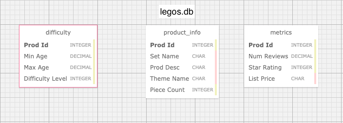
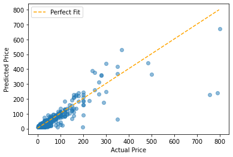
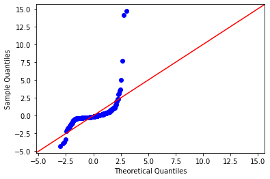

# LEGO Regression Project

## Introduction 

In this notebook you'll perform a simple linear regression analysis and report the findings of your model, including both predictive model performance metrics and interpretation of fitted model parameters.

## Objectives

You will be able to:

* Write an SQL query to pull data from an SQL database
* Perform a simple linear regression analysis 
* Evaluate your model and interpret its predictive performance metrics
* Apply an inferential lens to interpret relationships betyouen variables identified by the model

# Task: Develop a LEGO Pricing Algorithm


Photo by <a href="https://unsplash.com/@xavi_cabrera?utm_source=unsplash&utm_medium=referral&utm_content=creditCopyText">Xavi Cabrera</a> on <a href="/s/photos/lego?utm_source=unsplash&utm_medium=referral&utm_content=creditCopyText">Unsplash</a>

## Business Understanding

You just got hired by LEGO! Your first project is going to be to develop a pricing algorithm in order to analyze the value of individual lego pieces.

The primary purpose of this algorithm is *inferential*, meaning that **your model should be able to tell us something about the relationship betyouen the attributes of a LEGO set and its price**. You will apply your knowledge of statistics to include appropriate caveats about these relationships.

## Data Understanding

You have been given access to an sql database containing over 700 LEGO sets released in the past, including attributes of those sets as youll as their prices.

You do not need to worry about inflation or differences in currency; just predict the same kinds of prices as are present in the past data, which have already been converted to USD.

## Loading the Data

The database for this project is stored at the path `data/legos.db` in this project repository. The entity relational diagram (E.R.D) for the legos database is displayed below. 

To load in the data, you will need to complete the following tasks:
- Open up a connection to the legos database
- Write an sql query to join all three tables together
- Run the sql query and load the joined tables into a pandas dataframe
    - The easiest method for completing this task is to use the `pd.read_sql` function ([Documentation](https://pandas.pydata.org/docs/reference/api/pandas.read_sql.html))
    - Store the pandas dataframe in a variable called `df`




```python
# Run this cell without changes
import sqlite3
import pandas as pd
import matplotlib.pyplot as plt
%matplotlib inline
```


```python
# Replace None with your code

connection = None

sql_query = None

df = None
```

## Analysis Requirements

### 1. Data Exploration and Cleaning

During the data exploration phase, the datatypes of columns should be checked, the distribution of the target variable should be inspected, null values should be either removed or replaced, and duplicates (in most cases) should be dropped. 

### 2. Create a Baseline Model

In order to evaluate how youll a simple linear regression model is understanding the dependent variable, you will begin by first creating a model that predicts the mean of the dependent variable for every observation. Predicting the mean of `list_price` can be considered a highly naive model. If our simple linear regression model performs worse than this naive approach, you can safely say that it is not a very good model. 

### 3. Interpret a Correlation Heatmap

To develop a simple linear regression model, you will identify the independent variable that is most correlated with our dependent variable. To do this this you will plot a correlation heatmap to identify the variable most correlated with `list_price`.

### 4. Build a Simple Linear Regression Model

Now, create a linear regression model using the `statsmodels` library where the most correlated feature is used as the independent variable and the dependent variable is properly set. 

### 5. Interpret the Simple Linear Regression Model

Once the model has been fit, the coefficient for our independent variable, its p-value, and the coefficient confidence interval should be interpeted. You should ask ourselves whether or not the relationship your model is finding seems plausible. 

### 6. Evaluate the Simple Linear Regression Model

Before you can make a final assessment of our model, you need to compare its metrics with the baseline model created in step one, and you need to check the assumptions of linear regression.


# 1. Data Exploration and Cleaning

Inspect the dataframe by outputting the first five rows.


```python
# Replace None with your code

None
```


Produce high-level descriptive information about your training data


```python
# Replace None with your code

None
```

Display the number of null values for each column


```python
# Replace None with your code

None
```

You have four columns that contain null values. Of those four, `List Price`, which is your dependent variable, is probably the most concerning. 

In the cell below, drop all rows where `List Price` is null.


```python
# Replace None with your code

None
```

To make things easier moving forward, in the cell below, reformat the column names so spaces have been replaced with underscores and the text has been lowered


```python
# Replace None with your code

None
```

Run the cell below to check your reformatting. If it runs without throwing an error it means you have reformatted the columns correctly.


```python
assert 'min_age' in df.columns
```

Check the datatypes of the columns in the dataframe. 
> Remember, the target column and any columns you use as independent variables *must* have a numeric datatype. After inspecting the datatypes of the columns, convert columns to numeric where necessary. 


```python
# Replace None with your code

None
```

In the cell below, output the number of duplicate rows in the dataframe. If duplicates are found, drop them.


```python
# Replace None with your code

None
```

Visualize the distribution of the dependent variable


```python
# Replace None with your code

None
```

# Create a Baseline Model

Below, create a baseline model. 

To do this you must:

1. Calculate the mean of the `list_price` column in the `train` dataframe.
2. Now that you've calculate the mean of `list_price`, create a list with the same length as the `list_price` column where every value in the list is the calculated mean.
    - Store this list in the variable `baseline_preds`.


```python
# Calculate the mean of the list_price column in the train dataframe.
mean = None

# Create a list with the same length as the list_price column 
# where every value in the list is the calculated mean.
baseline_preds = None
```

Now that you have baseline predictions, you can use the predictions to calculate metrics about the model's performance. 


```python
from sklearn.metrics import r2_score, mean_squared_error

# Pass the list_price column and the baseline_preds list into the function r2_score
baseline_r2 = r2_score(train.list_price, baseline_preds)

# Pass the list_price column and the baseline_preds list 
# into the function mean_squared_error and setting squared to False
baseline_rmse = mean_squared_error(train.list_price, baseline_preds, squared=False)

print('Baseline R^2: ', baseline_r2)
print('Baseline RMSE:', baseline_rmse)
```

    Baseline R^2:  0.0
    Baseline RMSE: 70.31606908300459


**Interpret the resulting metrics for the baseline model.**

- How is the model explaining the variance of the dependent variable?
- On average, how many dollars off are the models predictions?

*YOUR ANSWER HERE*

# 2. Interpret a Correlation Heatmap to Build a Baseline Model

## Correlation Heatmap

Produce a heatmap showing the correlations between all of the numeric values in the data. The x and y axis labels should indicate the pair of values that are being compared, and then the color and the number should represent the correlation. 

The most important column or row shows the correlations betyouen the target (listing price) and other attributes.


```python
# Run this cell without changes

import seaborn as sns
import numpy as np
```


```python
# Replace None with your code

None
```

Based on the heatmap, which feature is most strongly correlated with the target (`list_price`)? In other words, which feature has the strongest positive or negative correlation — the correlation with the greatest magnitude?


```python
# Replace None with the name of the feature (a string)

most_correlated_feature = None
```

Create a scatter plot of that feature vs. listing price:


```python
# Replace None with your code

None
```

Assuming you correctly identified `piece_count` (the number of pieces in the LEGO set) as the most correlated feature, you should have a scatter plot that shows a fairly clear linear relationship betyouen that feature and the target. It looks like you are ready to proceed with creating a simple linear regression model.

# 3. Build a Simple Linear Regression Model

Now, you'll build a linear regression model using just that feature. 

In the cell below, fit a statsmodels linear regression model to the data and output a summary for the model. 


```python
import statsmodels.formula.api as smf

# Replace None with your code

model = None
```

# 4. Interpret the Simple Linear Regression Model

Now that the model has been fit, you should interpret the model parameters. 

Specifically:
- What do the coefficients for the intercept and independent variable suggest about the dependent variable?
- Are the coefficients found to be statistically significant?
- What are the confidence intervals for the coefficients?
- Do the relationships found by the model seem plausible? 

*YOUR ANSWER HERE*

# 5. Evaluate the Simple Linear Regression Model

Now that the model parameters have been interpreted, the model must be assessed based on predictive metrics and whether or not the model is meeting the assumptions of linear regression. 

### Compare the $R^2$ and the Root Mean Squared Error of the simple linear regression model with the baseline model. 


```python
# Replace None with your code
model_r2 = None

model_rmse = None

print('Baseline R^2: ', baseline_r2)
print('Baseline RMSE:', baseline_rmse)
print('----------------------------')
print('Regression R^2: ', model_r2)
print('Regression RMSE:', model_rmse)
```

    Baseline R^2:  0.0
    Baseline RMSE: 70.31606908300459
    ----------------------------
    Regression R^2:  None
    Regression RMSE: None


### Interpret the model metrics

*YOUR ANSWER HERE*

### Check the assumptions of simple linear regression

#### Investigating Linearity

First, let's check whether the linearity assumption holds.


```python
# Run this cell without changes

preds = model.predict()
fig, ax = plt.subplots()

perfect_line = np.arange(df.list_price.min(), df.list_price.max())
ax.plot(perfect_line, linestyle="--", color="orange", label="Perfect Fit")
ax.scatter(df.list_price, preds, alpha=0.5)
ax.set_xlabel("Actual Price")
ax.set_ylabel("Predicted Price")
ax.legend();
```





Are you violating the linearity assumption?

*YOUR ANSWER HERE*

#### Investigating Normality

Now let's check whether the normality assumption holds for our model.


```python
# Run this code without changes
import scipy.stats as stats
import statsmodels.api as sm

residuals = (df.list_price - preds)
sm.graphics.qqplot(residuals, dist=stats.norm, line='45', fit=True);
```





Are you violating the normality assumption?

*YOUR ANSWER HERE*

#### Investigating Homoscedasticity

Now let's check whether the model's errors are indeed homoscedastic or if they violate this principle and display heteroscedasticity.


```python
# Run this cell without changes
fig, ax = plt.subplots()

ax.scatter(preds, residuals, alpha=0.5)
ax.plot(preds, [0 for i in range(len(df))])
ax.set_xlabel("Predicted Value")
ax.set_ylabel("Actual - Predicted Value");
```


Are you violating the homoscedasticity assumption?

*YOUR ANSWER HERE*

### Linear Regression Assumptions Conclusion

Given your ansyours above, how should you interpret our model's coefficients? Do you have a model that can be used for inferential as youll as predictive purposes? What might your next steps be?

*YOUR ANSWER HERE*

# Level Up: Project Enhancements

After completing the project, you could consider the following enhancements if you have time:

* Identify and remove outliers, then redo the analysis
* Compile the data cleaning code into a function
* Identify lego sets with high or low value for LEGO buyers, using the differences betyouen actual and predicted prices
* [Log the target variable](https://www.codegrepper.com/code-examples/python/log+transform+pandas+dataframe) and see if that improves the model assumptions.
* Conduct statistical tests using the numeric features in the dataset to make inferences about the population of LEGO sets

## Summary

Well done! As you can see, regression can be a challenging task that requires you to make decisions along the way, try alternative approaches, and make ongoing refinements.
