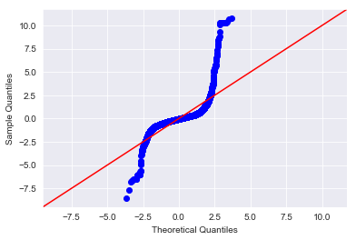
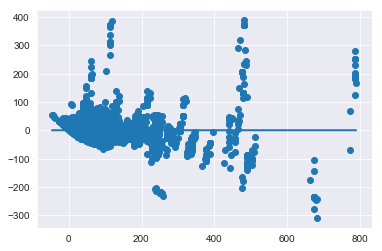
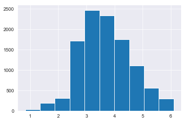
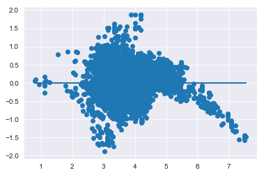
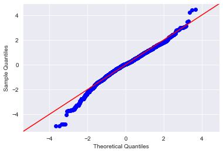
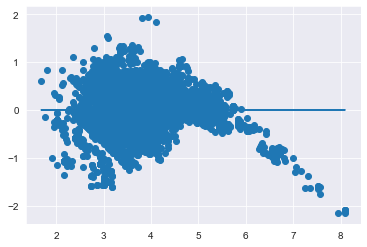

# Modeling Your Data - Lab

## Introduction 

In this lab you'll perform a full linear regression on the data. You'll implement the process demonstrated in the previous lesson, taking a stepwise approach to analyze and improve the model along the way.

## Objectives
You will be able to:

* Remove predictors with p-values too high and refit the model
* Examine and interpret the model results
* Split data into training and testing sets
* Fit a regression model to the data set using statsmodel library


## Build an Initial Regression Model

To start, perform a train-test split and create an initial regression model to model the `list_price` using all of your available features.

> **Note:** In order to write the model you'll have to do some tedious manipulation of your column names. Statsmodels will not allow you to have spaces, apostrophe or arithmetic symbols (+) in your column names. Preview them and refine them as you go.  
**If you receive an error such as "PatsyError: error tokenizing input (maybe an unclosed string?)" then you need to further preprocess your column names.**


```python
#Your code here
```


```python
# __SOLUTION__ 
import pandas as pd
import matplotlib.pyplot as plt
import numpy as np
import seaborn as sns
sns.set_style('darkgrid')

from statsmodels.formula.api import ols
from statsmodels.stats.outliers_influence import variance_inflation_factor
import statsmodels.api as sm
import scipy.stats as stats
from sklearn.model_selection import train_test_split
```


```python
# __SOLUTION__ 
df = pd.read_csv('Lego_dataset_cleaned.csv')
df.head()
```


<div>
<style scoped>
    .dataframe tbody tr th:only-of-type {
        vertical-align: middle;
    }

    .dataframe tbody tr th {
        vertical-align: top;
    }

    .dataframe thead th {
        text-align: right;
    }
</style>
<table border="1" class="dataframe">
  <thead>
    <tr style="text-align: right;">
      <th></th>
      <th>piece_count</th>
      <th>list_price</th>
      <th>num_reviews</th>
      <th>play_star_rating</th>
      <th>star_rating</th>
      <th>val_star_rating</th>
      <th>ages_10+</th>
      <th>ages_10-14</th>
      <th>ages_10-16</th>
      <th>ages_10-21</th>
      <th>...</th>
      <th>country_NZ</th>
      <th>country_PL</th>
      <th>country_PT</th>
      <th>country_US</th>
      <th>review_difficulty_Average</th>
      <th>review_difficulty_Challenging</th>
      <th>review_difficulty_Easy</th>
      <th>review_difficulty_Very Challenging</th>
      <th>review_difficulty_Very Easy</th>
      <th>review_difficulty_unknown</th>
    </tr>
  </thead>
  <tbody>
    <tr>
      <th>0</th>
      <td>-0.273020</td>
      <td>29.99</td>
      <td>-0.398512</td>
      <td>-0.655279</td>
      <td>-0.045687</td>
      <td>-0.365010</td>
      <td>0</td>
      <td>0</td>
      <td>0</td>
      <td>0</td>
      <td>...</td>
      <td>0</td>
      <td>0</td>
      <td>0</td>
      <td>1</td>
      <td>1</td>
      <td>0</td>
      <td>0</td>
      <td>0</td>
      <td>0</td>
      <td>0</td>
    </tr>
    <tr>
      <th>1</th>
      <td>-0.404154</td>
      <td>19.99</td>
      <td>-0.398512</td>
      <td>-0.655279</td>
      <td>0.990651</td>
      <td>-0.365010</td>
      <td>0</td>
      <td>0</td>
      <td>0</td>
      <td>0</td>
      <td>...</td>
      <td>0</td>
      <td>0</td>
      <td>0</td>
      <td>1</td>
      <td>0</td>
      <td>0</td>
      <td>1</td>
      <td>0</td>
      <td>0</td>
      <td>0</td>
    </tr>
    <tr>
      <th>2</th>
      <td>-0.517242</td>
      <td>12.99</td>
      <td>-0.147162</td>
      <td>-0.132473</td>
      <td>-0.460222</td>
      <td>-0.204063</td>
      <td>0</td>
      <td>0</td>
      <td>0</td>
      <td>0</td>
      <td>...</td>
      <td>0</td>
      <td>0</td>
      <td>0</td>
      <td>1</td>
      <td>0</td>
      <td>0</td>
      <td>1</td>
      <td>0</td>
      <td>0</td>
      <td>0</td>
    </tr>
    <tr>
      <th>3</th>
      <td>0.635296</td>
      <td>99.99</td>
      <td>0.187972</td>
      <td>-1.352353</td>
      <td>0.161581</td>
      <td>0.117830</td>
      <td>0</td>
      <td>0</td>
      <td>0</td>
      <td>0</td>
      <td>...</td>
      <td>0</td>
      <td>0</td>
      <td>0</td>
      <td>1</td>
      <td>1</td>
      <td>0</td>
      <td>0</td>
      <td>0</td>
      <td>0</td>
      <td>0</td>
    </tr>
    <tr>
      <th>4</th>
      <td>0.288812</td>
      <td>79.99</td>
      <td>-0.063378</td>
      <td>-2.049427</td>
      <td>0.161581</td>
      <td>-0.204063</td>
      <td>0</td>
      <td>0</td>
      <td>0</td>
      <td>0</td>
      <td>...</td>
      <td>0</td>
      <td>0</td>
      <td>0</td>
      <td>1</td>
      <td>0</td>
      <td>1</td>
      <td>0</td>
      <td>0</td>
      <td>0</td>
      <td>0</td>
    </tr>
  </tbody>
</table>
<p>5 rows × 103 columns</p>
</div>


```python
# __SOLUTION__ 
subs = [(' ', '_'),('.',''),("'",""),('™', ''), ('®',''),
        ('+','plus'), ('½','half'), ('-','_')
       ]
def col_formatting(col):
    for old, new in subs:
        col = col.replace(old,new)
    return col
```


```python
# __SOLUTION__ 
df.columns = [col_formatting(col) for col in df.columns]
```


```python
# __SOLUTION__ 
list(df.columns)
```


    ['piece_count',
     'list_price',
     'num_reviews',
     'play_star_rating',
     'star_rating',
     'val_star_rating',
     'ages_10plus',
     'ages_10_14',
     'ages_10_16',
     'ages_10_21',
     'ages_11_16',
     'ages_12plus',
     'ages_12_16',
     'ages_14plus',
     'ages_16plus',
     'ages_1half_3',
     'ages_1half_5',
     'ages_2_5',
     'ages_4plus',
     'ages_4_7',
     'ages_4_99',
     'ages_5plus',
     'ages_5_12',
     'ages_5_8',
     'ages_6plus',
     'ages_6_12',
     'ages_6_14',
     'ages_7plus',
     'ages_7_12',
     'ages_7_14',
     'ages_8plus',
     'ages_8_12',
     'ages_8_14',
     'ages_9plus',
     'ages_9_12',
     'ages_9_14',
     'ages_9_16',
     'theme_name_Angry_Birds',
     'theme_name_Architecture',
     'theme_name_BOOST',
     'theme_name_Blues_Helicopter_Pursuit',
     'theme_name_BrickHeadz',
     'theme_name_Carnotaurus_Gyrosphere_Escape',
     'theme_name_City',
     'theme_name_Classic',
     'theme_name_Creator_3_in_1',
     'theme_name_Creator_Expert',
     'theme_name_DC_Comics_Super_Heroes',
     'theme_name_DC_Super_Hero_Girls',
     'theme_name_DIMENSIONS',
     'theme_name_DUPLO',
     'theme_name_Dilophosaurus_Outpost_Attack',
     'theme_name_Disney',
     'theme_name_Elves',
     'theme_name_Friends',
     'theme_name_Ghostbusters',
     'theme_name_Ideas',
     'theme_name_Indoraptor_Rampage_at_Lockwood_Estate',
     'theme_name_Juniors',
     'theme_name_Jurassic_Park_Velociraptor_Chase',
     'theme_name_MINDSTORMS',
     'theme_name_Marvel_Super_Heroes',
     'theme_name_Minecraft',
     'theme_name_Minifigures',
     'theme_name_NEXO_KNIGHTS',
     'theme_name_NINJAGO',
     'theme_name_Power_Functions',
     'theme_name_Pteranodon_Chase',
     'theme_name_SERIOUS_PLAY',
     'theme_name_Speed_Champions',
     'theme_name_Star_Wars',
     'theme_name_Stygimoloch_Breakout',
     'theme_name_T_rex_Transport',
     'theme_name_THE_LEGO_BATMAN_MOVIE',
     'theme_name_THE_LEGO_NINJAGO_MOVIE',
     'theme_name_Technic',
     'country_AT',
     'country_AU',
     'country_BE',
     'country_CA',
     'country_CH',
     'country_CZ',
     'country_DE',
     'country_DN',
     'country_ES',
     'country_FI',
     'country_FR',
     'country_GB',
     'country_IE',
     'country_IT',
     'country_LU',
     'country_NL',
     'country_NO',
     'country_NZ',
     'country_PL',
     'country_PT',
     'country_US',
     'review_difficulty_Average',
     'review_difficulty_Challenging',
     'review_difficulty_Easy',
     'review_difficulty_Very_Challenging',
     'review_difficulty_Very_Easy',
     'review_difficulty_unknown']


```python
# __SOLUTION__ 
df.info()
```

    <class 'pandas.core.frame.DataFrame'>
    RangeIndex: 10870 entries, 0 to 10869
    Columns: 103 entries, piece_count to review_difficulty_unknown
    dtypes: float64(6), int64(97)
    memory usage: 8.5 MB


```python
# __SOLUTION__ 
#Defining the problem
outcome = 'list_price'
x_cols = list(df.columns)
x_cols.remove(outcome)
```


```python
# __SOLUTION__ 
train, test = train_test_split(df)
```


```python
# __SOLUTION__ 
print(len(train), len(test))
train.head()
```

    8152 2718


<div>
<style scoped>
    .dataframe tbody tr th:only-of-type {
        vertical-align: middle;
    }

    .dataframe tbody tr th {
        vertical-align: top;
    }

    .dataframe thead th {
        text-align: right;
    }
</style>
<table border="1" class="dataframe">
  <thead>
    <tr style="text-align: right;">
      <th></th>
      <th>piece_count</th>
      <th>list_price</th>
      <th>num_reviews</th>
      <th>play_star_rating</th>
      <th>star_rating</th>
      <th>val_star_rating</th>
      <th>ages_10plus</th>
      <th>ages_10_14</th>
      <th>ages_10_16</th>
      <th>ages_10_21</th>
      <th>...</th>
      <th>country_NZ</th>
      <th>country_PL</th>
      <th>country_PT</th>
      <th>country_US</th>
      <th>review_difficulty_Average</th>
      <th>review_difficulty_Challenging</th>
      <th>review_difficulty_Easy</th>
      <th>review_difficulty_Very_Challenging</th>
      <th>review_difficulty_Very_Easy</th>
      <th>review_difficulty_unknown</th>
    </tr>
  </thead>
  <tbody>
    <tr>
      <th>10674</th>
      <td>-0.337985</td>
      <td>36.5878</td>
      <td>-0.175090</td>
      <td>0.041796</td>
      <td>-0.252954</td>
      <td>1.083511</td>
      <td>0</td>
      <td>0</td>
      <td>0</td>
      <td>0</td>
      <td>...</td>
      <td>0</td>
      <td>0</td>
      <td>1</td>
      <td>0</td>
      <td>0</td>
      <td>0</td>
      <td>1</td>
      <td>0</td>
      <td>0</td>
      <td>0</td>
    </tr>
    <tr>
      <th>7290</th>
      <td>-0.345204</td>
      <td>24.3878</td>
      <td>-0.286801</td>
      <td>0.216064</td>
      <td>0.161581</td>
      <td>0.117830</td>
      <td>0</td>
      <td>0</td>
      <td>0</td>
      <td>0</td>
      <td>...</td>
      <td>0</td>
      <td>0</td>
      <td>0</td>
      <td>0</td>
      <td>0</td>
      <td>0</td>
      <td>0</td>
      <td>0</td>
      <td>0</td>
      <td>1</td>
    </tr>
    <tr>
      <th>3673</th>
      <td>-0.588223</td>
      <td>12.9120</td>
      <td>-0.398512</td>
      <td>1.087407</td>
      <td>0.990651</td>
      <td>1.244458</td>
      <td>0</td>
      <td>0</td>
      <td>0</td>
      <td>0</td>
      <td>...</td>
      <td>0</td>
      <td>0</td>
      <td>0</td>
      <td>0</td>
      <td>0</td>
      <td>0</td>
      <td>0</td>
      <td>0</td>
      <td>1</td>
      <td>0</td>
    </tr>
    <tr>
      <th>7270</th>
      <td>0.270766</td>
      <td>109.7878</td>
      <td>-0.258873</td>
      <td>-0.655279</td>
      <td>-0.874757</td>
      <td>-0.847850</td>
      <td>0</td>
      <td>0</td>
      <td>0</td>
      <td>0</td>
      <td>...</td>
      <td>0</td>
      <td>0</td>
      <td>0</td>
      <td>0</td>
      <td>1</td>
      <td>0</td>
      <td>0</td>
      <td>0</td>
      <td>0</td>
      <td>0</td>
    </tr>
    <tr>
      <th>8341</th>
      <td>-0.153916</td>
      <td>73.1878</td>
      <td>-0.063378</td>
      <td>-0.655279</td>
      <td>-2.118362</td>
      <td>-1.491638</td>
      <td>0</td>
      <td>0</td>
      <td>0</td>
      <td>0</td>
      <td>...</td>
      <td>0</td>
      <td>0</td>
      <td>0</td>
      <td>0</td>
      <td>0</td>
      <td>0</td>
      <td>1</td>
      <td>0</td>
      <td>0</td>
      <td>0</td>
    </tr>
  </tbody>
</table>
<p>5 rows × 103 columns</p>
</div>


```python
# __SOLUTION__ 
test.head()
```


<div>
<style scoped>
    .dataframe tbody tr th:only-of-type {
        vertical-align: middle;
    }

    .dataframe tbody tr th {
        vertical-align: top;
    }

    .dataframe thead th {
        text-align: right;
    }
</style>
<table border="1" class="dataframe">
  <thead>
    <tr style="text-align: right;">
      <th></th>
      <th>piece_count</th>
      <th>list_price</th>
      <th>num_reviews</th>
      <th>play_star_rating</th>
      <th>star_rating</th>
      <th>val_star_rating</th>
      <th>ages_10plus</th>
      <th>ages_10_14</th>
      <th>ages_10_16</th>
      <th>ages_10_21</th>
      <th>...</th>
      <th>country_NZ</th>
      <th>country_PL</th>
      <th>country_PT</th>
      <th>country_US</th>
      <th>review_difficulty_Average</th>
      <th>review_difficulty_Challenging</th>
      <th>review_difficulty_Easy</th>
      <th>review_difficulty_Very_Challenging</th>
      <th>review_difficulty_Very_Easy</th>
      <th>review_difficulty_unknown</th>
    </tr>
  </thead>
  <tbody>
    <tr>
      <th>3445</th>
      <td>-0.437840</td>
      <td>25.3980</td>
      <td>-0.398512</td>
      <td>0.216064</td>
      <td>-1.082024</td>
      <td>-0.365010</td>
      <td>0</td>
      <td>0</td>
      <td>0</td>
      <td>0</td>
      <td>...</td>
      <td>0</td>
      <td>0</td>
      <td>0</td>
      <td>0</td>
      <td>0</td>
      <td>0</td>
      <td>1</td>
      <td>0</td>
      <td>0</td>
      <td>0</td>
    </tr>
    <tr>
      <th>10152</th>
      <td>-0.151510</td>
      <td>43.4971</td>
      <td>-0.370585</td>
      <td>0.564601</td>
      <td>-3.776502</td>
      <td>-1.491638</td>
      <td>0</td>
      <td>0</td>
      <td>0</td>
      <td>0</td>
      <td>...</td>
      <td>0</td>
      <td>1</td>
      <td>0</td>
      <td>0</td>
      <td>1</td>
      <td>0</td>
      <td>0</td>
      <td>0</td>
      <td>0</td>
      <td>0</td>
    </tr>
    <tr>
      <th>5356</th>
      <td>0.063839</td>
      <td>92.7078</td>
      <td>-0.286801</td>
      <td>-0.306741</td>
      <td>-0.460222</td>
      <td>0.278777</td>
      <td>0</td>
      <td>0</td>
      <td>0</td>
      <td>0</td>
      <td>...</td>
      <td>0</td>
      <td>0</td>
      <td>0</td>
      <td>0</td>
      <td>0</td>
      <td>1</td>
      <td>0</td>
      <td>0</td>
      <td>0</td>
      <td>0</td>
    </tr>
    <tr>
      <th>3692</th>
      <td>0.262345</td>
      <td>86.3520</td>
      <td>-0.258873</td>
      <td>0.390333</td>
      <td>-0.874757</td>
      <td>-0.365010</td>
      <td>0</td>
      <td>0</td>
      <td>0</td>
      <td>0</td>
      <td>...</td>
      <td>0</td>
      <td>0</td>
      <td>0</td>
      <td>0</td>
      <td>1</td>
      <td>0</td>
      <td>0</td>
      <td>0</td>
      <td>0</td>
      <td>0</td>
    </tr>
    <tr>
      <th>9622</th>
      <td>-0.571380</td>
      <td>31.9429</td>
      <td>-0.286801</td>
      <td>0.216064</td>
      <td>0.161581</td>
      <td>0.117830</td>
      <td>0</td>
      <td>0</td>
      <td>0</td>
      <td>0</td>
      <td>...</td>
      <td>1</td>
      <td>0</td>
      <td>0</td>
      <td>0</td>
      <td>0</td>
      <td>0</td>
      <td>0</td>
      <td>0</td>
      <td>0</td>
      <td>1</td>
    </tr>
  </tbody>
</table>
<p>5 rows × 103 columns</p>
</div>


```python
# __SOLUTION__ 
#Fitting the actual model
predictors = '+'.join(x_cols)
formula = outcome + "~" + predictors
model = ols(formula=formula, data=train).fit()
model.summary()
```


<table class="simpletable">
<caption>OLS Regression Results</caption>
<tr>
  <th>Dep. Variable:</th>       <td>list_price</td>    <th>  R-squared:         </th> <td>   0.862</td> 
</tr>
<tr>
  <th>Model:</th>                   <td>OLS</td>       <th>  Adj. R-squared:    </th> <td>   0.860</td> 
</tr>
<tr>
  <th>Method:</th>             <td>Least Squares</td>  <th>  F-statistic:       </th> <td>   534.0</td> 
</tr>
<tr>
  <th>Date:</th>             <td>Fri, 02 Aug 2019</td> <th>  Prob (F-statistic):</th>  <td>  0.00</td>  
</tr>
<tr>
  <th>Time:</th>                 <td>09:25:21</td>     <th>  Log-Likelihood:    </th> <td> -40345.</td> 
</tr>
<tr>
  <th>No. Observations:</th>      <td>  8152</td>      <th>  AIC:               </th> <td>8.088e+04</td>
</tr>
<tr>
  <th>Df Residuals:</th>          <td>  8057</td>      <th>  BIC:               </th> <td>8.155e+04</td>
</tr>
<tr>
  <th>Df Model:</th>              <td>    94</td>      <th>                     </th>     <td> </td>    
</tr>
<tr>
  <th>Covariance Type:</th>      <td>nonrobust</td>    <th>                     </th>     <td> </td>    
</tr>
</table>
<table class="simpletable">
<tr>
                          <td></td>                            <th>coef</th>     <th>std err</th>      <th>t</th>      <th>P>|t|</th>  <th>[0.025</th>    <th>0.975]</th>  
</tr>
<tr>
  <th>Intercept</th>                                        <td>   63.4432</td> <td>    1.988</td> <td>   31.920</td> <td> 0.000</td> <td>   59.547</td> <td>   67.339</td>
</tr>
<tr>
  <th>piece_count</th>                                      <td>   77.5286</td> <td>    0.882</td> <td>   87.865</td> <td> 0.000</td> <td>   75.799</td> <td>   79.258</td>
</tr>
<tr>
  <th>num_reviews</th>                                      <td>    6.8938</td> <td>    0.669</td> <td>   10.300</td> <td> 0.000</td> <td>    5.582</td> <td>    8.206</td>
</tr>
<tr>
  <th>play_star_rating</th>                                 <td>    5.1531</td> <td>    0.608</td> <td>    8.475</td> <td> 0.000</td> <td>    3.961</td> <td>    6.345</td>
</tr>
<tr>
  <th>star_rating</th>                                      <td>   -1.3370</td> <td>    0.690</td> <td>   -1.937</td> <td> 0.053</td> <td>   -2.690</td> <td>    0.016</td>
</tr>
<tr>
  <th>val_star_rating</th>                                  <td>   -7.9233</td> <td>    0.614</td> <td>  -12.901</td> <td> 0.000</td> <td>   -9.127</td> <td>   -6.719</td>
</tr>
<tr>
  <th>ages_10plus</th>                                      <td>  124.5101</td> <td>    6.446</td> <td>   19.315</td> <td> 0.000</td> <td>  111.874</td> <td>  137.147</td>
</tr>
<tr>
  <th>ages_10_14</th>                                       <td>  -21.8760</td> <td>    9.030</td> <td>   -2.422</td> <td> 0.015</td> <td>  -39.578</td> <td>   -4.174</td>
</tr>
<tr>
  <th>ages_10_16</th>                                       <td>  -12.5289</td> <td>    4.032</td> <td>   -3.108</td> <td> 0.002</td> <td>  -20.432</td> <td>   -4.626</td>
</tr>
<tr>
  <th>ages_10_21</th>                                       <td>   56.0437</td> <td>    7.155</td> <td>    7.833</td> <td> 0.000</td> <td>   42.019</td> <td>   70.069</td>
</tr>
<tr>
  <th>ages_11_16</th>                                       <td>  -21.9216</td> <td>    5.976</td> <td>   -3.668</td> <td> 0.000</td> <td>  -33.635</td> <td>  -10.208</td>
</tr>
<tr>
  <th>ages_12plus</th>                                      <td>   68.9323</td> <td>    5.478</td> <td>   12.584</td> <td> 0.000</td> <td>   58.195</td> <td>   79.670</td>
</tr>
<tr>
  <th>ages_12_16</th>                                       <td>  -70.1946</td> <td>    6.972</td> <td>  -10.068</td> <td> 0.000</td> <td>  -83.862</td> <td>  -56.527</td>
</tr>
<tr>
  <th>ages_14plus</th>                                      <td>   24.5772</td> <td>    4.263</td> <td>    5.765</td> <td> 0.000</td> <td>   16.221</td> <td>   32.933</td>
</tr>
<tr>
  <th>ages_16plus</th>                                      <td>   20.9553</td> <td>    6.079</td> <td>    3.447</td> <td> 0.001</td> <td>    9.039</td> <td>   32.872</td>
</tr>
<tr>
  <th>ages_1half_3</th>                                     <td>   -8.3407</td> <td>    2.364</td> <td>   -3.528</td> <td> 0.000</td> <td>  -12.975</td> <td>   -3.706</td>
</tr>
<tr>
  <th>ages_1half_5</th>                                     <td>   -4.2354</td> <td>    2.807</td> <td>   -1.509</td> <td> 0.131</td> <td>   -9.738</td> <td>    1.268</td>
</tr>
<tr>
  <th>ages_2_5</th>                                         <td>   15.9058</td> <td>    1.637</td> <td>    9.718</td> <td> 0.000</td> <td>   12.698</td> <td>   19.114</td>
</tr>
<tr>
  <th>ages_4plus</th>                                       <td>  -20.4842</td> <td>    5.887</td> <td>   -3.479</td> <td> 0.001</td> <td>  -32.025</td> <td>   -8.944</td>
</tr>
<tr>
  <th>ages_4_7</th>                                         <td>   -5.3233</td> <td>    3.563</td> <td>   -1.494</td> <td> 0.135</td> <td>  -12.307</td> <td>    1.660</td>
</tr>
<tr>
  <th>ages_4_99</th>                                        <td>   -1.0041</td> <td>    3.407</td> <td>   -0.295</td> <td> 0.768</td> <td>   -7.683</td> <td>    5.675</td>
</tr>
<tr>
  <th>ages_5plus</th>                                       <td>   -8.5931</td> <td>    3.098</td> <td>   -2.774</td> <td> 0.006</td> <td>  -14.666</td> <td>   -2.521</td>
</tr>
<tr>
  <th>ages_5_12</th>                                        <td>  -33.0921</td> <td>    3.183</td> <td>  -10.396</td> <td> 0.000</td> <td>  -39.332</td> <td>  -26.852</td>
</tr>
<tr>
  <th>ages_5_8</th>                                         <td>    6.7575</td> <td>    6.491</td> <td>    1.041</td> <td> 0.298</td> <td>   -5.967</td> <td>   19.482</td>
</tr>
<tr>
  <th>ages_6plus</th>                                       <td>  -26.6895</td> <td>    5.655</td> <td>   -4.720</td> <td> 0.000</td> <td>  -37.775</td> <td>  -15.604</td>
</tr>
<tr>
  <th>ages_6_12</th>                                        <td>  -20.7938</td> <td>    2.535</td> <td>   -8.203</td> <td> 0.000</td> <td>  -25.763</td> <td>  -15.825</td>
</tr>
<tr>
  <th>ages_6_14</th>                                        <td>   -3.3367</td> <td>    4.089</td> <td>   -0.816</td> <td> 0.414</td> <td>  -11.352</td> <td>    4.679</td>
</tr>
<tr>
  <th>ages_7plus</th>                                       <td>   -8.8000</td> <td>   33.204</td> <td>   -0.265</td> <td> 0.791</td> <td>  -73.888</td> <td>   56.288</td>
</tr>
<tr>
  <th>ages_7_12</th>                                        <td>  -19.1757</td> <td>    2.828</td> <td>   -6.781</td> <td> 0.000</td> <td>  -24.719</td> <td>  -13.633</td>
</tr>
<tr>
  <th>ages_7_14</th>                                        <td>  -16.1194</td> <td>    2.507</td> <td>   -6.429</td> <td> 0.000</td> <td>  -21.034</td> <td>  -11.205</td>
</tr>
<tr>
  <th>ages_8plus</th>                                       <td>   15.8444</td> <td>    4.806</td> <td>    3.297</td> <td> 0.001</td> <td>    6.423</td> <td>   25.266</td>
</tr>
<tr>
  <th>ages_8_12</th>                                        <td>  -18.5700</td> <td>    3.299</td> <td>   -5.628</td> <td> 0.000</td> <td>  -25.038</td> <td>  -12.102</td>
</tr>
<tr>
  <th>ages_8_14</th>                                        <td>  -14.1302</td> <td>    2.413</td> <td>   -5.855</td> <td> 0.000</td> <td>  -18.861</td> <td>   -9.399</td>
</tr>
<tr>
  <th>ages_9plus</th>                                       <td>  106.5770</td> <td>   10.092</td> <td>   10.561</td> <td> 0.000</td> <td>   86.794</td> <td>  126.360</td>
</tr>
<tr>
  <th>ages_9_12</th>                                        <td>  -27.3555</td> <td>    6.437</td> <td>   -4.250</td> <td> 0.000</td> <td>  -39.973</td> <td>  -14.738</td>
</tr>
<tr>
  <th>ages_9_14</th>                                        <td>   -8.3819</td> <td>    2.807</td> <td>   -2.986</td> <td> 0.003</td> <td>  -13.885</td> <td>   -2.879</td>
</tr>
<tr>
  <th>ages_9_16</th>                                        <td>   -5.7135</td> <td>    5.280</td> <td>   -1.082</td> <td> 0.279</td> <td>  -16.065</td> <td>    4.638</td>
</tr>
<tr>
  <th>theme_name_Angry_Birds</th>                           <td>   12.7713</td> <td>   13.799</td> <td>    0.926</td> <td> 0.355</td> <td>  -14.278</td> <td>   39.821</td>
</tr>
<tr>
  <th>theme_name_Architecture</th>                          <td>  -85.3626</td> <td>    6.260</td> <td>  -13.637</td> <td> 0.000</td> <td>  -97.633</td> <td>  -73.092</td>
</tr>
<tr>
  <th>theme_name_BOOST</th>                                 <td>   86.5688</td> <td>    8.331</td> <td>   10.391</td> <td> 0.000</td> <td>   70.238</td> <td>  102.899</td>
</tr>
<tr>
  <th>theme_name_Blues_Helicopter_Pursuit</th>              <td>   24.3657</td> <td>    8.026</td> <td>    3.036</td> <td> 0.002</td> <td>    8.633</td> <td>   40.098</td>
</tr>
<tr>
  <th>theme_name_BrickHeadz</th>                            <td> -133.6299</td> <td>    6.917</td> <td>  -19.318</td> <td> 0.000</td> <td> -147.189</td> <td> -120.070</td>
</tr>
<tr>
  <th>theme_name_Carnotaurus_Gyrosphere_Escape</th>         <td>   49.7863</td> <td>    8.469</td> <td>    5.879</td> <td> 0.000</td> <td>   33.185</td> <td>   66.388</td>
</tr>
<tr>
  <th>theme_name_City</th>                                  <td>   21.4263</td> <td>    2.386</td> <td>    8.981</td> <td> 0.000</td> <td>   16.750</td> <td>   26.103</td>
</tr>
<tr>
  <th>theme_name_Classic</th>                               <td>  -21.4883</td> <td>    3.168</td> <td>   -6.784</td> <td> 0.000</td> <td>  -27.697</td> <td>  -15.279</td>
</tr>
<tr>
  <th>theme_name_Creator_3_in_1</th>                        <td>   -0.1944</td> <td>    2.583</td> <td>   -0.075</td> <td> 0.940</td> <td>   -5.257</td> <td>    4.868</td>
</tr>
<tr>
  <th>theme_name_Creator_Expert</th>                        <td> -116.5010</td> <td>    4.759</td> <td>  -24.478</td> <td> 0.000</td> <td> -125.831</td> <td> -107.171</td>
</tr>
<tr>
  <th>theme_name_DC_Comics_Super_Heroes</th>                <td>    9.7526</td> <td>    3.403</td> <td>    2.866</td> <td> 0.004</td> <td>    3.081</td> <td>   16.424</td>
</tr>
<tr>
  <th>theme_name_DC_Super_Hero_Girls</th>                   <td>    7.9469</td> <td>   11.384</td> <td>    0.698</td> <td> 0.485</td> <td>  -14.369</td> <td>   30.263</td>
</tr>
<tr>
  <th>theme_name_DIMENSIONS</th>                            <td>   16.2759</td> <td>    3.243</td> <td>    5.019</td> <td> 0.000</td> <td>    9.919</td> <td>   22.633</td>
</tr>
<tr>
  <th>theme_name_DUPLO</th>                                 <td>    3.3297</td> <td>    1.869</td> <td>    1.782</td> <td> 0.075</td> <td>   -0.334</td> <td>    6.993</td>
</tr>
<tr>
  <th>theme_name_Dilophosaurus_Outpost_Attack</th>          <td>   29.9858</td> <td>    8.503</td> <td>    3.526</td> <td> 0.000</td> <td>   13.317</td> <td>   46.654</td>
</tr>
<tr>
  <th>theme_name_Disney</th>                                <td>   10.2313</td> <td>    2.852</td> <td>    3.587</td> <td> 0.000</td> <td>    4.640</td> <td>   15.823</td>
</tr>
<tr>
  <th>theme_name_Elves</th>                                 <td>    1.7750</td> <td>    3.621</td> <td>    0.490</td> <td> 0.624</td> <td>   -5.324</td> <td>    8.874</td>
</tr>
<tr>
  <th>theme_name_Friends</th>                               <td>    1.9425</td> <td>    2.304</td> <td>    0.843</td> <td> 0.399</td> <td>   -2.573</td> <td>    6.458</td>
</tr>
<tr>
  <th>theme_name_Ghostbusters</th>                          <td>  -65.9586</td> <td>    9.589</td> <td>   -6.878</td> <td> 0.000</td> <td>  -84.756</td> <td>  -47.161</td>
</tr>
<tr>
  <th>theme_name_Ideas</th>                                 <td> -129.4704</td> <td>    5.798</td> <td>  -22.329</td> <td> 0.000</td> <td> -140.836</td> <td> -118.104</td>
</tr>
<tr>
  <th>theme_name_Indoraptor_Rampage_at_Lockwood_Estate</th> <td>   63.3924</td> <td>    9.192</td> <td>    6.896</td> <td> 0.000</td> <td>   45.373</td> <td>   81.412</td>
</tr>
<tr>
  <th>theme_name_Juniors</th>                               <td>    1.4342</td> <td>    3.409</td> <td>    0.421</td> <td> 0.674</td> <td>   -5.247</td> <td>    8.116</td>
</tr>
<tr>
  <th>theme_name_Jurassic_Park_Velociraptor_Chase</th>      <td>   16.3620</td> <td>    8.606</td> <td>    1.901</td> <td> 0.057</td> <td>   -0.507</td> <td>   33.232</td>
</tr>
<tr>
  <th>theme_name_MINDSTORMS</th>                            <td>  -17.3710</td> <td>    6.721</td> <td>   -2.585</td> <td> 0.010</td> <td>  -30.546</td> <td>   -4.196</td>
</tr>
<tr>
  <th>theme_name_Marvel_Super_Heroes</th>                   <td>   10.0596</td> <td>    2.403</td> <td>    4.187</td> <td> 0.000</td> <td>    5.350</td> <td>   14.769</td>
</tr>
<tr>
  <th>theme_name_Minecraft</th>                             <td>  -20.2738</td> <td>    4.255</td> <td>   -4.765</td> <td> 0.000</td> <td>  -28.614</td> <td>  -11.934</td>
</tr>
<tr>
  <th>theme_name_Minifigures</th>                           <td>   -8.5931</td> <td>    3.098</td> <td>   -2.774</td> <td> 0.006</td> <td>  -14.666</td> <td>   -2.521</td>
</tr>
<tr>
  <th>theme_name_NEXO_KNIGHTS</th>                          <td>   -2.2179</td> <td>    3.348</td> <td>   -0.662</td> <td> 0.508</td> <td>   -8.781</td> <td>    4.345</td>
</tr>
<tr>
  <th>theme_name_NINJAGO</th>                               <td>  -10.3700</td> <td>    3.171</td> <td>   -3.271</td> <td> 0.001</td> <td>  -16.585</td> <td>   -4.155</td>
</tr>
<tr>
  <th>theme_name_Power_Functions</th>                       <td>   13.4118</td> <td>   11.418</td> <td>    1.175</td> <td> 0.240</td> <td>   -8.970</td> <td>   35.794</td>
</tr>
<tr>
  <th>theme_name_Pteranodon_Chase</th>                      <td>    2.3370</td> <td>    8.328</td> <td>    0.281</td> <td> 0.779</td> <td>  -13.988</td> <td>   18.661</td>
</tr>
<tr>
  <th>theme_name_SERIOUS_PLAY</th>                          <td>  227.5010</td> <td>    7.458</td> <td>   30.502</td> <td> 0.000</td> <td>  212.881</td> <td>  242.122</td>
</tr>
<tr>
  <th>theme_name_Speed_Champions</th>                       <td>    4.0599</td> <td>    3.038</td> <td>    1.337</td> <td> 0.181</td> <td>   -1.895</td> <td>   10.014</td>
</tr>
<tr>
  <th>theme_name_Star_Wars</th>                             <td>   15.9409</td> <td>    1.759</td> <td>    9.062</td> <td> 0.000</td> <td>   12.493</td> <td>   19.389</td>
</tr>
<tr>
  <th>theme_name_Stygimoloch_Breakout</th>                  <td>   20.8620</td> <td>    8.138</td> <td>    2.563</td> <td> 0.010</td> <td>    4.909</td> <td>   36.815</td>
</tr>
<tr>
  <th>theme_name_T_rex_Transport</th>                       <td>   33.4883</td> <td>    8.959</td> <td>    3.738</td> <td> 0.000</td> <td>   15.926</td> <td>   51.050</td>
</tr>
<tr>
  <th>theme_name_THE_LEGO_BATMAN_MOVIE</th>                 <td>    6.0441</td> <td>    2.505</td> <td>    2.413</td> <td> 0.016</td> <td>    1.133</td> <td>   10.955</td>
</tr>
<tr>
  <th>theme_name_THE_LEGO_NINJAGO_MOVIE</th>                <td>  -16.7946</td> <td>    2.634</td> <td>   -6.377</td> <td> 0.000</td> <td>  -21.957</td> <td>  -11.632</td>
</tr>
<tr>
  <th>theme_name_Technic</th>                               <td>    0.6173</td> <td>    2.817</td> <td>    0.219</td> <td> 0.827</td> <td>   -4.905</td> <td>    6.140</td>
</tr>
<tr>
  <th>country_AT</th>                                       <td>    2.2192</td> <td>    1.736</td> <td>    1.278</td> <td> 0.201</td> <td>   -1.185</td> <td>    5.623</td>
</tr>
<tr>
  <th>country_AU</th>                                       <td>   -1.5927</td> <td>    1.744</td> <td>   -0.913</td> <td> 0.361</td> <td>   -5.011</td> <td>    1.825</td>
</tr>
<tr>
  <th>country_BE</th>                                       <td>    5.6450</td> <td>    1.757</td> <td>    3.214</td> <td> 0.001</td> <td>    2.202</td> <td>    9.088</td>
</tr>
<tr>
  <th>country_CA</th>                                       <td>   -9.3907</td> <td>    1.469</td> <td>   -6.393</td> <td> 0.000</td> <td>  -12.270</td> <td>   -6.511</td>
</tr>
<tr>
  <th>country_CH</th>                                       <td>    2.0902</td> <td>    1.724</td> <td>    1.212</td> <td> 0.225</td> <td>   -1.289</td> <td>    5.470</td>
</tr>
<tr>
  <th>country_CZ</th>                                       <td>    8.0719</td> <td>    1.732</td> <td>    4.659</td> <td> 0.000</td> <td>    4.676</td> <td>   11.468</td>
</tr>
<tr>
  <th>country_DE</th>                                       <td>    5.4147</td> <td>    1.767</td> <td>    3.064</td> <td> 0.002</td> <td>    1.950</td> <td>    8.879</td>
</tr>
<tr>
  <th>country_DN</th>                                       <td>   -7.5807</td> <td>    1.731</td> <td>   -4.380</td> <td> 0.000</td> <td>  -10.973</td> <td>   -4.188</td>
</tr>
<tr>
  <th>country_ES</th>                                       <td>    4.7203</td> <td>    1.783</td> <td>    2.648</td> <td> 0.008</td> <td>    1.225</td> <td>    8.215</td>
</tr>
<tr>
  <th>country_FI</th>                                       <td>   12.0584</td> <td>    1.788</td> <td>    6.745</td> <td> 0.000</td> <td>    8.554</td> <td>   15.563</td>
</tr>
<tr>
  <th>country_FR</th>                                       <td>    2.9545</td> <td>    1.738</td> <td>    1.700</td> <td> 0.089</td> <td>   -0.452</td> <td>    6.361</td>
</tr>
<tr>
  <th>country_GB</th>                                       <td>    3.0655</td> <td>    1.737</td> <td>    1.765</td> <td> 0.078</td> <td>   -0.340</td> <td>    6.471</td>
</tr>
<tr>
  <th>country_IE</th>                                       <td>    3.2253</td> <td>    1.686</td> <td>    1.913</td> <td> 0.056</td> <td>   -0.080</td> <td>    6.530</td>
</tr>
<tr>
  <th>country_IT</th>                                       <td>    1.8835</td> <td>    1.729</td> <td>    1.089</td> <td> 0.276</td> <td>   -1.506</td> <td>    5.273</td>
</tr>
<tr>
  <th>country_LU</th>                                       <td>    5.5128</td> <td>    1.779</td> <td>    3.098</td> <td> 0.002</td> <td>    2.025</td> <td>    9.001</td>
</tr>
<tr>
  <th>country_NL</th>                                       <td>    5.2506</td> <td>    1.686</td> <td>    3.115</td> <td> 0.002</td> <td>    1.946</td> <td>    8.555</td>
</tr>
<tr>
  <th>country_NO</th>                                       <td>   12.1088</td> <td>    1.744</td> <td>    6.941</td> <td> 0.000</td> <td>    8.689</td> <td>   15.528</td>
</tr>
<tr>
  <th>country_NZ</th>                                       <td>    5.2710</td> <td>    1.720</td> <td>    3.064</td> <td> 0.002</td> <td>    1.899</td> <td>    8.644</td>
</tr>
<tr>
  <th>country_PL</th>                                       <td>    5.6042</td> <td>    1.783</td> <td>    3.143</td> <td> 0.002</td> <td>    2.109</td> <td>    9.099</td>
</tr>
<tr>
  <th>country_PT</th>                                       <td>    4.0040</td> <td>    1.719</td> <td>    2.329</td> <td> 0.020</td> <td>    0.634</td> <td>    7.374</td>
</tr>
<tr>
  <th>country_US</th>                                       <td>   -7.0927</td> <td>    1.474</td> <td>   -4.813</td> <td> 0.000</td> <td>   -9.982</td> <td>   -4.204</td>
</tr>
<tr>
  <th>review_difficulty_Average</th>                        <td>   14.7908</td> <td>    1.848</td> <td>    8.004</td> <td> 0.000</td> <td>   11.168</td> <td>   18.413</td>
</tr>
<tr>
  <th>review_difficulty_Challenging</th>                    <td>   17.9878</td> <td>    2.282</td> <td>    7.884</td> <td> 0.000</td> <td>   13.515</td> <td>   22.460</td>
</tr>
<tr>
  <th>review_difficulty_Easy</th>                           <td>    3.2644</td> <td>    1.851</td> <td>    1.764</td> <td> 0.078</td> <td>   -0.363</td> <td>    6.892</td>
</tr>
<tr>
  <th>review_difficulty_Very_Challenging</th>               <td>   22.5694</td> <td>    9.539</td> <td>    2.366</td> <td> 0.018</td> <td>    3.870</td> <td>   41.269</td>
</tr>
<tr>
  <th>review_difficulty_Very_Easy</th>                      <td>    1.9326</td> <td>    2.191</td> <td>    0.882</td> <td> 0.378</td> <td>   -2.363</td> <td>    6.228</td>
</tr>
<tr>
  <th>review_difficulty_unknown</th>                        <td>    2.8982</td> <td>    1.997</td> <td>    1.451</td> <td> 0.147</td> <td>   -1.016</td> <td>    6.813</td>
</tr>
</table>
<table class="simpletable">
<tr>
  <th>Omnibus:</th>       <td>5101.792</td> <th>  Durbin-Watson:     </th>  <td>   1.989</td> 
</tr>
<tr>
  <th>Prob(Omnibus):</th>  <td> 0.000</td>  <th>  Jarque-Bera (JB):  </th> <td>499661.593</td>
</tr>
<tr>
  <th>Skew:</th>           <td> 2.133</td>  <th>  Prob(JB):          </th>  <td>    0.00</td> 
</tr>
<tr>
  <th>Kurtosis:</th>       <td>41.116</td>  <th>  Cond. No.          </th>  <td>1.41e+16</td> 
</tr>
</table><br/><br/>Warnings:<br/>[1] Standard Errors assume that the covariance matrix of the errors is correctly specified.<br/>[2] The smallest eigenvalue is 9.05e-29. This might indicate that there are<br/>strong multicollinearity problems or that the design matrix is singular.


## Remove the Uninfluential Features

Based on the initial model, remove those features which do not appear to be statistically relevant and rerun the model.


```python
#Your code here
```


```python
# __SOLUTION__ 
#Extract the p-value table from the summary and use it to subset our features
summary = model.summary()
p_table = summary.tables[1]
p_table = pd.DataFrame(p_table.data)
p_table.columns = p_table.iloc[0]
p_table = p_table.drop(0)
p_table = p_table.set_index(p_table.columns[0])
p_table['P>|t|'] = p_table['P>|t|'].astype(float)
x_cols = list(p_table[p_table['P>|t|']<0.05].index)
x_cols.remove('Intercept')
print(len(p_table), len(x_cols))
print(x_cols[:5])
p_table.head()
```

    103 71
    ['piece_count', 'num_reviews', 'play_star_rating', 'val_star_rating', 'ages_10plus']


<div>
<style scoped>
    .dataframe tbody tr th:only-of-type {
        vertical-align: middle;
    }

    .dataframe tbody tr th {
        vertical-align: top;
    }

    .dataframe thead th {
        text-align: right;
    }
</style>
<table border="1" class="dataframe">
  <thead>
    <tr style="text-align: right;">
      <th></th>
      <th>coef</th>
      <th>std err</th>
      <th>t</th>
      <th>P&gt;|t|</th>
      <th>[0.025</th>
      <th>0.975]</th>
    </tr>
    <tr>
      <th></th>
      <th></th>
      <th></th>
      <th></th>
      <th></th>
      <th></th>
      <th></th>
    </tr>
  </thead>
  <tbody>
    <tr>
      <th>Intercept</th>
      <td>63.4432</td>
      <td>1.988</td>
      <td>31.920</td>
      <td>0.000</td>
      <td>59.547</td>
      <td>67.339</td>
    </tr>
    <tr>
      <th>piece_count</th>
      <td>77.5286</td>
      <td>0.882</td>
      <td>87.865</td>
      <td>0.000</td>
      <td>75.799</td>
      <td>79.258</td>
    </tr>
    <tr>
      <th>num_reviews</th>
      <td>6.8938</td>
      <td>0.669</td>
      <td>10.300</td>
      <td>0.000</td>
      <td>5.582</td>
      <td>8.206</td>
    </tr>
    <tr>
      <th>play_star_rating</th>
      <td>5.1531</td>
      <td>0.608</td>
      <td>8.475</td>
      <td>0.000</td>
      <td>3.961</td>
      <td>6.345</td>
    </tr>
    <tr>
      <th>star_rating</th>
      <td>-1.3370</td>
      <td>0.690</td>
      <td>-1.937</td>
      <td>0.053</td>
      <td>-2.690</td>
      <td>0.016</td>
    </tr>
  </tbody>
</table>
</div>


```python
# __SOLUTION__ 
#Refit model with subset features
predictors = '+'.join(x_cols)
formula = outcome + "~" + predictors
model = ols(formula=formula, data=train).fit()
model.summary()
```


<table class="simpletable">
<caption>OLS Regression Results</caption>
<tr>
  <th>Dep. Variable:</th>       <td>list_price</td>    <th>  R-squared:         </th> <td>   0.861</td> 
</tr>
<tr>
  <th>Model:</th>                   <td>OLS</td>       <th>  Adj. R-squared:    </th> <td>   0.860</td> 
</tr>
<tr>
  <th>Method:</th>             <td>Least Squares</td>  <th>  F-statistic:       </th> <td>   717.2</td> 
</tr>
<tr>
  <th>Date:</th>             <td>Fri, 02 Aug 2019</td> <th>  Prob (F-statistic):</th>  <td>  0.00</td>  
</tr>
<tr>
  <th>Time:</th>                 <td>09:25:21</td>     <th>  Log-Likelihood:    </th> <td> -40355.</td> 
</tr>
<tr>
  <th>No. Observations:</th>      <td>  8152</td>      <th>  AIC:               </th> <td>8.085e+04</td>
</tr>
<tr>
  <th>Df Residuals:</th>          <td>  8081</td>      <th>  BIC:               </th> <td>8.135e+04</td>
</tr>
<tr>
  <th>Df Model:</th>              <td>    70</td>      <th>                     </th>     <td> </td>    
</tr>
<tr>
  <th>Covariance Type:</th>      <td>nonrobust</td>    <th>                     </th>     <td> </td>    
</tr>
</table>
<table class="simpletable">
<tr>
                          <td></td>                            <th>coef</th>     <th>std err</th>      <th>t</th>      <th>P>|t|</th>  <th>[0.025</th>    <th>0.975]</th>  
</tr>
<tr>
  <th>Intercept</th>                                        <td>   65.3626</td> <td>    1.510</td> <td>   43.299</td> <td> 0.000</td> <td>   62.404</td> <td>   68.322</td>
</tr>
<tr>
  <th>piece_count</th>                                      <td>   77.4971</td> <td>    0.867</td> <td>   89.398</td> <td> 0.000</td> <td>   75.798</td> <td>   79.196</td>
</tr>
<tr>
  <th>num_reviews</th>                                      <td>    7.0283</td> <td>    0.663</td> <td>   10.598</td> <td> 0.000</td> <td>    5.728</td> <td>    8.328</td>
</tr>
<tr>
  <th>play_star_rating</th>                                 <td>    4.7406</td> <td>    0.514</td> <td>    9.232</td> <td> 0.000</td> <td>    3.734</td> <td>    5.747</td>
</tr>
<tr>
  <th>val_star_rating</th>                                  <td>   -8.6035</td> <td>    0.483</td> <td>  -17.818</td> <td> 0.000</td> <td>   -9.550</td> <td>   -7.657</td>
</tr>
<tr>
  <th>ages_10plus</th>                                      <td>  129.7044</td> <td>    7.203</td> <td>   18.007</td> <td> 0.000</td> <td>  115.584</td> <td>  143.824</td>
</tr>
<tr>
  <th>ages_10_14</th>                                       <td>  -17.8290</td> <td>    9.340</td> <td>   -1.909</td> <td> 0.056</td> <td>  -36.137</td> <td>    0.479</td>
</tr>
<tr>
  <th>ages_10_16</th>                                       <td>   -9.2960</td> <td>    3.737</td> <td>   -2.488</td> <td> 0.013</td> <td>  -16.621</td> <td>   -1.971</td>
</tr>
<tr>
  <th>ages_10_21</th>                                       <td>   61.3902</td> <td>    7.741</td> <td>    7.930</td> <td> 0.000</td> <td>   46.216</td> <td>   76.565</td>
</tr>
<tr>
  <th>ages_11_16</th>                                       <td>  -18.4464</td> <td>    5.768</td> <td>   -3.198</td> <td> 0.001</td> <td>  -29.754</td> <td>   -7.139</td>
</tr>
<tr>
  <th>ages_12plus</th>                                      <td>   72.9934</td> <td>    6.360</td> <td>   11.478</td> <td> 0.000</td> <td>   60.527</td> <td>   85.460</td>
</tr>
<tr>
  <th>ages_12_16</th>                                       <td>  -66.4780</td> <td>    7.266</td> <td>   -9.150</td> <td> 0.000</td> <td>  -80.720</td> <td>  -52.235</td>
</tr>
<tr>
  <th>ages_14plus</th>                                      <td>   28.2627</td> <td>    4.849</td> <td>    5.828</td> <td> 0.000</td> <td>   18.757</td> <td>   37.768</td>
</tr>
<tr>
  <th>ages_16plus</th>                                      <td>   23.8282</td> <td>    6.758</td> <td>    3.526</td> <td> 0.000</td> <td>   10.580</td> <td>   37.076</td>
</tr>
<tr>
  <th>ages_1half_3</th>                                     <td>   -1.6819</td> <td>    3.055</td> <td>   -0.551</td> <td> 0.582</td> <td>   -7.670</td> <td>    4.306</td>
</tr>
<tr>
  <th>ages_2_5</th>                                         <td>   21.9932</td> <td>    1.943</td> <td>   11.318</td> <td> 0.000</td> <td>   18.184</td> <td>   25.802</td>
</tr>
<tr>
  <th>ages_4plus</th>                                       <td>  -21.6331</td> <td>    8.988</td> <td>   -2.407</td> <td> 0.016</td> <td>  -39.252</td> <td>   -4.014</td>
</tr>
<tr>
  <th>ages_5plus</th>                                       <td>   -7.7951</td> <td>    3.018</td> <td>   -2.583</td> <td> 0.010</td> <td>  -13.711</td> <td>   -1.880</td>
</tr>
<tr>
  <th>ages_5_12</th>                                        <td>  -28.0697</td> <td>    2.610</td> <td>  -10.754</td> <td> 0.000</td> <td>  -33.187</td> <td>  -22.953</td>
</tr>
<tr>
  <th>ages_6plus</th>                                       <td>  -22.0991</td> <td>    5.475</td> <td>   -4.036</td> <td> 0.000</td> <td>  -32.832</td> <td>  -11.366</td>
</tr>
<tr>
  <th>ages_6_12</th>                                        <td>  -15.7449</td> <td>    1.822</td> <td>   -8.641</td> <td> 0.000</td> <td>  -19.317</td> <td>  -12.173</td>
</tr>
<tr>
  <th>ages_7_12</th>                                        <td>  -14.7517</td> <td>    2.161</td> <td>   -6.826</td> <td> 0.000</td> <td>  -18.988</td> <td>  -10.515</td>
</tr>
<tr>
  <th>ages_7_14</th>                                        <td>  -11.3411</td> <td>    1.921</td> <td>   -5.903</td> <td> 0.000</td> <td>  -15.107</td> <td>   -7.575</td>
</tr>
<tr>
  <th>ages_8plus</th>                                       <td>   20.2299</td> <td>    4.974</td> <td>    4.067</td> <td> 0.000</td> <td>   10.479</td> <td>   29.981</td>
</tr>
<tr>
  <th>ages_8_12</th>                                        <td>  -14.4585</td> <td>    2.728</td> <td>   -5.301</td> <td> 0.000</td> <td>  -19.805</td> <td>   -9.112</td>
</tr>
<tr>
  <th>ages_8_14</th>                                        <td>  -10.2693</td> <td>    2.076</td> <td>   -4.947</td> <td> 0.000</td> <td>  -14.339</td> <td>   -6.200</td>
</tr>
<tr>
  <th>ages_9plus</th>                                       <td>  113.0702</td> <td>   10.752</td> <td>   10.517</td> <td> 0.000</td> <td>   91.994</td> <td>  134.146</td>
</tr>
<tr>
  <th>ages_9_12</th>                                        <td>  -23.8604</td> <td>    6.082</td> <td>   -3.923</td> <td> 0.000</td> <td>  -35.783</td> <td>  -11.938</td>
</tr>
<tr>
  <th>ages_9_14</th>                                        <td>   -4.8383</td> <td>    2.796</td> <td>   -1.731</td> <td> 0.084</td> <td>  -10.319</td> <td>    0.642</td>
</tr>
<tr>
  <th>theme_name_Architecture</th>                          <td>  -87.4697</td> <td>    6.675</td> <td>  -13.105</td> <td> 0.000</td> <td> -100.554</td> <td>  -74.386</td>
</tr>
<tr>
  <th>theme_name_BOOST</th>                                 <td>   86.5443</td> <td>    8.412</td> <td>   10.288</td> <td> 0.000</td> <td>   70.055</td> <td>  103.034</td>
</tr>
<tr>
  <th>theme_name_Blues_Helicopter_Pursuit</th>              <td>   22.8785</td> <td>    8.073</td> <td>    2.834</td> <td> 0.005</td> <td>    7.053</td> <td>   38.704</td>
</tr>
<tr>
  <th>theme_name_BrickHeadz</th>                            <td> -136.8273</td> <td>    7.382</td> <td>  -18.535</td> <td> 0.000</td> <td> -151.298</td> <td> -122.356</td>
</tr>
<tr>
  <th>theme_name_Carnotaurus_Gyrosphere_Escape</th>         <td>   47.1615</td> <td>    8.519</td> <td>    5.536</td> <td> 0.000</td> <td>   30.462</td> <td>   63.861</td>
</tr>
<tr>
  <th>theme_name_City</th>                                  <td>   19.4151</td> <td>    2.131</td> <td>    9.111</td> <td> 0.000</td> <td>   15.238</td> <td>   23.592</td>
</tr>
<tr>
  <th>theme_name_Classic</th>                               <td>  -19.4232</td> <td>    2.642</td> <td>   -7.351</td> <td> 0.000</td> <td>  -24.603</td> <td>  -14.244</td>
</tr>
<tr>
  <th>theme_name_Creator_Expert</th>                        <td> -117.4683</td> <td>    5.011</td> <td>  -23.440</td> <td> 0.000</td> <td> -127.292</td> <td> -107.645</td>
</tr>
<tr>
  <th>theme_name_DC_Comics_Super_Heroes</th>                <td>    8.1268</td> <td>    3.313</td> <td>    2.453</td> <td> 0.014</td> <td>    1.632</td> <td>   14.622</td>
</tr>
<tr>
  <th>theme_name_DIMENSIONS</th>                            <td>   14.6424</td> <td>    2.998</td> <td>    4.883</td> <td> 0.000</td> <td>    8.765</td> <td>   20.520</td>
</tr>
<tr>
  <th>theme_name_Dilophosaurus_Outpost_Attack</th>          <td>   28.0466</td> <td>    8.602</td> <td>    3.261</td> <td> 0.001</td> <td>   11.185</td> <td>   44.908</td>
</tr>
<tr>
  <th>theme_name_Disney</th>                                <td>    8.1724</td> <td>    2.753</td> <td>    2.968</td> <td> 0.003</td> <td>    2.775</td> <td>   13.570</td>
</tr>
<tr>
  <th>theme_name_Ghostbusters</th>                          <td>  -66.8789</td> <td>    9.873</td> <td>   -6.774</td> <td> 0.000</td> <td>  -86.233</td> <td>  -47.525</td>
</tr>
<tr>
  <th>theme_name_Ideas</th>                                 <td> -131.4975</td> <td>    6.345</td> <td>  -20.724</td> <td> 0.000</td> <td> -143.936</td> <td> -119.059</td>
</tr>
<tr>
  <th>theme_name_Indoraptor_Rampage_at_Lockwood_Estate</th> <td>   61.7924</td> <td>    9.234</td> <td>    6.692</td> <td> 0.000</td> <td>   43.691</td> <td>   79.894</td>
</tr>
<tr>
  <th>theme_name_MINDSTORMS</th>                            <td>  -20.0107</td> <td>    7.173</td> <td>   -2.790</td> <td> 0.005</td> <td>  -34.071</td> <td>   -5.951</td>
</tr>
<tr>
  <th>theme_name_Marvel_Super_Heroes</th>                   <td>    8.7986</td> <td>    2.209</td> <td>    3.984</td> <td> 0.000</td> <td>    4.469</td> <td>   13.128</td>
</tr>
<tr>
  <th>theme_name_Minecraft</th>                             <td>  -21.6547</td> <td>    4.267</td> <td>   -5.075</td> <td> 0.000</td> <td>  -30.019</td> <td>  -13.291</td>
</tr>
<tr>
  <th>theme_name_Minifigures</th>                           <td>   -7.7951</td> <td>    3.018</td> <td>   -2.583</td> <td> 0.010</td> <td>  -13.711</td> <td>   -1.880</td>
</tr>
<tr>
  <th>theme_name_NINJAGO</th>                               <td>  -11.3858</td> <td>    2.664</td> <td>   -4.274</td> <td> 0.000</td> <td>  -16.607</td> <td>   -6.164</td>
</tr>
<tr>
  <th>theme_name_SERIOUS_PLAY</th>                          <td>  226.3427</td> <td>    7.424</td> <td>   30.488</td> <td> 0.000</td> <td>  211.790</td> <td>  240.896</td>
</tr>
<tr>
  <th>theme_name_Star_Wars</th>                             <td>   14.7611</td> <td>    1.546</td> <td>    9.548</td> <td> 0.000</td> <td>   11.731</td> <td>   17.792</td>
</tr>
<tr>
  <th>theme_name_Stygimoloch_Breakout</th>                  <td>   17.8576</td> <td>    8.224</td> <td>    2.171</td> <td> 0.030</td> <td>    1.736</td> <td>   33.979</td>
</tr>
<tr>
  <th>theme_name_T_rex_Transport</th>                       <td>   31.9288</td> <td>    9.049</td> <td>    3.529</td> <td> 0.000</td> <td>   14.191</td> <td>   49.666</td>
</tr>
<tr>
  <th>theme_name_THE_LEGO_BATMAN_MOVIE</th>                 <td>    4.8599</td> <td>    2.283</td> <td>    2.129</td> <td> 0.033</td> <td>    0.386</td> <td>    9.334</td>
</tr>
<tr>
  <th>theme_name_THE_LEGO_NINJAGO_MOVIE</th>                <td>  -17.4419</td> <td>    2.386</td> <td>   -7.309</td> <td> 0.000</td> <td>  -22.120</td> <td>  -12.764</td>
</tr>
<tr>
  <th>country_BE</th>                                       <td>    3.7100</td> <td>    1.918</td> <td>    1.935</td> <td> 0.053</td> <td>   -0.049</td> <td>    7.469</td>
</tr>
<tr>
  <th>country_CA</th>                                       <td>  -11.4195</td> <td>    1.626</td> <td>   -7.022</td> <td> 0.000</td> <td>  -14.607</td> <td>   -8.232</td>
</tr>
<tr>
  <th>country_CZ</th>                                       <td>    6.1162</td> <td>    1.895</td> <td>    3.227</td> <td> 0.001</td> <td>    2.401</td> <td>    9.832</td>
</tr>
<tr>
  <th>country_DE</th>                                       <td>    3.3867</td> <td>    1.929</td> <td>    1.756</td> <td> 0.079</td> <td>   -0.395</td> <td>    7.168</td>
</tr>
<tr>
  <th>country_DN</th>                                       <td>   -9.5724</td> <td>    1.892</td> <td>   -5.060</td> <td> 0.000</td> <td>  -13.281</td> <td>   -5.864</td>
</tr>
<tr>
  <th>country_ES</th>                                       <td>    2.7692</td> <td>    1.946</td> <td>    1.423</td> <td> 0.155</td> <td>   -1.046</td> <td>    6.584</td>
</tr>
<tr>
  <th>country_FI</th>                                       <td>   10.0754</td> <td>    1.951</td> <td>    5.165</td> <td> 0.000</td> <td>    6.251</td> <td>   13.900</td>
</tr>
<tr>
  <th>country_LU</th>                                       <td>    3.5623</td> <td>    1.942</td> <td>    1.835</td> <td> 0.067</td> <td>   -0.244</td> <td>    7.368</td>
</tr>
<tr>
  <th>country_NL</th>                                       <td>    3.3020</td> <td>    1.847</td> <td>    1.788</td> <td> 0.074</td> <td>   -0.318</td> <td>    6.922</td>
</tr>
<tr>
  <th>country_NO</th>                                       <td>   10.0775</td> <td>    1.906</td> <td>    5.286</td> <td> 0.000</td> <td>    6.340</td> <td>   13.815</td>
</tr>
<tr>
  <th>country_NZ</th>                                       <td>    3.2446</td> <td>    1.880</td> <td>    1.726</td> <td> 0.084</td> <td>   -0.441</td> <td>    6.930</td>
</tr>
<tr>
  <th>country_PL</th>                                       <td>    3.6337</td> <td>    1.947</td> <td>    1.867</td> <td> 0.062</td> <td>   -0.182</td> <td>    7.450</td>
</tr>
<tr>
  <th>country_PT</th>                                       <td>    1.9956</td> <td>    1.882</td> <td>    1.060</td> <td> 0.289</td> <td>   -1.694</td> <td>    5.686</td>
</tr>
<tr>
  <th>country_US</th>                                       <td>   -9.0990</td> <td>    1.630</td> <td>   -5.583</td> <td> 0.000</td> <td>  -12.294</td> <td>   -5.904</td>
</tr>
<tr>
  <th>review_difficulty_Average</th>                        <td>   12.1199</td> <td>    1.051</td> <td>   11.532</td> <td> 0.000</td> <td>   10.060</td> <td>   14.180</td>
</tr>
<tr>
  <th>review_difficulty_Challenging</th>                    <td>   15.5663</td> <td>    2.072</td> <td>    7.511</td> <td> 0.000</td> <td>   11.504</td> <td>   19.629</td>
</tr>
<tr>
  <th>review_difficulty_Very_Challenging</th>               <td>   20.0899</td> <td>   11.188</td> <td>    1.796</td> <td> 0.073</td> <td>   -1.841</td> <td>   42.021</td>
</tr>
</table>
<table class="simpletable">
<tr>
  <th>Omnibus:</th>       <td>5079.597</td> <th>  Durbin-Watson:     </th>  <td>   1.989</td> 
</tr>
<tr>
  <th>Prob(Omnibus):</th>  <td> 0.000</td>  <th>  Jarque-Bera (JB):  </th> <td>493101.511</td>
</tr>
<tr>
  <th>Skew:</th>           <td> 2.121</td>  <th>  Prob(JB):          </th>  <td>    0.00</td> 
</tr>
<tr>
  <th>Kurtosis:</th>       <td>40.865</td>  <th>  Cond. No.          </th>  <td>2.25e+15</td> 
</tr>
</table><br/><br/>Warnings:<br/>[1] Standard Errors assume that the covariance matrix of the errors is correctly specified.<br/>[2] The smallest eigenvalue is 2.55e-27. This might indicate that there are<br/>strong multicollinearity problems or that the design matrix is singular.


> **Comment:** You should see that the model performance is identical. Additionally, observe that there are further features which have been identified as unimpactful. Continue to refine the model accordingly.


```python
#Your code here
```


```python
# __SOLUTION__ 
#Extract the p-value table from the summary and use it to subset our features
summary = model.summary()
p_table = summary.tables[1]
p_table = pd.DataFrame(p_table.data)
p_table.columns = p_table.iloc[0]
p_table = p_table.drop(0)
p_table = p_table.set_index(p_table.columns[0])
p_table['P>|t|'] = p_table['P>|t|'].astype(float)
x_cols = list(p_table[p_table['P>|t|']<0.05].index)
x_cols.remove('Intercept')
print(len(p_table), len(x_cols))
print(x_cols[:5])
p_table.head()
```

    72 59
    ['piece_count', 'num_reviews', 'play_star_rating', 'val_star_rating', 'ages_10plus']


<div>
<style scoped>
    .dataframe tbody tr th:only-of-type {
        vertical-align: middle;
    }

    .dataframe tbody tr th {
        vertical-align: top;
    }

    .dataframe thead th {
        text-align: right;
    }
</style>
<table border="1" class="dataframe">
  <thead>
    <tr style="text-align: right;">
      <th></th>
      <th>coef</th>
      <th>std err</th>
      <th>t</th>
      <th>P&gt;|t|</th>
      <th>[0.025</th>
      <th>0.975]</th>
    </tr>
    <tr>
      <th></th>
      <th></th>
      <th></th>
      <th></th>
      <th></th>
      <th></th>
      <th></th>
    </tr>
  </thead>
  <tbody>
    <tr>
      <th>Intercept</th>
      <td>65.3626</td>
      <td>1.510</td>
      <td>43.299</td>
      <td>0.0</td>
      <td>62.404</td>
      <td>68.322</td>
    </tr>
    <tr>
      <th>piece_count</th>
      <td>77.4971</td>
      <td>0.867</td>
      <td>89.398</td>
      <td>0.0</td>
      <td>75.798</td>
      <td>79.196</td>
    </tr>
    <tr>
      <th>num_reviews</th>
      <td>7.0283</td>
      <td>0.663</td>
      <td>10.598</td>
      <td>0.0</td>
      <td>5.728</td>
      <td>8.328</td>
    </tr>
    <tr>
      <th>play_star_rating</th>
      <td>4.7406</td>
      <td>0.514</td>
      <td>9.232</td>
      <td>0.0</td>
      <td>3.734</td>
      <td>5.747</td>
    </tr>
    <tr>
      <th>val_star_rating</th>
      <td>-8.6035</td>
      <td>0.483</td>
      <td>-17.818</td>
      <td>0.0</td>
      <td>-9.550</td>
      <td>-7.657</td>
    </tr>
  </tbody>
</table>
</div>


```python
# __SOLUTION__ 
#Refit model with subset features
predictors = '+'.join(x_cols)
formula = outcome + "~" + predictors
model = ols(formula=formula, data=train).fit()
model.summary()
```


<table class="simpletable">
<caption>OLS Regression Results</caption>
<tr>
  <th>Dep. Variable:</th>       <td>list_price</td>    <th>  R-squared:         </th> <td>   0.861</td> 
</tr>
<tr>
  <th>Model:</th>                   <td>OLS</td>       <th>  Adj. R-squared:    </th> <td>   0.860</td> 
</tr>
<tr>
  <th>Method:</th>             <td>Least Squares</td>  <th>  F-statistic:       </th> <td>   864.2</td> 
</tr>
<tr>
  <th>Date:</th>             <td>Fri, 02 Aug 2019</td> <th>  Prob (F-statistic):</th>  <td>  0.00</td>  
</tr>
<tr>
  <th>Time:</th>                 <td>09:25:22</td>     <th>  Log-Likelihood:    </th> <td> -40366.</td> 
</tr>
<tr>
  <th>No. Observations:</th>      <td>  8152</td>      <th>  AIC:               </th> <td>8.085e+04</td>
</tr>
<tr>
  <th>Df Residuals:</th>          <td>  8093</td>      <th>  BIC:               </th> <td>8.126e+04</td>
</tr>
<tr>
  <th>Df Model:</th>              <td>    58</td>      <th>                     </th>     <td> </td>    
</tr>
<tr>
  <th>Covariance Type:</th>      <td>nonrobust</td>    <th>                     </th>     <td> </td>    
</tr>
</table>
<table class="simpletable">
<tr>
                          <td></td>                            <th>coef</th>     <th>std err</th>      <th>t</th>      <th>P>|t|</th>  <th>[0.025</th>    <th>0.975]</th>  
</tr>
<tr>
  <th>Intercept</th>                                        <td>   65.8481</td> <td>    1.211</td> <td>   54.365</td> <td> 0.000</td> <td>   63.474</td> <td>   68.222</td>
</tr>
<tr>
  <th>piece_count</th>                                      <td>   77.2538</td> <td>    0.839</td> <td>   92.066</td> <td> 0.000</td> <td>   75.609</td> <td>   78.899</td>
</tr>
<tr>
  <th>num_reviews</th>                                      <td>    6.9137</td> <td>    0.653</td> <td>   10.583</td> <td> 0.000</td> <td>    5.633</td> <td>    8.194</td>
</tr>
<tr>
  <th>play_star_rating</th>                                 <td>    4.8698</td> <td>    0.511</td> <td>    9.537</td> <td> 0.000</td> <td>    3.869</td> <td>    5.871</td>
</tr>
<tr>
  <th>val_star_rating</th>                                  <td>   -8.6307</td> <td>    0.482</td> <td>  -17.898</td> <td> 0.000</td> <td>   -9.576</td> <td>   -7.685</td>
</tr>
<tr>
  <th>ages_10plus</th>                                      <td>  132.4402</td> <td>    7.121</td> <td>   18.598</td> <td> 0.000</td> <td>  118.481</td> <td>  146.400</td>
</tr>
<tr>
  <th>ages_10_16</th>                                       <td>   -6.5311</td> <td>    3.500</td> <td>   -1.866</td> <td> 0.062</td> <td>  -13.392</td> <td>    0.330</td>
</tr>
<tr>
  <th>ages_10_21</th>                                       <td>   62.6789</td> <td>    7.718</td> <td>    8.121</td> <td> 0.000</td> <td>   47.550</td> <td>   77.808</td>
</tr>
<tr>
  <th>ages_11_16</th>                                       <td>  -15.7742</td> <td>    5.581</td> <td>   -2.826</td> <td> 0.005</td> <td>  -26.714</td> <td>   -4.834</td>
</tr>
<tr>
  <th>ages_12plus</th>                                      <td>   76.8134</td> <td>    6.125</td> <td>   12.541</td> <td> 0.000</td> <td>   64.807</td> <td>   88.820</td>
</tr>
<tr>
  <th>ages_12_16</th>                                       <td>  -62.9609</td> <td>    7.035</td> <td>   -8.950</td> <td> 0.000</td> <td>  -76.751</td> <td>  -49.170</td>
</tr>
<tr>
  <th>ages_14plus</th>                                      <td>   34.3025</td> <td>    4.215</td> <td>    8.137</td> <td> 0.000</td> <td>   26.039</td> <td>   42.566</td>
</tr>
<tr>
  <th>ages_16plus</th>                                      <td>   29.1337</td> <td>    6.279</td> <td>    4.640</td> <td> 0.000</td> <td>   16.826</td> <td>   41.442</td>
</tr>
<tr>
  <th>ages_2_5</th>                                         <td>   23.1224</td> <td>    1.804</td> <td>   12.818</td> <td> 0.000</td> <td>   19.586</td> <td>   26.659</td>
</tr>
<tr>
  <th>ages_4plus</th>                                       <td>  -20.9592</td> <td>    8.976</td> <td>   -2.335</td> <td> 0.020</td> <td>  -38.554</td> <td>   -3.364</td>
</tr>
<tr>
  <th>ages_5plus</th>                                       <td>   -7.1985</td> <td>    2.999</td> <td>   -2.400</td> <td> 0.016</td> <td>  -13.078</td> <td>   -1.319</td>
</tr>
<tr>
  <th>ages_5_12</th>                                        <td>  -26.7057</td> <td>    2.495</td> <td>  -10.704</td> <td> 0.000</td> <td>  -31.596</td> <td>  -21.815</td>
</tr>
<tr>
  <th>ages_6plus</th>                                       <td>  -20.4189</td> <td>    5.420</td> <td>   -3.767</td> <td> 0.000</td> <td>  -31.044</td> <td>   -9.794</td>
</tr>
<tr>
  <th>ages_6_12</th>                                        <td>  -13.9555</td> <td>    1.555</td> <td>   -8.975</td> <td> 0.000</td> <td>  -17.004</td> <td>  -10.907</td>
</tr>
<tr>
  <th>ages_7_12</th>                                        <td>  -13.0428</td> <td>    1.936</td> <td>   -6.739</td> <td> 0.000</td> <td>  -16.837</td> <td>   -9.249</td>
</tr>
<tr>
  <th>ages_7_14</th>                                        <td>   -9.6458</td> <td>    1.688</td> <td>   -5.714</td> <td> 0.000</td> <td>  -12.955</td> <td>   -6.337</td>
</tr>
<tr>
  <th>ages_8plus</th>                                       <td>   21.3816</td> <td>    4.940</td> <td>    4.328</td> <td> 0.000</td> <td>   11.697</td> <td>   31.066</td>
</tr>
<tr>
  <th>ages_8_12</th>                                        <td>  -12.5387</td> <td>    2.517</td> <td>   -4.982</td> <td> 0.000</td> <td>  -17.472</td> <td>   -7.605</td>
</tr>
<tr>
  <th>ages_8_14</th>                                        <td>   -7.8372</td> <td>    1.660</td> <td>   -4.721</td> <td> 0.000</td> <td>  -11.091</td> <td>   -4.583</td>
</tr>
<tr>
  <th>ages_9plus</th>                                       <td>  115.9396</td> <td>   10.693</td> <td>   10.843</td> <td> 0.000</td> <td>   94.979</td> <td>  136.900</td>
</tr>
<tr>
  <th>ages_9_12</th>                                        <td>  -22.3144</td> <td>    6.017</td> <td>   -3.708</td> <td> 0.000</td> <td>  -34.110</td> <td>  -10.519</td>
</tr>
<tr>
  <th>theme_name_Architecture</th>                          <td>  -89.1673</td> <td>    6.625</td> <td>  -13.458</td> <td> 0.000</td> <td> -102.155</td> <td>  -76.180</td>
</tr>
<tr>
  <th>theme_name_BOOST</th>                                 <td>   87.1036</td> <td>    8.408</td> <td>   10.360</td> <td> 0.000</td> <td>   70.622</td> <td>  103.585</td>
</tr>
<tr>
  <th>theme_name_Blues_Helicopter_Pursuit</th>              <td>   22.3762</td> <td>    8.071</td> <td>    2.772</td> <td> 0.006</td> <td>    6.555</td> <td>   38.197</td>
</tr>
<tr>
  <th>theme_name_BrickHeadz</th>                            <td> -138.1384</td> <td>    7.362</td> <td>  -18.764</td> <td> 0.000</td> <td> -152.570</td> <td> -123.707</td>
</tr>
<tr>
  <th>theme_name_Carnotaurus_Gyrosphere_Escape</th>         <td>   46.6916</td> <td>    8.519</td> <td>    5.481</td> <td> 0.000</td> <td>   29.993</td> <td>   63.390</td>
</tr>
<tr>
  <th>theme_name_City</th>                                  <td>   19.2895</td> <td>    2.131</td> <td>    9.054</td> <td> 0.000</td> <td>   15.113</td> <td>   23.466</td>
</tr>
<tr>
  <th>theme_name_Classic</th>                               <td>  -18.2206</td> <td>    2.531</td> <td>   -7.199</td> <td> 0.000</td> <td>  -23.182</td> <td>  -13.259</td>
</tr>
<tr>
  <th>theme_name_Creator_Expert</th>                        <td> -118.9316</td> <td>    4.944</td> <td>  -24.057</td> <td> 0.000</td> <td> -128.623</td> <td> -109.241</td>
</tr>
<tr>
  <th>theme_name_DC_Comics_Super_Heroes</th>                <td>    7.4836</td> <td>    3.294</td> <td>    2.272</td> <td> 0.023</td> <td>    1.027</td> <td>   13.940</td>
</tr>
<tr>
  <th>theme_name_DIMENSIONS</th>                            <td>   13.6266</td> <td>    2.976</td> <td>    4.579</td> <td> 0.000</td> <td>    7.793</td> <td>   19.460</td>
</tr>
<tr>
  <th>theme_name_Dilophosaurus_Outpost_Attack</th>          <td>   27.6683</td> <td>    8.601</td> <td>    3.217</td> <td> 0.001</td> <td>   10.809</td> <td>   44.528</td>
</tr>
<tr>
  <th>theme_name_Disney</th>                                <td>    7.8629</td> <td>    2.751</td> <td>    2.858</td> <td> 0.004</td> <td>    2.470</td> <td>   13.256</td>
</tr>
<tr>
  <th>theme_name_Ghostbusters</th>                          <td>  -68.0331</td> <td>    9.871</td> <td>   -6.893</td> <td> 0.000</td> <td>  -87.382</td> <td>  -48.684</td>
</tr>
<tr>
  <th>theme_name_Ideas</th>                                 <td> -133.0373</td> <td>    6.322</td> <td>  -21.043</td> <td> 0.000</td> <td> -145.430</td> <td> -120.644</td>
</tr>
<tr>
  <th>theme_name_Indoraptor_Rampage_at_Lockwood_Estate</th> <td>   60.8191</td> <td>    9.233</td> <td>    6.587</td> <td> 0.000</td> <td>   42.721</td> <td>   78.917</td>
</tr>
<tr>
  <th>theme_name_MINDSTORMS</th>                            <td>  -20.2374</td> <td>    7.172</td> <td>   -2.822</td> <td> 0.005</td> <td>  -34.296</td> <td>   -6.178</td>
</tr>
<tr>
  <th>theme_name_Marvel_Super_Heroes</th>                   <td>    8.3472</td> <td>    2.199</td> <td>    3.796</td> <td> 0.000</td> <td>    4.037</td> <td>   12.657</td>
</tr>
<tr>
  <th>theme_name_Minecraft</th>                             <td>  -21.3315</td> <td>    4.258</td> <td>   -5.009</td> <td> 0.000</td> <td>  -29.679</td> <td>  -12.984</td>
</tr>
<tr>
  <th>theme_name_Minifigures</th>                           <td>   -7.1985</td> <td>    2.999</td> <td>   -2.400</td> <td> 0.016</td> <td>  -13.078</td> <td>   -1.319</td>
</tr>
<tr>
  <th>theme_name_NINJAGO</th>                               <td>  -11.5424</td> <td>    2.649</td> <td>   -4.358</td> <td> 0.000</td> <td>  -16.735</td> <td>   -6.350</td>
</tr>
<tr>
  <th>theme_name_SERIOUS_PLAY</th>                          <td>  226.4719</td> <td>    7.406</td> <td>   30.579</td> <td> 0.000</td> <td>  211.954</td> <td>  240.990</td>
</tr>
<tr>
  <th>theme_name_Star_Wars</th>                             <td>   13.6386</td> <td>    1.402</td> <td>    9.726</td> <td> 0.000</td> <td>   10.890</td> <td>   16.387</td>
</tr>
<tr>
  <th>theme_name_Stygimoloch_Breakout</th>                  <td>   17.8060</td> <td>    8.228</td> <td>    2.164</td> <td> 0.030</td> <td>    1.677</td> <td>   33.935</td>
</tr>
<tr>
  <th>theme_name_T_rex_Transport</th>                       <td>   31.4041</td> <td>    9.049</td> <td>    3.471</td> <td> 0.001</td> <td>   13.666</td> <td>   49.142</td>
</tr>
<tr>
  <th>theme_name_THE_LEGO_BATMAN_MOVIE</th>                 <td>    4.1719</td> <td>    2.257</td> <td>    1.849</td> <td> 0.065</td> <td>   -0.252</td> <td>    8.596</td>
</tr>
<tr>
  <th>theme_name_THE_LEGO_NINJAGO_MOVIE</th>                <td>  -18.6254</td> <td>    2.252</td> <td>   -8.271</td> <td> 0.000</td> <td>  -23.040</td> <td>  -14.211</td>
</tr>
<tr>
  <th>country_CA</th>                                       <td>  -13.1098</td> <td>    1.553</td> <td>   -8.442</td> <td> 0.000</td> <td>  -16.154</td> <td>  -10.066</td>
</tr>
<tr>
  <th>country_CZ</th>                                       <td>    4.4726</td> <td>    1.832</td> <td>    2.441</td> <td> 0.015</td> <td>    0.881</td> <td>    8.064</td>
</tr>
<tr>
  <th>country_DN</th>                                       <td>  -11.1729</td> <td>    1.830</td> <td>   -6.105</td> <td> 0.000</td> <td>  -14.761</td> <td>   -7.585</td>
</tr>
<tr>
  <th>country_FI</th>                                       <td>    8.4881</td> <td>    1.889</td> <td>    4.492</td> <td> 0.000</td> <td>    4.784</td> <td>   12.192</td>
</tr>
<tr>
  <th>country_NO</th>                                       <td>    8.3655</td> <td>    1.843</td> <td>    4.538</td> <td> 0.000</td> <td>    4.752</td> <td>   11.979</td>
</tr>
<tr>
  <th>country_US</th>                                       <td>  -10.7747</td> <td>    1.557</td> <td>   -6.921</td> <td> 0.000</td> <td>  -13.827</td> <td>   -7.723</td>
</tr>
<tr>
  <th>review_difficulty_Average</th>                        <td>   11.3881</td> <td>    0.991</td> <td>   11.488</td> <td> 0.000</td> <td>    9.445</td> <td>   13.331</td>
</tr>
<tr>
  <th>review_difficulty_Challenging</th>                    <td>   13.7788</td> <td>    1.968</td> <td>    7.002</td> <td> 0.000</td> <td>    9.921</td> <td>   17.636</td>
</tr>
</table>
<table class="simpletable">
<tr>
  <th>Omnibus:</th>       <td>5088.466</td> <th>  Durbin-Watson:     </th>  <td>   1.987</td> 
</tr>
<tr>
  <th>Prob(Omnibus):</th>  <td> 0.000</td>  <th>  Jarque-Bera (JB):  </th> <td>491114.768</td>
</tr>
<tr>
  <th>Skew:</th>           <td> 2.129</td>  <th>  Prob(JB):          </th>  <td>    0.00</td> 
</tr>
<tr>
  <th>Kurtosis:</th>       <td>40.786</td>  <th>  Cond. No.          </th>  <td>2.25e+15</td> 
</tr>
</table><br/><br/>Warnings:<br/>[1] Standard Errors assume that the covariance matrix of the errors is correctly specified.<br/>[2] The smallest eigenvalue is 2.55e-27. This might indicate that there are<br/>strong multicollinearity problems or that the design matrix is singular.


## Investigate Multicollinearity

There are still a lot of features in the current model! Chances are there are some strong multicollinearity issues. Begin to investigate the extend of this problem.


```python
#Your code here
```


```python
# __SOLUTION__ 
#Your code here
X = df[x_cols]
vif = [variance_inflation_factor(X.values, i) for i in range(X.shape[1])]
list(zip(x_cols, vif))
```

    /Users/alex/anaconda3/lib/python3.7/site-packages/statsmodels/stats/outliers_influence.py:181: RuntimeWarning: divide by zero encountered in double_scalars
      vif = 1. / (1. - r_squared_i)


    [('piece_count', 4.440990382267404),
     ('num_reviews', 2.8029727441694536),
     ('play_star_rating', 1.8068700944259386),
     ('val_star_rating', 1.6310767056364888),
     ('ages_10plus', 17.658674871005292),
     ('ages_10_16', 1.1180147491092753),
     ('ages_10_21', 7.175088659528819),
     ('ages_11_16', 1.1296889301018416),
     ('ages_12plus', 6.954989926022552),
     ('ages_12_16', 1.1659543079993575),
     ('ages_14plus', 1.7733958662983669),
     ('ages_16plus', 8.823880215652627),
     ('ages_2_5', 1.166120235087852),
     ('ages_4plus', 1.1931577826353863),
     ('ages_5plus', inf),
     ('ages_5_12', 3.177994359450526),
     ('ages_6plus', 2.657357778210103),
     ('ages_6_12', 1.7332762981119656),
     ('ages_7_12', 1.385624040361591),
     ('ages_7_14', 1.7927876274949575),
     ('ages_8plus', 3.3294194279920273),
     ('ages_8_12', 1.21352147201632),
     ('ages_8_14', 1.5971124729037305),
     ('ages_9plus', 1.5473627655033815),
     ('ages_9_12', 1.0154089937428885),
     ('theme_name_Architecture', 5.840760659458497),
     ('theme_name_BOOST', 1.0601451275780753),
     ('theme_name_Blues_Helicopter_Pursuit', 1.0392462259148758),
     ('theme_name_BrickHeadz', 15.02463695753612),
     ('theme_name_Carnotaurus_Gyrosphere_Escape', 1.0406169212642993),
     ('theme_name_City', 3.1118641697416263),
     ('theme_name_Classic', 1.0994780062161191),
     ('theme_name_Creator_Expert', 4.808432196018995),
     ('theme_name_DC_Comics_Super_Heroes', 1.0929225239765887),
     ('theme_name_DIMENSIONS', 1.3420061751607426),
     ('theme_name_Dilophosaurus_Outpost_Attack', 1.0599953609445705),
     ('theme_name_Disney', 1.4050491951005692),
     ('theme_name_Ghostbusters', 1.2082371775805638),
     ('theme_name_Ideas', 3.2659299734320566),
     ('theme_name_Indoraptor_Rampage_at_Lockwood_Estate', 1.0852475443518608),
     ('theme_name_MINDSTORMS', 9.240867590449016),
     ('theme_name_Marvel_Super_Heroes', 1.2872260140867868),
     ('theme_name_Minecraft', 3.2473536303754136),
     ('theme_name_Minifigures', inf),
     ('theme_name_NINJAGO', 1.08565150743095),
     ('theme_name_SERIOUS_PLAY', 2.8209782589366665),
     ('theme_name_Star_Wars', 1.5543047004814863),
     ('theme_name_Stygimoloch_Breakout', 1.0298074252686373),
     ('theme_name_T_rex_Transport', 1.0407359380666614),
     ('theme_name_THE_LEGO_BATMAN_MOVIE', 1.272883792198209),
     ('theme_name_THE_LEGO_NINJAGO_MOVIE', 1.1678740937100505),
     ('country_CA', 1.0869948147184625),
     ('country_CZ', 1.0567476787461363),
     ('country_DN', 1.0595281942710124),
     ('country_FI', 1.0567476787461363),
     ('country_NO', 1.056747678746136),
     ('country_US', 1.087152682216327),
     ('review_difficulty_Average', 1.955111228290665),
     ('review_difficulty_Challenging', 2.187766293840124)]


## Perform Another Round of Feature Selection

Once again, subset your features based on your findings above. Then rerun the model once again.


```python
#Your code here
```


```python
# __SOLUTION__ 
vif_scores = list(zip(x_cols, vif))
x_cols = [x for x,vif in vif_scores if vif < 5]
print(len(vif_scores), len(x_cols))
```

    59 50


```python
# __SOLUTION__ 
#Refit model with subset features
predictors = '+'.join(x_cols)
formula = outcome + "~" + predictors
model = ols(formula=formula, data=train).fit()
model.summary()
```


<table class="simpletable">
<caption>OLS Regression Results</caption>
<tr>
  <th>Dep. Variable:</th>       <td>list_price</td>    <th>  R-squared:         </th> <td>   0.845</td> 
</tr>
<tr>
  <th>Model:</th>                   <td>OLS</td>       <th>  Adj. R-squared:    </th> <td>   0.844</td> 
</tr>
<tr>
  <th>Method:</th>             <td>Least Squares</td>  <th>  F-statistic:       </th> <td>   880.1</td> 
</tr>
<tr>
  <th>Date:</th>             <td>Fri, 02 Aug 2019</td> <th>  Prob (F-statistic):</th>  <td>  0.00</td>  
</tr>
<tr>
  <th>Time:</th>                 <td>09:25:25</td>     <th>  Log-Likelihood:    </th> <td> -40822.</td> 
</tr>
<tr>
  <th>No. Observations:</th>      <td>  8152</td>      <th>  AIC:               </th> <td>8.175e+04</td>
</tr>
<tr>
  <th>Df Residuals:</th>          <td>  8101</td>      <th>  BIC:               </th> <td>8.210e+04</td>
</tr>
<tr>
  <th>Df Model:</th>              <td>    50</td>      <th>                     </th>     <td> </td>    
</tr>
<tr>
  <th>Covariance Type:</th>      <td>nonrobust</td>    <th>                     </th>     <td> </td>    
</tr>
</table>
<table class="simpletable">
<tr>
                          <td></td>                            <th>coef</th>     <th>std err</th>      <th>t</th>      <th>P>|t|</th>  <th>[0.025</th>    <th>0.975]</th>  
</tr>
<tr>
  <th>Intercept</th>                                        <td>   70.7479</td> <td>    1.011</td> <td>   69.948</td> <td> 0.000</td> <td>   68.765</td> <td>   72.731</td>
</tr>
<tr>
  <th>piece_count</th>                                      <td>   77.9800</td> <td>    0.684</td> <td>  114.075</td> <td> 0.000</td> <td>   76.640</td> <td>   79.320</td>
</tr>
<tr>
  <th>num_reviews</th>                                      <td>    4.8202</td> <td>    0.631</td> <td>    7.644</td> <td> 0.000</td> <td>    3.584</td> <td>    6.056</td>
</tr>
<tr>
  <th>play_star_rating</th>                                 <td>    6.4976</td> <td>    0.479</td> <td>   13.562</td> <td> 0.000</td> <td>    5.558</td> <td>    7.437</td>
</tr>
<tr>
  <th>val_star_rating</th>                                  <td>  -10.4215</td> <td>    0.483</td> <td>  -21.589</td> <td> 0.000</td> <td>  -11.368</td> <td>   -9.475</td>
</tr>
<tr>
  <th>ages_10_16</th>                                       <td>  -13.2244</td> <td>    3.560</td> <td>   -3.714</td> <td> 0.000</td> <td>  -20.203</td> <td>   -6.245</td>
</tr>
<tr>
  <th>ages_11_16</th>                                       <td>  -24.4561</td> <td>    5.654</td> <td>   -4.326</td> <td> 0.000</td> <td>  -35.539</td> <td>  -13.374</td>
</tr>
<tr>
  <th>ages_12_16</th>                                       <td>  -71.9101</td> <td>    7.090</td> <td>  -10.142</td> <td> 0.000</td> <td>  -85.809</td> <td>  -58.012</td>
</tr>
<tr>
  <th>ages_14plus</th>                                      <td>   17.5853</td> <td>    3.799</td> <td>    4.629</td> <td> 0.000</td> <td>   10.139</td> <td>   25.032</td>
</tr>
<tr>
  <th>ages_2_5</th>                                         <td>   17.9913</td> <td>    1.777</td> <td>   10.126</td> <td> 0.000</td> <td>   14.508</td> <td>   21.474</td>
</tr>
<tr>
  <th>ages_4plus</th>                                       <td>   -9.3228</td> <td>    9.406</td> <td>   -0.991</td> <td> 0.322</td> <td>  -27.762</td> <td>    9.116</td>
</tr>
<tr>
  <th>ages_5_12</th>                                        <td>  -32.5127</td> <td>    2.561</td> <td>  -12.693</td> <td> 0.000</td> <td>  -37.534</td> <td>  -27.492</td>
</tr>
<tr>
  <th>ages_6plus</th>                                       <td>  -27.0108</td> <td>    5.692</td> <td>   -4.745</td> <td> 0.000</td> <td>  -38.168</td> <td>  -15.853</td>
</tr>
<tr>
  <th>ages_6_12</th>                                        <td>  -20.3276</td> <td>    1.528</td> <td>  -13.307</td> <td> 0.000</td> <td>  -23.322</td> <td>  -17.333</td>
</tr>
<tr>
  <th>ages_7_12</th>                                        <td>  -18.4086</td> <td>    1.956</td> <td>   -9.412</td> <td> 0.000</td> <td>  -22.243</td> <td>  -14.574</td>
</tr>
<tr>
  <th>ages_7_14</th>                                        <td>  -15.3158</td> <td>    1.692</td> <td>   -9.051</td> <td> 0.000</td> <td>  -18.633</td> <td>  -11.999</td>
</tr>
<tr>
  <th>ages_8plus</th>                                       <td>    0.1871</td> <td>    4.411</td> <td>    0.042</td> <td> 0.966</td> <td>   -8.460</td> <td>    8.834</td>
</tr>
<tr>
  <th>ages_8_12</th>                                        <td>  -17.6314</td> <td>    2.551</td> <td>   -6.911</td> <td> 0.000</td> <td>  -22.632</td> <td>  -12.631</td>
</tr>
<tr>
  <th>ages_8_14</th>                                        <td>  -13.6584</td> <td>    1.679</td> <td>   -8.133</td> <td> 0.000</td> <td>  -16.951</td> <td>  -10.366</td>
</tr>
<tr>
  <th>ages_9plus</th>                                       <td>   23.1491</td> <td>   10.093</td> <td>    2.294</td> <td> 0.022</td> <td>    3.364</td> <td>   42.934</td>
</tr>
<tr>
  <th>ages_9_12</th>                                        <td>  -29.5471</td> <td>    6.323</td> <td>   -4.673</td> <td> 0.000</td> <td>  -41.942</td> <td>  -17.152</td>
</tr>
<tr>
  <th>theme_name_BOOST</th>                                 <td>   89.9271</td> <td>    8.853</td> <td>   10.158</td> <td> 0.000</td> <td>   72.573</td> <td>  107.281</td>
</tr>
<tr>
  <th>theme_name_Blues_Helicopter_Pursuit</th>              <td>   22.2924</td> <td>    8.530</td> <td>    2.614</td> <td> 0.009</td> <td>    5.572</td> <td>   39.013</td>
</tr>
<tr>
  <th>theme_name_Carnotaurus_Gyrosphere_Escape</th>         <td>   46.1393</td> <td>    9.001</td> <td>    5.126</td> <td> 0.000</td> <td>   28.494</td> <td>   63.784</td>
</tr>
<tr>
  <th>theme_name_City</th>                                  <td>   19.8322</td> <td>    2.241</td> <td>    8.851</td> <td> 0.000</td> <td>   15.440</td> <td>   24.225</td>
</tr>
<tr>
  <th>theme_name_Classic</th>                               <td>  -22.5130</td> <td>    2.563</td> <td>   -8.783</td> <td> 0.000</td> <td>  -27.538</td> <td>  -17.488</td>
</tr>
<tr>
  <th>theme_name_Creator_Expert</th>                        <td>  -92.5148</td> <td>    3.411</td> <td>  -27.123</td> <td> 0.000</td> <td>  -99.201</td> <td>  -85.828</td>
</tr>
<tr>
  <th>theme_name_DC_Comics_Super_Heroes</th>                <td>    7.4480</td> <td>    3.473</td> <td>    2.145</td> <td> 0.032</td> <td>    0.640</td> <td>   14.256</td>
</tr>
<tr>
  <th>theme_name_DIMENSIONS</th>                            <td>   13.6642</td> <td>    3.137</td> <td>    4.355</td> <td> 0.000</td> <td>    7.514</td> <td>   19.814</td>
</tr>
<tr>
  <th>theme_name_Dilophosaurus_Outpost_Attack</th>          <td>   27.9250</td> <td>    9.081</td> <td>    3.075</td> <td> 0.002</td> <td>   10.123</td> <td>   45.727</td>
</tr>
<tr>
  <th>theme_name_Disney</th>                                <td>   10.3564</td> <td>    2.892</td> <td>    3.581</td> <td> 0.000</td> <td>    4.687</td> <td>   16.026</td>
</tr>
<tr>
  <th>theme_name_Ghostbusters</th>                          <td>  -51.9107</td> <td>   10.151</td> <td>   -5.114</td> <td> 0.000</td> <td>  -71.809</td> <td>  -32.012</td>
</tr>
<tr>
  <th>theme_name_Ideas</th>                                 <td>  -46.8314</td> <td>    4.389</td> <td>  -10.670</td> <td> 0.000</td> <td>  -55.435</td> <td>  -38.227</td>
</tr>
<tr>
  <th>theme_name_Indoraptor_Rampage_at_Lockwood_Estate</th> <td>   57.4493</td> <td>    9.745</td> <td>    5.895</td> <td> 0.000</td> <td>   38.347</td> <td>   76.551</td>
</tr>
<tr>
  <th>theme_name_Marvel_Super_Heroes</th>                   <td>    9.8536</td> <td>    2.315</td> <td>    4.257</td> <td> 0.000</td> <td>    5.316</td> <td>   14.391</td>
</tr>
<tr>
  <th>theme_name_Minecraft</th>                             <td>   -7.7901</td> <td>    3.908</td> <td>   -1.993</td> <td> 0.046</td> <td>  -15.450</td> <td>   -0.130</td>
</tr>
<tr>
  <th>theme_name_NINJAGO</th>                               <td>  -14.7311</td> <td>    2.767</td> <td>   -5.323</td> <td> 0.000</td> <td>  -20.156</td> <td>   -9.306</td>
</tr>
<tr>
  <th>theme_name_SERIOUS_PLAY</th>                          <td>  224.6555</td> <td>    7.693</td> <td>   29.204</td> <td> 0.000</td> <td>  209.576</td> <td>  239.735</td>
</tr>
<tr>
  <th>theme_name_Star_Wars</th>                             <td>   13.5758</td> <td>    1.453</td> <td>    9.342</td> <td> 0.000</td> <td>   10.727</td> <td>   16.425</td>
</tr>
<tr>
  <th>theme_name_Stygimoloch_Breakout</th>                  <td>   19.5121</td> <td>    8.693</td> <td>    2.245</td> <td> 0.025</td> <td>    2.472</td> <td>   36.552</td>
</tr>
<tr>
  <th>theme_name_T_rex_Transport</th>                       <td>   31.0884</td> <td>    9.561</td> <td>    3.252</td> <td> 0.001</td> <td>   12.347</td> <td>   49.830</td>
</tr>
<tr>
  <th>theme_name_THE_LEGO_BATMAN_MOVIE</th>                 <td>    4.9133</td> <td>    2.370</td> <td>    2.073</td> <td> 0.038</td> <td>    0.266</td> <td>    9.560</td>
</tr>
<tr>
  <th>theme_name_THE_LEGO_NINJAGO_MOVIE</th>                <td>  -19.5493</td> <td>    2.320</td> <td>   -8.427</td> <td> 0.000</td> <td>  -24.097</td> <td>  -15.002</td>
</tr>
<tr>
  <th>country_CA</th>                                       <td>  -13.3651</td> <td>    1.641</td> <td>   -8.145</td> <td> 0.000</td> <td>  -16.582</td> <td>  -10.148</td>
</tr>
<tr>
  <th>country_CZ</th>                                       <td>    4.1183</td> <td>    1.936</td> <td>    2.127</td> <td> 0.033</td> <td>    0.323</td> <td>    7.914</td>
</tr>
<tr>
  <th>country_DN</th>                                       <td>  -11.7419</td> <td>    1.934</td> <td>   -6.071</td> <td> 0.000</td> <td>  -15.533</td> <td>   -7.950</td>
</tr>
<tr>
  <th>country_FI</th>                                       <td>    8.0753</td> <td>    1.997</td> <td>    4.044</td> <td> 0.000</td> <td>    4.161</td> <td>   11.990</td>
</tr>
<tr>
  <th>country_NO</th>                                       <td>    8.0968</td> <td>    1.948</td> <td>    4.156</td> <td> 0.000</td> <td>    4.278</td> <td>   11.916</td>
</tr>
<tr>
  <th>country_US</th>                                       <td>  -11.0945</td> <td>    1.645</td> <td>   -6.743</td> <td> 0.000</td> <td>  -14.320</td> <td>   -7.869</td>
</tr>
<tr>
  <th>review_difficulty_Average</th>                        <td>   11.1233</td> <td>    1.011</td> <td>   10.997</td> <td> 0.000</td> <td>    9.141</td> <td>   13.106</td>
</tr>
<tr>
  <th>review_difficulty_Challenging</th>                    <td>   23.0572</td> <td>    2.016</td> <td>   11.439</td> <td> 0.000</td> <td>   19.106</td> <td>   27.009</td>
</tr>
</table>
<table class="simpletable">
<tr>
  <th>Omnibus:</th>       <td>6362.130</td> <th>  Durbin-Watson:     </th>  <td>   1.986</td> 
</tr>
<tr>
  <th>Prob(Omnibus):</th>  <td> 0.000</td>  <th>  Jarque-Bera (JB):  </th> <td>590863.024</td>
</tr>
<tr>
  <th>Skew:</th>           <td> 3.093</td>  <th>  Prob(JB):          </th>  <td>    0.00</td> 
</tr>
<tr>
  <th>Kurtosis:</th>       <td>44.246</td>  <th>  Cond. No.          </th>  <td>    32.8</td> 
</tr>
</table><br/><br/>Warnings:<br/>[1] Standard Errors assume that the covariance matrix of the errors is correctly specified.


## Check the Normality Assumption

Check whether the normality assumption holds for your model.


```python
# Your code here
```


```python
# __SOLUTION__ 
fig = sm.graphics.qqplot(model.resid, dist=stats.norm, line='45', fit=True)
```





## Check Homoscedasticity Assumption

Check whether the model's errors are indeed homoscedastic or if they violate this principle and display heteroscedasticity.


```python
#Your code here
```


```python
# __SOLUTION__ 
plt.scatter(model.predict(train[x_cols]), model.resid)
plt.plot(model.predict(train[x_cols]), [0 for i in range(len(train))])
```


    [<matplotlib.lines.Line2D at 0x1c25b8eb70>]





> **Comment:** This displays a fairly pronounced 'funnel' shape: errors appear to increase as the list_price increases. This doesn't bode well for our model. Subsetting the data to remove outliers and confiding the model to this restricted domain may be necessary. A log transformation or something equivalent may also be appropriate.

## Make Additional Refinements

From here, make additional refinements to your model based on the above analysis. As you progress, continue to go back and check the assumptions for the updated model. Be sure to attempt at least 2 additional model refinements.

> **Comment:** Based on the above plots, it seems as though outliers are having a substantial impact on the model. As such, removing outliers may be appropriate. Investigating the impact of a log transformation is also worthwhile.


```python
#Your code here
```


```python
# __SOLUTION__ 
df.list_price.hist()
```


    <matplotlib.axes._subplots.AxesSubplot at 0x1c25bcf518>


```python
# __SOLUTION__ 
for i in range(80,100):
    q = i/100
    print("{} percentile: {}".format(q, df.list_price.quantile(q=q)))
```

    0.8 percentile: 90.986
    0.81 percentile: 92.66216100000052
    0.82 percentile: 97.5878
    0.83 percentile: 101.898
    0.84 percentile: 109.13971199999885
    0.85 percentile: 110.352
    0.86 percentile: 119.96492
    0.87 percentile: 121.9878
    0.88 percentile: 121.9878
    0.89 percentile: 134.18779999999998
    0.9 percentile: 143.952
    0.91 percentile: 153.986
    0.92 percentile: 170.7878
    0.93 percentile: 182.9878
    0.94 percentile: 198.7929
    0.95 percentile: 220.03032999999942
    0.96 percentile: 251.90543999999994
    0.97 percentile: 292.7878
    0.98 percentile: 359.88
    0.99 percentile: 463.5878


```python
# __SOLUTION__
# Rerunning The Model
```


```python
# __SOLUTION__ 
orig_tot = len(df)
df = df[df.list_price < 450] #Subsetting to remove extreme outliers
print('Percent removed:', (orig_tot -len(df))/orig_tot)
df.list_price = df.list_price.map(np.log) #Applying a log transformation
train, test = train_test_split(df)

#Refit model with subset features
predictors = '+'.join(x_cols)
formula = outcome + "~" + predictors
model = ols(formula=formula, data=train).fit()
model.summary()
```

    Percent removed: 0.010487580496780129


<table class="simpletable">
<caption>OLS Regression Results</caption>
<tr>
  <th>Dep. Variable:</th>       <td>list_price</td>    <th>  R-squared:         </th> <td>   0.747</td> 
</tr>
<tr>
  <th>Model:</th>                   <td>OLS</td>       <th>  Adj. R-squared:    </th> <td>   0.746</td> 
</tr>
<tr>
  <th>Method:</th>             <td>Least Squares</td>  <th>  F-statistic:       </th> <td>   474.2</td> 
</tr>
<tr>
  <th>Date:</th>             <td>Fri, 02 Aug 2019</td> <th>  Prob (F-statistic):</th>  <td>  0.00</td>  
</tr>
<tr>
  <th>Time:</th>                 <td>09:25:27</td>     <th>  Log-Likelihood:    </th> <td> -5094.2</td> 
</tr>
<tr>
  <th>No. Observations:</th>      <td>  8067</td>      <th>  AIC:               </th> <td>1.029e+04</td>
</tr>
<tr>
  <th>Df Residuals:</th>          <td>  8016</td>      <th>  BIC:               </th> <td>1.065e+04</td>
</tr>
<tr>
  <th>Df Model:</th>              <td>    50</td>      <th>                     </th>     <td> </td>    
</tr>
<tr>
  <th>Covariance Type:</th>      <td>nonrobust</td>    <th>                     </th>     <td> </td>    
</tr>
</table>
<table class="simpletable">
<tr>
                          <td></td>                            <th>coef</th>     <th>std err</th>      <th>t</th>      <th>P>|t|</th>  <th>[0.025</th>    <th>0.975]</th>  
</tr>
<tr>
  <th>Intercept</th>                                        <td>    3.4583</td> <td>    0.013</td> <td>  267.513</td> <td> 0.000</td> <td>    3.433</td> <td>    3.484</td>
</tr>
<tr>
  <th>piece_count</th>                                      <td>    0.5871</td> <td>    0.010</td> <td>   58.051</td> <td> 0.000</td> <td>    0.567</td> <td>    0.607</td>
</tr>
<tr>
  <th>num_reviews</th>                                      <td>    0.0011</td> <td>    0.008</td> <td>    0.140</td> <td> 0.889</td> <td>   -0.015</td> <td>    0.017</td>
</tr>
<tr>
  <th>play_star_rating</th>                                 <td>    0.1233</td> <td>    0.006</td> <td>   20.273</td> <td> 0.000</td> <td>    0.111</td> <td>    0.135</td>
</tr>
<tr>
  <th>val_star_rating</th>                                  <td>   -0.1638</td> <td>    0.006</td> <td>  -26.568</td> <td> 0.000</td> <td>   -0.176</td> <td>   -0.152</td>
</tr>
<tr>
  <th>ages_10_16</th>                                       <td>    0.4897</td> <td>    0.046</td> <td>   10.570</td> <td> 0.000</td> <td>    0.399</td> <td>    0.581</td>
</tr>
<tr>
  <th>ages_11_16</th>                                       <td>    0.2740</td> <td>    0.066</td> <td>    4.161</td> <td> 0.000</td> <td>    0.145</td> <td>    0.403</td>
</tr>
<tr>
  <th>ages_12_16</th>                                       <td>   -0.1244</td> <td>    0.089</td> <td>   -1.395</td> <td> 0.163</td> <td>   -0.299</td> <td>    0.050</td>
</tr>
<tr>
  <th>ages_14plus</th>                                      <td>    0.3096</td> <td>    0.050</td> <td>    6.183</td> <td> 0.000</td> <td>    0.211</td> <td>    0.408</td>
</tr>
<tr>
  <th>ages_2_5</th>                                         <td>    0.4494</td> <td>    0.022</td> <td>   20.059</td> <td> 0.000</td> <td>    0.406</td> <td>    0.493</td>
</tr>
<tr>
  <th>ages_4plus</th>                                       <td>   -1.3433</td> <td>    0.121</td> <td>  -11.078</td> <td> 0.000</td> <td>   -1.581</td> <td>   -1.106</td>
</tr>
<tr>
  <th>ages_5_12</th>                                        <td>   -0.8117</td> <td>    0.032</td> <td>  -24.980</td> <td> 0.000</td> <td>   -0.875</td> <td>   -0.748</td>
</tr>
<tr>
  <th>ages_6plus</th>                                       <td>   -1.0064</td> <td>    0.072</td> <td>  -13.934</td> <td> 0.000</td> <td>   -1.148</td> <td>   -0.865</td>
</tr>
<tr>
  <th>ages_6_12</th>                                        <td>   -0.2457</td> <td>    0.019</td> <td>  -12.668</td> <td> 0.000</td> <td>   -0.284</td> <td>   -0.208</td>
</tr>
<tr>
  <th>ages_7_12</th>                                        <td>    0.0242</td> <td>    0.024</td> <td>    0.990</td> <td> 0.322</td> <td>   -0.024</td> <td>    0.072</td>
</tr>
<tr>
  <th>ages_7_14</th>                                        <td>   -0.1029</td> <td>    0.021</td> <td>   -4.865</td> <td> 0.000</td> <td>   -0.144</td> <td>   -0.061</td>
</tr>
<tr>
  <th>ages_8plus</th>                                       <td>    0.5083</td> <td>    0.055</td> <td>    9.249</td> <td> 0.000</td> <td>    0.401</td> <td>    0.616</td>
</tr>
<tr>
  <th>ages_8_12</th>                                        <td>    0.2124</td> <td>    0.032</td> <td>    6.703</td> <td> 0.000</td> <td>    0.150</td> <td>    0.274</td>
</tr>
<tr>
  <th>ages_8_14</th>                                        <td>    0.1946</td> <td>    0.021</td> <td>    9.215</td> <td> 0.000</td> <td>    0.153</td> <td>    0.236</td>
</tr>
<tr>
  <th>ages_9plus</th>                                       <td>    0.2220</td> <td>    0.131</td> <td>    1.698</td> <td> 0.090</td> <td>   -0.034</td> <td>    0.478</td>
</tr>
<tr>
  <th>ages_9_12</th>                                        <td>    0.3156</td> <td>    0.078</td> <td>    4.022</td> <td> 0.000</td> <td>    0.162</td> <td>    0.469</td>
</tr>
<tr>
  <th>theme_name_BOOST</th>                                 <td>    1.0529</td> <td>    0.121</td> <td>    8.674</td> <td> 0.000</td> <td>    0.815</td> <td>    1.291</td>
</tr>
<tr>
  <th>theme_name_Blues_Helicopter_Pursuit</th>              <td>    0.7209</td> <td>    0.116</td> <td>    6.192</td> <td> 0.000</td> <td>    0.493</td> <td>    0.949</td>
</tr>
<tr>
  <th>theme_name_Carnotaurus_Gyrosphere_Escape</th>         <td>    1.0952</td> <td>    0.113</td> <td>    9.678</td> <td> 0.000</td> <td>    0.873</td> <td>    1.317</td>
</tr>
<tr>
  <th>theme_name_City</th>                                  <td>    0.6548</td> <td>    0.028</td> <td>   22.983</td> <td> 0.000</td> <td>    0.599</td> <td>    0.711</td>
</tr>
<tr>
  <th>theme_name_Classic</th>                               <td>   -0.4844</td> <td>    0.032</td> <td>  -15.092</td> <td> 0.000</td> <td>   -0.547</td> <td>   -0.422</td>
</tr>
<tr>
  <th>theme_name_Creator_Expert</th>                        <td>   -0.1162</td> <td>    0.045</td> <td>   -2.555</td> <td> 0.011</td> <td>   -0.205</td> <td>   -0.027</td>
</tr>
<tr>
  <th>theme_name_DC_Comics_Super_Heroes</th>                <td>    0.3966</td> <td>    0.045</td> <td>    8.809</td> <td> 0.000</td> <td>    0.308</td> <td>    0.485</td>
</tr>
<tr>
  <th>theme_name_DIMENSIONS</th>                            <td>    0.1590</td> <td>    0.039</td> <td>    4.071</td> <td> 0.000</td> <td>    0.082</td> <td>    0.236</td>
</tr>
<tr>
  <th>theme_name_Dilophosaurus_Outpost_Attack</th>          <td>    0.7860</td> <td>    0.114</td> <td>    6.880</td> <td> 0.000</td> <td>    0.562</td> <td>    1.010</td>
</tr>
<tr>
  <th>theme_name_Disney</th>                                <td>    0.5016</td> <td>    0.036</td> <td>   13.753</td> <td> 0.000</td> <td>    0.430</td> <td>    0.573</td>
</tr>
<tr>
  <th>theme_name_Ghostbusters</th>                          <td>   -0.6818</td> <td>    0.159</td> <td>   -4.284</td> <td> 0.000</td> <td>   -0.994</td> <td>   -0.370</td>
</tr>
<tr>
  <th>theme_name_Ideas</th>                                 <td>    0.2526</td> <td>    0.057</td> <td>    4.470</td> <td> 0.000</td> <td>    0.142</td> <td>    0.363</td>
</tr>
<tr>
  <th>theme_name_Indoraptor_Rampage_at_Lockwood_Estate</th> <td>    0.9004</td> <td>    0.126</td> <td>    7.122</td> <td> 0.000</td> <td>    0.653</td> <td>    1.148</td>
</tr>
<tr>
  <th>theme_name_Marvel_Super_Heroes</th>                   <td>    0.4055</td> <td>    0.030</td> <td>   13.523</td> <td> 0.000</td> <td>    0.347</td> <td>    0.464</td>
</tr>
<tr>
  <th>theme_name_Minecraft</th>                             <td>   -0.1646</td> <td>    0.047</td> <td>   -3.468</td> <td> 0.001</td> <td>   -0.258</td> <td>   -0.072</td>
</tr>
<tr>
  <th>theme_name_NINJAGO</th>                               <td>   -0.2674</td> <td>    0.035</td> <td>   -7.709</td> <td> 0.000</td> <td>   -0.335</td> <td>   -0.199</td>
</tr>
<tr>
  <th>theme_name_SERIOUS_PLAY</th>                          <td>    0.8753</td> <td>    0.115</td> <td>    7.579</td> <td> 0.000</td> <td>    0.649</td> <td>    1.102</td>
</tr>
<tr>
  <th>theme_name_Star_Wars</th>                             <td>    0.2743</td> <td>    0.018</td> <td>   15.019</td> <td> 0.000</td> <td>    0.239</td> <td>    0.310</td>
</tr>
<tr>
  <th>theme_name_Stygimoloch_Breakout</th>                  <td>    0.4954</td> <td>    0.124</td> <td>    4.009</td> <td> 0.000</td> <td>    0.253</td> <td>    0.738</td>
</tr>
<tr>
  <th>theme_name_T_rex_Transport</th>                       <td>    0.9587</td> <td>    0.117</td> <td>    8.228</td> <td> 0.000</td> <td>    0.730</td> <td>    1.187</td>
</tr>
<tr>
  <th>theme_name_THE_LEGO_BATMAN_MOVIE</th>                 <td>    0.2272</td> <td>    0.030</td> <td>    7.691</td> <td> 0.000</td> <td>    0.169</td> <td>    0.285</td>
</tr>
<tr>
  <th>theme_name_THE_LEGO_NINJAGO_MOVIE</th>                <td>    0.0875</td> <td>    0.029</td> <td>    2.966</td> <td> 0.003</td> <td>    0.030</td> <td>    0.145</td>
</tr>
<tr>
  <th>country_CA</th>                                       <td>   -0.3131</td> <td>    0.020</td> <td>  -15.358</td> <td> 0.000</td> <td>   -0.353</td> <td>   -0.273</td>
</tr>
<tr>
  <th>country_CZ</th>                                       <td>    0.0426</td> <td>    0.025</td> <td>    1.712</td> <td> 0.087</td> <td>   -0.006</td> <td>    0.091</td>
</tr>
<tr>
  <th>country_DN</th>                                       <td>   -0.1762</td> <td>    0.024</td> <td>   -7.272</td> <td> 0.000</td> <td>   -0.224</td> <td>   -0.129</td>
</tr>
<tr>
  <th>country_FI</th>                                       <td>    0.1733</td> <td>    0.025</td> <td>    7.014</td> <td> 0.000</td> <td>    0.125</td> <td>    0.222</td>
</tr>
<tr>
  <th>country_NO</th>                                       <td>    0.1206</td> <td>    0.025</td> <td>    4.890</td> <td> 0.000</td> <td>    0.072</td> <td>    0.169</td>
</tr>
<tr>
  <th>country_US</th>                                       <td>   -0.2740</td> <td>    0.021</td> <td>  -13.181</td> <td> 0.000</td> <td>   -0.315</td> <td>   -0.233</td>
</tr>
<tr>
  <th>review_difficulty_Average</th>                        <td>    0.4484</td> <td>    0.013</td> <td>   34.847</td> <td> 0.000</td> <td>    0.423</td> <td>    0.474</td>
</tr>
<tr>
  <th>review_difficulty_Challenging</th>                    <td>    0.5152</td> <td>    0.026</td> <td>   20.045</td> <td> 0.000</td> <td>    0.465</td> <td>    0.566</td>
</tr>
</table>
<table class="simpletable">
<tr>
  <th>Omnibus:</th>       <td>309.149</td> <th>  Durbin-Watson:     </th> <td>   1.980</td> 
</tr>
<tr>
  <th>Prob(Omnibus):</th> <td> 0.000</td>  <th>  Jarque-Bera (JB):  </th> <td> 582.957</td> 
</tr>
<tr>
  <th>Skew:</th>          <td>-0.295</td>  <th>  Prob(JB):          </th> <td>2.58e-127</td>
</tr>
<tr>
  <th>Kurtosis:</th>      <td> 4.177</td>  <th>  Cond. No.          </th> <td>    38.4</td> 
</tr>
</table><br/><br/>Warnings:<br/>[1] Standard Errors assume that the covariance matrix of the errors is correctly specified.


```python
# __SOLUTION__
# Check Normality Assumption
```


```python
# __SOLUTION__ 
# Comment: This is much, much better!
fig = sm.graphics.qqplot(model.resid, dist=stats.norm, line='45', fit=True)
```


```python
# __SOLUTION__ 
# Check the Homoscedasticity Assumption
```


```python
# __SOLUTION__ 
# Comment: There is still a clear underestimate now by the model as the log transformed 
# list price increases, but the model is much improved. Further subsetting is potentially warranted.
plt.scatter(model.predict(train[x_cols]), model.resid)
plt.plot(model.predict(train[x_cols]), [0 for i in range(len(train))])
```


    [<matplotlib.lines.Line2D at 0x121338080>]


```python
# __SOLUTION__
# Reexamining the Transformed Distribution
```


```python
# __SOLUTION__
for i in range(80,100):
    q = i/100
    print("{} percentile: {}".format(q, df.list_price.quantile(q=q)))

df.list_price.hist()
```

    0.8 percentile: 4.447203233446613
    0.81 percentile: 4.512971560274537
    0.82 percentile: 4.542526402035123
    0.83 percentile: 4.580752485605895
    0.84 percentile: 4.640913706863106
    0.85 percentile: 4.6985494117910225
    0.86 percentile: 4.718373863481943
    0.87 percentile: 4.787408405976297
    0.88 percentile: 4.8039210397329235
    0.89 percentile: 4.826327766567244
    0.9 percentile: 4.89924031131419
    0.91 percentile: 4.976713742220571
    0.92 percentile: 5.0490223265009595
    0.93 percentile: 5.140421850231899
    0.94 percentile: 5.209419483952433
    0.95 percentile: 5.292263579298989
    0.96 percentile: 5.391752152536553
    0.97 percentile: 5.528952783620542
    0.98 percentile: 5.678340376637527
    0.99 percentile: 5.873347331375852


    <matplotlib.axes._subplots.AxesSubplot at 0x1c273fb278>





```python
# __SOLUTION__ 
df = df[df.list_price <= 6]
train, test = train_test_split(df)

#Refit model with subset features
predictors = '+'.join(x_cols)
formula = outcome + "~" + predictors
model = ols(formula=formula, data=train).fit()
model.summary()
```


<table class="simpletable">
<caption>OLS Regression Results</caption>
<tr>
  <th>Dep. Variable:</th>       <td>list_price</td>    <th>  R-squared:         </th> <td>   0.744</td> 
</tr>
<tr>
  <th>Model:</th>                   <td>OLS</td>       <th>  Adj. R-squared:    </th> <td>   0.743</td> 
</tr>
<tr>
  <th>Method:</th>             <td>Least Squares</td>  <th>  F-statistic:       </th> <td>   464.6</td> 
</tr>
<tr>
  <th>Date:</th>             <td>Fri, 02 Aug 2019</td> <th>  Prob (F-statistic):</th>  <td>  0.00</td>  
</tr>
<tr>
  <th>Time:</th>                 <td>09:25:29</td>     <th>  Log-Likelihood:    </th> <td> -4920.4</td> 
</tr>
<tr>
  <th>No. Observations:</th>      <td>  8027</td>      <th>  AIC:               </th> <td>   9943.</td> 
</tr>
<tr>
  <th>Df Residuals:</th>          <td>  7976</td>      <th>  BIC:               </th> <td>1.030e+04</td>
</tr>
<tr>
  <th>Df Model:</th>              <td>    50</td>      <th>                     </th>     <td> </td>    
</tr>
<tr>
  <th>Covariance Type:</th>      <td>nonrobust</td>    <th>                     </th>     <td> </td>    
</tr>
</table>
<table class="simpletable">
<tr>
                          <td></td>                            <th>coef</th>     <th>std err</th>      <th>t</th>      <th>P>|t|</th>  <th>[0.025</th>    <th>0.975]</th>  
</tr>
<tr>
  <th>Intercept</th>                                        <td>    3.4846</td> <td>    0.013</td> <td>  270.379</td> <td> 0.000</td> <td>    3.459</td> <td>    3.510</td>
</tr>
<tr>
  <th>piece_count</th>                                      <td>    0.6595</td> <td>    0.011</td> <td>   59.013</td> <td> 0.000</td> <td>    0.638</td> <td>    0.681</td>
</tr>
<tr>
  <th>num_reviews</th>                                      <td>    0.0113</td> <td>    0.009</td> <td>    1.313</td> <td> 0.189</td> <td>   -0.006</td> <td>    0.028</td>
</tr>
<tr>
  <th>play_star_rating</th>                                 <td>    0.1104</td> <td>    0.006</td> <td>   18.426</td> <td> 0.000</td> <td>    0.099</td> <td>    0.122</td>
</tr>
<tr>
  <th>val_star_rating</th>                                  <td>   -0.1607</td> <td>    0.006</td> <td>  -26.560</td> <td> 0.000</td> <td>   -0.173</td> <td>   -0.149</td>
</tr>
<tr>
  <th>ages_10_16</th>                                       <td>    0.4264</td> <td>    0.045</td> <td>    9.414</td> <td> 0.000</td> <td>    0.338</td> <td>    0.515</td>
</tr>
<tr>
  <th>ages_11_16</th>                                       <td>    0.0832</td> <td>    0.069</td> <td>    1.204</td> <td> 0.229</td> <td>   -0.052</td> <td>    0.219</td>
</tr>
<tr>
  <th>ages_12_16</th>                                       <td>   -0.2908</td> <td>    0.088</td> <td>   -3.292</td> <td> 0.001</td> <td>   -0.464</td> <td>   -0.118</td>
</tr>
<tr>
  <th>ages_14plus</th>                                      <td>    0.1910</td> <td>    0.051</td> <td>    3.750</td> <td> 0.000</td> <td>    0.091</td> <td>    0.291</td>
</tr>
<tr>
  <th>ages_2_5</th>                                         <td>    0.4440</td> <td>    0.022</td> <td>   20.229</td> <td> 0.000</td> <td>    0.401</td> <td>    0.487</td>
</tr>
<tr>
  <th>ages_4plus</th>                                       <td>   -1.4286</td> <td>    0.120</td> <td>  -11.885</td> <td> 0.000</td> <td>   -1.664</td> <td>   -1.193</td>
</tr>
<tr>
  <th>ages_5_12</th>                                        <td>   -0.7855</td> <td>    0.032</td> <td>  -24.801</td> <td> 0.000</td> <td>   -0.848</td> <td>   -0.723</td>
</tr>
<tr>
  <th>ages_6plus</th>                                       <td>   -1.0112</td> <td>    0.080</td> <td>  -12.713</td> <td> 0.000</td> <td>   -1.167</td> <td>   -0.855</td>
</tr>
<tr>
  <th>ages_6_12</th>                                        <td>   -0.2407</td> <td>    0.019</td> <td>  -12.714</td> <td> 0.000</td> <td>   -0.278</td> <td>   -0.204</td>
</tr>
<tr>
  <th>ages_7_12</th>                                        <td>    0.0322</td> <td>    0.024</td> <td>    1.314</td> <td> 0.189</td> <td>   -0.016</td> <td>    0.080</td>
</tr>
<tr>
  <th>ages_7_14</th>                                        <td>   -0.0872</td> <td>    0.021</td> <td>   -4.150</td> <td> 0.000</td> <td>   -0.128</td> <td>   -0.046</td>
</tr>
<tr>
  <th>ages_8plus</th>                                       <td>    0.5155</td> <td>    0.055</td> <td>    9.432</td> <td> 0.000</td> <td>    0.408</td> <td>    0.623</td>
</tr>
<tr>
  <th>ages_8_12</th>                                        <td>    0.1679</td> <td>    0.032</td> <td>    5.295</td> <td> 0.000</td> <td>    0.106</td> <td>    0.230</td>
</tr>
<tr>
  <th>ages_8_14</th>                                        <td>    0.1928</td> <td>    0.021</td> <td>    9.228</td> <td> 0.000</td> <td>    0.152</td> <td>    0.234</td>
</tr>
<tr>
  <th>ages_9plus</th>                                       <td>    0.2157</td> <td>    0.116</td> <td>    1.858</td> <td> 0.063</td> <td>   -0.012</td> <td>    0.443</td>
</tr>
<tr>
  <th>ages_9_12</th>                                        <td>    0.2951</td> <td>    0.079</td> <td>    3.720</td> <td> 0.000</td> <td>    0.140</td> <td>    0.451</td>
</tr>
<tr>
  <th>theme_name_BOOST</th>                                 <td>    0.9771</td> <td>    0.133</td> <td>    7.366</td> <td> 0.000</td> <td>    0.717</td> <td>    1.237</td>
</tr>
<tr>
  <th>theme_name_Blues_Helicopter_Pursuit</th>              <td>    0.7161</td> <td>    0.108</td> <td>    6.623</td> <td> 0.000</td> <td>    0.504</td> <td>    0.928</td>
</tr>
<tr>
  <th>theme_name_Carnotaurus_Gyrosphere_Escape</th>         <td>    1.0444</td> <td>    0.122</td> <td>    8.556</td> <td> 0.000</td> <td>    0.805</td> <td>    1.284</td>
</tr>
<tr>
  <th>theme_name_City</th>                                  <td>    0.6562</td> <td>    0.028</td> <td>   23.701</td> <td> 0.000</td> <td>    0.602</td> <td>    0.710</td>
</tr>
<tr>
  <th>theme_name_Classic</th>                               <td>   -0.4502</td> <td>    0.032</td> <td>  -14.199</td> <td> 0.000</td> <td>   -0.512</td> <td>   -0.388</td>
</tr>
<tr>
  <th>theme_name_Creator_Expert</th>                        <td>   -0.2721</td> <td>    0.048</td> <td>   -5.715</td> <td> 0.000</td> <td>   -0.365</td> <td>   -0.179</td>
</tr>
<tr>
  <th>theme_name_DC_Comics_Super_Heroes</th>                <td>    0.3865</td> <td>    0.043</td> <td>    8.989</td> <td> 0.000</td> <td>    0.302</td> <td>    0.471</td>
</tr>
<tr>
  <th>theme_name_DIMENSIONS</th>                            <td>    0.1448</td> <td>    0.039</td> <td>    3.748</td> <td> 0.000</td> <td>    0.069</td> <td>    0.220</td>
</tr>
<tr>
  <th>theme_name_Dilophosaurus_Outpost_Attack</th>          <td>    0.7436</td> <td>    0.112</td> <td>    6.626</td> <td> 0.000</td> <td>    0.524</td> <td>    0.964</td>
</tr>
<tr>
  <th>theme_name_Disney</th>                                <td>    0.5370</td> <td>    0.038</td> <td>   14.189</td> <td> 0.000</td> <td>    0.463</td> <td>    0.611</td>
</tr>
<tr>
  <th>theme_name_Ghostbusters</th>                          <td>   -0.7766</td> <td>    0.175</td> <td>   -4.441</td> <td> 0.000</td> <td>   -1.119</td> <td>   -0.434</td>
</tr>
<tr>
  <th>theme_name_Ideas</th>                                 <td>    0.2168</td> <td>    0.054</td> <td>    4.000</td> <td> 0.000</td> <td>    0.111</td> <td>    0.323</td>
</tr>
<tr>
  <th>theme_name_Indoraptor_Rampage_at_Lockwood_Estate</th> <td>    0.8858</td> <td>    0.111</td> <td>    7.995</td> <td> 0.000</td> <td>    0.669</td> <td>    1.103</td>
</tr>
<tr>
  <th>theme_name_Marvel_Super_Heroes</th>                   <td>    0.3745</td> <td>    0.029</td> <td>   13.067</td> <td> 0.000</td> <td>    0.318</td> <td>    0.431</td>
</tr>
<tr>
  <th>theme_name_Minecraft</th>                             <td>   -0.1722</td> <td>    0.047</td> <td>   -3.640</td> <td> 0.000</td> <td>   -0.265</td> <td>   -0.079</td>
</tr>
<tr>
  <th>theme_name_NINJAGO</th>                               <td>   -0.2619</td> <td>    0.033</td> <td>   -7.870</td> <td> 0.000</td> <td>   -0.327</td> <td>   -0.197</td>
</tr>
<tr>
  <th>theme_name_SERIOUS_PLAY</th>                          <td>    0.9349</td> <td>    0.131</td> <td>    7.161</td> <td> 0.000</td> <td>    0.679</td> <td>    1.191</td>
</tr>
<tr>
  <th>theme_name_Star_Wars</th>                             <td>    0.2579</td> <td>    0.018</td> <td>   14.264</td> <td> 0.000</td> <td>    0.222</td> <td>    0.293</td>
</tr>
<tr>
  <th>theme_name_Stygimoloch_Breakout</th>                  <td>    0.4868</td> <td>    0.110</td> <td>    4.410</td> <td> 0.000</td> <td>    0.270</td> <td>    0.703</td>
</tr>
<tr>
  <th>theme_name_T_rex_Transport</th>                       <td>    0.8982</td> <td>    0.118</td> <td>    7.606</td> <td> 0.000</td> <td>    0.667</td> <td>    1.130</td>
</tr>
<tr>
  <th>theme_name_THE_LEGO_BATMAN_MOVIE</th>                 <td>    0.2056</td> <td>    0.029</td> <td>    7.125</td> <td> 0.000</td> <td>    0.149</td> <td>    0.262</td>
</tr>
<tr>
  <th>theme_name_THE_LEGO_NINJAGO_MOVIE</th>                <td>    0.0587</td> <td>    0.029</td> <td>    2.036</td> <td> 0.042</td> <td>    0.002</td> <td>    0.115</td>
</tr>
<tr>
  <th>country_CA</th>                                       <td>   -0.2974</td> <td>    0.020</td> <td>  -14.779</td> <td> 0.000</td> <td>   -0.337</td> <td>   -0.258</td>
</tr>
<tr>
  <th>country_CZ</th>                                       <td>    0.0512</td> <td>    0.025</td> <td>    2.051</td> <td> 0.040</td> <td>    0.002</td> <td>    0.100</td>
</tr>
<tr>
  <th>country_DN</th>                                       <td>   -0.1621</td> <td>    0.024</td> <td>   -6.838</td> <td> 0.000</td> <td>   -0.209</td> <td>   -0.116</td>
</tr>
<tr>
  <th>country_FI</th>                                       <td>    0.1499</td> <td>    0.025</td> <td>    6.093</td> <td> 0.000</td> <td>    0.102</td> <td>    0.198</td>
</tr>
<tr>
  <th>country_NO</th>                                       <td>    0.1686</td> <td>    0.025</td> <td>    6.828</td> <td> 0.000</td> <td>    0.120</td> <td>    0.217</td>
</tr>
<tr>
  <th>country_US</th>                                       <td>   -0.2603</td> <td>    0.020</td> <td>  -12.863</td> <td> 0.000</td> <td>   -0.300</td> <td>   -0.221</td>
</tr>
<tr>
  <th>review_difficulty_Average</th>                        <td>    0.4313</td> <td>    0.013</td> <td>   33.993</td> <td> 0.000</td> <td>    0.406</td> <td>    0.456</td>
</tr>
<tr>
  <th>review_difficulty_Challenging</th>                    <td>    0.4504</td> <td>    0.025</td> <td>   17.700</td> <td> 0.000</td> <td>    0.400</td> <td>    0.500</td>
</tr>
</table>
<table class="simpletable">
<tr>
  <th>Omnibus:</th>       <td>398.322</td> <th>  Durbin-Watson:     </th> <td>   1.981</td> 
</tr>
<tr>
  <th>Prob(Omnibus):</th> <td> 0.000</td>  <th>  Jarque-Bera (JB):  </th> <td> 780.815</td> 
</tr>
<tr>
  <th>Skew:</th>          <td>-0.362</td>  <th>  Prob(JB):          </th> <td>2.81e-170</td>
</tr>
<tr>
  <th>Kurtosis:</th>      <td> 4.345</td>  <th>  Cond. No.          </th> <td>    42.9</td> 
</tr>
</table><br/><br/>Warnings:<br/>[1] Standard Errors assume that the covariance matrix of the errors is correctly specified.


```python
# __SOLUTION__ 
# Check the Normality Assumption
fig = sm.graphics.qqplot(model.resid, dist=stats.norm, line='45', fit=True)
```


```python
# __SOLUTION__ 
# Check the Homoscedasticity Assumption
```


```python
# __SOLUTION__ 
# Comment: No improvement observed
plt.scatter(model.predict(train[x_cols]), model.resid)
plt.plot(model.predict(train[x_cols]), [0 for i in range(len(train))])
```


    [<matplotlib.lines.Line2D at 0x1c250c6a20>]





```python
# __SOLUTION__
# An Alternative Approach: Building a Model From the Ground Up
```


```python
# __SOLUTION__ 
x_cols = ['piece_count', 'country_US']
```


```python
# __SOLUTION__ 
#Refit model with subset features
predictors = '+'.join(x_cols)
formula = outcome + "~" + predictors
model = ols(formula=formula, data=train).fit()
model.summary()
```


<table class="simpletable">
<caption>OLS Regression Results</caption>
<tr>
  <th>Dep. Variable:</th>       <td>list_price</td>    <th>  R-squared:         </th> <td>   0.520</td> 
</tr>
<tr>
  <th>Model:</th>                   <td>OLS</td>       <th>  Adj. R-squared:    </th> <td>   0.520</td> 
</tr>
<tr>
  <th>Method:</th>             <td>Least Squares</td>  <th>  F-statistic:       </th> <td>   4352.</td> 
</tr>
<tr>
  <th>Date:</th>             <td>Fri, 02 Aug 2019</td> <th>  Prob (F-statistic):</th>  <td>  0.00</td>  
</tr>
<tr>
  <th>Time:</th>                 <td>09:25:30</td>     <th>  Log-Likelihood:    </th> <td> -7447.2</td> 
</tr>
<tr>
  <th>No. Observations:</th>      <td>  8027</td>      <th>  AIC:               </th> <td>1.490e+04</td>
</tr>
<tr>
  <th>Df Residuals:</th>          <td>  8024</td>      <th>  BIC:               </th> <td>1.492e+04</td>
</tr>
<tr>
  <th>Df Model:</th>              <td>     2</td>      <th>                     </th>     <td> </td>    
</tr>
<tr>
  <th>Covariance Type:</th>      <td>nonrobust</td>    <th>                     </th>     <td> </td>    
</tr>
</table>
<table class="simpletable">
<tr>
       <td></td>          <th>coef</th>     <th>std err</th>      <th>t</th>      <th>P>|t|</th>  <th>[0.025</th>    <th>0.975]</th>  
</tr>
<tr>
  <th>Intercept</th>   <td>    3.7396</td> <td>    0.007</td> <td>  527.127</td> <td> 0.000</td> <td>    3.726</td> <td>    3.753</td>
</tr>
<tr>
  <th>piece_count</th> <td>    0.7855</td> <td>    0.008</td> <td>   92.477</td> <td> 0.000</td> <td>    0.769</td> <td>    0.802</td>
</tr>
<tr>
  <th>country_US</th>  <td>   -0.2644</td> <td>    0.027</td> <td>   -9.709</td> <td> 0.000</td> <td>   -0.318</td> <td>   -0.211</td>
</tr>
</table>
<table class="simpletable">
<tr>
  <th>Omnibus:</th>       <td>509.127</td> <th>  Durbin-Watson:     </th> <td>   2.008</td> 
</tr>
<tr>
  <th>Prob(Omnibus):</th> <td> 0.000</td>  <th>  Jarque-Bera (JB):  </th> <td> 785.787</td> 
</tr>
<tr>
  <th>Skew:</th>          <td>-0.524</td>  <th>  Prob(JB):          </th> <td>2.34e-171</td>
</tr>
<tr>
  <th>Kurtosis:</th>      <td> 4.118</td>  <th>  Cond. No.          </th> <td>    4.03</td> 
</tr>
</table><br/><br/>Warnings:<br/>[1] Standard Errors assume that the covariance matrix of the errors is correctly specified.


```python
# __SOLUTION__
# Checking Assumptions for Simplified Model
```


```python
# __SOLUTION__
# Check Normality Assumption
```


```python
# __SOLUTION__
fig = sm.graphics.qqplot(model.resid, dist=stats.norm, line='45', fit=True)
```





```python
# __SOLUTION__
# Check Homoscedasticity Assumption
```


```python
# __SOLUTION__ 
# Comment: Certainly not as strong a model, but with only 2 features, 
# over half the model performance was recovered.
plt.scatter(model.predict(train[x_cols]), model.resid)
plt.plot(model.predict(train[x_cols]), [0 for i in range(len(train))])
```


    [<matplotlib.lines.Line2D at 0x1c3229f828>]





## Summary

Well done! As you can see, regression can be a challenging task that requires you to make decisions along the way, try alternative approaches and make ongoing refinements. These choices depend on the context and specific use cases. 
