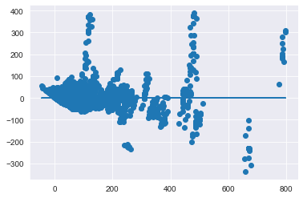
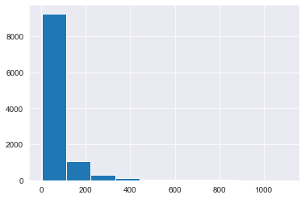
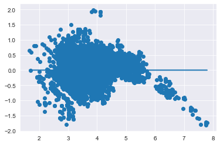
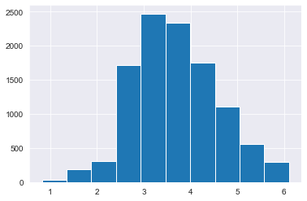
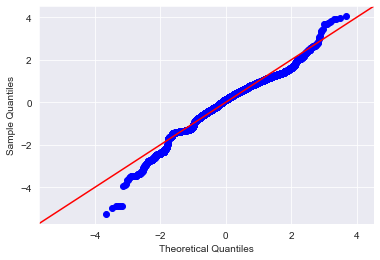
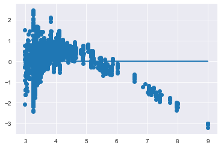

# Modeling Your Data - Lab

## Introduction 

In this lab you'll perform a full linear regression on the data. You'll implement the process demonstrated in the previous lesson, taking a stepwise approach to analyze and improve the model along the way.

## Objectives
You will be able to:

* Remove predictors with p-values too high and refit the model
* Examine and interpret the model results
* Split data into training and test sets
* Fit a regression model to the dataset using the `statsmodels` library


## Build an Initial Regression Model

To start, perform a train-test split and create an initial regression model to model the `list_price` using all of your available features.

> **Note:** In order to write the model you'll have to do some tedious manipulation of your column names. Statsmodels will not allow you to have spaces, apostrophe or arithmetic symbols (+) in your column names. Preview them and refine them as you go.  
**If you receive an error such as "PatsyError: error tokenizing input (maybe an unclosed string?)", then you need to further preprocess your column names.**


```python
import pandas as pd
import matplotlib.pyplot as plt
import numpy as np
import seaborn as sns
sns.set_style('darkgrid')

from statsmodels.formula.api import ols
from statsmodels.stats.outliers_influence import variance_inflation_factor
import statsmodels.api as sm
import scipy.stats as stats
from sklearn.model_selection import train_test_split
```


```python
# __SOLUTION__ 
import pandas as pd
import matplotlib.pyplot as plt
import numpy as np
import seaborn as sns
sns.set_style('darkgrid')

from statsmodels.formula.api import ols
from statsmodels.stats.outliers_influence import variance_inflation_factor
import statsmodels.api as sm
import scipy.stats as stats
from sklearn.model_selection import train_test_split
```


```python
# Import the dataset 'Lego_dataset_cleaned.csv'
df = None
```


```python
# __SOLUTION__ 
df = pd.read_csv('Lego_dataset_cleaned.csv')
df.head()
```


<div>
<style scoped>
    .dataframe tbody tr th:only-of-type {
        vertical-align: middle;
    }

    .dataframe tbody tr th {
        vertical-align: top;
    }

    .dataframe thead th {
        text-align: right;
    }
</style>
<table border="1" class="dataframe">
  <thead>
    <tr style="text-align: right;">
      <th></th>
      <th>piece_count</th>
      <th>list_price</th>
      <th>num_reviews</th>
      <th>play_star_rating</th>
      <th>star_rating</th>
      <th>val_star_rating</th>
      <th>ages_10+</th>
      <th>ages_10-14</th>
      <th>ages_10-16</th>
      <th>ages_10-21</th>
      <th>...</th>
      <th>country_NZ</th>
      <th>country_PL</th>
      <th>country_PT</th>
      <th>country_US</th>
      <th>review_difficulty_Average</th>
      <th>review_difficulty_Challenging</th>
      <th>review_difficulty_Easy</th>
      <th>review_difficulty_Very Challenging</th>
      <th>review_difficulty_Very Easy</th>
      <th>review_difficulty_unknown</th>
    </tr>
  </thead>
  <tbody>
    <tr>
      <th>0</th>
      <td>-0.273020</td>
      <td>29.99</td>
      <td>-0.398512</td>
      <td>-0.655279</td>
      <td>-0.045687</td>
      <td>-0.365010</td>
      <td>0</td>
      <td>0</td>
      <td>0</td>
      <td>0</td>
      <td>...</td>
      <td>0</td>
      <td>0</td>
      <td>0</td>
      <td>1</td>
      <td>1</td>
      <td>0</td>
      <td>0</td>
      <td>0</td>
      <td>0</td>
      <td>0</td>
    </tr>
    <tr>
      <th>1</th>
      <td>-0.404154</td>
      <td>19.99</td>
      <td>-0.398512</td>
      <td>-0.655279</td>
      <td>0.990651</td>
      <td>-0.365010</td>
      <td>0</td>
      <td>0</td>
      <td>0</td>
      <td>0</td>
      <td>...</td>
      <td>0</td>
      <td>0</td>
      <td>0</td>
      <td>1</td>
      <td>0</td>
      <td>0</td>
      <td>1</td>
      <td>0</td>
      <td>0</td>
      <td>0</td>
    </tr>
    <tr>
      <th>2</th>
      <td>-0.517242</td>
      <td>12.99</td>
      <td>-0.147162</td>
      <td>-0.132473</td>
      <td>-0.460222</td>
      <td>-0.204063</td>
      <td>0</td>
      <td>0</td>
      <td>0</td>
      <td>0</td>
      <td>...</td>
      <td>0</td>
      <td>0</td>
      <td>0</td>
      <td>1</td>
      <td>0</td>
      <td>0</td>
      <td>1</td>
      <td>0</td>
      <td>0</td>
      <td>0</td>
    </tr>
    <tr>
      <th>3</th>
      <td>0.635296</td>
      <td>99.99</td>
      <td>0.187972</td>
      <td>-1.352353</td>
      <td>0.161581</td>
      <td>0.117830</td>
      <td>0</td>
      <td>0</td>
      <td>0</td>
      <td>0</td>
      <td>...</td>
      <td>0</td>
      <td>0</td>
      <td>0</td>
      <td>1</td>
      <td>1</td>
      <td>0</td>
      <td>0</td>
      <td>0</td>
      <td>0</td>
      <td>0</td>
    </tr>
    <tr>
      <th>4</th>
      <td>0.288812</td>
      <td>79.99</td>
      <td>-0.063378</td>
      <td>-2.049427</td>
      <td>0.161581</td>
      <td>-0.204063</td>
      <td>0</td>
      <td>0</td>
      <td>0</td>
      <td>0</td>
      <td>...</td>
      <td>0</td>
      <td>0</td>
      <td>0</td>
      <td>1</td>
      <td>0</td>
      <td>1</td>
      <td>0</td>
      <td>0</td>
      <td>0</td>
      <td>0</td>
    </tr>
  </tbody>
</table>
<p>5 rows × 103 columns</p>
</div>


```python
# Your code here - Manipulate column names
```


```python
# __SOLUTION__ 
subs = [(' ', '_'),('.',''),("'",""),('™', ''), ('®',''),
        ('+','plus'), ('½','half'), ('-','_')
       ]
def col_formatting(col):
    for old, new in subs:
        col = col.replace(old,new)
    return col
```


```python
# __SOLUTION__ 
df.columns = [col_formatting(col) for col in df.columns]
```


```python
# __SOLUTION__ 
list(df.columns)
```


    ['piece_count',
     'list_price',
     'num_reviews',
     'play_star_rating',
     'star_rating',
     'val_star_rating',
     'ages_10plus',
     'ages_10_14',
     'ages_10_16',
     'ages_10_21',
     'ages_11_16',
     'ages_12plus',
     'ages_12_16',
     'ages_14plus',
     'ages_16plus',
     'ages_1half_3',
     'ages_1half_5',
     'ages_2_5',
     'ages_4plus',
     'ages_4_7',
     'ages_4_99',
     'ages_5plus',
     'ages_5_12',
     'ages_5_8',
     'ages_6plus',
     'ages_6_12',
     'ages_6_14',
     'ages_7plus',
     'ages_7_12',
     'ages_7_14',
     'ages_8plus',
     'ages_8_12',
     'ages_8_14',
     'ages_9plus',
     'ages_9_12',
     'ages_9_14',
     'ages_9_16',
     'theme_name_Angry_Birds',
     'theme_name_Architecture',
     'theme_name_BOOST',
     'theme_name_Blues_Helicopter_Pursuit',
     'theme_name_BrickHeadz',
     'theme_name_Carnotaurus_Gyrosphere_Escape',
     'theme_name_City',
     'theme_name_Classic',
     'theme_name_Creator_3_in_1',
     'theme_name_Creator_Expert',
     'theme_name_DC_Comics_Super_Heroes',
     'theme_name_DC_Super_Hero_Girls',
     'theme_name_DIMENSIONS',
     'theme_name_DUPLO',
     'theme_name_Dilophosaurus_Outpost_Attack',
     'theme_name_Disney',
     'theme_name_Elves',
     'theme_name_Friends',
     'theme_name_Ghostbusters',
     'theme_name_Ideas',
     'theme_name_Indoraptor_Rampage_at_Lockwood_Estate',
     'theme_name_Juniors',
     'theme_name_Jurassic_Park_Velociraptor_Chase',
     'theme_name_MINDSTORMS',
     'theme_name_Marvel_Super_Heroes',
     'theme_name_Minecraft',
     'theme_name_Minifigures',
     'theme_name_NEXO_KNIGHTS',
     'theme_name_NINJAGO',
     'theme_name_Power_Functions',
     'theme_name_Pteranodon_Chase',
     'theme_name_SERIOUS_PLAY',
     'theme_name_Speed_Champions',
     'theme_name_Star_Wars',
     'theme_name_Stygimoloch_Breakout',
     'theme_name_T_rex_Transport',
     'theme_name_THE_LEGO_BATMAN_MOVIE',
     'theme_name_THE_LEGO_NINJAGO_MOVIE',
     'theme_name_Technic',
     'country_AT',
     'country_AU',
     'country_BE',
     'country_CA',
     'country_CH',
     'country_CZ',
     'country_DE',
     'country_DN',
     'country_ES',
     'country_FI',
     'country_FR',
     'country_GB',
     'country_IE',
     'country_IT',
     'country_LU',
     'country_NL',
     'country_NO',
     'country_NZ',
     'country_PL',
     'country_PT',
     'country_US',
     'review_difficulty_Average',
     'review_difficulty_Challenging',
     'review_difficulty_Easy',
     'review_difficulty_Very_Challenging',
     'review_difficulty_Very_Easy',
     'review_difficulty_unknown']


```python
# __SOLUTION__ 
df.info()
```

    <class 'pandas.core.frame.DataFrame'>
    RangeIndex: 10870 entries, 0 to 10869
    Columns: 103 entries, piece_count to review_difficulty_unknown
    dtypes: float64(6), int64(97)
    memory usage: 8.5 MB


```python
# Your code here - Define the target and predictors
```


```python
# __SOLUTION__ 
# Defining the problem
outcome = 'list_price'
x_cols = list(df.columns)
x_cols.remove(outcome)
```


```python
# Your code here - Split into train and test
train, test = None
```


```python
# __SOLUTION__ 
train, test = train_test_split(df)
```


```python
# __SOLUTION__ 
print(len(train), len(test))
train.head()
```

    8152 2718


<div>
<style scoped>
    .dataframe tbody tr th:only-of-type {
        vertical-align: middle;
    }

    .dataframe tbody tr th {
        vertical-align: top;
    }

    .dataframe thead th {
        text-align: right;
    }
</style>
<table border="1" class="dataframe">
  <thead>
    <tr style="text-align: right;">
      <th></th>
      <th>piece_count</th>
      <th>list_price</th>
      <th>num_reviews</th>
      <th>play_star_rating</th>
      <th>star_rating</th>
      <th>val_star_rating</th>
      <th>ages_10plus</th>
      <th>ages_10_14</th>
      <th>ages_10_16</th>
      <th>ages_10_21</th>
      <th>...</th>
      <th>country_NZ</th>
      <th>country_PL</th>
      <th>country_PT</th>
      <th>country_US</th>
      <th>review_difficulty_Average</th>
      <th>review_difficulty_Challenging</th>
      <th>review_difficulty_Easy</th>
      <th>review_difficulty_Very_Challenging</th>
      <th>review_difficulty_Very_Easy</th>
      <th>review_difficulty_unknown</th>
    </tr>
  </thead>
  <tbody>
    <tr>
      <th>9322</th>
      <td>1.049150</td>
      <td>182.9878</td>
      <td>0.467250</td>
      <td>-0.481010</td>
      <td>-0.252954</td>
      <td>-0.525957</td>
      <td>0</td>
      <td>0</td>
      <td>0</td>
      <td>0</td>
      <td>...</td>
      <td>0</td>
      <td>0</td>
      <td>0</td>
      <td>0</td>
      <td>0</td>
      <td>1</td>
      <td>0</td>
      <td>0</td>
      <td>0</td>
      <td>0</td>
    </tr>
    <tr>
      <th>4617</th>
      <td>-0.481150</td>
      <td>15.6000</td>
      <td>-0.426440</td>
      <td>1.087407</td>
      <td>0.990651</td>
      <td>1.244458</td>
      <td>0</td>
      <td>0</td>
      <td>0</td>
      <td>0</td>
      <td>...</td>
      <td>0</td>
      <td>0</td>
      <td>0</td>
      <td>0</td>
      <td>1</td>
      <td>0</td>
      <td>0</td>
      <td>0</td>
      <td>0</td>
      <td>0</td>
    </tr>
    <tr>
      <th>4780</th>
      <td>0.054214</td>
      <td>65.8800</td>
      <td>-0.342657</td>
      <td>0.564601</td>
      <td>0.576116</td>
      <td>0.117830</td>
      <td>0</td>
      <td>0</td>
      <td>0</td>
      <td>0</td>
      <td>...</td>
      <td>0</td>
      <td>0</td>
      <td>0</td>
      <td>0</td>
      <td>0</td>
      <td>0</td>
      <td>1</td>
      <td>0</td>
      <td>0</td>
      <td>0</td>
    </tr>
    <tr>
      <th>10609</th>
      <td>0.441602</td>
      <td>121.9878</td>
      <td>-0.342657</td>
      <td>1.087407</td>
      <td>0.576116</td>
      <td>-0.365010</td>
      <td>0</td>
      <td>0</td>
      <td>0</td>
      <td>0</td>
      <td>...</td>
      <td>0</td>
      <td>0</td>
      <td>1</td>
      <td>0</td>
      <td>1</td>
      <td>0</td>
      <td>0</td>
      <td>0</td>
      <td>0</td>
      <td>0</td>
    </tr>
    <tr>
      <th>2225</th>
      <td>1.352323</td>
      <td>195.1878</td>
      <td>0.104189</td>
      <td>-1.526621</td>
      <td>-1.496559</td>
      <td>-1.491638</td>
      <td>0</td>
      <td>0</td>
      <td>0</td>
      <td>0</td>
      <td>...</td>
      <td>0</td>
      <td>0</td>
      <td>0</td>
      <td>0</td>
      <td>1</td>
      <td>0</td>
      <td>0</td>
      <td>0</td>
      <td>0</td>
      <td>0</td>
    </tr>
  </tbody>
</table>
<p>5 rows × 103 columns</p>
</div>


```python
# __SOLUTION__ 
test.head()
```


<div>
<style scoped>
    .dataframe tbody tr th:only-of-type {
        vertical-align: middle;
    }

    .dataframe tbody tr th {
        vertical-align: top;
    }

    .dataframe thead th {
        text-align: right;
    }
</style>
<table border="1" class="dataframe">
  <thead>
    <tr style="text-align: right;">
      <th></th>
      <th>piece_count</th>
      <th>list_price</th>
      <th>num_reviews</th>
      <th>play_star_rating</th>
      <th>star_rating</th>
      <th>val_star_rating</th>
      <th>ages_10plus</th>
      <th>ages_10_14</th>
      <th>ages_10_16</th>
      <th>ages_10_21</th>
      <th>...</th>
      <th>country_NZ</th>
      <th>country_PL</th>
      <th>country_PT</th>
      <th>country_US</th>
      <th>review_difficulty_Average</th>
      <th>review_difficulty_Challenging</th>
      <th>review_difficulty_Easy</th>
      <th>review_difficulty_Very_Challenging</th>
      <th>review_difficulty_Very_Easy</th>
      <th>review_difficulty_unknown</th>
    </tr>
  </thead>
  <tbody>
    <tr>
      <th>2331</th>
      <td>-0.518445</td>
      <td>10.1322</td>
      <td>-0.286801</td>
      <td>0.216064</td>
      <td>0.161581</td>
      <td>0.117830</td>
      <td>0</td>
      <td>0</td>
      <td>0</td>
      <td>0</td>
      <td>...</td>
      <td>0</td>
      <td>0</td>
      <td>0</td>
      <td>0</td>
      <td>0</td>
      <td>0</td>
      <td>0</td>
      <td>0</td>
      <td>0</td>
      <td>1</td>
    </tr>
    <tr>
      <th>6118</th>
      <td>-0.572583</td>
      <td>36.5878</td>
      <td>-0.370585</td>
      <td>-0.132473</td>
      <td>-0.460222</td>
      <td>-1.491638</td>
      <td>0</td>
      <td>0</td>
      <td>0</td>
      <td>0</td>
      <td>...</td>
      <td>0</td>
      <td>0</td>
      <td>0</td>
      <td>0</td>
      <td>1</td>
      <td>0</td>
      <td>0</td>
      <td>0</td>
      <td>0</td>
      <td>0</td>
    </tr>
    <tr>
      <th>3444</th>
      <td>-0.167150</td>
      <td>25.3980</td>
      <td>-0.175090</td>
      <td>0.390333</td>
      <td>0.576116</td>
      <td>0.600671</td>
      <td>0</td>
      <td>0</td>
      <td>0</td>
      <td>0</td>
      <td>...</td>
      <td>0</td>
      <td>0</td>
      <td>0</td>
      <td>0</td>
      <td>0</td>
      <td>0</td>
      <td>1</td>
      <td>0</td>
      <td>0</td>
      <td>0</td>
    </tr>
    <tr>
      <th>8020</th>
      <td>-0.540100</td>
      <td>6.0878</td>
      <td>-0.342657</td>
      <td>-0.132473</td>
      <td>-0.045687</td>
      <td>0.117830</td>
      <td>0</td>
      <td>0</td>
      <td>0</td>
      <td>0</td>
      <td>...</td>
      <td>0</td>
      <td>0</td>
      <td>0</td>
      <td>0</td>
      <td>1</td>
      <td>0</td>
      <td>0</td>
      <td>0</td>
      <td>0</td>
      <td>0</td>
    </tr>
    <tr>
      <th>2334</th>
      <td>-0.512430</td>
      <td>10.1322</td>
      <td>-0.426440</td>
      <td>-0.655279</td>
      <td>0.990651</td>
      <td>-0.365010</td>
      <td>0</td>
      <td>0</td>
      <td>0</td>
      <td>0</td>
      <td>...</td>
      <td>0</td>
      <td>0</td>
      <td>0</td>
      <td>0</td>
      <td>0</td>
      <td>0</td>
      <td>1</td>
      <td>0</td>
      <td>0</td>
      <td>0</td>
    </tr>
  </tbody>
</table>
<p>5 rows × 103 columns</p>
</div>


```python
# Your code here - Fit the actual model
```


```python
# __SOLUTION__ 
# Fitting the actual model
predictors = '+'.join(x_cols)
formula = outcome + '~' + predictors
model = ols(formula=formula, data=train).fit()
model.summary()
```


<table class="simpletable">
<caption>OLS Regression Results</caption>
<tr>
  <th>Dep. Variable:</th>       <td>list_price</td>    <th>  R-squared:         </th> <td>   0.862</td> 
</tr>
<tr>
  <th>Model:</th>                   <td>OLS</td>       <th>  Adj. R-squared:    </th> <td>   0.860</td> 
</tr>
<tr>
  <th>Method:</th>             <td>Least Squares</td>  <th>  F-statistic:       </th> <td>   535.2</td> 
</tr>
<tr>
  <th>Date:</th>             <td>Mon, 30 Sep 2019</td> <th>  Prob (F-statistic):</th>  <td>  0.00</td>  
</tr>
<tr>
  <th>Time:</th>                 <td>17:52:25</td>     <th>  Log-Likelihood:    </th> <td> -40631.</td> 
</tr>
<tr>
  <th>No. Observations:</th>      <td>  8152</td>      <th>  AIC:               </th> <td>8.145e+04</td>
</tr>
<tr>
  <th>Df Residuals:</th>          <td>  8057</td>      <th>  BIC:               </th> <td>8.212e+04</td>
</tr>
<tr>
  <th>Df Model:</th>              <td>    94</td>      <th>                     </th>     <td> </td>    
</tr>
<tr>
  <th>Covariance Type:</th>      <td>nonrobust</td>    <th>                     </th>     <td> </td>    
</tr>
</table>
<table class="simpletable">
<tr>
                          <td></td>                            <th>coef</th>     <th>std err</th>      <th>t</th>      <th>P>|t|</th>  <th>[0.025</th>    <th>0.975]</th>  
</tr>
<tr>
  <th>Intercept</th>                                        <td>   64.8612</td> <td>    1.744</td> <td>   37.193</td> <td> 0.000</td> <td>   61.443</td> <td>   68.280</td>
</tr>
<tr>
  <th>piece_count</th>                                      <td>   74.9476</td> <td>    0.901</td> <td>   83.162</td> <td> 0.000</td> <td>   73.181</td> <td>   76.714</td>
</tr>
<tr>
  <th>num_reviews</th>                                      <td>    6.9764</td> <td>    0.705</td> <td>    9.893</td> <td> 0.000</td> <td>    5.594</td> <td>    8.359</td>
</tr>
<tr>
  <th>play_star_rating</th>                                 <td>    4.9752</td> <td>    0.632</td> <td>    7.878</td> <td> 0.000</td> <td>    3.737</td> <td>    6.213</td>
</tr>
<tr>
  <th>star_rating</th>                                      <td>   -1.5662</td> <td>    0.718</td> <td>   -2.180</td> <td> 0.029</td> <td>   -2.975</td> <td>   -0.158</td>
</tr>
<tr>
  <th>val_star_rating</th>                                  <td>   -8.1746</td> <td>    0.639</td> <td>  -12.793</td> <td> 0.000</td> <td>   -9.427</td> <td>   -6.922</td>
</tr>
<tr>
  <th>ages_10plus</th>                                      <td>  132.5639</td> <td>    6.698</td> <td>   19.792</td> <td> 0.000</td> <td>  119.434</td> <td>  145.693</td>
</tr>
<tr>
  <th>ages_10_14</th>                                       <td>  -25.7403</td> <td>    9.294</td> <td>   -2.770</td> <td> 0.006</td> <td>  -43.959</td> <td>   -7.522</td>
</tr>
<tr>
  <th>ages_10_16</th>                                       <td>  -13.6084</td> <td>    4.121</td> <td>   -3.302</td> <td> 0.001</td> <td>  -21.687</td> <td>   -5.530</td>
</tr>
<tr>
  <th>ages_10_21</th>                                       <td>   52.6182</td> <td>    7.379</td> <td>    7.130</td> <td> 0.000</td> <td>   38.153</td> <td>   67.084</td>
</tr>
<tr>
  <th>ages_11_16</th>                                       <td>  -25.1561</td> <td>    5.759</td> <td>   -4.369</td> <td> 0.000</td> <td>  -36.444</td> <td>  -13.868</td>
</tr>
<tr>
  <th>ages_12plus</th>                                      <td>   73.1912</td> <td>    5.653</td> <td>   12.948</td> <td> 0.000</td> <td>   62.111</td> <td>   84.272</td>
</tr>
<tr>
  <th>ages_12_16</th>                                       <td>  -54.3087</td> <td>    6.629</td> <td>   -8.193</td> <td> 0.000</td> <td>  -67.303</td> <td>  -41.314</td>
</tr>
<tr>
  <th>ages_14plus</th>                                      <td>   19.7380</td> <td>    4.250</td> <td>    4.644</td> <td> 0.000</td> <td>   11.406</td> <td>   28.070</td>
</tr>
<tr>
  <th>ages_16plus</th>                                      <td>   38.0731</td> <td>    6.050</td> <td>    6.294</td> <td> 0.000</td> <td>   26.214</td> <td>   49.932</td>
</tr>
<tr>
  <th>ages_1half_3</th>                                     <td>   -9.1021</td> <td>    2.488</td> <td>   -3.658</td> <td> 0.000</td> <td>  -13.979</td> <td>   -4.225</td>
</tr>
<tr>
  <th>ages_1half_5</th>                                     <td>   -3.4366</td> <td>    3.126</td> <td>   -1.099</td> <td> 0.272</td> <td>   -9.564</td> <td>    2.691</td>
</tr>
<tr>
  <th>ages_2_5</th>                                         <td>   14.7228</td> <td>    1.717</td> <td>    8.575</td> <td> 0.000</td> <td>   11.357</td> <td>   18.089</td>
</tr>
<tr>
  <th>ages_4plus</th>                                       <td>  -20.1622</td> <td>    6.412</td> <td>   -3.145</td> <td> 0.002</td> <td>  -32.731</td> <td>   -7.594</td>
</tr>
<tr>
  <th>ages_4_7</th>                                         <td>   -5.3924</td> <td>    3.801</td> <td>   -1.419</td> <td> 0.156</td> <td>  -12.844</td> <td>    2.059</td>
</tr>
<tr>
  <th>ages_4_99</th>                                        <td>   -1.8210</td> <td>    3.661</td> <td>   -0.497</td> <td> 0.619</td> <td>   -8.997</td> <td>    5.355</td>
</tr>
<tr>
  <th>ages_5plus</th>                                       <td>   -9.1452</td> <td>    3.355</td> <td>   -2.726</td> <td> 0.006</td> <td>  -15.721</td> <td>   -2.569</td>
</tr>
<tr>
  <th>ages_5_12</th>                                        <td>  -36.1423</td> <td>    3.183</td> <td>  -11.353</td> <td> 0.000</td> <td>  -42.383</td> <td>  -29.902</td>
</tr>
<tr>
  <th>ages_5_8</th>                                         <td>    5.5407</td> <td>    6.971</td> <td>    0.795</td> <td> 0.427</td> <td>   -8.124</td> <td>   19.205</td>
</tr>
<tr>
  <th>ages_6plus</th>                                       <td>  -26.8077</td> <td>    6.163</td> <td>   -4.350</td> <td> 0.000</td> <td>  -38.888</td> <td>  -14.727</td>
</tr>
<tr>
  <th>ages_6_12</th>                                        <td>  -23.0474</td> <td>    2.437</td> <td>   -9.457</td> <td> 0.000</td> <td>  -27.825</td> <td>  -18.270</td>
</tr>
<tr>
  <th>ages_6_14</th>                                        <td>   -5.5645</td> <td>    4.011</td> <td>   -1.387</td> <td> 0.165</td> <td>  -13.427</td> <td>    2.298</td>
</tr>
<tr>
  <th>ages_7plus</th>                                       <td>  -12.5725</td> <td>   24.425</td> <td>   -0.515</td> <td> 0.607</td> <td>  -60.451</td> <td>   35.306</td>
</tr>
<tr>
  <th>ages_7_12</th>                                        <td>  -20.7390</td> <td>    2.775</td> <td>   -7.474</td> <td> 0.000</td> <td>  -26.178</td> <td>  -15.300</td>
</tr>
<tr>
  <th>ages_7_14</th>                                        <td>  -18.6188</td> <td>    2.411</td> <td>   -7.723</td> <td> 0.000</td> <td>  -23.345</td> <td>  -13.893</td>
</tr>
<tr>
  <th>ages_8plus</th>                                       <td>   11.8227</td> <td>    4.886</td> <td>    2.420</td> <td> 0.016</td> <td>    2.244</td> <td>   21.401</td>
</tr>
<tr>
  <th>ages_8_12</th>                                        <td>  -19.8814</td> <td>    3.258</td> <td>   -6.102</td> <td> 0.000</td> <td>  -26.268</td> <td>  -13.494</td>
</tr>
<tr>
  <th>ages_8_14</th>                                        <td>  -16.3554</td> <td>    2.302</td> <td>   -7.104</td> <td> 0.000</td> <td>  -20.868</td> <td>  -11.843</td>
</tr>
<tr>
  <th>ages_9plus</th>                                       <td>  110.1110</td> <td>   10.717</td> <td>   10.275</td> <td> 0.000</td> <td>   89.103</td> <td>  131.119</td>
</tr>
<tr>
  <th>ages_9_12</th>                                        <td>  -27.4024</td> <td>    6.676</td> <td>   -4.105</td> <td> 0.000</td> <td>  -40.489</td> <td>  -14.316</td>
</tr>
<tr>
  <th>ages_9_14</th>                                        <td>  -10.5604</td> <td>    2.728</td> <td>   -3.871</td> <td> 0.000</td> <td>  -15.909</td> <td>   -5.212</td>
</tr>
<tr>
  <th>ages_9_16</th>                                        <td>   -7.9555</td> <td>    5.776</td> <td>   -1.377</td> <td> 0.168</td> <td>  -19.277</td> <td>    3.366</td>
</tr>
<tr>
  <th>theme_name_Angry_Birds</th>                           <td>   13.6281</td> <td>   15.631</td> <td>    0.872</td> <td> 0.383</td> <td>  -17.013</td> <td>   44.269</td>
</tr>
<tr>
  <th>theme_name_Architecture</th>                          <td>  -92.3721</td> <td>    6.531</td> <td>  -14.144</td> <td> 0.000</td> <td> -105.174</td> <td>  -79.570</td>
</tr>
<tr>
  <th>theme_name_BOOST</th>                                 <td>   85.4343</td> <td>    9.102</td> <td>    9.386</td> <td> 0.000</td> <td>   67.592</td> <td>  103.277</td>
</tr>
<tr>
  <th>theme_name_Blues_Helicopter_Pursuit</th>              <td>   24.9154</td> <td>    9.271</td> <td>    2.688</td> <td> 0.007</td> <td>    6.742</td> <td>   43.088</td>
</tr>
<tr>
  <th>theme_name_BrickHeadz</th>                            <td> -142.5524</td> <td>    7.241</td> <td>  -19.686</td> <td> 0.000</td> <td> -156.748</td> <td> -128.357</td>
</tr>
<tr>
  <th>theme_name_Carnotaurus_Gyrosphere_Escape</th>         <td>   52.4351</td> <td>    9.595</td> <td>    5.465</td> <td> 0.000</td> <td>   33.625</td> <td>   71.245</td>
</tr>
<tr>
  <th>theme_name_City</th>                                  <td>   24.1582</td> <td>    2.498</td> <td>    9.673</td> <td> 0.000</td> <td>   19.262</td> <td>   29.054</td>
</tr>
<tr>
  <th>theme_name_Classic</th>                               <td>  -21.9832</td> <td>    3.374</td> <td>   -6.515</td> <td> 0.000</td> <td>  -28.598</td> <td>  -15.369</td>
</tr>
<tr>
  <th>theme_name_Creator_3_in_1</th>                        <td>   -0.2245</td> <td>    2.634</td> <td>   -0.085</td> <td> 0.932</td> <td>   -5.388</td> <td>    4.939</td>
</tr>
<tr>
  <th>theme_name_Creator_Expert</th>                        <td> -127.1408</td> <td>    4.798</td> <td>  -26.501</td> <td> 0.000</td> <td> -136.545</td> <td> -117.736</td>
</tr>
<tr>
  <th>theme_name_DC_Comics_Super_Heroes</th>                <td>    9.6009</td> <td>    3.696</td> <td>    2.598</td> <td> 0.009</td> <td>    2.356</td> <td>   16.846</td>
</tr>
<tr>
  <th>theme_name_DC_Super_Hero_Girls</th>                   <td>   10.4594</td> <td>    9.921</td> <td>    1.054</td> <td> 0.292</td> <td>   -8.988</td> <td>   29.907</td>
</tr>
<tr>
  <th>theme_name_DIMENSIONS</th>                            <td>   16.9661</td> <td>    3.358</td> <td>    5.052</td> <td> 0.000</td> <td>   10.383</td> <td>   23.549</td>
</tr>
<tr>
  <th>theme_name_DUPLO</th>                                 <td>    2.1841</td> <td>    1.860</td> <td>    1.174</td> <td> 0.240</td> <td>   -1.463</td> <td>    5.831</td>
</tr>
<tr>
  <th>theme_name_Dilophosaurus_Outpost_Attack</th>          <td>   30.2391</td> <td>    8.585</td> <td>    3.522</td> <td> 0.000</td> <td>   13.409</td> <td>   47.069</td>
</tr>
<tr>
  <th>theme_name_Disney</th>                                <td>   10.5232</td> <td>    3.051</td> <td>    3.449</td> <td> 0.001</td> <td>    4.542</td> <td>   16.504</td>
</tr>
<tr>
  <th>theme_name_Elves</th>                                 <td>    1.1227</td> <td>    3.610</td> <td>    0.311</td> <td> 0.756</td> <td>   -5.954</td> <td>    8.200</td>
</tr>
<tr>
  <th>theme_name_Friends</th>                               <td>    2.6382</td> <td>    2.395</td> <td>    1.101</td> <td> 0.271</td> <td>   -2.057</td> <td>    7.333</td>
</tr>
<tr>
  <th>theme_name_Ghostbusters</th>                          <td>  -70.8147</td> <td>    8.566</td> <td>   -8.267</td> <td> 0.000</td> <td>  -87.605</td> <td>  -54.024</td>
</tr>
<tr>
  <th>theme_name_Ideas</th>                                 <td> -134.1264</td> <td>    6.163</td> <td>  -21.761</td> <td> 0.000</td> <td> -146.208</td> <td> -122.044</td>
</tr>
<tr>
  <th>theme_name_Indoraptor_Rampage_at_Lockwood_Estate</th> <td>   65.2329</td> <td>    9.244</td> <td>    7.057</td> <td> 0.000</td> <td>   47.112</td> <td>   83.354</td>
</tr>
<tr>
  <th>theme_name_Juniors</th>                               <td>    0.1483</td> <td>    3.594</td> <td>    0.041</td> <td> 0.967</td> <td>   -6.897</td> <td>    7.193</td>
</tr>
<tr>
  <th>theme_name_Jurassic_Park_Velociraptor_Chase</th>      <td>   16.9342</td> <td>    9.837</td> <td>    1.721</td> <td> 0.085</td> <td>   -2.349</td> <td>   36.217</td>
</tr>
<tr>
  <th>theme_name_MINDSTORMS</th>                            <td>   -9.5000</td> <td>    7.026</td> <td>   -1.352</td> <td> 0.176</td> <td>  -23.272</td> <td>    4.272</td>
</tr>
<tr>
  <th>theme_name_Marvel_Super_Heroes</th>                   <td>   12.1344</td> <td>    2.515</td> <td>    4.824</td> <td> 0.000</td> <td>    7.204</td> <td>   17.065</td>
</tr>
<tr>
  <th>theme_name_Minecraft</th>                             <td>  -16.9032</td> <td>    4.429</td> <td>   -3.817</td> <td> 0.000</td> <td>  -25.585</td> <td>   -8.222</td>
</tr>
<tr>
  <th>theme_name_Minifigures</th>                           <td>   -9.1452</td> <td>    3.355</td> <td>   -2.726</td> <td> 0.006</td> <td>  -15.721</td> <td>   -2.569</td>
</tr>
<tr>
  <th>theme_name_NEXO_KNIGHTS</th>                          <td>   -1.3679</td> <td>    3.332</td> <td>   -0.411</td> <td> 0.681</td> <td>   -7.899</td> <td>    5.163</td>
</tr>
<tr>
  <th>theme_name_NINJAGO</th>                               <td>   -9.2351</td> <td>    3.306</td> <td>   -2.794</td> <td> 0.005</td> <td>  -15.715</td> <td>   -2.755</td>
</tr>
<tr>
  <th>theme_name_Power_Functions</th>                       <td>   13.2828</td> <td>   10.735</td> <td>    1.237</td> <td> 0.216</td> <td>   -7.761</td> <td>   34.326</td>
</tr>
<tr>
  <th>theme_name_Pteranodon_Chase</th>                      <td>    2.1570</td> <td>    8.626</td> <td>    0.250</td> <td> 0.803</td> <td>  -14.751</td> <td>   19.066</td>
</tr>
<tr>
  <th>theme_name_SERIOUS_PLAY</th>                          <td>  233.3834</td> <td>    7.980</td> <td>   29.246</td> <td> 0.000</td> <td>  217.740</td> <td>  249.026</td>
</tr>
<tr>
  <th>theme_name_Speed_Champions</th>                       <td>    6.1419</td> <td>    3.236</td> <td>    1.898</td> <td> 0.058</td> <td>   -0.202</td> <td>   12.486</td>
</tr>
<tr>
  <th>theme_name_Star_Wars</th>                             <td>   17.1460</td> <td>    1.830</td> <td>    9.370</td> <td> 0.000</td> <td>   13.559</td> <td>   20.733</td>
</tr>
<tr>
  <th>theme_name_Stygimoloch_Breakout</th>                  <td>   20.9796</td> <td>    8.911</td> <td>    2.354</td> <td> 0.019</td> <td>    3.512</td> <td>   38.447</td>
</tr>
<tr>
  <th>theme_name_T_rex_Transport</th>                       <td>   34.9832</td> <td>    9.920</td> <td>    3.526</td> <td> 0.000</td> <td>   15.537</td> <td>   54.430</td>
</tr>
<tr>
  <th>theme_name_THE_LEGO_BATMAN_MOVIE</th>                 <td>    8.4370</td> <td>    2.561</td> <td>    3.294</td> <td> 0.001</td> <td>    3.417</td> <td>   13.457</td>
</tr>
<tr>
  <th>theme_name_THE_LEGO_NINJAGO_MOVIE</th>                <td>  -16.8083</td> <td>    2.738</td> <td>   -6.138</td> <td> 0.000</td> <td>  -22.176</td> <td>  -11.441</td>
</tr>
<tr>
  <th>theme_name_Technic</th>                               <td>    1.7695</td> <td>    2.928</td> <td>    0.604</td> <td> 0.546</td> <td>   -3.970</td> <td>    7.509</td>
</tr>
<tr>
  <th>country_AT</th>                                       <td>    1.2896</td> <td>    1.771</td> <td>    0.728</td> <td> 0.467</td> <td>   -2.182</td> <td>    4.761</td>
</tr>
<tr>
  <th>country_AU</th>                                       <td>   -0.7723</td> <td>    1.777</td> <td>   -0.435</td> <td> 0.664</td> <td>   -4.256</td> <td>    2.712</td>
</tr>
<tr>
  <th>country_BE</th>                                       <td>    5.2894</td> <td>    1.780</td> <td>    2.971</td> <td> 0.003</td> <td>    1.800</td> <td>    8.779</td>
</tr>
<tr>
  <th>country_CA</th>                                       <td>   -9.7879</td> <td>    1.505</td> <td>   -6.505</td> <td> 0.000</td> <td>  -12.737</td> <td>   -6.839</td>
</tr>
<tr>
  <th>country_CH</th>                                       <td>    1.3379</td> <td>    1.854</td> <td>    0.721</td> <td> 0.471</td> <td>   -2.297</td> <td>    4.973</td>
</tr>
<tr>
  <th>country_CZ</th>                                       <td>    7.7488</td> <td>    1.787</td> <td>    4.337</td> <td> 0.000</td> <td>    4.246</td> <td>   11.251</td>
</tr>
<tr>
  <th>country_DE</th>                                       <td>    4.1877</td> <td>    1.829</td> <td>    2.289</td> <td> 0.022</td> <td>    0.602</td> <td>    7.774</td>
</tr>
<tr>
  <th>country_DN</th>                                       <td>   -7.6586</td> <td>    1.789</td> <td>   -4.280</td> <td> 0.000</td> <td>  -11.166</td> <td>   -4.151</td>
</tr>
<tr>
  <th>country_ES</th>                                       <td>    4.6657</td> <td>    1.804</td> <td>    2.587</td> <td> 0.010</td> <td>    1.130</td> <td>    8.202</td>
</tr>
<tr>
  <th>country_FI</th>                                       <td>   14.9798</td> <td>    1.788</td> <td>    8.376</td> <td> 0.000</td> <td>   11.474</td> <td>   18.486</td>
</tr>
<tr>
  <th>country_FR</th>                                       <td>    2.4876</td> <td>    1.804</td> <td>    1.379</td> <td> 0.168</td> <td>   -1.050</td> <td>    6.025</td>
</tr>
<tr>
  <th>country_GB</th>                                       <td>    3.8208</td> <td>    1.763</td> <td>    2.167</td> <td> 0.030</td> <td>    0.364</td> <td>    7.277</td>
</tr>
<tr>
  <th>country_IE</th>                                       <td>    2.7893</td> <td>    1.816</td> <td>    1.536</td> <td> 0.125</td> <td>   -0.770</td> <td>    6.348</td>
</tr>
<tr>
  <th>country_IT</th>                                       <td>    1.5533</td> <td>    1.831</td> <td>    0.848</td> <td> 0.396</td> <td>   -2.036</td> <td>    5.143</td>
</tr>
<tr>
  <th>country_LU</th>                                       <td>    4.8374</td> <td>    1.812</td> <td>    2.670</td> <td> 0.008</td> <td>    1.286</td> <td>    8.389</td>
</tr>
<tr>
  <th>country_NL</th>                                       <td>    5.9982</td> <td>    1.799</td> <td>    3.335</td> <td> 0.001</td> <td>    2.472</td> <td>    9.524</td>
</tr>
<tr>
  <th>country_NO</th>                                       <td>   12.8418</td> <td>    1.821</td> <td>    7.051</td> <td> 0.000</td> <td>    9.272</td> <td>   16.412</td>
</tr>
<tr>
  <th>country_NZ</th>                                       <td>    4.6286</td> <td>    1.817</td> <td>    2.547</td> <td> 0.011</td> <td>    1.066</td> <td>    8.191</td>
</tr>
<tr>
  <th>country_PL</th>                                       <td>    7.4844</td> <td>    1.837</td> <td>    4.074</td> <td> 0.000</td> <td>    3.883</td> <td>   11.086</td>
</tr>
<tr>
  <th>country_PT</th>                                       <td>    4.2345</td> <td>    1.810</td> <td>    2.340</td> <td> 0.019</td> <td>    0.687</td> <td>    7.782</td>
</tr>
<tr>
  <th>country_US</th>                                       <td>   -7.0948</td> <td>    1.517</td> <td>   -4.677</td> <td> 0.000</td> <td>  -10.068</td> <td>   -4.121</td>
</tr>
<tr>
  <th>review_difficulty_Average</th>                        <td>   14.8550</td> <td>    1.668</td> <td>    8.907</td> <td> 0.000</td> <td>   11.586</td> <td>   18.124</td>
</tr>
<tr>
  <th>review_difficulty_Challenging</th>                    <td>   19.6220</td> <td>    2.136</td> <td>    9.184</td> <td> 0.000</td> <td>   15.434</td> <td>   23.810</td>
</tr>
<tr>
  <th>review_difficulty_Easy</th>                           <td>    1.5081</td> <td>    1.676</td> <td>    0.900</td> <td> 0.368</td> <td>   -1.777</td> <td>    4.794</td>
</tr>
<tr>
  <th>review_difficulty_Very_Challenging</th>               <td>   27.8144</td> <td>    8.237</td> <td>    3.377</td> <td> 0.001</td> <td>   11.669</td> <td>   43.960</td>
</tr>
<tr>
  <th>review_difficulty_Very_Easy</th>                      <td>   -0.1109</td> <td>    2.064</td> <td>   -0.054</td> <td> 0.957</td> <td>   -4.156</td> <td>    3.934</td>
</tr>
<tr>
  <th>review_difficulty_unknown</th>                        <td>    1.1727</td> <td>    1.845</td> <td>    0.636</td> <td> 0.525</td> <td>   -2.443</td> <td>    4.789</td>
</tr>
</table>
<table class="simpletable">
<tr>
  <th>Omnibus:</th>       <td>4559.125</td> <th>  Durbin-Watson:     </th>  <td>   1.993</td> 
</tr>
<tr>
  <th>Prob(Omnibus):</th>  <td> 0.000</td>  <th>  Jarque-Bera (JB):  </th> <td>409155.543</td>
</tr>
<tr>
  <th>Skew:</th>           <td> 1.795</td>  <th>  Prob(JB):          </th>  <td>    0.00</td> 
</tr>
<tr>
  <th>Kurtosis:</th>       <td>37.521</td>  <th>  Cond. No.          </th>  <td>1.49e+16</td> 
</tr>
</table><br/><br/>Warnings:<br/>[1] Standard Errors assume that the covariance matrix of the errors is correctly specified.<br/>[2] The smallest eigenvalue is 8.22e-29. This might indicate that there are<br/>strong multicollinearity problems or that the design matrix is singular.


## Remove the Uninfluential Features

Based on the initial model, remove those features which do not appear to be statistically relevant and rerun the model.


```python
# Your code here - Remove features which do not appear to be statistically relevant
```


```python
# __SOLUTION__ 
# Extract the p-value table from the summary and use it to subset our features
summary = model.summary()
p_table = summary.tables[1]
p_table = pd.DataFrame(p_table.data)
p_table.columns = p_table.iloc[0]
p_table = p_table.drop(0)
p_table = p_table.set_index(p_table.columns[0])
p_table['P>|t|'] = p_table['P>|t|'].astype(float)
x_cols = list(p_table[p_table['P>|t|'] < 0.05].index)
x_cols.remove('Intercept')
print(len(p_table), len(x_cols))
print(x_cols[:5])
p_table.head()
```

    103 72
    ['piece_count', 'num_reviews', 'play_star_rating', 'star_rating', 'val_star_rating']


<div>
<style scoped>
    .dataframe tbody tr th:only-of-type {
        vertical-align: middle;
    }

    .dataframe tbody tr th {
        vertical-align: top;
    }

    .dataframe thead th {
        text-align: right;
    }
</style>
<table border="1" class="dataframe">
  <thead>
    <tr style="text-align: right;">
      <th></th>
      <th>coef</th>
      <th>std err</th>
      <th>t</th>
      <th>P&gt;|t|</th>
      <th>[0.025</th>
      <th>0.975]</th>
    </tr>
    <tr>
      <th></th>
      <th></th>
      <th></th>
      <th></th>
      <th></th>
      <th></th>
      <th></th>
    </tr>
  </thead>
  <tbody>
    <tr>
      <th>Intercept</th>
      <td>64.8612</td>
      <td>1.744</td>
      <td>37.193</td>
      <td>0.000</td>
      <td>61.443</td>
      <td>68.280</td>
    </tr>
    <tr>
      <th>piece_count</th>
      <td>74.9476</td>
      <td>0.901</td>
      <td>83.162</td>
      <td>0.000</td>
      <td>73.181</td>
      <td>76.714</td>
    </tr>
    <tr>
      <th>num_reviews</th>
      <td>6.9764</td>
      <td>0.705</td>
      <td>9.893</td>
      <td>0.000</td>
      <td>5.594</td>
      <td>8.359</td>
    </tr>
    <tr>
      <th>play_star_rating</th>
      <td>4.9752</td>
      <td>0.632</td>
      <td>7.878</td>
      <td>0.000</td>
      <td>3.737</td>
      <td>6.213</td>
    </tr>
    <tr>
      <th>star_rating</th>
      <td>-1.5662</td>
      <td>0.718</td>
      <td>-2.180</td>
      <td>0.029</td>
      <td>-2.975</td>
      <td>-0.158</td>
    </tr>
  </tbody>
</table>
</div>


```python
# Your code here - Refit the model
```


```python
# __SOLUTION__ 
# Refit model with subset features
predictors = '+'.join(x_cols)
formula = outcome + '~' + predictors
model = ols(formula=formula, data=train).fit()
model.summary()
```


<table class="simpletable">
<caption>OLS Regression Results</caption>
<tr>
  <th>Dep. Variable:</th>       <td>list_price</td>    <th>  R-squared:         </th> <td>   0.862</td> 
</tr>
<tr>
  <th>Model:</th>                   <td>OLS</td>       <th>  Adj. R-squared:    </th> <td>   0.860</td> 
</tr>
<tr>
  <th>Method:</th>             <td>Least Squares</td>  <th>  F-statistic:       </th> <td>   708.8</td> 
</tr>
<tr>
  <th>Date:</th>             <td>Mon, 30 Sep 2019</td> <th>  Prob (F-statistic):</th>  <td>  0.00</td>  
</tr>
<tr>
  <th>Time:</th>                 <td>17:52:36</td>     <th>  Log-Likelihood:    </th> <td> -40640.</td> 
</tr>
<tr>
  <th>No. Observations:</th>      <td>  8152</td>      <th>  AIC:               </th> <td>8.142e+04</td>
</tr>
<tr>
  <th>Df Residuals:</th>          <td>  8080</td>      <th>  BIC:               </th> <td>8.193e+04</td>
</tr>
<tr>
  <th>Df Model:</th>              <td>    71</td>      <th>                     </th>     <td> </td>    
</tr>
<tr>
  <th>Covariance Type:</th>      <td>nonrobust</td>    <th>                     </th>     <td> </td>    
</tr>
</table>
<table class="simpletable">
<tr>
                          <td></td>                            <th>coef</th>     <th>std err</th>      <th>t</th>      <th>P>|t|</th>  <th>[0.025</th>    <th>0.975]</th>  
</tr>
<tr>
  <th>Intercept</th>                                        <td>   63.1235</td> <td>    1.601</td> <td>   39.436</td> <td> 0.000</td> <td>   59.986</td> <td>   66.261</td>
</tr>
<tr>
  <th>piece_count</th>                                      <td>   75.1642</td> <td>    0.882</td> <td>   85.253</td> <td> 0.000</td> <td>   73.436</td> <td>   76.892</td>
</tr>
<tr>
  <th>num_reviews</th>                                      <td>    6.9132</td> <td>    0.693</td> <td>    9.973</td> <td> 0.000</td> <td>    5.554</td> <td>    8.272</td>
</tr>
<tr>
  <th>play_star_rating</th>                                 <td>    5.0413</td> <td>    0.615</td> <td>    8.203</td> <td> 0.000</td> <td>    3.837</td> <td>    6.246</td>
</tr>
<tr>
  <th>star_rating</th>                                      <td>   -1.4870</td> <td>    0.701</td> <td>   -2.121</td> <td> 0.034</td> <td>   -2.861</td> <td>   -0.113</td>
</tr>
<tr>
  <th>val_star_rating</th>                                  <td>   -8.1112</td> <td>    0.604</td> <td>  -13.439</td> <td> 0.000</td> <td>   -9.294</td> <td>   -6.928</td>
</tr>
<tr>
  <th>ages_10plus</th>                                      <td>  130.0601</td> <td>    4.841</td> <td>   26.864</td> <td> 0.000</td> <td>  120.570</td> <td>  139.550</td>
</tr>
<tr>
  <th>ages_10_14</th>                                       <td>  -19.5287</td> <td>    9.665</td> <td>   -2.021</td> <td> 0.043</td> <td>  -38.475</td> <td>   -0.583</td>
</tr>
<tr>
  <th>ages_10_16</th>                                       <td>   -7.6978</td> <td>    3.907</td> <td>   -1.970</td> <td> 0.049</td> <td>  -15.357</td> <td>   -0.039</td>
</tr>
<tr>
  <th>ages_10_21</th>                                       <td>   47.2955</td> <td>    3.271</td> <td>   14.461</td> <td> 0.000</td> <td>   40.884</td> <td>   53.707</td>
</tr>
<tr>
  <th>ages_11_16</th>                                       <td>  -19.4170</td> <td>    5.568</td> <td>   -3.488</td> <td> 0.000</td> <td>  -30.331</td> <td>   -8.503</td>
</tr>
<tr>
  <th>ages_12plus</th>                                      <td>   75.5952</td> <td>    6.183</td> <td>   12.227</td> <td> 0.000</td> <td>   63.475</td> <td>   87.715</td>
</tr>
<tr>
  <th>ages_12_16</th>                                       <td>  -48.4587</td> <td>    6.993</td> <td>   -6.930</td> <td> 0.000</td> <td>  -62.166</td> <td>  -34.752</td>
</tr>
<tr>
  <th>ages_14plus</th>                                      <td>   25.0545</td> <td>    4.907</td> <td>    5.105</td> <td> 0.000</td> <td>   15.435</td> <td>   34.674</td>
</tr>
<tr>
  <th>ages_16plus</th>                                      <td>   42.6640</td> <td>    6.791</td> <td>    6.283</td> <td> 0.000</td> <td>   29.352</td> <td>   55.976</td>
</tr>
<tr>
  <th>ages_1half_3</th>                                     <td>   -2.4120</td> <td>    3.197</td> <td>   -0.755</td> <td> 0.451</td> <td>   -8.678</td> <td>    3.854</td>
</tr>
<tr>
  <th>ages_2_5</th>                                         <td>   21.1856</td> <td>    2.002</td> <td>   10.585</td> <td> 0.000</td> <td>   17.262</td> <td>   25.109</td>
</tr>
<tr>
  <th>ages_4plus</th>                                       <td>  -18.8947</td> <td>    9.806</td> <td>   -1.927</td> <td> 0.054</td> <td>  -38.117</td> <td>    0.327</td>
</tr>
<tr>
  <th>ages_5plus</th>                                       <td>   -7.5176</td> <td>    3.322</td> <td>   -2.263</td> <td> 0.024</td> <td>  -14.029</td> <td>   -1.006</td>
</tr>
<tr>
  <th>ages_5_12</th>                                        <td>  -29.6111</td> <td>    2.734</td> <td>  -10.830</td> <td> 0.000</td> <td>  -34.971</td> <td>  -24.252</td>
</tr>
<tr>
  <th>ages_6plus</th>                                       <td>  -20.2238</td> <td>    6.093</td> <td>   -3.319</td> <td> 0.001</td> <td>  -32.168</td> <td>   -8.280</td>
</tr>
<tr>
  <th>ages_6_12</th>                                        <td>  -16.3294</td> <td>    1.903</td> <td>   -8.579</td> <td> 0.000</td> <td>  -20.061</td> <td>  -12.598</td>
</tr>
<tr>
  <th>ages_7_12</th>                                        <td>  -14.8557</td> <td>    2.252</td> <td>   -6.597</td> <td> 0.000</td> <td>  -19.270</td> <td>  -10.442</td>
</tr>
<tr>
  <th>ages_7_14</th>                                        <td>  -11.5934</td> <td>    2.008</td> <td>   -5.773</td> <td> 0.000</td> <td>  -15.530</td> <td>   -7.657</td>
</tr>
<tr>
  <th>ages_8plus</th>                                       <td>   13.8251</td> <td>    4.458</td> <td>    3.101</td> <td> 0.002</td> <td>    5.087</td> <td>   22.563</td>
</tr>
<tr>
  <th>ages_8_12</th>                                        <td>  -14.3407</td> <td>    2.790</td> <td>   -5.140</td> <td> 0.000</td> <td>  -19.810</td> <td>   -8.872</td>
</tr>
<tr>
  <th>ages_8_14</th>                                        <td>  -10.3312</td> <td>    2.153</td> <td>   -4.799</td> <td> 0.000</td> <td>  -14.551</td> <td>   -6.111</td>
</tr>
<tr>
  <th>ages_9plus</th>                                       <td>  111.5507</td> <td>   10.929</td> <td>   10.207</td> <td> 0.000</td> <td>   90.127</td> <td>  132.975</td>
</tr>
<tr>
  <th>ages_9_12</th>                                        <td>  -22.1872</td> <td>    6.392</td> <td>   -3.471</td> <td> 0.001</td> <td>  -34.718</td> <td>   -9.657</td>
</tr>
<tr>
  <th>ages_9_14</th>                                        <td>   -4.8308</td> <td>    2.887</td> <td>   -1.673</td> <td> 0.094</td> <td>  -10.490</td> <td>    0.829</td>
</tr>
<tr>
  <th>theme_name_Architecture</th>                          <td>  -90.3912</td> <td>    6.537</td> <td>  -13.828</td> <td> 0.000</td> <td> -103.205</td> <td>  -77.578</td>
</tr>
<tr>
  <th>theme_name_BOOST</th>                                 <td>   84.2039</td> <td>    9.226</td> <td>    9.127</td> <td> 0.000</td> <td>   66.119</td> <td>  102.289</td>
</tr>
<tr>
  <th>theme_name_Blues_Helicopter_Pursuit</th>              <td>   23.5148</td> <td>    9.363</td> <td>    2.511</td> <td> 0.012</td> <td>    5.161</td> <td>   41.869</td>
</tr>
<tr>
  <th>theme_name_BrickHeadz</th>                            <td> -135.7338</td> <td>    5.179</td> <td>  -26.206</td> <td> 0.000</td> <td> -145.887</td> <td> -125.581</td>
</tr>
<tr>
  <th>theme_name_Carnotaurus_Gyrosphere_Escape</th>         <td>   50.8146</td> <td>    9.709</td> <td>    5.234</td> <td> 0.000</td> <td>   31.782</td> <td>   69.848</td>
</tr>
<tr>
  <th>theme_name_City</th>                                  <td>   21.9566</td> <td>    2.226</td> <td>    9.863</td> <td> 0.000</td> <td>   17.593</td> <td>   26.320</td>
</tr>
<tr>
  <th>theme_name_Classic</th>                               <td>  -19.7378</td> <td>    2.745</td> <td>   -7.191</td> <td> 0.000</td> <td>  -25.118</td> <td>  -14.357</td>
</tr>
<tr>
  <th>theme_name_Creator_Expert</th>                        <td> -127.5652</td> <td>    4.968</td> <td>  -25.676</td> <td> 0.000</td> <td> -137.304</td> <td> -117.826</td>
</tr>
<tr>
  <th>theme_name_DC_Comics_Super_Heroes</th>                <td>    7.3159</td> <td>    3.615</td> <td>    2.024</td> <td> 0.043</td> <td>    0.230</td> <td>   14.402</td>
</tr>
<tr>
  <th>theme_name_DIMENSIONS</th>                            <td>   14.5559</td> <td>    3.098</td> <td>    4.698</td> <td> 0.000</td> <td>    8.482</td> <td>   20.630</td>
</tr>
<tr>
  <th>theme_name_Dilophosaurus_Outpost_Attack</th>          <td>   29.3786</td> <td>    8.710</td> <td>    3.373</td> <td> 0.001</td> <td>   12.305</td> <td>   46.452</td>
</tr>
<tr>
  <th>theme_name_Disney</th>                                <td>    8.4534</td> <td>    2.947</td> <td>    2.869</td> <td> 0.004</td> <td>    2.677</td> <td>   14.230</td>
</tr>
<tr>
  <th>theme_name_Ghostbusters</th>                          <td>  -72.0280</td> <td>    8.812</td> <td>   -8.173</td> <td> 0.000</td> <td>  -89.303</td> <td>  -54.753</td>
</tr>
<tr>
  <th>theme_name_Ideas</th>                                 <td> -130.5852</td> <td>    5.657</td> <td>  -23.083</td> <td> 0.000</td> <td> -141.675</td> <td> -119.496</td>
</tr>
<tr>
  <th>theme_name_Indoraptor_Rampage_at_Lockwood_Estate</th> <td>   64.0838</td> <td>    9.277</td> <td>    6.908</td> <td> 0.000</td> <td>   45.898</td> <td>   82.269</td>
</tr>
<tr>
  <th>theme_name_Marvel_Super_Heroes</th>                   <td>    9.9655</td> <td>    2.318</td> <td>    4.299</td> <td> 0.000</td> <td>    5.422</td> <td>   14.509</td>
</tr>
<tr>
  <th>theme_name_Minecraft</th>                             <td>  -15.6278</td> <td>    3.944</td> <td>   -3.962</td> <td> 0.000</td> <td>  -23.360</td> <td>   -7.896</td>
</tr>
<tr>
  <th>theme_name_Minifigures</th>                           <td>   -7.5176</td> <td>    3.322</td> <td>   -2.263</td> <td> 0.024</td> <td>  -14.029</td> <td>   -1.006</td>
</tr>
<tr>
  <th>theme_name_NINJAGO</th>                               <td>  -10.9044</td> <td>    2.777</td> <td>   -3.927</td> <td> 0.000</td> <td>  -16.348</td> <td>   -5.461</td>
</tr>
<tr>
  <th>theme_name_SERIOUS_PLAY</th>                          <td>  230.9067</td> <td>    7.954</td> <td>   29.029</td> <td> 0.000</td> <td>  215.314</td> <td>  246.499</td>
</tr>
<tr>
  <th>theme_name_Star_Wars</th>                             <td>   15.4926</td> <td>    1.593</td> <td>    9.723</td> <td> 0.000</td> <td>   12.369</td> <td>   18.616</td>
</tr>
<tr>
  <th>theme_name_Stygimoloch_Breakout</th>                  <td>   18.4648</td> <td>    9.043</td> <td>    2.042</td> <td> 0.041</td> <td>    0.738</td> <td>   36.192</td>
</tr>
<tr>
  <th>theme_name_T_rex_Transport</th>                       <td>   33.3650</td> <td>   10.040</td> <td>    3.323</td> <td> 0.001</td> <td>   13.684</td> <td>   53.045</td>
</tr>
<tr>
  <th>theme_name_THE_LEGO_BATMAN_MOVIE</th>                 <td>    6.4034</td> <td>    2.320</td> <td>    2.760</td> <td> 0.006</td> <td>    1.855</td> <td>   10.952</td>
</tr>
<tr>
  <th>theme_name_THE_LEGO_NINJAGO_MOVIE</th>                <td>  -18.6378</td> <td>    2.481</td> <td>   -7.511</td> <td> 0.000</td> <td>  -23.502</td> <td>  -13.774</td>
</tr>
<tr>
  <th>country_BE</th>                                       <td>    3.8082</td> <td>    1.971</td> <td>    1.932</td> <td> 0.053</td> <td>   -0.055</td> <td>    7.672</td>
</tr>
<tr>
  <th>country_CA</th>                                       <td>  -11.2054</td> <td>    1.693</td> <td>   -6.618</td> <td> 0.000</td> <td>  -14.525</td> <td>   -7.886</td>
</tr>
<tr>
  <th>country_CZ</th>                                       <td>    6.3353</td> <td>    1.979</td> <td>    3.201</td> <td> 0.001</td> <td>    2.455</td> <td>   10.216</td>
</tr>
<tr>
  <th>country_DE</th>                                       <td>    2.7893</td> <td>    2.021</td> <td>    1.380</td> <td> 0.168</td> <td>   -1.172</td> <td>    6.751</td>
</tr>
<tr>
  <th>country_DN</th>                                       <td>   -9.1155</td> <td>    1.980</td> <td>   -4.604</td> <td> 0.000</td> <td>  -12.996</td> <td>   -5.235</td>
</tr>
<tr>
  <th>country_ES</th>                                       <td>    3.3234</td> <td>    1.996</td> <td>    1.665</td> <td> 0.096</td> <td>   -0.588</td> <td>    7.235</td>
</tr>
<tr>
  <th>country_FI</th>                                       <td>   13.5480</td> <td>    1.981</td> <td>    6.838</td> <td> 0.000</td> <td>    9.664</td> <td>   17.432</td>
</tr>
<tr>
  <th>country_GB</th>                                       <td>    2.3971</td> <td>    1.954</td> <td>    1.227</td> <td> 0.220</td> <td>   -1.433</td> <td>    6.227</td>
</tr>
<tr>
  <th>country_LU</th>                                       <td>    3.3402</td> <td>    2.005</td> <td>    1.666</td> <td> 0.096</td> <td>   -0.589</td> <td>    7.270</td>
</tr>
<tr>
  <th>country_NL</th>                                       <td>    4.5775</td> <td>    1.988</td> <td>    2.302</td> <td> 0.021</td> <td>    0.680</td> <td>    8.475</td>
</tr>
<tr>
  <th>country_NO</th>                                       <td>   11.4335</td> <td>    2.014</td> <td>    5.678</td> <td> 0.000</td> <td>    7.486</td> <td>   15.381</td>
</tr>
<tr>
  <th>country_NZ</th>                                       <td>    3.1325</td> <td>    2.008</td> <td>    1.560</td> <td> 0.119</td> <td>   -0.803</td> <td>    7.068</td>
</tr>
<tr>
  <th>country_PL</th>                                       <td>    6.0690</td> <td>    2.029</td> <td>    2.991</td> <td> 0.003</td> <td>    2.092</td> <td>   10.046</td>
</tr>
<tr>
  <th>country_PT</th>                                       <td>    2.8458</td> <td>    2.002</td> <td>    1.421</td> <td> 0.155</td> <td>   -1.079</td> <td>    6.771</td>
</tr>
<tr>
  <th>country_US</th>                                       <td>   -8.5555</td> <td>    1.709</td> <td>   -5.007</td> <td> 0.000</td> <td>  -11.905</td> <td>   -5.206</td>
</tr>
<tr>
  <th>review_difficulty_Average</th>                        <td>   13.7516</td> <td>    1.094</td> <td>   12.568</td> <td> 0.000</td> <td>   11.607</td> <td>   15.897</td>
</tr>
<tr>
  <th>review_difficulty_Challenging</th>                    <td>   18.3355</td> <td>    2.118</td> <td>    8.656</td> <td> 0.000</td> <td>   14.183</td> <td>   22.488</td>
</tr>
<tr>
  <th>review_difficulty_Very_Challenging</th>               <td>   26.6146</td> <td>    9.683</td> <td>    2.749</td> <td> 0.006</td> <td>    7.634</td> <td>   45.596</td>
</tr>
</table>
<table class="simpletable">
<tr>
  <th>Omnibus:</th>       <td>4513.186</td> <th>  Durbin-Watson:     </th>  <td>   1.994</td> 
</tr>
<tr>
  <th>Prob(Omnibus):</th>  <td> 0.000</td>  <th>  Jarque-Bera (JB):  </th> <td>403998.537</td>
</tr>
<tr>
  <th>Skew:</th>           <td> 1.766</td>  <th>  Prob(JB):          </th>  <td>    0.00</td> 
</tr>
<tr>
  <th>Kurtosis:</th>       <td>37.306</td>  <th>  Cond. No.          </th>  <td>1.55e+16</td> 
</tr>
</table><br/><br/>Warnings:<br/>[1] Standard Errors assume that the covariance matrix of the errors is correctly specified.<br/>[2] The smallest eigenvalue is 7.55e-29. This might indicate that there are<br/>strong multicollinearity problems or that the design matrix is singular.


> **Comment:** You should see that the model performance is identical. Additionally, observe that there are further features which have been identified as unimpactful. Continue to refine the model accordingly.


```python
# Your code here - Continue to refine the model
```


```python
# __SOLUTION__ 
# Extract the p-value table from the summary and use it to subset our features
summary = model.summary()
p_table = summary.tables[1]
p_table = pd.DataFrame(p_table.data)
p_table.columns = p_table.iloc[0]
p_table = p_table.drop(0)
p_table = p_table.set_index(p_table.columns[0])
p_table['P>|t|'] = p_table['P>|t|'].astype(float)
x_cols = list(p_table[p_table['P>|t|'] < 0.05].index)
x_cols.remove('Intercept')
print(len(p_table), len(x_cols))
print(x_cols[:5])
p_table.head()
```

    73 62
    ['piece_count', 'num_reviews', 'play_star_rating', 'star_rating', 'val_star_rating']


<div>
<style scoped>
    .dataframe tbody tr th:only-of-type {
        vertical-align: middle;
    }

    .dataframe tbody tr th {
        vertical-align: top;
    }

    .dataframe thead th {
        text-align: right;
    }
</style>
<table border="1" class="dataframe">
  <thead>
    <tr style="text-align: right;">
      <th></th>
      <th>coef</th>
      <th>std err</th>
      <th>t</th>
      <th>P&gt;|t|</th>
      <th>[0.025</th>
      <th>0.975]</th>
    </tr>
    <tr>
      <th></th>
      <th></th>
      <th></th>
      <th></th>
      <th></th>
      <th></th>
      <th></th>
    </tr>
  </thead>
  <tbody>
    <tr>
      <th>Intercept</th>
      <td>63.1235</td>
      <td>1.601</td>
      <td>39.436</td>
      <td>0.000</td>
      <td>59.986</td>
      <td>66.261</td>
    </tr>
    <tr>
      <th>piece_count</th>
      <td>75.1642</td>
      <td>0.882</td>
      <td>85.253</td>
      <td>0.000</td>
      <td>73.436</td>
      <td>76.892</td>
    </tr>
    <tr>
      <th>num_reviews</th>
      <td>6.9132</td>
      <td>0.693</td>
      <td>9.973</td>
      <td>0.000</td>
      <td>5.554</td>
      <td>8.272</td>
    </tr>
    <tr>
      <th>play_star_rating</th>
      <td>5.0413</td>
      <td>0.615</td>
      <td>8.203</td>
      <td>0.000</td>
      <td>3.837</td>
      <td>6.246</td>
    </tr>
    <tr>
      <th>star_rating</th>
      <td>-1.4870</td>
      <td>0.701</td>
      <td>-2.121</td>
      <td>0.034</td>
      <td>-2.861</td>
      <td>-0.113</td>
    </tr>
  </tbody>
</table>
</div>


```python
# Your code here - Refit the model
```


```python
# __SOLUTION__ 
# Refit model with subset features
predictors = '+'.join(x_cols)
formula = outcome + "~" + predictors
model = ols(formula=formula, data=train).fit()
model.summary()
```


<table class="simpletable">
<caption>OLS Regression Results</caption>
<tr>
  <th>Dep. Variable:</th>       <td>list_price</td>    <th>  R-squared:         </th> <td>   0.861</td> 
</tr>
<tr>
  <th>Model:</th>                   <td>OLS</td>       <th>  Adj. R-squared:    </th> <td>   0.860</td> 
</tr>
<tr>
  <th>Method:</th>             <td>Least Squares</td>  <th>  F-statistic:       </th> <td>   824.1</td> 
</tr>
<tr>
  <th>Date:</th>             <td>Mon, 30 Sep 2019</td> <th>  Prob (F-statistic):</th>  <td>  0.00</td>  
</tr>
<tr>
  <th>Time:</th>                 <td>17:52:44</td>     <th>  Log-Likelihood:    </th> <td> -40648.</td> 
</tr>
<tr>
  <th>No. Observations:</th>      <td>  8152</td>      <th>  AIC:               </th> <td>8.142e+04</td>
</tr>
<tr>
  <th>Df Residuals:</th>          <td>  8090</td>      <th>  BIC:               </th> <td>8.185e+04</td>
</tr>
<tr>
  <th>Df Model:</th>              <td>    61</td>      <th>                     </th>     <td> </td>    
</tr>
<tr>
  <th>Covariance Type:</th>      <td>nonrobust</td>    <th>                     </th>     <td> </td>    
</tr>
</table>
<table class="simpletable">
<tr>
                          <td></td>                            <th>coef</th>     <th>std err</th>      <th>t</th>      <th>P>|t|</th>  <th>[0.025</th>    <th>0.975]</th>  
</tr>
<tr>
  <th>Intercept</th>                                        <td>   63.4267</td> <td>    1.269</td> <td>   49.989</td> <td> 0.000</td> <td>   60.940</td> <td>   65.914</td>
</tr>
<tr>
  <th>piece_count</th>                                      <td>   74.8606</td> <td>    0.855</td> <td>   87.528</td> <td> 0.000</td> <td>   73.184</td> <td>   76.537</td>
</tr>
<tr>
  <th>num_reviews</th>                                      <td>    6.4627</td> <td>    0.652</td> <td>    9.911</td> <td> 0.000</td> <td>    5.184</td> <td>    7.741</td>
</tr>
<tr>
  <th>play_star_rating</th>                                 <td>    5.2129</td> <td>    0.611</td> <td>    8.529</td> <td> 0.000</td> <td>    4.015</td> <td>    6.411</td>
</tr>
<tr>
  <th>star_rating</th>                                      <td>   -1.6143</td> <td>    0.697</td> <td>   -2.315</td> <td> 0.021</td> <td>   -2.981</td> <td>   -0.247</td>
</tr>
<tr>
  <th>val_star_rating</th>                                  <td>   -8.1057</td> <td>    0.602</td> <td>  -13.468</td> <td> 0.000</td> <td>   -9.285</td> <td>   -6.926</td>
</tr>
<tr>
  <th>ages_10plus</th>                                      <td>  131.6363</td> <td>    4.713</td> <td>   27.930</td> <td> 0.000</td> <td>  122.398</td> <td>  140.875</td>
</tr>
<tr>
  <th>ages_10_14</th>                                       <td>  -16.4343</td> <td>    9.507</td> <td>   -1.729</td> <td> 0.084</td> <td>  -35.070</td> <td>    2.201</td>
</tr>
<tr>
  <th>ages_10_16</th>                                       <td>   -5.2748</td> <td>    3.665</td> <td>   -1.439</td> <td> 0.150</td> <td>  -12.458</td> <td>    1.909</td>
</tr>
<tr>
  <th>ages_10_21</th>                                       <td>   48.3031</td> <td>    3.190</td> <td>   15.143</td> <td> 0.000</td> <td>   42.050</td> <td>   54.556</td>
</tr>
<tr>
  <th>ages_11_16</th>                                       <td>  -16.6233</td> <td>    5.357</td> <td>   -3.103</td> <td> 0.002</td> <td>  -27.125</td> <td>   -6.122</td>
</tr>
<tr>
  <th>ages_12plus</th>                                      <td>   78.7907</td> <td>    5.943</td> <td>   13.258</td> <td> 0.000</td> <td>   67.141</td> <td>   90.440</td>
</tr>
<tr>
  <th>ages_12_16</th>                                       <td>  -44.8737</td> <td>    6.746</td> <td>   -6.652</td> <td> 0.000</td> <td>  -58.098</td> <td>  -31.649</td>
</tr>
<tr>
  <th>ages_14plus</th>                                      <td>   29.5013</td> <td>    4.462</td> <td>    6.611</td> <td> 0.000</td> <td>   20.754</td> <td>   38.249</td>
</tr>
<tr>
  <th>ages_16plus</th>                                      <td>   48.1257</td> <td>    6.273</td> <td>    7.672</td> <td> 0.000</td> <td>   35.830</td> <td>   60.422</td>
</tr>
<tr>
  <th>ages_2_5</th>                                         <td>   22.3439</td> <td>    1.856</td> <td>   12.038</td> <td> 0.000</td> <td>   18.705</td> <td>   25.982</td>
</tr>
<tr>
  <th>ages_5plus</th>                                       <td>   -6.9446</td> <td>    3.303</td> <td>   -2.103</td> <td> 0.036</td> <td>  -13.419</td> <td>   -0.470</td>
</tr>
<tr>
  <th>ages_5_12</th>                                        <td>  -28.4674</td> <td>    2.619</td> <td>  -10.871</td> <td> 0.000</td> <td>  -33.601</td> <td>  -23.334</td>
</tr>
<tr>
  <th>ages_6plus</th>                                       <td>  -19.0659</td> <td>    6.039</td> <td>   -3.157</td> <td> 0.002</td> <td>  -30.904</td> <td>   -7.228</td>
</tr>
<tr>
  <th>ages_6_12</th>                                        <td>  -14.7402</td> <td>    1.634</td> <td>   -9.021</td> <td> 0.000</td> <td>  -17.943</td> <td>  -11.537</td>
</tr>
<tr>
  <th>ages_7_12</th>                                        <td>  -13.1965</td> <td>    2.024</td> <td>   -6.521</td> <td> 0.000</td> <td>  -17.163</td> <td>   -9.230</td>
</tr>
<tr>
  <th>ages_7_14</th>                                        <td>   -9.9517</td> <td>    1.767</td> <td>   -5.632</td> <td> 0.000</td> <td>  -13.415</td> <td>   -6.488</td>
</tr>
<tr>
  <th>ages_8plus</th>                                       <td>   14.6605</td> <td>    4.416</td> <td>    3.320</td> <td> 0.001</td> <td>    6.005</td> <td>   23.316</td>
</tr>
<tr>
  <th>ages_8_12</th>                                        <td>  -12.5803</td> <td>    2.568</td> <td>   -4.898</td> <td> 0.000</td> <td>  -17.615</td> <td>   -7.546</td>
</tr>
<tr>
  <th>ages_8_14</th>                                        <td>   -8.1411</td> <td>    1.736</td> <td>   -4.689</td> <td> 0.000</td> <td>  -11.545</td> <td>   -4.738</td>
</tr>
<tr>
  <th>ages_9plus</th>                                       <td>  112.4350</td> <td>   10.854</td> <td>   10.359</td> <td> 0.000</td> <td>   91.159</td> <td>  133.711</td>
</tr>
<tr>
  <th>ages_9_12</th>                                        <td>  -20.5921</td> <td>    6.325</td> <td>   -3.256</td> <td> 0.001</td> <td>  -32.990</td> <td>   -8.194</td>
</tr>
<tr>
  <th>theme_name_Architecture</th>                          <td>  -91.2979</td> <td>    6.498</td> <td>  -14.050</td> <td> 0.000</td> <td> -104.036</td> <td>  -78.560</td>
</tr>
<tr>
  <th>theme_name_BOOST</th>                                 <td>   85.2067</td> <td>    9.222</td> <td>    9.240</td> <td> 0.000</td> <td>   67.130</td> <td>  103.284</td>
</tr>
<tr>
  <th>theme_name_Blues_Helicopter_Pursuit</th>              <td>   23.0396</td> <td>    9.360</td> <td>    2.461</td> <td> 0.014</td> <td>    4.691</td> <td>   41.388</td>
</tr>
<tr>
  <th>theme_name_BrickHeadz</th>                            <td> -135.8757</td> <td>    5.159</td> <td>  -26.337</td> <td> 0.000</td> <td> -145.989</td> <td> -125.763</td>
</tr>
<tr>
  <th>theme_name_Carnotaurus_Gyrosphere_Escape</th>         <td>   50.8720</td> <td>    9.709</td> <td>    5.240</td> <td> 0.000</td> <td>   31.840</td> <td>   69.904</td>
</tr>
<tr>
  <th>theme_name_City</th>                                  <td>   22.0863</td> <td>    2.226</td> <td>    9.921</td> <td> 0.000</td> <td>   17.722</td> <td>   26.450</td>
</tr>
<tr>
  <th>theme_name_Classic</th>                               <td>  -19.5937</td> <td>    2.572</td> <td>   -7.619</td> <td> 0.000</td> <td>  -24.635</td> <td>  -14.552</td>
</tr>
<tr>
  <th>theme_name_Creator_Expert</th>                        <td> -128.6759</td> <td>    4.895</td> <td>  -26.286</td> <td> 0.000</td> <td> -138.272</td> <td> -119.080</td>
</tr>
<tr>
  <th>theme_name_DC_Comics_Super_Heroes</th>                <td>    6.7668</td> <td>    3.600</td> <td>    1.880</td> <td> 0.060</td> <td>   -0.290</td> <td>   13.824</td>
</tr>
<tr>
  <th>theme_name_DIMENSIONS</th>                            <td>   13.7002</td> <td>    3.077</td> <td>    4.453</td> <td> 0.000</td> <td>    7.669</td> <td>   19.731</td>
</tr>
<tr>
  <th>theme_name_Dilophosaurus_Outpost_Attack</th>          <td>   29.2095</td> <td>    8.710</td> <td>    3.354</td> <td> 0.001</td> <td>   12.136</td> <td>   46.283</td>
</tr>
<tr>
  <th>theme_name_Disney</th>                                <td>    8.4859</td> <td>    2.948</td> <td>    2.879</td> <td> 0.004</td> <td>    2.708</td> <td>   14.264</td>
</tr>
<tr>
  <th>theme_name_Ghostbusters</th>                          <td>  -72.6316</td> <td>    8.807</td> <td>   -8.247</td> <td> 0.000</td> <td>  -89.896</td> <td>  -55.367</td>
</tr>
<tr>
  <th>theme_name_Ideas</th>                                 <td> -130.0450</td> <td>    5.602</td> <td>  -23.213</td> <td> 0.000</td> <td> -141.027</td> <td> -119.063</td>
</tr>
<tr>
  <th>theme_name_Indoraptor_Rampage_at_Lockwood_Estate</th> <td>   63.5596</td> <td>    9.275</td> <td>    6.853</td> <td> 0.000</td> <td>   45.378</td> <td>   81.741</td>
</tr>
<tr>
  <th>theme_name_Marvel_Super_Heroes</th>                   <td>    9.6614</td> <td>    2.308</td> <td>    4.185</td> <td> 0.000</td> <td>    5.136</td> <td>   14.186</td>
</tr>
<tr>
  <th>theme_name_Minecraft</th>                             <td>  -15.0666</td> <td>    3.933</td> <td>   -3.831</td> <td> 0.000</td> <td>  -22.777</td> <td>   -7.357</td>
</tr>
<tr>
  <th>theme_name_Minifigures</th>                           <td>   -6.9446</td> <td>    3.303</td> <td>   -2.103</td> <td> 0.036</td> <td>  -13.419</td> <td>   -0.470</td>
</tr>
<tr>
  <th>theme_name_NINJAGO</th>                               <td>  -11.0344</td> <td>    2.761</td> <td>   -3.996</td> <td> 0.000</td> <td>  -16.447</td> <td>   -5.621</td>
</tr>
<tr>
  <th>theme_name_SERIOUS_PLAY</th>                          <td>  231.6343</td> <td>    7.934</td> <td>   29.195</td> <td> 0.000</td> <td>  216.081</td> <td>  247.187</td>
</tr>
<tr>
  <th>theme_name_Star_Wars</th>                             <td>   14.7210</td> <td>    1.467</td> <td>   10.035</td> <td> 0.000</td> <td>   11.845</td> <td>   17.596</td>
</tr>
<tr>
  <th>theme_name_Stygimoloch_Breakout</th>                  <td>   18.4513</td> <td>    9.045</td> <td>    2.040</td> <td> 0.041</td> <td>    0.721</td> <td>   36.182</td>
</tr>
<tr>
  <th>theme_name_T_rex_Transport</th>                       <td>   32.7113</td> <td>   10.038</td> <td>    3.259</td> <td> 0.001</td> <td>   13.034</td> <td>   52.389</td>
</tr>
<tr>
  <th>theme_name_THE_LEGO_BATMAN_MOVIE</th>                 <td>    5.9243</td> <td>    2.296</td> <td>    2.580</td> <td> 0.010</td> <td>    1.424</td> <td>   10.425</td>
</tr>
<tr>
  <th>theme_name_THE_LEGO_NINJAGO_MOVIE</th>                <td>  -19.7354</td> <td>    2.347</td> <td>   -8.411</td> <td> 0.000</td> <td>  -24.335</td> <td>  -15.136</td>
</tr>
<tr>
  <th>country_CA</th>                                       <td>  -12.8908</td> <td>    1.600</td> <td>   -8.058</td> <td> 0.000</td> <td>  -16.027</td> <td>   -9.755</td>
</tr>
<tr>
  <th>country_CZ</th>                                       <td>    4.6381</td> <td>    1.899</td> <td>    2.442</td> <td> 0.015</td> <td>    0.915</td> <td>    8.361</td>
</tr>
<tr>
  <th>country_DN</th>                                       <td>  -10.7767</td> <td>    1.902</td> <td>   -5.667</td> <td> 0.000</td> <td>  -14.505</td> <td>   -7.049</td>
</tr>
<tr>
  <th>country_FI</th>                                       <td>   11.8724</td> <td>    1.902</td> <td>    6.244</td> <td> 0.000</td> <td>    8.145</td> <td>   15.600</td>
</tr>
<tr>
  <th>country_NL</th>                                       <td>    2.8918</td> <td>    1.910</td> <td>    1.514</td> <td> 0.130</td> <td>   -0.853</td> <td>    6.636</td>
</tr>
<tr>
  <th>country_NO</th>                                       <td>    9.7377</td> <td>    1.935</td> <td>    5.032</td> <td> 0.000</td> <td>    5.944</td> <td>   13.531</td>
</tr>
<tr>
  <th>country_PL</th>                                       <td>    4.3578</td> <td>    1.951</td> <td>    2.234</td> <td> 0.026</td> <td>    0.533</td> <td>    8.182</td>
</tr>
<tr>
  <th>country_US</th>                                       <td>  -10.2657</td> <td>    1.616</td> <td>   -6.353</td> <td> 0.000</td> <td>  -13.433</td> <td>   -7.098</td>
</tr>
<tr>
  <th>review_difficulty_Average</th>                        <td>   13.1889</td> <td>    1.032</td> <td>   12.782</td> <td> 0.000</td> <td>   11.166</td> <td>   15.212</td>
</tr>
<tr>
  <th>review_difficulty_Challenging</th>                    <td>   17.6019</td> <td>    2.051</td> <td>    8.580</td> <td> 0.000</td> <td>   13.581</td> <td>   21.623</td>
</tr>
<tr>
  <th>review_difficulty_Very_Challenging</th>               <td>   24.5852</td> <td>    9.650</td> <td>    2.548</td> <td> 0.011</td> <td>    5.668</td> <td>   43.503</td>
</tr>
</table>
<table class="simpletable">
<tr>
  <th>Omnibus:</th>       <td>4532.744</td> <th>  Durbin-Watson:     </th>  <td>   1.995</td> 
</tr>
<tr>
  <th>Prob(Omnibus):</th>  <td> 0.000</td>  <th>  Jarque-Bera (JB):  </th> <td>402761.845</td>
</tr>
<tr>
  <th>Skew:</th>           <td> 1.781</td>  <th>  Prob(JB):          </th>  <td>    0.00</td> 
</tr>
<tr>
  <th>Kurtosis:</th>       <td>37.250</td>  <th>  Cond. No.          </th>  <td>1.56e+16</td> 
</tr>
</table><br/><br/>Warnings:<br/>[1] Standard Errors assume that the covariance matrix of the errors is correctly specified.<br/>[2] The smallest eigenvalue is 7.46e-29. This might indicate that there are<br/>strong multicollinearity problems or that the design matrix is singular.


## Investigate Multicollinearity

There are still a lot of features in the current model! Chances are there are some strong multicollinearity issues. Begin to investigate the extent of this problem.


```python
# Your code here - Code a way to identify multicollinearity
```


```python
# __SOLUTION__ 
# Your code here
X = df[x_cols]
vif = [variance_inflation_factor(X.values, i) for i in range(X.shape[1])]
list(zip(x_cols, vif))
```

    //anaconda3/lib/python3.7/site-packages/statsmodels/stats/outliers_influence.py:185: RuntimeWarning: divide by zero encountered in double_scalars
      vif = 1. / (1. - r_squared_i)


    [('piece_count', 4.405922178149602),
     ('num_reviews', 2.5718006443792962),
     ('play_star_rating', 2.4260935190437145),
     ('star_rating', 3.1741561009508583),
     ('val_star_rating', 2.378917945963164),
     ('ages_10plus', 7.062790874285119),
     ('ages_10_14', 1.0757978281815623),
     ('ages_10_16', 1.1251253329169546),
     ('ages_10_21', 1.05087276211678),
     ('ages_11_16', 1.1324665191866985),
     ('ages_12plus', 6.029744721129756),
     ('ages_12_16', 1.1691677864356895),
     ('ages_14plus', 2.0274529340611647),
     ('ages_16plus', 8.827255705628065),
     ('ages_2_5', 1.178223844804356),
     ('ages_5plus', inf),
     ('ages_5_12', 3.2140122683031045),
     ('ages_6plus', 2.6615908842375973),
     ('ages_6_12', 1.7695310233521744),
     ('ages_7_12', 1.4094255446212736),
     ('ages_7_14', 1.8041932530808011),
     ('ages_8plus', 2.5759630763154084),
     ('ages_8_12', 1.2182811988298787),
     ('ages_8_14', 1.620513834261176),
     ('ages_9plus', 1.4045095135032246),
     ('ages_9_12', 1.0165202407011587),
     ('theme_name_Architecture', 5.2076170924927245),
     ('theme_name_BOOST', 1.0657931827250136),
     ('theme_name_Blues_Helicopter_Pursuit', 1.0397474912772058),
     ('theme_name_BrickHeadz', 6.838363242215517),
     ('theme_name_Carnotaurus_Gyrosphere_Escape', 1.047496467961563),
     ('theme_name_City', 3.125973417015085),
     ('theme_name_Classic', 1.0413562303533714),
     ('theme_name_Creator_Expert', 4.675759444324803),
     ('theme_name_DC_Comics_Super_Heroes', 1.092988243790357),
     ('theme_name_DIMENSIONS', 1.3437623629438735),
     ('theme_name_Dilophosaurus_Outpost_Attack', 1.0689157923201948),
     ('theme_name_Disney', 1.409607876297951),
     ('theme_name_Ghostbusters', 1.2059876864557593),
     ('theme_name_Ideas', 2.313300325355922),
     ('theme_name_Indoraptor_Rampage_at_Lockwood_Estate', 1.0877622951765271),
     ('theme_name_Marvel_Super_Heroes', 1.290836873516688),
     ('theme_name_Minecraft', 2.6814702409831055),
     ('theme_name_Minifigures', inf),
     ('theme_name_NINJAGO', 1.0859940669013926),
     ('theme_name_SERIOUS_PLAY', 2.8302142883577526),
     ('theme_name_Star_Wars', 1.6011811108555025),
     ('theme_name_Stygimoloch_Breakout', 1.0349147360095843),
     ('theme_name_T_rex_Transport', 1.04124983810647),
     ('theme_name_THE_LEGO_BATMAN_MOVIE', 1.2739561583217915),
     ('theme_name_THE_LEGO_NINJAGO_MOVIE', 1.1763518399402193),
     ('country_CA', 1.0973057427296746),
     ('country_CZ', 1.0637480188357873),
     ('country_DN', 1.0668862455720203),
     ('country_FI', 1.0637480188357873),
     ('country_NL', 1.0670108311480555),
     ('country_NO', 1.0637480188357873),
     ('country_PL', 1.061861096858257),
     ('country_US', 1.097504050148929),
     ('review_difficulty_Average', 1.9699941512514942),
     ('review_difficulty_Challenging', 2.3212004104121404),
     ('review_difficulty_Very_Challenging', 1.2186259404082131)]


## Perform Another Round of Feature Selection

Once again, subset your features based on your findings above. Then rerun the model once again.


```python
# Your code here - Subset features based on multicollinearity
```


```python
# Your code here - Refit model with subset features
```


```python
# __SOLUTION__ 
vif_scores = list(zip(x_cols, vif))
x_cols = [x for x,vif in vif_scores if vif < 5]
print(len(vif_scores), len(x_cols))
```

    62 55


```python
# __SOLUTION__ 
# Refit model with subset features
predictors = '+'.join(x_cols)
formula = outcome + "~" + predictors
model = ols(formula=formula, data=train).fit()
model.summary()
```


<table class="simpletable">
<caption>OLS Regression Results</caption>
<tr>
  <th>Dep. Variable:</th>       <td>list_price</td>    <th>  R-squared:         </th> <td>   0.846</td> 
</tr>
<tr>
  <th>Model:</th>                   <td>OLS</td>       <th>  Adj. R-squared:    </th> <td>   0.845</td> 
</tr>
<tr>
  <th>Method:</th>             <td>Least Squares</td>  <th>  F-statistic:       </th> <td>   808.5</td> 
</tr>
<tr>
  <th>Date:</th>             <td>Mon, 30 Sep 2019</td> <th>  Prob (F-statistic):</th>  <td>  0.00</td>  
</tr>
<tr>
  <th>Time:</th>                 <td>17:53:18</td>     <th>  Log-Likelihood:    </th> <td> -41077.</td> 
</tr>
<tr>
  <th>No. Observations:</th>      <td>  8152</td>      <th>  AIC:               </th> <td>8.227e+04</td>
</tr>
<tr>
  <th>Df Residuals:</th>          <td>  8096</td>      <th>  BIC:               </th> <td>8.266e+04</td>
</tr>
<tr>
  <th>Df Model:</th>              <td>    55</td>      <th>                     </th>     <td> </td>    
</tr>
<tr>
  <th>Covariance Type:</th>      <td>nonrobust</td>    <th>                     </th>     <td> </td>    
</tr>
</table>
<table class="simpletable">
<tr>
                          <td></td>                            <th>coef</th>     <th>std err</th>      <th>t</th>      <th>P>|t|</th>  <th>[0.025</th>    <th>0.975]</th>  
</tr>
<tr>
  <th>Intercept</th>                                        <td>   66.5706</td> <td>    1.120</td> <td>   59.423</td> <td> 0.000</td> <td>   64.375</td> <td>   68.767</td>
</tr>
<tr>
  <th>piece_count</th>                                      <td>   77.4224</td> <td>    0.708</td> <td>  109.333</td> <td> 0.000</td> <td>   76.034</td> <td>   78.811</td>
</tr>
<tr>
  <th>num_reviews</th>                                      <td>    5.6273</td> <td>    0.641</td> <td>    8.784</td> <td> 0.000</td> <td>    4.372</td> <td>    6.883</td>
</tr>
<tr>
  <th>play_star_rating</th>                                 <td>    6.4645</td> <td>    0.566</td> <td>   11.424</td> <td> 0.000</td> <td>    5.355</td> <td>    7.574</td>
</tr>
<tr>
  <th>star_rating</th>                                      <td>   -2.2202</td> <td>    0.710</td> <td>   -3.125</td> <td> 0.002</td> <td>   -3.613</td> <td>   -0.828</td>
</tr>
<tr>
  <th>val_star_rating</th>                                  <td>   -9.3871</td> <td>    0.629</td> <td>  -14.922</td> <td> 0.000</td> <td>  -10.620</td> <td>   -8.154</td>
</tr>
<tr>
  <th>ages_10_14</th>                                       <td>  -30.5007</td> <td>    9.990</td> <td>   -3.053</td> <td> 0.002</td> <td>  -50.084</td> <td>  -10.917</td>
</tr>
<tr>
  <th>ages_10_16</th>                                       <td>  -12.9744</td> <td>    3.719</td> <td>   -3.489</td> <td> 0.000</td> <td>  -20.264</td> <td>   -5.685</td>
</tr>
<tr>
  <th>ages_10_21</th>                                       <td>   45.7372</td> <td>    3.313</td> <td>   13.807</td> <td> 0.000</td> <td>   39.244</td> <td>   52.231</td>
</tr>
<tr>
  <th>ages_11_16</th>                                       <td>  -29.0582</td> <td>    5.384</td> <td>   -5.397</td> <td> 0.000</td> <td>  -39.612</td> <td>  -18.505</td>
</tr>
<tr>
  <th>ages_12_16</th>                                       <td>  -59.7600</td> <td>    6.796</td> <td>   -8.793</td> <td> 0.000</td> <td>  -73.083</td> <td>  -46.437</td>
</tr>
<tr>
  <th>ages_14plus</th>                                      <td>    4.2955</td> <td>    4.087</td> <td>    1.051</td> <td> 0.293</td> <td>   -3.716</td> <td>   12.307</td>
</tr>
<tr>
  <th>ages_2_5</th>                                         <td>   20.4819</td> <td>    1.847</td> <td>   11.090</td> <td> 0.000</td> <td>   16.861</td> <td>   24.102</td>
</tr>
<tr>
  <th>ages_5_12</th>                                        <td>  -31.1165</td> <td>    2.706</td> <td>  -11.498</td> <td> 0.000</td> <td>  -36.421</td> <td>  -25.812</td>
</tr>
<tr>
  <th>ages_6plus</th>                                       <td>  -22.1511</td> <td>    6.330</td> <td>   -3.499</td> <td> 0.000</td> <td>  -34.560</td> <td>   -9.742</td>
</tr>
<tr>
  <th>ages_6_12</th>                                        <td>  -18.9130</td> <td>    1.634</td> <td>  -11.574</td> <td> 0.000</td> <td>  -22.116</td> <td>  -15.710</td>
</tr>
<tr>
  <th>ages_7_12</th>                                        <td>  -16.6192</td> <td>    2.068</td> <td>   -8.037</td> <td> 0.000</td> <td>  -20.673</td> <td>  -12.566</td>
</tr>
<tr>
  <th>ages_7_14</th>                                        <td>  -13.3358</td> <td>    1.792</td> <td>   -7.441</td> <td> 0.000</td> <td>  -16.849</td> <td>   -9.822</td>
</tr>
<tr>
  <th>ages_8plus</th>                                       <td>    1.1390</td> <td>    4.534</td> <td>    0.251</td> <td> 0.802</td> <td>   -7.748</td> <td>   10.026</td>
</tr>
<tr>
  <th>ages_8_12</th>                                        <td>  -16.4240</td> <td>    2.600</td> <td>   -6.317</td> <td> 0.000</td> <td>  -21.521</td> <td>  -11.327</td>
</tr>
<tr>
  <th>ages_8_14</th>                                        <td>  -12.8283</td> <td>    1.763</td> <td>   -7.278</td> <td> 0.000</td> <td>  -16.283</td> <td>   -9.373</td>
</tr>
<tr>
  <th>ages_9plus</th>                                       <td>   20.7116</td> <td>   10.805</td> <td>    1.917</td> <td> 0.055</td> <td>   -0.469</td> <td>   41.892</td>
</tr>
<tr>
  <th>ages_9_12</th>                                        <td>  -26.0979</td> <td>    6.632</td> <td>   -3.935</td> <td> 0.000</td> <td>  -39.098</td> <td>  -13.098</td>
</tr>
<tr>
  <th>theme_name_BOOST</th>                                 <td>   83.5449</td> <td>    9.692</td> <td>    8.620</td> <td> 0.000</td> <td>   64.547</td> <td>  102.543</td>
</tr>
<tr>
  <th>theme_name_Blues_Helicopter_Pursuit</th>              <td>   23.4626</td> <td>    9.861</td> <td>    2.379</td> <td> 0.017</td> <td>    4.132</td> <td>   42.793</td>
</tr>
<tr>
  <th>theme_name_Carnotaurus_Gyrosphere_Escape</th>         <td>   51.1313</td> <td>   10.224</td> <td>    5.001</td> <td> 0.000</td> <td>   31.089</td> <td>   71.173</td>
</tr>
<tr>
  <th>theme_name_City</th>                                  <td>   21.8707</td> <td>    2.334</td> <td>    9.372</td> <td> 0.000</td> <td>   17.296</td> <td>   26.445</td>
</tr>
<tr>
  <th>theme_name_Classic</th>                               <td>  -21.3411</td> <td>    2.613</td> <td>   -8.167</td> <td> 0.000</td> <td>  -26.464</td> <td>  -16.219</td>
</tr>
<tr>
  <th>theme_name_Creator_Expert</th>                        <td>  -93.7125</td> <td>    3.357</td> <td>  -27.915</td> <td> 0.000</td> <td> -100.293</td> <td>  -87.132</td>
</tr>
<tr>
  <th>theme_name_DC_Comics_Super_Heroes</th>                <td>    7.0900</td> <td>    3.787</td> <td>    1.872</td> <td> 0.061</td> <td>   -0.333</td> <td>   14.513</td>
</tr>
<tr>
  <th>theme_name_DIMENSIONS</th>                            <td>   14.4625</td> <td>    3.237</td> <td>    4.469</td> <td> 0.000</td> <td>    8.118</td> <td>   20.807</td>
</tr>
<tr>
  <th>theme_name_Dilophosaurus_Outpost_Attack</th>          <td>   29.7108</td> <td>    9.159</td> <td>    3.244</td> <td> 0.001</td> <td>   11.758</td> <td>   47.664</td>
</tr>
<tr>
  <th>theme_name_Disney</th>                                <td>   10.7879</td> <td>    3.094</td> <td>    3.487</td> <td> 0.000</td> <td>    4.723</td> <td>   16.852</td>
</tr>
<tr>
  <th>theme_name_Ghostbusters</th>                          <td>  -50.8519</td> <td>    8.941</td> <td>   -5.687</td> <td> 0.000</td> <td>  -68.379</td> <td>  -33.325</td>
</tr>
<tr>
  <th>theme_name_Ideas</th>                                 <td>  -44.2094</td> <td>    4.736</td> <td>   -9.336</td> <td> 0.000</td> <td>  -53.492</td> <td>  -34.926</td>
</tr>
<tr>
  <th>theme_name_Indoraptor_Rampage_at_Lockwood_Estate</th> <td>   61.2241</td> <td>    9.763</td> <td>    6.271</td> <td> 0.000</td> <td>   42.087</td> <td>   80.361</td>
</tr>
<tr>
  <th>theme_name_Marvel_Super_Heroes</th>                   <td>   11.1287</td> <td>    2.428</td> <td>    4.584</td> <td> 0.000</td> <td>    6.370</td> <td>   15.887</td>
</tr>
<tr>
  <th>theme_name_Minecraft</th>                             <td>   -5.1590</td> <td>    4.010</td> <td>   -1.287</td> <td> 0.198</td> <td>  -13.019</td> <td>    2.701</td>
</tr>
<tr>
  <th>theme_name_NINJAGO</th>                               <td>  -12.7384</td> <td>    2.883</td> <td>   -4.418</td> <td> 0.000</td> <td>  -18.390</td> <td>   -7.087</td>
</tr>
<tr>
  <th>theme_name_SERIOUS_PLAY</th>                          <td>  223.6317</td> <td>    8.216</td> <td>   27.218</td> <td> 0.000</td> <td>  207.526</td> <td>  239.738</td>
</tr>
<tr>
  <th>theme_name_Star_Wars</th>                             <td>   14.9396</td> <td>    1.525</td> <td>    9.799</td> <td> 0.000</td> <td>   11.951</td> <td>   17.928</td>
</tr>
<tr>
  <th>theme_name_Stygimoloch_Breakout</th>                  <td>   20.6310</td> <td>    9.523</td> <td>    2.166</td> <td> 0.030</td> <td>    1.963</td> <td>   39.299</td>
</tr>
<tr>
  <th>theme_name_T_rex_Transport</th>                       <td>   32.5335</td> <td>   10.573</td> <td>    3.077</td> <td> 0.002</td> <td>   11.807</td> <td>   53.260</td>
</tr>
<tr>
  <th>theme_name_THE_LEGO_BATMAN_MOVIE</th>                 <td>    6.8638</td> <td>    2.407</td> <td>    2.851</td> <td> 0.004</td> <td>    2.145</td> <td>   11.583</td>
</tr>
<tr>
  <th>theme_name_THE_LEGO_NINJAGO_MOVIE</th>                <td>  -20.5352</td> <td>    2.427</td> <td>   -8.461</td> <td> 0.000</td> <td>  -25.293</td> <td>  -15.778</td>
</tr>
<tr>
  <th>country_CA</th>                                       <td>  -13.1183</td> <td>    1.685</td> <td>   -7.783</td> <td> 0.000</td> <td>  -16.422</td> <td>   -9.814</td>
</tr>
<tr>
  <th>country_CZ</th>                                       <td>    4.6252</td> <td>    2.001</td> <td>    2.311</td> <td> 0.021</td> <td>    0.703</td> <td>    8.548</td>
</tr>
<tr>
  <th>country_DN</th>                                       <td>  -10.7804</td> <td>    2.004</td> <td>   -5.380</td> <td> 0.000</td> <td>  -14.708</td> <td>   -6.853</td>
</tr>
<tr>
  <th>country_FI</th>                                       <td>   11.3089</td> <td>    2.003</td> <td>    5.645</td> <td> 0.000</td> <td>    7.382</td> <td>   15.236</td>
</tr>
<tr>
  <th>country_NL</th>                                       <td>    2.8245</td> <td>    2.013</td> <td>    1.403</td> <td> 0.161</td> <td>   -1.121</td> <td>    6.770</td>
</tr>
<tr>
  <th>country_NO</th>                                       <td>    9.8207</td> <td>    2.039</td> <td>    4.816</td> <td> 0.000</td> <td>    5.823</td> <td>   13.818</td>
</tr>
<tr>
  <th>country_PL</th>                                       <td>    3.5943</td> <td>    2.055</td> <td>    1.749</td> <td> 0.080</td> <td>   -0.435</td> <td>    7.623</td>
</tr>
<tr>
  <th>country_US</th>                                       <td>  -10.5266</td> <td>    1.702</td> <td>   -6.184</td> <td> 0.000</td> <td>  -13.863</td> <td>   -7.190</td>
</tr>
<tr>
  <th>review_difficulty_Average</th>                        <td>   13.5756</td> <td>    1.054</td> <td>   12.882</td> <td> 0.000</td> <td>   11.510</td> <td>   15.641</td>
</tr>
<tr>
  <th>review_difficulty_Challenging</th>                    <td>   29.1722</td> <td>    2.108</td> <td>   13.838</td> <td> 0.000</td> <td>   25.040</td> <td>   33.305</td>
</tr>
<tr>
  <th>review_difficulty_Very_Challenging</th>               <td>   42.4896</td> <td>   10.093</td> <td>    4.210</td> <td> 0.000</td> <td>   22.705</td> <td>   62.274</td>
</tr>
</table>
<table class="simpletable">
<tr>
  <th>Omnibus:</th>       <td>6132.641</td> <th>  Durbin-Watson:     </th>  <td>   1.981</td> 
</tr>
<tr>
  <th>Prob(Omnibus):</th>  <td> 0.000</td>  <th>  Jarque-Bera (JB):  </th> <td>538299.782</td>
</tr>
<tr>
  <th>Skew:</th>           <td> 2.928</td>  <th>  Prob(JB):          </th>  <td>    0.00</td> 
</tr>
<tr>
  <th>Kurtosis:</th>       <td>42.376</td>  <th>  Cond. No.          </th>  <td>    39.8</td> 
</tr>
</table><br/><br/>Warnings:<br/>[1] Standard Errors assume that the covariance matrix of the errors is correctly specified.


## Check the Normality Assumption

Check whether the normality assumption holds for your model.


```python
# Your code here - Check that the residuals are normally distributed
```


```python
# __SOLUTION__ 
fig = sm.graphics.qqplot(model.resid, dist=stats.norm, line='45', fit=True)
```


## Check Homoscedasticity Assumption

Check whether the model's errors are indeed homoscedastic or if they violate this principle and display heteroscedasticity.


```python
# Your code here - Check that the residuals are homoscedastic
```


```python
# __SOLUTION__ 
plt.scatter(model.predict(train[x_cols]), model.resid)
plt.plot(model.predict(train[x_cols]), [0 for i in range(len(train))])
```


    [<matplotlib.lines.Line2D at 0x107bacfd0>]





> **Comment:** This displays a fairly pronounced 'funnel' shape: errors appear to increase as the `list_price` increases. This doesn't bode well for our model. Subsetting the data to remove outliers and confiding the model to this restricted domain may be necessary. A log transformation or something equivalent may also be appropriate.

## Make Additional Refinements

From here, make additional refinements to your model based on the above analysis. As you progress, continue to go back and check the assumptions for the updated model. Be sure to attempt at least two additional model refinements.

> **Comment:** Based on the above plots, it seems as though outliers are having a substantial impact on the model. As such, removing outliers may be appropriate. Investigating the impact of a log transformation is also worthwhile.


```python
# Your code here - Check for outliers
```


```python
# __SOLUTION__ 
df.list_price.hist()
```


    <matplotlib.axes._subplots.AxesSubplot at 0x1c1e551a90>





```python
# __SOLUTION__ 
for i in range(80,100):
    q = i/100
    print("{} percentile: {}".format(q, df.list_price.quantile(q=q)))
```

    0.8 percentile: 90.986
    0.81 percentile: 92.66216100000052
    0.82 percentile: 97.5878
    0.83 percentile: 101.898
    0.84 percentile: 109.13971199999885
    0.85 percentile: 110.352
    0.86 percentile: 119.96492
    0.87 percentile: 121.9878
    0.88 percentile: 121.9878
    0.89 percentile: 134.18779999999998
    0.9 percentile: 143.952
    0.91 percentile: 153.986
    0.92 percentile: 170.7878
    0.93 percentile: 182.9878
    0.94 percentile: 198.7929
    0.95 percentile: 220.03032999999942
    0.96 percentile: 251.90543999999994
    0.97 percentile: 292.7878
    0.98 percentile: 359.88
    0.99 percentile: 463.5878


```python
# Your code here
# Remove extreme outliers


# Rerun the model
```


```python
# __SOLUTION__ 
orig_tot = len(df)
df = df[df.list_price < 450] # Subsetting to remove extreme outliers
print('Percent removed:', (orig_tot -len(df))/orig_tot)
df.list_price = df.list_price.map(np.log) # Applying a log transformation
train, test = train_test_split(df)

# Refit model with subset features
predictors = '+'.join(x_cols)
formula = outcome + "~" + predictors
model = ols(formula=formula, data=train).fit()
model.summary()
```

    Percent removed: 0.010487580496780129


<table class="simpletable">
<caption>OLS Regression Results</caption>
<tr>
  <th>Dep. Variable:</th>       <td>list_price</td>    <th>  R-squared:         </th> <td>   0.758</td> 
</tr>
<tr>
  <th>Model:</th>                   <td>OLS</td>       <th>  Adj. R-squared:    </th> <td>   0.757</td> 
</tr>
<tr>
  <th>Method:</th>             <td>Least Squares</td>  <th>  F-statistic:       </th> <td>   457.3</td> 
</tr>
<tr>
  <th>Date:</th>             <td>Mon, 30 Sep 2019</td> <th>  Prob (F-statistic):</th>  <td>  0.00</td>  
</tr>
<tr>
  <th>Time:</th>                 <td>17:53:38</td>     <th>  Log-Likelihood:    </th> <td> -4909.7</td> 
</tr>
<tr>
  <th>No. Observations:</th>      <td>  8067</td>      <th>  AIC:               </th> <td>   9931.</td> 
</tr>
<tr>
  <th>Df Residuals:</th>          <td>  8011</td>      <th>  BIC:               </th> <td>1.032e+04</td>
</tr>
<tr>
  <th>Df Model:</th>              <td>    55</td>      <th>                     </th>     <td> </td>    
</tr>
<tr>
  <th>Covariance Type:</th>      <td>nonrobust</td>    <th>                     </th>     <td> </td>    
</tr>
</table>
<table class="simpletable">
<tr>
                          <td></td>                            <th>coef</th>     <th>std err</th>      <th>t</th>      <th>P>|t|</th>  <th>[0.025</th>    <th>0.975]</th>  
</tr>
<tr>
  <th>Intercept</th>                                        <td>    3.4008</td> <td>    0.013</td> <td>  254.158</td> <td> 0.000</td> <td>    3.375</td> <td>    3.427</td>
</tr>
<tr>
  <th>piece_count</th>                                      <td>    0.6322</td> <td>    0.010</td> <td>   62.797</td> <td> 0.000</td> <td>    0.612</td> <td>    0.652</td>
</tr>
<tr>
  <th>num_reviews</th>                                      <td>   -0.0211</td> <td>    0.008</td> <td>   -2.750</td> <td> 0.006</td> <td>   -0.036</td> <td>   -0.006</td>
</tr>
<tr>
  <th>play_star_rating</th>                                 <td>    0.1169</td> <td>    0.007</td> <td>   17.480</td> <td> 0.000</td> <td>    0.104</td> <td>    0.130</td>
</tr>
<tr>
  <th>star_rating</th>                                      <td>   -0.0570</td> <td>    0.008</td> <td>   -6.718</td> <td> 0.000</td> <td>   -0.074</td> <td>   -0.040</td>
</tr>
<tr>
  <th>val_star_rating</th>                                  <td>   -0.1264</td> <td>    0.008</td> <td>  -16.689</td> <td> 0.000</td> <td>   -0.141</td> <td>   -0.112</td>
</tr>
<tr>
  <th>ages_10_14</th>                                       <td>    0.1662</td> <td>    0.112</td> <td>    1.480</td> <td> 0.139</td> <td>   -0.054</td> <td>    0.386</td>
</tr>
<tr>
  <th>ages_10_16</th>                                       <td>    0.5089</td> <td>    0.044</td> <td>   11.471</td> <td> 0.000</td> <td>    0.422</td> <td>    0.596</td>
</tr>
<tr>
  <th>ages_10_21</th>                                       <td>    0.7583</td> <td>    0.041</td> <td>   18.609</td> <td> 0.000</td> <td>    0.678</td> <td>    0.838</td>
</tr>
<tr>
  <th>ages_11_16</th>                                       <td>    0.2171</td> <td>    0.068</td> <td>    3.203</td> <td> 0.001</td> <td>    0.084</td> <td>    0.350</td>
</tr>
<tr>
  <th>ages_12_16</th>                                       <td>   -0.1092</td> <td>    0.086</td> <td>   -1.277</td> <td> 0.202</td> <td>   -0.277</td> <td>    0.059</td>
</tr>
<tr>
  <th>ages_14plus</th>                                      <td>    0.2591</td> <td>    0.052</td> <td>    4.952</td> <td> 0.000</td> <td>    0.157</td> <td>    0.362</td>
</tr>
<tr>
  <th>ages_2_5</th>                                         <td>    0.5142</td> <td>    0.022</td> <td>   22.968</td> <td> 0.000</td> <td>    0.470</td> <td>    0.558</td>
</tr>
<tr>
  <th>ages_5_12</th>                                        <td>   -0.7453</td> <td>    0.032</td> <td>  -23.090</td> <td> 0.000</td> <td>   -0.809</td> <td>   -0.682</td>
</tr>
<tr>
  <th>ages_6plus</th>                                       <td>   -0.9030</td> <td>    0.067</td> <td>  -13.425</td> <td> 0.000</td> <td>   -1.035</td> <td>   -0.771</td>
</tr>
<tr>
  <th>ages_6_12</th>                                        <td>   -0.2010</td> <td>    0.019</td> <td>  -10.403</td> <td> 0.000</td> <td>   -0.239</td> <td>   -0.163</td>
</tr>
<tr>
  <th>ages_7_12</th>                                        <td>    0.0571</td> <td>    0.024</td> <td>    2.343</td> <td> 0.019</td> <td>    0.009</td> <td>    0.105</td>
</tr>
<tr>
  <th>ages_7_14</th>                                        <td>   -0.0682</td> <td>    0.021</td> <td>   -3.211</td> <td> 0.001</td> <td>   -0.110</td> <td>   -0.027</td>
</tr>
<tr>
  <th>ages_8plus</th>                                       <td>    0.5867</td> <td>    0.057</td> <td>   10.335</td> <td> 0.000</td> <td>    0.475</td> <td>    0.698</td>
</tr>
<tr>
  <th>ages_8_12</th>                                        <td>    0.2181</td> <td>    0.031</td> <td>    6.951</td> <td> 0.000</td> <td>    0.157</td> <td>    0.280</td>
</tr>
<tr>
  <th>ages_8_14</th>                                        <td>    0.2265</td> <td>    0.021</td> <td>   10.907</td> <td> 0.000</td> <td>    0.186</td> <td>    0.267</td>
</tr>
<tr>
  <th>ages_9plus</th>                                       <td>    0.1344</td> <td>    0.125</td> <td>    1.071</td> <td> 0.284</td> <td>   -0.112</td> <td>    0.380</td>
</tr>
<tr>
  <th>ages_9_12</th>                                        <td>    0.3884</td> <td>    0.074</td> <td>    5.252</td> <td> 0.000</td> <td>    0.243</td> <td>    0.533</td>
</tr>
<tr>
  <th>theme_name_BOOST</th>                                 <td>    0.9707</td> <td>    0.127</td> <td>    7.624</td> <td> 0.000</td> <td>    0.721</td> <td>    1.220</td>
</tr>
<tr>
  <th>theme_name_Blues_Helicopter_Pursuit</th>              <td>    0.7427</td> <td>    0.117</td> <td>    6.324</td> <td> 0.000</td> <td>    0.513</td> <td>    0.973</td>
</tr>
<tr>
  <th>theme_name_Carnotaurus_Gyrosphere_Escape</th>         <td>    1.1762</td> <td>    0.118</td> <td>    9.984</td> <td> 0.000</td> <td>    0.945</td> <td>    1.407</td>
</tr>
<tr>
  <th>theme_name_City</th>                                  <td>    0.6679</td> <td>    0.028</td> <td>   23.970</td> <td> 0.000</td> <td>    0.613</td> <td>    0.723</td>
</tr>
<tr>
  <th>theme_name_Classic</th>                               <td>   -0.5442</td> <td>    0.031</td> <td>  -17.367</td> <td> 0.000</td> <td>   -0.606</td> <td>   -0.483</td>
</tr>
<tr>
  <th>theme_name_Creator_Expert</th>                        <td>   -0.0809</td> <td>    0.044</td> <td>   -1.834</td> <td> 0.067</td> <td>   -0.167</td> <td>    0.006</td>
</tr>
<tr>
  <th>theme_name_DC_Comics_Super_Heroes</th>                <td>    0.4057</td> <td>    0.044</td> <td>    9.166</td> <td> 0.000</td> <td>    0.319</td> <td>    0.492</td>
</tr>
<tr>
  <th>theme_name_DIMENSIONS</th>                            <td>    0.1950</td> <td>    0.039</td> <td>    5.013</td> <td> 0.000</td> <td>    0.119</td> <td>    0.271</td>
</tr>
<tr>
  <th>theme_name_Dilophosaurus_Outpost_Attack</th>          <td>    0.8131</td> <td>    0.109</td> <td>    7.456</td> <td> 0.000</td> <td>    0.599</td> <td>    1.027</td>
</tr>
<tr>
  <th>theme_name_Disney</th>                                <td>    0.4877</td> <td>    0.036</td> <td>   13.457</td> <td> 0.000</td> <td>    0.417</td> <td>    0.559</td>
</tr>
<tr>
  <th>theme_name_Ghostbusters</th>                          <td>   -0.5669</td> <td>    0.173</td> <td>   -3.279</td> <td> 0.001</td> <td>   -0.906</td> <td>   -0.228</td>
</tr>
<tr>
  <th>theme_name_Ideas</th>                                 <td>    0.3338</td> <td>    0.057</td> <td>    5.894</td> <td> 0.000</td> <td>    0.223</td> <td>    0.445</td>
</tr>
<tr>
  <th>theme_name_Indoraptor_Rampage_at_Lockwood_Estate</th> <td>    0.9857</td> <td>    0.108</td> <td>    9.150</td> <td> 0.000</td> <td>    0.775</td> <td>    1.197</td>
</tr>
<tr>
  <th>theme_name_Marvel_Super_Heroes</th>                   <td>    0.3871</td> <td>    0.029</td> <td>   13.367</td> <td> 0.000</td> <td>    0.330</td> <td>    0.444</td>
</tr>
<tr>
  <th>theme_name_Minecraft</th>                             <td>   -0.1480</td> <td>    0.049</td> <td>   -3.019</td> <td> 0.003</td> <td>   -0.244</td> <td>   -0.052</td>
</tr>
<tr>
  <th>theme_name_NINJAGO</th>                               <td>   -0.2153</td> <td>    0.034</td> <td>   -6.393</td> <td> 0.000</td> <td>   -0.281</td> <td>   -0.149</td>
</tr>
<tr>
  <th>theme_name_SERIOUS_PLAY</th>                          <td>    0.7100</td> <td>    0.107</td> <td>    6.639</td> <td> 0.000</td> <td>    0.500</td> <td>    0.920</td>
</tr>
<tr>
  <th>theme_name_Star_Wars</th>                             <td>    0.2780</td> <td>    0.018</td> <td>   15.369</td> <td> 0.000</td> <td>    0.243</td> <td>    0.313</td>
</tr>
<tr>
  <th>theme_name_Stygimoloch_Breakout</th>                  <td>    0.5061</td> <td>    0.121</td> <td>    4.183</td> <td> 0.000</td> <td>    0.269</td> <td>    0.743</td>
</tr>
<tr>
  <th>theme_name_T_rex_Transport</th>                       <td>    0.9691</td> <td>    0.105</td> <td>    9.234</td> <td> 0.000</td> <td>    0.763</td> <td>    1.175</td>
</tr>
<tr>
  <th>theme_name_THE_LEGO_BATMAN_MOVIE</th>                 <td>    0.2237</td> <td>    0.029</td> <td>    7.698</td> <td> 0.000</td> <td>    0.167</td> <td>    0.281</td>
</tr>
<tr>
  <th>theme_name_THE_LEGO_NINJAGO_MOVIE</th>                <td>    0.1035</td> <td>    0.029</td> <td>    3.604</td> <td> 0.000</td> <td>    0.047</td> <td>    0.160</td>
</tr>
<tr>
  <th>country_CA</th>                                       <td>   -0.3077</td> <td>    0.020</td> <td>  -15.265</td> <td> 0.000</td> <td>   -0.347</td> <td>   -0.268</td>
</tr>
<tr>
  <th>country_CZ</th>                                       <td>    0.0583</td> <td>    0.025</td> <td>    2.375</td> <td> 0.018</td> <td>    0.010</td> <td>    0.107</td>
</tr>
<tr>
  <th>country_DN</th>                                       <td>   -0.1770</td> <td>    0.024</td> <td>   -7.278</td> <td> 0.000</td> <td>   -0.225</td> <td>   -0.129</td>
</tr>
<tr>
  <th>country_FI</th>                                       <td>    0.1604</td> <td>    0.025</td> <td>    6.433</td> <td> 0.000</td> <td>    0.112</td> <td>    0.209</td>
</tr>
<tr>
  <th>country_NL</th>                                       <td>    0.0398</td> <td>    0.024</td> <td>    1.669</td> <td> 0.095</td> <td>   -0.007</td> <td>    0.087</td>
</tr>
<tr>
  <th>country_NO</th>                                       <td>    0.1382</td> <td>    0.025</td> <td>    5.566</td> <td> 0.000</td> <td>    0.090</td> <td>    0.187</td>
</tr>
<tr>
  <th>country_PL</th>                                       <td>    0.0279</td> <td>    0.025</td> <td>    1.130</td> <td> 0.259</td> <td>   -0.020</td> <td>    0.076</td>
</tr>
<tr>
  <th>country_US</th>                                       <td>   -0.2486</td> <td>    0.020</td> <td>  -12.172</td> <td> 0.000</td> <td>   -0.289</td> <td>   -0.209</td>
</tr>
<tr>
  <th>review_difficulty_Average</th>                        <td>    0.4693</td> <td>    0.013</td> <td>   37.311</td> <td> 0.000</td> <td>    0.445</td> <td>    0.494</td>
</tr>
<tr>
  <th>review_difficulty_Challenging</th>                    <td>    0.5181</td> <td>    0.026</td> <td>   20.205</td> <td> 0.000</td> <td>    0.468</td> <td>    0.568</td>
</tr>
<tr>
  <th>review_difficulty_Very_Challenging</th>               <td>    0.5807</td> <td>    0.125</td> <td>    4.664</td> <td> 0.000</td> <td>    0.337</td> <td>    0.825</td>
</tr>
</table>
<table class="simpletable">
<tr>
  <th>Omnibus:</th>       <td>312.742</td> <th>  Durbin-Watson:     </th> <td>   2.006</td> 
</tr>
<tr>
  <th>Prob(Omnibus):</th> <td> 0.000</td>  <th>  Jarque-Bera (JB):  </th> <td> 504.719</td> 
</tr>
<tr>
  <th>Skew:</th>          <td>-0.347</td>  <th>  Prob(JB):          </th> <td>2.52e-110</td>
</tr>
<tr>
  <th>Kurtosis:</th>      <td> 4.010</td>  <th>  Cond. No.          </th> <td>    52.1</td> 
</tr>
</table><br/><br/>Warnings:<br/>[1] Standard Errors assume that the covariance matrix of the errors is correctly specified.


```python
# Your code here - Check normality assumption
```


```python
# __SOLUTION__ 
# Comment: This is much, much better!
fig = sm.graphics.qqplot(model.resid, dist=stats.norm, line='45', fit=True)
```


```python
# Your code here - Check the Homoscedasticity Assumption
```


```python
# __SOLUTION__ 
# Comment: There is still a clear underestimate now by the model as the log transformed 
# list price increases, but the model is much improved. Further subsetting is potentially warranted.
plt.scatter(model.predict(train[x_cols]), model.resid)
plt.plot(model.predict(train[x_cols]), [0 for i in range(len(train))])
```


    [<matplotlib.lines.Line2D at 0x1c1e380710>]





```python
# __SOLUTION__
for i in range(80,100):
    q = i/100
    print("{} percentile: {}".format(q, df.list_price.quantile(q=q)))

df.list_price.hist()
```

    0.8 percentile: 4.447203233446613
    0.81 percentile: 4.512971560274537
    0.82 percentile: 4.542526402035123
    0.83 percentile: 4.580752485605895
    0.84 percentile: 4.640913706863106
    0.85 percentile: 4.6985494117910225
    0.86 percentile: 4.718373863481943
    0.87 percentile: 4.787408405976297
    0.88 percentile: 4.8039210397329235
    0.89 percentile: 4.826327766567244
    0.9 percentile: 4.89924031131419
    0.91 percentile: 4.976713742220571
    0.92 percentile: 5.0490223265009595
    0.93 percentile: 5.140421850231899
    0.94 percentile: 5.209419483952433
    0.95 percentile: 5.292263579298989
    0.96 percentile: 5.391752152536553
    0.97 percentile: 5.528952783620542
    0.98 percentile: 5.678340376637527
    0.99 percentile: 5.873347331375852


    <matplotlib.axes._subplots.AxesSubplot at 0x1c1ebbd978>





```python
# Your code goes here
```


```python
# __SOLUTION__ 
df = df[df.list_price <= 6]
train, test = train_test_split(df)

# Refit model with subset features
predictors = '+'.join(x_cols)
formula = outcome + '~' + predictors
model = ols(formula=formula, data=train).fit()
model.summary()
```


<table class="simpletable">
<caption>OLS Regression Results</caption>
<tr>
  <th>Dep. Variable:</th>       <td>list_price</td>    <th>  R-squared:         </th> <td>   0.758</td>
</tr>
<tr>
  <th>Model:</th>                   <td>OLS</td>       <th>  Adj. R-squared:    </th> <td>   0.756</td>
</tr>
<tr>
  <th>Method:</th>             <td>Least Squares</td>  <th>  F-statistic:       </th> <td>   452.9</td>
</tr>
<tr>
  <th>Date:</th>             <td>Mon, 30 Sep 2019</td> <th>  Prob (F-statistic):</th>  <td>  0.00</td> 
</tr>
<tr>
  <th>Time:</th>                 <td>17:53:54</td>     <th>  Log-Likelihood:    </th> <td> -4737.1</td>
</tr>
<tr>
  <th>No. Observations:</th>      <td>  8027</td>      <th>  AIC:               </th> <td>   9586.</td>
</tr>
<tr>
  <th>Df Residuals:</th>          <td>  7971</td>      <th>  BIC:               </th> <td>   9978.</td>
</tr>
<tr>
  <th>Df Model:</th>              <td>    55</td>      <th>                     </th>     <td> </td>   
</tr>
<tr>
  <th>Covariance Type:</th>      <td>nonrobust</td>    <th>                     </th>     <td> </td>   
</tr>
</table>
<table class="simpletable">
<tr>
                          <td></td>                            <th>coef</th>     <th>std err</th>      <th>t</th>      <th>P>|t|</th>  <th>[0.025</th>    <th>0.975]</th>  
</tr>
<tr>
  <th>Intercept</th>                                        <td>    3.4234</td> <td>    0.013</td> <td>  255.302</td> <td> 0.000</td> <td>    3.397</td> <td>    3.450</td>
</tr>
<tr>
  <th>piece_count</th>                                      <td>    0.7018</td> <td>    0.011</td> <td>   62.427</td> <td> 0.000</td> <td>    0.680</td> <td>    0.724</td>
</tr>
<tr>
  <th>num_reviews</th>                                      <td>   -0.0240</td> <td>    0.008</td> <td>   -3.062</td> <td> 0.002</td> <td>   -0.039</td> <td>   -0.009</td>
</tr>
<tr>
  <th>play_star_rating</th>                                 <td>    0.1146</td> <td>    0.007</td> <td>   17.175</td> <td> 0.000</td> <td>    0.101</td> <td>    0.128</td>
</tr>
<tr>
  <th>star_rating</th>                                      <td>   -0.0501</td> <td>    0.008</td> <td>   -5.962</td> <td> 0.000</td> <td>   -0.067</td> <td>   -0.034</td>
</tr>
<tr>
  <th>val_star_rating</th>                                  <td>   -0.1259</td> <td>    0.007</td> <td>  -16.807</td> <td> 0.000</td> <td>   -0.141</td> <td>   -0.111</td>
</tr>
<tr>
  <th>ages_10_14</th>                                       <td>    0.1770</td> <td>    0.125</td> <td>    1.416</td> <td> 0.157</td> <td>   -0.068</td> <td>    0.422</td>
</tr>
<tr>
  <th>ages_10_16</th>                                       <td>    0.4504</td> <td>    0.045</td> <td>    9.959</td> <td> 0.000</td> <td>    0.362</td> <td>    0.539</td>
</tr>
<tr>
  <th>ages_10_21</th>                                       <td>    0.7176</td> <td>    0.039</td> <td>   18.184</td> <td> 0.000</td> <td>    0.640</td> <td>    0.795</td>
</tr>
<tr>
  <th>ages_11_16</th>                                       <td>    0.0891</td> <td>    0.068</td> <td>    1.308</td> <td> 0.191</td> <td>   -0.044</td> <td>    0.223</td>
</tr>
<tr>
  <th>ages_12_16</th>                                       <td>   -0.5372</td> <td>    0.104</td> <td>   -5.141</td> <td> 0.000</td> <td>   -0.742</td> <td>   -0.332</td>
</tr>
<tr>
  <th>ages_14plus</th>                                      <td>    0.1467</td> <td>    0.053</td> <td>    2.766</td> <td> 0.006</td> <td>    0.043</td> <td>    0.251</td>
</tr>
<tr>
  <th>ages_2_5</th>                                         <td>    0.5144</td> <td>    0.022</td> <td>   23.602</td> <td> 0.000</td> <td>    0.472</td> <td>    0.557</td>
</tr>
<tr>
  <th>ages_5_12</th>                                        <td>   -0.7538</td> <td>    0.032</td> <td>  -23.553</td> <td> 0.000</td> <td>   -0.817</td> <td>   -0.691</td>
</tr>
<tr>
  <th>ages_6plus</th>                                       <td>   -0.9527</td> <td>    0.067</td> <td>  -14.217</td> <td> 0.000</td> <td>   -1.084</td> <td>   -0.821</td>
</tr>
<tr>
  <th>ages_6_12</th>                                        <td>   -0.2280</td> <td>    0.019</td> <td>  -11.799</td> <td> 0.000</td> <td>   -0.266</td> <td>   -0.190</td>
</tr>
<tr>
  <th>ages_7_12</th>                                        <td>    0.0589</td> <td>    0.024</td> <td>    2.454</td> <td> 0.014</td> <td>    0.012</td> <td>    0.106</td>
</tr>
<tr>
  <th>ages_7_14</th>                                        <td>   -0.0527</td> <td>    0.021</td> <td>   -2.544</td> <td> 0.011</td> <td>   -0.093</td> <td>   -0.012</td>
</tr>
<tr>
  <th>ages_8plus</th>                                       <td>    0.5521</td> <td>    0.054</td> <td>   10.296</td> <td> 0.000</td> <td>    0.447</td> <td>    0.657</td>
</tr>
<tr>
  <th>ages_8_12</th>                                        <td>    0.2028</td> <td>    0.030</td> <td>    6.684</td> <td> 0.000</td> <td>    0.143</td> <td>    0.262</td>
</tr>
<tr>
  <th>ages_8_14</th>                                        <td>    0.2254</td> <td>    0.021</td> <td>   10.924</td> <td> 0.000</td> <td>    0.185</td> <td>    0.266</td>
</tr>
<tr>
  <th>ages_9plus</th>                                       <td>    0.1481</td> <td>    0.134</td> <td>    1.104</td> <td> 0.270</td> <td>   -0.115</td> <td>    0.411</td>
</tr>
<tr>
  <th>ages_9_12</th>                                        <td>    0.3368</td> <td>    0.080</td> <td>    4.208</td> <td> 0.000</td> <td>    0.180</td> <td>    0.494</td>
</tr>
<tr>
  <th>theme_name_BOOST</th>                                 <td>    0.9536</td> <td>    0.114</td> <td>    8.401</td> <td> 0.000</td> <td>    0.731</td> <td>    1.176</td>
</tr>
<tr>
  <th>theme_name_Blues_Helicopter_Pursuit</th>              <td>    0.7186</td> <td>    0.112</td> <td>    6.430</td> <td> 0.000</td> <td>    0.499</td> <td>    0.938</td>
</tr>
<tr>
  <th>theme_name_Carnotaurus_Gyrosphere_Escape</th>         <td>    1.1200</td> <td>    0.103</td> <td>   10.834</td> <td> 0.000</td> <td>    0.917</td> <td>    1.323</td>
</tr>
<tr>
  <th>theme_name_City</th>                                  <td>    0.6658</td> <td>    0.028</td> <td>   24.104</td> <td> 0.000</td> <td>    0.612</td> <td>    0.720</td>
</tr>
<tr>
  <th>theme_name_Classic</th>                               <td>   -0.5351</td> <td>    0.030</td> <td>  -18.001</td> <td> 0.000</td> <td>   -0.593</td> <td>   -0.477</td>
</tr>
<tr>
  <th>theme_name_Creator_Expert</th>                        <td>   -0.1818</td> <td>    0.046</td> <td>   -3.950</td> <td> 0.000</td> <td>   -0.272</td> <td>   -0.092</td>
</tr>
<tr>
  <th>theme_name_DC_Comics_Super_Heroes</th>                <td>    0.4115</td> <td>    0.044</td> <td>    9.251</td> <td> 0.000</td> <td>    0.324</td> <td>    0.499</td>
</tr>
<tr>
  <th>theme_name_DIMENSIONS</th>                            <td>    0.1811</td> <td>    0.037</td> <td>    4.867</td> <td> 0.000</td> <td>    0.108</td> <td>    0.254</td>
</tr>
<tr>
  <th>theme_name_Dilophosaurus_Outpost_Attack</th>          <td>    0.8021</td> <td>    0.107</td> <td>    7.490</td> <td> 0.000</td> <td>    0.592</td> <td>    1.012</td>
</tr>
<tr>
  <th>theme_name_Disney</th>                                <td>    0.5531</td> <td>    0.036</td> <td>   15.400</td> <td> 0.000</td> <td>    0.483</td> <td>    0.623</td>
</tr>
<tr>
  <th>theme_name_Ghostbusters</th>                          <td>   -0.8136</td> <td>    0.171</td> <td>   -4.756</td> <td> 0.000</td> <td>   -1.149</td> <td>   -0.478</td>
</tr>
<tr>
  <th>theme_name_Ideas</th>                                 <td>    0.3067</td> <td>    0.056</td> <td>    5.440</td> <td> 0.000</td> <td>    0.196</td> <td>    0.417</td>
</tr>
<tr>
  <th>theme_name_Indoraptor_Rampage_at_Lockwood_Estate</th> <td>    0.9282</td> <td>    0.106</td> <td>    8.781</td> <td> 0.000</td> <td>    0.721</td> <td>    1.135</td>
</tr>
<tr>
  <th>theme_name_Marvel_Super_Heroes</th>                   <td>    0.4059</td> <td>    0.028</td> <td>   14.537</td> <td> 0.000</td> <td>    0.351</td> <td>    0.461</td>
</tr>
<tr>
  <th>theme_name_Minecraft</th>                             <td>   -0.1588</td> <td>    0.046</td> <td>   -3.425</td> <td> 0.001</td> <td>   -0.250</td> <td>   -0.068</td>
</tr>
<tr>
  <th>theme_name_NINJAGO</th>                               <td>   -0.2179</td> <td>    0.033</td> <td>   -6.590</td> <td> 0.000</td> <td>   -0.283</td> <td>   -0.153</td>
</tr>
<tr>
  <th>theme_name_SERIOUS_PLAY</th>                          <td>    0.8785</td> <td>    0.126</td> <td>    6.945</td> <td> 0.000</td> <td>    0.631</td> <td>    1.126</td>
</tr>
<tr>
  <th>theme_name_Star_Wars</th>                             <td>    0.2855</td> <td>    0.018</td> <td>   15.968</td> <td> 0.000</td> <td>    0.250</td> <td>    0.321</td>
</tr>
<tr>
  <th>theme_name_Stygimoloch_Breakout</th>                  <td>    0.5519</td> <td>    0.123</td> <td>    4.479</td> <td> 0.000</td> <td>    0.310</td> <td>    0.793</td>
</tr>
<tr>
  <th>theme_name_T_rex_Transport</th>                       <td>    0.9473</td> <td>    0.115</td> <td>    8.208</td> <td> 0.000</td> <td>    0.721</td> <td>    1.174</td>
</tr>
<tr>
  <th>theme_name_THE_LEGO_BATMAN_MOVIE</th>                 <td>    0.2239</td> <td>    0.029</td> <td>    7.616</td> <td> 0.000</td> <td>    0.166</td> <td>    0.282</td>
</tr>
<tr>
  <th>theme_name_THE_LEGO_NINJAGO_MOVIE</th>                <td>    0.0578</td> <td>    0.028</td> <td>    2.045</td> <td> 0.041</td> <td>    0.002</td> <td>    0.113</td>
</tr>
<tr>
  <th>country_CA</th>                                       <td>   -0.2764</td> <td>    0.020</td> <td>  -13.856</td> <td> 0.000</td> <td>   -0.315</td> <td>   -0.237</td>
</tr>
<tr>
  <th>country_CZ</th>                                       <td>    0.0567</td> <td>    0.024</td> <td>    2.347</td> <td> 0.019</td> <td>    0.009</td> <td>    0.104</td>
</tr>
<tr>
  <th>country_DN</th>                                       <td>   -0.1546</td> <td>    0.023</td> <td>   -6.588</td> <td> 0.000</td> <td>   -0.201</td> <td>   -0.109</td>
</tr>
<tr>
  <th>country_FI</th>                                       <td>    0.1656</td> <td>    0.024</td> <td>    6.809</td> <td> 0.000</td> <td>    0.118</td> <td>    0.213</td>
</tr>
<tr>
  <th>country_NL</th>                                       <td>    0.0368</td> <td>    0.024</td> <td>    1.563</td> <td> 0.118</td> <td>   -0.009</td> <td>    0.083</td>
</tr>
<tr>
  <th>country_NO</th>                                       <td>    0.1385</td> <td>    0.024</td> <td>    5.779</td> <td> 0.000</td> <td>    0.092</td> <td>    0.186</td>
</tr>
<tr>
  <th>country_PL</th>                                       <td>    0.0526</td> <td>    0.024</td> <td>    2.167</td> <td> 0.030</td> <td>    0.005</td> <td>    0.100</td>
</tr>
<tr>
  <th>country_US</th>                                       <td>   -0.2570</td> <td>    0.020</td> <td>  -12.552</td> <td> 0.000</td> <td>   -0.297</td> <td>   -0.217</td>
</tr>
<tr>
  <th>review_difficulty_Average</th>                        <td>    0.4434</td> <td>    0.013</td> <td>   35.337</td> <td> 0.000</td> <td>    0.419</td> <td>    0.468</td>
</tr>
<tr>
  <th>review_difficulty_Challenging</th>                    <td>    0.4721</td> <td>    0.025</td> <td>   18.542</td> <td> 0.000</td> <td>    0.422</td> <td>    0.522</td>
</tr>
<tr>
  <th>review_difficulty_Very_Challenging</th>               <td>    0.5176</td> <td>    0.143</td> <td>    3.615</td> <td> 0.000</td> <td>    0.237</td> <td>    0.798</td>
</tr>
</table>
<table class="simpletable">
<tr>
  <th>Omnibus:</th>       <td>435.697</td> <th>  Durbin-Watson:     </th> <td>   1.996</td> 
</tr>
<tr>
  <th>Prob(Omnibus):</th> <td> 0.000</td>  <th>  Jarque-Bera (JB):  </th> <td> 736.508</td> 
</tr>
<tr>
  <th>Skew:</th>          <td>-0.438</td>  <th>  Prob(JB):          </th> <td>1.17e-160</td>
</tr>
<tr>
  <th>Kurtosis:</th>      <td> 4.198</td>  <th>  Cond. No.          </th> <td>    52.4</td> 
</tr>
</table><br/><br/>Warnings:<br/>[1] Standard Errors assume that the covariance matrix of the errors is correctly specified.


```python
# __SOLUTION__ 
# Check the Normality Assumption
fig = sm.graphics.qqplot(model.resid, dist=stats.norm, line='45', fit=True)
```


```python
# __SOLUTION__ 
# Check the Homoscedasticity Assumption
```


```python
# __SOLUTION__ 
# Comment: No improvement observed
plt.scatter(model.predict(train[x_cols]), model.resid)
plt.plot(model.predict(train[x_cols]), [0 for i in range(len(train))])
```


    [<matplotlib.lines.Line2D at 0x1c1e5d9e48>]


```python
# __SOLUTION__
# An Alternative Approach: Building a Model From the Ground Up
```


```python
# __SOLUTION__ 
x_cols = ['piece_count', 'country_US']
```


```python
# __SOLUTION__ 
# Refit model with subset features
predictors = '+'.join(x_cols)
formula = outcome + "~" + predictors
model = ols(formula=formula, data=train).fit()
model.summary()
```


<table class="simpletable">
<caption>OLS Regression Results</caption>
<tr>
  <th>Dep. Variable:</th>       <td>list_price</td>    <th>  R-squared:         </th> <td>   0.525</td> 
</tr>
<tr>
  <th>Model:</th>                   <td>OLS</td>       <th>  Adj. R-squared:    </th> <td>   0.525</td> 
</tr>
<tr>
  <th>Method:</th>             <td>Least Squares</td>  <th>  F-statistic:       </th> <td>   4434.</td> 
</tr>
<tr>
  <th>Date:</th>             <td>Mon, 30 Sep 2019</td> <th>  Prob (F-statistic):</th>  <td>  0.00</td>  
</tr>
<tr>
  <th>Time:</th>                 <td>17:54:05</td>     <th>  Log-Likelihood:    </th> <td> -7436.4</td> 
</tr>
<tr>
  <th>No. Observations:</th>      <td>  8027</td>      <th>  AIC:               </th> <td>1.488e+04</td>
</tr>
<tr>
  <th>Df Residuals:</th>          <td>  8024</td>      <th>  BIC:               </th> <td>1.490e+04</td>
</tr>
<tr>
  <th>Df Model:</th>              <td>     2</td>      <th>                     </th>     <td> </td>    
</tr>
<tr>
  <th>Covariance Type:</th>      <td>nonrobust</td>    <th>                     </th>     <td> </td>    
</tr>
</table>
<table class="simpletable">
<tr>
       <td></td>          <th>coef</th>     <th>std err</th>      <th>t</th>      <th>P>|t|</th>  <th>[0.025</th>    <th>0.975]</th>  
</tr>
<tr>
  <th>Intercept</th>   <td>    3.7329</td> <td>    0.007</td> <td>  527.630</td> <td> 0.000</td> <td>    3.719</td> <td>    3.747</td>
</tr>
<tr>
  <th>piece_count</th> <td>    0.8069</td> <td>    0.009</td> <td>   93.500</td> <td> 0.000</td> <td>    0.790</td> <td>    0.824</td>
</tr>
<tr>
  <th>country_US</th>  <td>   -0.2618</td> <td>    0.028</td> <td>   -9.351</td> <td> 0.000</td> <td>   -0.317</td> <td>   -0.207</td>
</tr>
</table>
<table class="simpletable">
<tr>
  <th>Omnibus:</th>       <td>498.509</td> <th>  Durbin-Watson:     </th> <td>   1.990</td> 
</tr>
<tr>
  <th>Prob(Omnibus):</th> <td> 0.000</td>  <th>  Jarque-Bera (JB):  </th> <td> 739.010</td> 
</tr>
<tr>
  <th>Skew:</th>          <td>-0.529</td>  <th>  Prob(JB):          </th> <td>3.36e-161</td>
</tr>
<tr>
  <th>Kurtosis:</th>      <td> 4.044</td>  <th>  Cond. No.          </th> <td>    4.15</td> 
</tr>
</table><br/><br/>Warnings:<br/>[1] Standard Errors assume that the covariance matrix of the errors is correctly specified.


```python
# __SOLUTION__
# Checking Assumptions for Simplified Model
```


```python
# __SOLUTION__
# Check Normality Assumption
```


```python
# __SOLUTION__
fig = sm.graphics.qqplot(model.resid, dist=stats.norm, line='45', fit=True)
```





```python
# __SOLUTION__
# Check Homoscedasticity Assumption
```


```python
# __SOLUTION__ 
# Comment: Certainly not as strong a model, but with only 2 features, 
# over half the model performance was recovered.
plt.scatter(model.predict(train[x_cols]), model.resid)
plt.plot(model.predict(train[x_cols]), [0 for i in range(len(train))])
```


    [<matplotlib.lines.Line2D at 0x1c1ed56278>]





## Summary

Well done! As you can see, regression can be a challenging task that requires you to make decisions along the way, try alternative approaches and make ongoing refinements. These choices depend on the context and specific use cases. 
