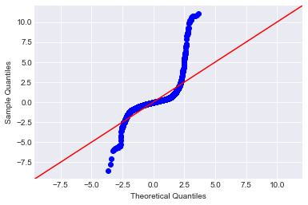
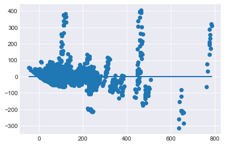
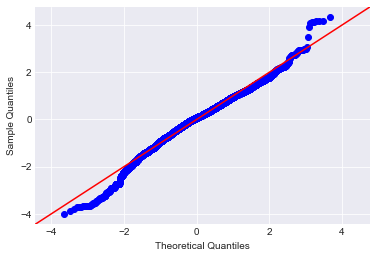
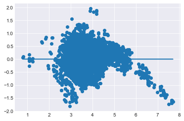
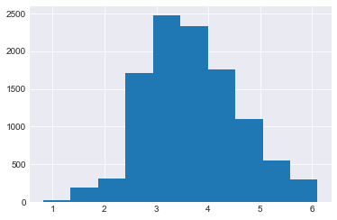
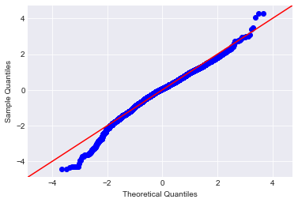
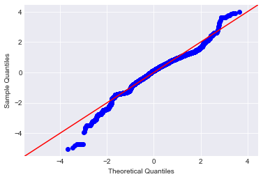
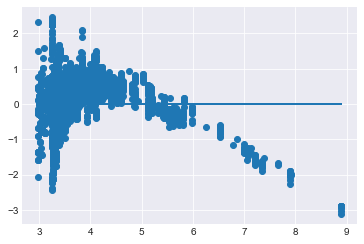

# Modeling Your Data - Lab

## Introduction 

In this lab you'll perform a full linear regression on the data. You'll implement the process demonstrated in the previous lesson, taking a stepwise approach to analyze and improve the model along the way.

## Objectives
You will be able to:

* Remove predictors with p-values too high and refit the model
* Examine and interpret the model results
* Split data into training and testing sets
* Fit a regression model to the data set using statsmodel library


## Build an Initial Regression Model

To start, perform a train-test split and create an initial regression model to model the `list_price` using all of your available features.

> **Note:** In order to write the model you'll have to do some tedious manipulation of your column names. Statsmodels will not allow you to have spaces, apostrophe or arithmetic symbols (+) in your column names. Preview them and refine them as you go.  
**If you receive an error such as "PatsyError: error tokenizing input (maybe an unclosed string?)" then you need to further preprocess your column names.**


```python
#Your code here
```


```python
# __SOLUTION__ 
import pandas as pd
import matplotlib.pyplot as plt
import numpy as np
import seaborn as sns
sns.set_style('darkgrid')

from statsmodels.formula.api import ols
from statsmodels.stats.outliers_influence import variance_inflation_factor
import statsmodels.api as sm
import scipy.stats as stats
from sklearn.model_selection import train_test_split
```

## Remove the Uninfluential Features

Based on the initial model, remove those features which do not appear to be statistically relevant and rerun the model.


```python
# __SOLUTION__ 
df = pd.read_csv('Lego_dataset_cleaned.csv')
df.head()
```


<div>
<style scoped>
    .dataframe tbody tr th:only-of-type {
        vertical-align: middle;
    }

    .dataframe tbody tr th {
        vertical-align: top;
    }

    .dataframe thead th {
        text-align: right;
    }
</style>
<table border="1" class="dataframe">
  <thead>
    <tr style="text-align: right;">
      <th></th>
      <th>piece_count</th>
      <th>list_price</th>
      <th>num_reviews</th>
      <th>play_star_rating</th>
      <th>star_rating</th>
      <th>val_star_rating</th>
      <th>ages_10+</th>
      <th>ages_10-14</th>
      <th>ages_10-16</th>
      <th>ages_10-21</th>
      <th>...</th>
      <th>country_NZ</th>
      <th>country_PL</th>
      <th>country_PT</th>
      <th>country_US</th>
      <th>review_difficulty_Average</th>
      <th>review_difficulty_Challenging</th>
      <th>review_difficulty_Easy</th>
      <th>review_difficulty_Very Challenging</th>
      <th>review_difficulty_Very Easy</th>
      <th>review_difficulty_unknown</th>
    </tr>
  </thead>
  <tbody>
    <tr>
      <th>0</th>
      <td>-0.273020</td>
      <td>29.99</td>
      <td>-0.398512</td>
      <td>-0.655279</td>
      <td>-0.045687</td>
      <td>-0.365010</td>
      <td>0</td>
      <td>0</td>
      <td>0</td>
      <td>0</td>
      <td>...</td>
      <td>0</td>
      <td>0</td>
      <td>0</td>
      <td>1</td>
      <td>1</td>
      <td>0</td>
      <td>0</td>
      <td>0</td>
      <td>0</td>
      <td>0</td>
    </tr>
    <tr>
      <th>1</th>
      <td>-0.404154</td>
      <td>19.99</td>
      <td>-0.398512</td>
      <td>-0.655279</td>
      <td>0.990651</td>
      <td>-0.365010</td>
      <td>0</td>
      <td>0</td>
      <td>0</td>
      <td>0</td>
      <td>...</td>
      <td>0</td>
      <td>0</td>
      <td>0</td>
      <td>1</td>
      <td>0</td>
      <td>0</td>
      <td>1</td>
      <td>0</td>
      <td>0</td>
      <td>0</td>
    </tr>
    <tr>
      <th>2</th>
      <td>-0.517242</td>
      <td>12.99</td>
      <td>-0.147162</td>
      <td>-0.132473</td>
      <td>-0.460222</td>
      <td>-0.204063</td>
      <td>0</td>
      <td>0</td>
      <td>0</td>
      <td>0</td>
      <td>...</td>
      <td>0</td>
      <td>0</td>
      <td>0</td>
      <td>1</td>
      <td>0</td>
      <td>0</td>
      <td>1</td>
      <td>0</td>
      <td>0</td>
      <td>0</td>
    </tr>
    <tr>
      <th>3</th>
      <td>0.635296</td>
      <td>99.99</td>
      <td>0.187972</td>
      <td>-1.352353</td>
      <td>0.161581</td>
      <td>0.117830</td>
      <td>0</td>
      <td>0</td>
      <td>0</td>
      <td>0</td>
      <td>...</td>
      <td>0</td>
      <td>0</td>
      <td>0</td>
      <td>1</td>
      <td>1</td>
      <td>0</td>
      <td>0</td>
      <td>0</td>
      <td>0</td>
      <td>0</td>
    </tr>
    <tr>
      <th>4</th>
      <td>0.288812</td>
      <td>79.99</td>
      <td>-0.063378</td>
      <td>-2.049427</td>
      <td>0.161581</td>
      <td>-0.204063</td>
      <td>0</td>
      <td>0</td>
      <td>0</td>
      <td>0</td>
      <td>...</td>
      <td>0</td>
      <td>0</td>
      <td>0</td>
      <td>1</td>
      <td>0</td>
      <td>1</td>
      <td>0</td>
      <td>0</td>
      <td>0</td>
      <td>0</td>
    </tr>
  </tbody>
</table>
<p>5 rows × 103 columns</p>
</div>


```python
#Your code here
```


```python
# __SOLUTION__ 
subs = [(' ', '_'),('.',''),("'",""),('™', ''), ('®',''),
        ('+','plus'), ('½','half'), ('-','_')
       ]
def col_formatting(col):
    for old, new in subs:
        col = col.replace(old,new)
    return col
```

> **Comment:** You should see that the model performance is identical. Additionally, observe that there are further features which have been identified as unimpactful. Continue to refine the model accordingly.


```python
# __SOLUTION__ 
df.columns = [col_formatting(col) for col in df.columns]
```


```python
#Your code here
```


```python
# __SOLUTION__ 
list(df.columns)
```


    ['piece_count',
     'list_price',
     'num_reviews',
     'play_star_rating',
     'star_rating',
     'val_star_rating',
     'ages_10plus',
     'ages_10_14',
     'ages_10_16',
     'ages_10_21',
     'ages_11_16',
     'ages_12plus',
     'ages_12_16',
     'ages_14plus',
     'ages_16plus',
     'ages_1half_3',
     'ages_1half_5',
     'ages_2_5',
     'ages_4plus',
     'ages_4_7',
     'ages_4_99',
     'ages_5plus',
     'ages_5_12',
     'ages_5_8',
     'ages_6plus',
     'ages_6_12',
     'ages_6_14',
     'ages_7plus',
     'ages_7_12',
     'ages_7_14',
     'ages_8plus',
     'ages_8_12',
     'ages_8_14',
     'ages_9plus',
     'ages_9_12',
     'ages_9_14',
     'ages_9_16',
     'theme_name_Angry_Birds',
     'theme_name_Architecture',
     'theme_name_BOOST',
     'theme_name_Blues_Helicopter_Pursuit',
     'theme_name_BrickHeadz',
     'theme_name_Carnotaurus_Gyrosphere_Escape',
     'theme_name_City',
     'theme_name_Classic',
     'theme_name_Creator_3_in_1',
     'theme_name_Creator_Expert',
     'theme_name_DC_Comics_Super_Heroes',
     'theme_name_DC_Super_Hero_Girls',
     'theme_name_DIMENSIONS',
     'theme_name_DUPLO',
     'theme_name_Dilophosaurus_Outpost_Attack',
     'theme_name_Disney',
     'theme_name_Elves',
     'theme_name_Friends',
     'theme_name_Ghostbusters',
     'theme_name_Ideas',
     'theme_name_Indoraptor_Rampage_at_Lockwood_Estate',
     'theme_name_Juniors',
     'theme_name_Jurassic_Park_Velociraptor_Chase',
     'theme_name_MINDSTORMS',
     'theme_name_Marvel_Super_Heroes',
     'theme_name_Minecraft',
     'theme_name_Minifigures',
     'theme_name_NEXO_KNIGHTS',
     'theme_name_NINJAGO',
     'theme_name_Power_Functions',
     'theme_name_Pteranodon_Chase',
     'theme_name_SERIOUS_PLAY',
     'theme_name_Speed_Champions',
     'theme_name_Star_Wars',
     'theme_name_Stygimoloch_Breakout',
     'theme_name_T_rex_Transport',
     'theme_name_THE_LEGO_BATMAN_MOVIE',
     'theme_name_THE_LEGO_NINJAGO_MOVIE',
     'theme_name_Technic',
     'country_AT',
     'country_AU',
     'country_BE',
     'country_CA',
     'country_CH',
     'country_CZ',
     'country_DE',
     'country_DN',
     'country_ES',
     'country_FI',
     'country_FR',
     'country_GB',
     'country_IE',
     'country_IT',
     'country_LU',
     'country_NL',
     'country_NO',
     'country_NZ',
     'country_PL',
     'country_PT',
     'country_US',
     'review_difficulty_Average',
     'review_difficulty_Challenging',
     'review_difficulty_Easy',
     'review_difficulty_Very_Challenging',
     'review_difficulty_Very_Easy',
     'review_difficulty_unknown']


## Investigate Multicollinearity

There are still a lot of features in the current model! Chances are there are some strong multicollinearity issues. Begin to investigate the extend of this problem.


```python
# __SOLUTION__ 
df.info()
```

    <class 'pandas.core.frame.DataFrame'>
    RangeIndex: 10870 entries, 0 to 10869
    Columns: 103 entries, piece_count to review_difficulty_unknown
    dtypes: float64(6), int64(97)
    memory usage: 8.5 MB


```python
#Your code here
```


```python
# __SOLUTION__ 
#Defining the problem
outcome = 'list_price'
x_cols = list(df.columns)
x_cols.remove(outcome)
```

## Perform Another Round of Feature Selection

Once again, subset your features based on your findings above. Then rerun the model once again.


```python
# __SOLUTION__ 
train, test = train_test_split(df)
```


```python
#Your code here
```


```python
# __SOLUTION__ 
print(len(train), len(test))
train.head()
```

    8152 2718


<div>
<style scoped>
    .dataframe tbody tr th:only-of-type {
        vertical-align: middle;
    }

    .dataframe tbody tr th {
        vertical-align: top;
    }

    .dataframe thead th {
        text-align: right;
    }
</style>
<table border="1" class="dataframe">
  <thead>
    <tr style="text-align: right;">
      <th></th>
      <th>piece_count</th>
      <th>list_price</th>
      <th>num_reviews</th>
      <th>play_star_rating</th>
      <th>star_rating</th>
      <th>val_star_rating</th>
      <th>ages_10plus</th>
      <th>ages_10_14</th>
      <th>ages_10_16</th>
      <th>ages_10_21</th>
      <th>...</th>
      <th>country_NZ</th>
      <th>country_PL</th>
      <th>country_PT</th>
      <th>country_US</th>
      <th>review_difficulty_Average</th>
      <th>review_difficulty_Challenging</th>
      <th>review_difficulty_Easy</th>
      <th>review_difficulty_Very_Challenging</th>
      <th>review_difficulty_Very_Easy</th>
      <th>review_difficulty_unknown</th>
    </tr>
  </thead>
  <tbody>
    <tr>
      <th>6585</th>
      <td>-0.552131</td>
      <td>20.9860</td>
      <td>-0.230945</td>
      <td>-1.352353</td>
      <td>-1.082024</td>
      <td>-1.169744</td>
      <td>0</td>
      <td>0</td>
      <td>0</td>
      <td>0</td>
      <td>...</td>
      <td>0</td>
      <td>0</td>
      <td>0</td>
      <td>0</td>
      <td>0</td>
      <td>0</td>
      <td>1</td>
      <td>0</td>
      <td>0</td>
      <td>0</td>
    </tr>
    <tr>
      <th>345</th>
      <td>-0.161134</td>
      <td>39.9900</td>
      <td>-0.286801</td>
      <td>0.216064</td>
      <td>0.161581</td>
      <td>0.117830</td>
      <td>0</td>
      <td>0</td>
      <td>0</td>
      <td>0</td>
      <td>...</td>
      <td>0</td>
      <td>0</td>
      <td>0</td>
      <td>1</td>
      <td>0</td>
      <td>0</td>
      <td>0</td>
      <td>0</td>
      <td>0</td>
      <td>1</td>
    </tr>
    <tr>
      <th>9150</th>
      <td>0.745978</td>
      <td>121.9878</td>
      <td>0.020405</td>
      <td>0.738870</td>
      <td>0.576116</td>
      <td>0.439724</td>
      <td>0</td>
      <td>0</td>
      <td>0</td>
      <td>0</td>
      <td>...</td>
      <td>0</td>
      <td>0</td>
      <td>0</td>
      <td>0</td>
      <td>1</td>
      <td>0</td>
      <td>0</td>
      <td>0</td>
      <td>0</td>
      <td>0</td>
    </tr>
    <tr>
      <th>10814</th>
      <td>-0.504008</td>
      <td>32.9278</td>
      <td>-0.370585</td>
      <td>0.564601</td>
      <td>0.368848</td>
      <td>0.761617</td>
      <td>0</td>
      <td>0</td>
      <td>0</td>
      <td>0</td>
      <td>...</td>
      <td>0</td>
      <td>0</td>
      <td>1</td>
      <td>0</td>
      <td>0</td>
      <td>0</td>
      <td>1</td>
      <td>0</td>
      <td>0</td>
      <td>0</td>
    </tr>
    <tr>
      <th>3754</th>
      <td>-0.457089</td>
      <td>19.1520</td>
      <td>-0.091306</td>
      <td>-0.306741</td>
      <td>0.576116</td>
      <td>0.922564</td>
      <td>0</td>
      <td>0</td>
      <td>0</td>
      <td>0</td>
      <td>...</td>
      <td>0</td>
      <td>0</td>
      <td>0</td>
      <td>0</td>
      <td>0</td>
      <td>0</td>
      <td>1</td>
      <td>0</td>
      <td>0</td>
      <td>0</td>
    </tr>
  </tbody>
</table>
<p>5 rows × 103 columns</p>
</div>


## Check the Normality Assumption

Check whether the normality assumption holds for your model.


```python
# __SOLUTION__ 
test.head()
```


<div>
<style scoped>
    .dataframe tbody tr th:only-of-type {
        vertical-align: middle;
    }

    .dataframe tbody tr th {
        vertical-align: top;
    }

    .dataframe thead th {
        text-align: right;
    }
</style>
<table border="1" class="dataframe">
  <thead>
    <tr style="text-align: right;">
      <th></th>
      <th>piece_count</th>
      <th>list_price</th>
      <th>num_reviews</th>
      <th>play_star_rating</th>
      <th>star_rating</th>
      <th>val_star_rating</th>
      <th>ages_10plus</th>
      <th>ages_10_14</th>
      <th>ages_10_16</th>
      <th>ages_10_21</th>
      <th>...</th>
      <th>country_NZ</th>
      <th>country_PL</th>
      <th>country_PT</th>
      <th>country_US</th>
      <th>review_difficulty_Average</th>
      <th>review_difficulty_Challenging</th>
      <th>review_difficulty_Easy</th>
      <th>review_difficulty_Very_Challenging</th>
      <th>review_difficulty_Very_Easy</th>
      <th>review_difficulty_unknown</th>
    </tr>
  </thead>
  <tbody>
    <tr>
      <th>9895</th>
      <td>-0.443855</td>
      <td>24.8429</td>
      <td>-0.426440</td>
      <td>1.087407</td>
      <td>0.990651</td>
      <td>1.244458</td>
      <td>0</td>
      <td>0</td>
      <td>0</td>
      <td>0</td>
      <td>...</td>
      <td>1</td>
      <td>0</td>
      <td>0</td>
      <td>0</td>
      <td>0</td>
      <td>0</td>
      <td>0</td>
      <td>0</td>
      <td>0</td>
      <td>1</td>
    </tr>
    <tr>
      <th>1266</th>
      <td>0.456039</td>
      <td>109.7878</td>
      <td>-0.426440</td>
      <td>1.087407</td>
      <td>0.990651</td>
      <td>1.244458</td>
      <td>0</td>
      <td>0</td>
      <td>0</td>
      <td>0</td>
      <td>...</td>
      <td>0</td>
      <td>0</td>
      <td>0</td>
      <td>0</td>
      <td>0</td>
      <td>0</td>
      <td>0</td>
      <td>0</td>
      <td>0</td>
      <td>1</td>
    </tr>
    <tr>
      <th>7958</th>
      <td>0.462054</td>
      <td>219.5878</td>
      <td>0.523106</td>
      <td>0.564601</td>
      <td>-0.252954</td>
      <td>-0.686904</td>
      <td>0</td>
      <td>0</td>
      <td>0</td>
      <td>0</td>
      <td>...</td>
      <td>0</td>
      <td>0</td>
      <td>0</td>
      <td>0</td>
      <td>1</td>
      <td>0</td>
      <td>0</td>
      <td>0</td>
      <td>0</td>
      <td>0</td>
    </tr>
    <tr>
      <th>8829</th>
      <td>-0.153916</td>
      <td>77.8700</td>
      <td>-0.063378</td>
      <td>-0.655279</td>
      <td>-2.118362</td>
      <td>-1.491638</td>
      <td>0</td>
      <td>0</td>
      <td>0</td>
      <td>0</td>
      <td>...</td>
      <td>0</td>
      <td>0</td>
      <td>0</td>
      <td>0</td>
      <td>0</td>
      <td>0</td>
      <td>1</td>
      <td>0</td>
      <td>0</td>
      <td>0</td>
    </tr>
    <tr>
      <th>9139</th>
      <td>-0.599051</td>
      <td>6.0878</td>
      <td>-0.286801</td>
      <td>0.216064</td>
      <td>0.161581</td>
      <td>0.117830</td>
      <td>0</td>
      <td>0</td>
      <td>0</td>
      <td>0</td>
      <td>...</td>
      <td>0</td>
      <td>0</td>
      <td>0</td>
      <td>0</td>
      <td>0</td>
      <td>0</td>
      <td>0</td>
      <td>0</td>
      <td>0</td>
      <td>1</td>
    </tr>
  </tbody>
</table>
<p>5 rows × 103 columns</p>
</div>


```python
# Your code here
```


```python
# __SOLUTION__ 
#Fitting the actual model
predictors = '+'.join(x_cols)
formula = outcome + "~" + predictors
model = ols(formula=formula, data=train).fit()
model.summary()
```


<table class="simpletable">
<caption>OLS Regression Results</caption>
<tr>
  <th>Dep. Variable:</th>       <td>list_price</td>    <th>  R-squared:         </th> <td>   0.862</td> 
</tr>
<tr>
  <th>Model:</th>                   <td>OLS</td>       <th>  Adj. R-squared:    </th> <td>   0.861</td> 
</tr>
<tr>
  <th>Method:</th>             <td>Least Squares</td>  <th>  F-statistic:       </th> <td>   536.2</td> 
</tr>
<tr>
  <th>Date:</th>             <td>Fri, 05 Apr 2019</td> <th>  Prob (F-statistic):</th>  <td>  0.00</td>  
</tr>
<tr>
  <th>Time:</th>                 <td>14:51:03</td>     <th>  Log-Likelihood:    </th> <td> -40476.</td> 
</tr>
<tr>
  <th>No. Observations:</th>      <td>  8152</td>      <th>  AIC:               </th> <td>8.114e+04</td>
</tr>
<tr>
  <th>Df Residuals:</th>          <td>  8057</td>      <th>  BIC:               </th> <td>8.181e+04</td>
</tr>
<tr>
  <th>Df Model:</th>              <td>    94</td>      <th>                     </th>     <td> </td>    
</tr>
<tr>
  <th>Covariance Type:</th>      <td>nonrobust</td>    <th>                     </th>     <td> </td>    
</tr>
</table>
<table class="simpletable">
<tr>
                          <td></td>                            <th>coef</th>     <th>std err</th>      <th>t</th>      <th>P>|t|</th>  <th>[0.025</th>    <th>0.975]</th>  
</tr>
<tr>
  <th>Intercept</th>                                        <td>   63.9404</td> <td>    1.780</td> <td>   35.930</td> <td> 0.000</td> <td>   60.452</td> <td>   67.429</td>
</tr>
<tr>
  <th>piece_count</th>                                      <td>   75.0125</td> <td>    0.871</td> <td>   86.083</td> <td> 0.000</td> <td>   73.304</td> <td>   76.721</td>
</tr>
<tr>
  <th>num_reviews</th>                                      <td>    6.9406</td> <td>    0.667</td> <td>   10.412</td> <td> 0.000</td> <td>    5.634</td> <td>    8.247</td>
</tr>
<tr>
  <th>play_star_rating</th>                                 <td>    5.3330</td> <td>    0.621</td> <td>    8.594</td> <td> 0.000</td> <td>    4.117</td> <td>    6.549</td>
</tr>
<tr>
  <th>star_rating</th>                                      <td>   -1.2523</td> <td>    0.710</td> <td>   -1.763</td> <td> 0.078</td> <td>   -2.645</td> <td>    0.140</td>
</tr>
<tr>
  <th>val_star_rating</th>                                  <td>   -8.4724</td> <td>    0.634</td> <td>  -13.363</td> <td> 0.000</td> <td>   -9.715</td> <td>   -7.230</td>
</tr>
<tr>
  <th>ages_10plus</th>                                      <td>  130.0074</td> <td>    6.524</td> <td>   19.926</td> <td> 0.000</td> <td>  117.218</td> <td>  142.797</td>
</tr>
<tr>
  <th>ages_10_14</th>                                       <td>  -22.5837</td> <td>    8.849</td> <td>   -2.552</td> <td> 0.011</td> <td>  -39.930</td> <td>   -5.237</td>
</tr>
<tr>
  <th>ages_10_16</th>                                       <td>  -11.2440</td> <td>    3.980</td> <td>   -2.825</td> <td> 0.005</td> <td>  -19.046</td> <td>   -3.442</td>
</tr>
<tr>
  <th>ages_10_21</th>                                       <td>   49.7139</td> <td>    7.316</td> <td>    6.795</td> <td> 0.000</td> <td>   35.373</td> <td>   64.055</td>
</tr>
<tr>
  <th>ages_11_16</th>                                       <td>  -16.7636</td> <td>    5.637</td> <td>   -2.974</td> <td> 0.003</td> <td>  -27.813</td> <td>   -5.714</td>
</tr>
<tr>
  <th>ages_12plus</th>                                      <td>   69.2748</td> <td>    5.455</td> <td>   12.698</td> <td> 0.000</td> <td>   58.581</td> <td>   79.969</td>
</tr>
<tr>
  <th>ages_12_16</th>                                       <td>  -57.2636</td> <td>    7.053</td> <td>   -8.119</td> <td> 0.000</td> <td>  -71.089</td> <td>  -43.438</td>
</tr>
<tr>
  <th>ages_14plus</th>                                      <td>   20.8114</td> <td>    4.006</td> <td>    5.196</td> <td> 0.000</td> <td>   12.959</td> <td>   28.663</td>
</tr>
<tr>
  <th>ages_16plus</th>                                      <td>   29.9692</td> <td>    5.881</td> <td>    5.096</td> <td> 0.000</td> <td>   18.440</td> <td>   41.498</td>
</tr>
<tr>
  <th>ages_1half_3</th>                                     <td>   -8.6260</td> <td>    2.363</td> <td>   -3.650</td> <td> 0.000</td> <td>  -13.259</td> <td>   -3.993</td>
</tr>
<tr>
  <th>ages_1half_5</th>                                     <td>   -4.6903</td> <td>    3.013</td> <td>   -1.557</td> <td> 0.120</td> <td>  -10.597</td> <td>    1.216</td>
</tr>
<tr>
  <th>ages_2_5</th>                                         <td>   15.3584</td> <td>    1.674</td> <td>    9.173</td> <td> 0.000</td> <td>   12.076</td> <td>   18.641</td>
</tr>
<tr>
  <th>ages_4plus</th>                                       <td>  -20.7126</td> <td>    6.261</td> <td>   -3.308</td> <td> 0.001</td> <td>  -32.986</td> <td>   -8.439</td>
</tr>
<tr>
  <th>ages_4_7</th>                                         <td>   -6.0439</td> <td>    3.400</td> <td>   -1.777</td> <td> 0.076</td> <td>  -12.709</td> <td>    0.622</td>
</tr>
<tr>
  <th>ages_4_99</th>                                        <td>   -1.6339</td> <td>    3.566</td> <td>   -0.458</td> <td> 0.647</td> <td>   -8.625</td> <td>    5.357</td>
</tr>
<tr>
  <th>ages_5plus</th>                                       <td>   -9.0683</td> <td>    3.154</td> <td>   -2.875</td> <td> 0.004</td> <td>  -15.251</td> <td>   -2.886</td>
</tr>
<tr>
  <th>ages_5_12</th>                                        <td>  -35.4169</td> <td>    3.049</td> <td>  -11.617</td> <td> 0.000</td> <td>  -41.393</td> <td>  -29.441</td>
</tr>
<tr>
  <th>ages_5_8</th>                                         <td>    6.6516</td> <td>    6.155</td> <td>    1.081</td> <td> 0.280</td> <td>   -5.413</td> <td>   18.716</td>
</tr>
<tr>
  <th>ages_6plus</th>                                       <td>  -26.1449</td> <td>    5.796</td> <td>   -4.511</td> <td> 0.000</td> <td>  -37.506</td> <td>  -14.784</td>
</tr>
<tr>
  <th>ages_6_12</th>                                        <td>  -22.1809</td> <td>    2.371</td> <td>   -9.356</td> <td> 0.000</td> <td>  -26.828</td> <td>  -17.534</td>
</tr>
<tr>
  <th>ages_6_14</th>                                        <td>   -8.2541</td> <td>    3.863</td> <td>   -2.137</td> <td> 0.033</td> <td>  -15.826</td> <td>   -0.682</td>
</tr>
<tr>
  <th>ages_7plus</th>                                       <td>   -9.7588</td> <td>   23.971</td> <td>   -0.407</td> <td> 0.684</td> <td>  -56.747</td> <td>   37.230</td>
</tr>
<tr>
  <th>ages_7_12</th>                                        <td>  -20.3704</td> <td>    2.720</td> <td>   -7.489</td> <td> 0.000</td> <td>  -25.703</td> <td>  -15.038</td>
</tr>
<tr>
  <th>ages_7_14</th>                                        <td>  -17.7447</td> <td>    2.340</td> <td>   -7.582</td> <td> 0.000</td> <td>  -22.333</td> <td>  -13.157</td>
</tr>
<tr>
  <th>ages_8plus</th>                                       <td>   10.1724</td> <td>    4.718</td> <td>    2.156</td> <td> 0.031</td> <td>    0.925</td> <td>   19.420</td>
</tr>
<tr>
  <th>ages_8_12</th>                                        <td>  -19.0387</td> <td>    3.184</td> <td>   -5.980</td> <td> 0.000</td> <td>  -25.279</td> <td>  -12.798</td>
</tr>
<tr>
  <th>ages_8_14</th>                                        <td>  -15.9950</td> <td>    2.242</td> <td>   -7.134</td> <td> 0.000</td> <td>  -20.390</td> <td>  -11.600</td>
</tr>
<tr>
  <th>ages_9plus</th>                                       <td>  108.7044</td> <td>   10.223</td> <td>   10.633</td> <td> 0.000</td> <td>   88.664</td> <td>  128.745</td>
</tr>
<tr>
  <th>ages_9_12</th>                                        <td>  -27.1979</td> <td>    6.304</td> <td>   -4.314</td> <td> 0.000</td> <td>  -39.555</td> <td>  -14.840</td>
</tr>
<tr>
  <th>ages_9_14</th>                                        <td>  -10.2560</td> <td>    2.650</td> <td>   -3.870</td> <td> 0.000</td> <td>  -15.451</td> <td>   -5.061</td>
</tr>
<tr>
  <th>ages_9_16</th>                                        <td>   -5.7348</td> <td>    5.364</td> <td>   -1.069</td> <td> 0.285</td> <td>  -16.250</td> <td>    4.781</td>
</tr>
<tr>
  <th>theme_name_Angry_Birds</th>                           <td>   10.2136</td> <td>   17.118</td> <td>    0.597</td> <td> 0.551</td> <td>  -23.343</td> <td>   43.770</td>
</tr>
<tr>
  <th>theme_name_Architecture</th>                          <td>  -86.9410</td> <td>    6.295</td> <td>  -13.812</td> <td> 0.000</td> <td>  -99.280</td> <td>  -74.602</td>
</tr>
<tr>
  <th>theme_name_BOOST</th>                                 <td>   84.7499</td> <td>    9.194</td> <td>    9.218</td> <td> 0.000</td> <td>   66.728</td> <td>  102.772</td>
</tr>
<tr>
  <th>theme_name_Blues_Helicopter_Pursuit</th>              <td>   24.3781</td> <td>    8.364</td> <td>    2.915</td> <td> 0.004</td> <td>    7.983</td> <td>   40.774</td>
</tr>
<tr>
  <th>theme_name_BrickHeadz</th>                            <td> -140.3681</td> <td>    7.046</td> <td>  -19.921</td> <td> 0.000</td> <td> -154.181</td> <td> -126.556</td>
</tr>
<tr>
  <th>theme_name_Carnotaurus_Gyrosphere_Escape</th>         <td>   48.5354</td> <td>    9.418</td> <td>    5.154</td> <td> 0.000</td> <td>   30.074</td> <td>   66.997</td>
</tr>
<tr>
  <th>theme_name_City</th>                                  <td>   23.2929</td> <td>    2.418</td> <td>    9.633</td> <td> 0.000</td> <td>   18.553</td> <td>   28.033</td>
</tr>
<tr>
  <th>theme_name_Classic</th>                               <td>  -22.3465</td> <td>    3.292</td> <td>   -6.788</td> <td> 0.000</td> <td>  -28.800</td> <td>  -15.893</td>
</tr>
<tr>
  <th>theme_name_Creator_3_in_1</th>                        <td>    0.0832</td> <td>    2.630</td> <td>    0.032</td> <td> 0.975</td> <td>   -5.072</td> <td>    5.238</td>
</tr>
<tr>
  <th>theme_name_Creator_Expert</th>                        <td> -119.0240</td> <td>    4.656</td> <td>  -25.564</td> <td> 0.000</td> <td> -128.151</td> <td> -109.897</td>
</tr>
<tr>
  <th>theme_name_DC_Comics_Super_Heroes</th>                <td>   10.8317</td> <td>    3.583</td> <td>    3.023</td> <td> 0.003</td> <td>    3.808</td> <td>   17.855</td>
</tr>
<tr>
  <th>theme_name_DC_Super_Hero_Girls</th>                   <td>   10.4603</td> <td>    9.367</td> <td>    1.117</td> <td> 0.264</td> <td>   -7.902</td> <td>   28.822</td>
</tr>
<tr>
  <th>theme_name_DIMENSIONS</th>                            <td>   15.2782</td> <td>    3.275</td> <td>    4.665</td> <td> 0.000</td> <td>    8.859</td> <td>   21.698</td>
</tr>
<tr>
  <th>theme_name_DUPLO</th>                                 <td>    2.0421</td> <td>    1.803</td> <td>    1.132</td> <td> 0.258</td> <td>   -1.493</td> <td>    5.577</td>
</tr>
<tr>
  <th>theme_name_Dilophosaurus_Outpost_Attack</th>          <td>   31.3004</td> <td>    8.887</td> <td>    3.522</td> <td> 0.000</td> <td>   13.879</td> <td>   48.722</td>
</tr>
<tr>
  <th>theme_name_Disney</th>                                <td>   10.7717</td> <td>    2.858</td> <td>    3.768</td> <td> 0.000</td> <td>    5.168</td> <td>   16.375</td>
</tr>
<tr>
  <th>theme_name_Elves</th>                                 <td>   -0.3244</td> <td>    3.676</td> <td>   -0.088</td> <td> 0.930</td> <td>   -7.531</td> <td>    6.882</td>
</tr>
<tr>
  <th>theme_name_Friends</th>                               <td>    2.8726</td> <td>    2.334</td> <td>    1.231</td> <td> 0.218</td> <td>   -1.703</td> <td>    7.448</td>
</tr>
<tr>
  <th>theme_name_Ghostbusters</th>                          <td>  -55.6804</td> <td>    8.956</td> <td>   -6.217</td> <td> 0.000</td> <td>  -73.237</td> <td>  -38.124</td>
</tr>
<tr>
  <th>theme_name_Ideas</th>                                 <td> -131.8233</td> <td>    5.916</td> <td>  -22.283</td> <td> 0.000</td> <td> -143.420</td> <td> -120.227</td>
</tr>
<tr>
  <th>theme_name_Indoraptor_Rampage_at_Lockwood_Estate</th> <td>   65.1492</td> <td>    9.331</td> <td>    6.982</td> <td> 0.000</td> <td>   46.859</td> <td>   83.439</td>
</tr>
<tr>
  <th>theme_name_Juniors</th>                               <td>    0.6077</td> <td>    3.215</td> <td>    0.189</td> <td> 0.850</td> <td>   -5.694</td> <td>    6.909</td>
</tr>
<tr>
  <th>theme_name_Jurassic_Park_Velociraptor_Chase</th>      <td>   15.6882</td> <td>    9.015</td> <td>    1.740</td> <td> 0.082</td> <td>   -1.983</td> <td>   33.360</td>
</tr>
<tr>
  <th>theme_name_MINDSTORMS</th>                            <td>   -8.2970</td> <td>    6.878</td> <td>   -1.206</td> <td> 0.228</td> <td>  -21.780</td> <td>    5.186</td>
</tr>
<tr>
  <th>theme_name_Marvel_Super_Heroes</th>                   <td>   10.7035</td> <td>    2.449</td> <td>    4.370</td> <td> 0.000</td> <td>    5.903</td> <td>   15.504</td>
</tr>
<tr>
  <th>theme_name_Minecraft</th>                             <td>  -15.8316</td> <td>    4.266</td> <td>   -3.711</td> <td> 0.000</td> <td>  -24.194</td> <td>   -7.469</td>
</tr>
<tr>
  <th>theme_name_Minifigures</th>                           <td>   -9.0683</td> <td>    3.154</td> <td>   -2.875</td> <td> 0.004</td> <td>  -15.251</td> <td>   -2.886</td>
</tr>
<tr>
  <th>theme_name_NEXO_KNIGHTS</th>                          <td>   -1.1050</td> <td>    3.307</td> <td>   -0.334</td> <td> 0.738</td> <td>   -7.588</td> <td>    5.378</td>
</tr>
<tr>
  <th>theme_name_NINJAGO</th>                               <td>   -8.0409</td> <td>    3.119</td> <td>   -2.578</td> <td> 0.010</td> <td>  -14.155</td> <td>   -1.927</td>
</tr>
<tr>
  <th>theme_name_Power_Functions</th>                       <td>   11.5651</td> <td>   10.135</td> <td>    1.141</td> <td> 0.254</td> <td>   -8.302</td> <td>   31.432</td>
</tr>
<tr>
  <th>theme_name_Pteranodon_Chase</th>                      <td>    1.9394</td> <td>    8.928</td> <td>    0.217</td> <td> 0.828</td> <td>  -15.562</td> <td>   19.441</td>
</tr>
<tr>
  <th>theme_name_SERIOUS_PLAY</th>                          <td>  213.4929</td> <td>    7.578</td> <td>   28.171</td> <td> 0.000</td> <td>  198.637</td> <td>  228.348</td>
</tr>
<tr>
  <th>theme_name_Speed_Champions</th>                       <td>    4.6666</td> <td>    3.117</td> <td>    1.497</td> <td> 0.134</td> <td>   -1.444</td> <td>   10.777</td>
</tr>
<tr>
  <th>theme_name_Star_Wars</th>                             <td>   16.6524</td> <td>    1.800</td> <td>    9.253</td> <td> 0.000</td> <td>   13.125</td> <td>   20.180</td>
</tr>
<tr>
  <th>theme_name_Stygimoloch_Breakout</th>                  <td>   19.8068</td> <td>    8.271</td> <td>    2.395</td> <td> 0.017</td> <td>    3.594</td> <td>   36.019</td>
</tr>
<tr>
  <th>theme_name_T_rex_Transport</th>                       <td>   33.5153</td> <td>    8.838</td> <td>    3.792</td> <td> 0.000</td> <td>   16.190</td> <td>   50.841</td>
</tr>
<tr>
  <th>theme_name_THE_LEGO_BATMAN_MOVIE</th>                 <td>    6.6914</td> <td>    2.595</td> <td>    2.578</td> <td> 0.010</td> <td>    1.604</td> <td>   11.779</td>
</tr>
<tr>
  <th>theme_name_THE_LEGO_NINJAGO_MOVIE</th>                <td>  -14.2593</td> <td>    2.676</td> <td>   -5.329</td> <td> 0.000</td> <td>  -19.505</td> <td>   -9.014</td>
</tr>
<tr>
  <th>theme_name_Technic</th>                               <td>    1.7616</td> <td>    2.835</td> <td>    0.621</td> <td> 0.534</td> <td>   -3.796</td> <td>    7.320</td>
</tr>
<tr>
  <th>country_AT</th>                                       <td>    1.4116</td> <td>    1.737</td> <td>    0.813</td> <td> 0.416</td> <td>   -1.993</td> <td>    4.816</td>
</tr>
<tr>
  <th>country_AU</th>                                       <td>   -0.3528</td> <td>    1.751</td> <td>   -0.201</td> <td> 0.840</td> <td>   -3.785</td> <td>    3.080</td>
</tr>
<tr>
  <th>country_BE</th>                                       <td>    4.8541</td> <td>    1.780</td> <td>    2.727</td> <td> 0.006</td> <td>    1.364</td> <td>    8.344</td>
</tr>
<tr>
  <th>country_CA</th>                                       <td>   -9.8730</td> <td>    1.472</td> <td>   -6.706</td> <td> 0.000</td> <td>  -12.759</td> <td>   -6.987</td>
</tr>
<tr>
  <th>country_CH</th>                                       <td>    1.8300</td> <td>    1.745</td> <td>    1.049</td> <td> 0.294</td> <td>   -1.590</td> <td>    5.250</td>
</tr>
<tr>
  <th>country_CZ</th>                                       <td>    9.3973</td> <td>    1.777</td> <td>    5.289</td> <td> 0.000</td> <td>    5.914</td> <td>   12.880</td>
</tr>
<tr>
  <th>country_DE</th>                                       <td>    3.3596</td> <td>    1.818</td> <td>    1.848</td> <td> 0.065</td> <td>   -0.204</td> <td>    6.923</td>
</tr>
<tr>
  <th>country_DN</th>                                       <td>   -8.9720</td> <td>    1.736</td> <td>   -5.169</td> <td> 0.000</td> <td>  -12.374</td> <td>   -5.570</td>
</tr>
<tr>
  <th>country_ES</th>                                       <td>    3.2699</td> <td>    1.769</td> <td>    1.849</td> <td> 0.065</td> <td>   -0.197</td> <td>    6.737</td>
</tr>
<tr>
  <th>country_FI</th>                                       <td>   13.0521</td> <td>    1.818</td> <td>    7.181</td> <td> 0.000</td> <td>    9.489</td> <td>   16.615</td>
</tr>
<tr>
  <th>country_FR</th>                                       <td>    4.1140</td> <td>    1.750</td> <td>    2.350</td> <td> 0.019</td> <td>    0.683</td> <td>    7.545</td>
</tr>
<tr>
  <th>country_GB</th>                                       <td>    1.1321</td> <td>    1.749</td> <td>    0.647</td> <td> 0.517</td> <td>   -2.296</td> <td>    4.560</td>
</tr>
<tr>
  <th>country_IE</th>                                       <td>    2.9670</td> <td>    1.798</td> <td>    1.650</td> <td> 0.099</td> <td>   -0.558</td> <td>    6.492</td>
</tr>
<tr>
  <th>country_IT</th>                                       <td>    2.5673</td> <td>    1.756</td> <td>    1.462</td> <td> 0.144</td> <td>   -0.874</td> <td>    6.009</td>
</tr>
<tr>
  <th>country_LU</th>                                       <td>    5.8689</td> <td>    1.790</td> <td>    3.278</td> <td> 0.001</td> <td>    2.360</td> <td>    9.378</td>
</tr>
<tr>
  <th>country_NL</th>                                       <td>    6.2881</td> <td>    1.737</td> <td>    3.619</td> <td> 0.000</td> <td>    2.882</td> <td>    9.694</td>
</tr>
<tr>
  <th>country_NO</th>                                       <td>   12.6064</td> <td>    1.810</td> <td>    6.965</td> <td> 0.000</td> <td>    9.059</td> <td>   16.154</td>
</tr>
<tr>
  <th>country_NZ</th>                                       <td>    5.1164</td> <td>    1.752</td> <td>    2.921</td> <td> 0.004</td> <td>    1.682</td> <td>    8.550</td>
</tr>
<tr>
  <th>country_PL</th>                                       <td>    6.8853</td> <td>    1.827</td> <td>    3.768</td> <td> 0.000</td> <td>    3.303</td> <td>   10.467</td>
</tr>
<tr>
  <th>country_PT</th>                                       <td>    4.9287</td> <td>    1.805</td> <td>    2.730</td> <td> 0.006</td> <td>    1.390</td> <td>    8.467</td>
</tr>
<tr>
  <th>country_US</th>                                       <td>   -6.5103</td> <td>    1.467</td> <td>   -4.437</td> <td> 0.000</td> <td>   -9.387</td> <td>   -3.634</td>
</tr>
<tr>
  <th>review_difficulty_Average</th>                        <td>   15.4619</td> <td>    1.720</td> <td>    8.988</td> <td> 0.000</td> <td>   12.090</td> <td>   18.834</td>
</tr>
<tr>
  <th>review_difficulty_Challenging</th>                    <td>   18.5479</td> <td>    2.155</td> <td>    8.607</td> <td> 0.000</td> <td>   14.324</td> <td>   22.772</td>
</tr>
<tr>
  <th>review_difficulty_Easy</th>                           <td>    2.4394</td> <td>    1.729</td> <td>    1.411</td> <td> 0.158</td> <td>   -0.950</td> <td>    5.829</td>
</tr>
<tr>
  <th>review_difficulty_Very_Challenging</th>               <td>   23.6374</td> <td>    8.675</td> <td>    2.725</td> <td> 0.006</td> <td>    6.633</td> <td>   40.642</td>
</tr>
<tr>
  <th>review_difficulty_Very_Easy</th>                      <td>    1.3201</td> <td>    2.084</td> <td>    0.634</td> <td> 0.526</td> <td>   -2.765</td> <td>    5.405</td>
</tr>
<tr>
  <th>review_difficulty_unknown</th>                        <td>    2.5338</td> <td>    1.885</td> <td>    1.344</td> <td> 0.179</td> <td>   -1.162</td> <td>    6.229</td>
</tr>
</table>
<table class="simpletable">
<tr>
  <th>Omnibus:</th>       <td>5300.297</td> <th>  Durbin-Watson:     </th>  <td>   2.053</td> 
</tr>
<tr>
  <th>Prob(Omnibus):</th>  <td> 0.000</td>  <th>  Jarque-Bera (JB):  </th> <td>482611.630</td>
</tr>
<tr>
  <th>Skew:</th>           <td> 2.294</td>  <th>  Prob(JB):          </th>  <td>    0.00</td> 
</tr>
<tr>
  <th>Kurtosis:</th>       <td>40.414</td>  <th>  Cond. No.          </th>  <td>1.51e+16</td> 
</tr>
</table><br/><br/>Warnings:<br/>[1] Standard Errors assume that the covariance matrix of the errors is correctly specified.<br/>[2] The smallest eigenvalue is 8.2e-29. This might indicate that there are<br/>strong multicollinearity problems or that the design matrix is singular.


## Check Homoscedasticity Assumption

Check whether the model's errors are indeed homoscedastic or if they violate this principle and display heteroscedasticity.


```python
#Your code here
```


```python
# __SOLUTION__ 
#Extract the p-value table from the summary and use it to subset our features
summary = model.summary()
p_table = summary.tables[1]
p_table = pd.DataFrame(p_table.data)
p_table.columns = p_table.iloc[0]
p_table = p_table.drop(0)
p_table = p_table.set_index(p_table.columns[0])
p_table['P>|t|'] = p_table['P>|t|'].astype(float)
x_cols = list(p_table[p_table['P>|t|']<0.05].index)
x_cols.remove('Intercept')
print(len(p_table), len(x_cols))
print(x_cols[:5])
p_table.head()
```

    103 70
    ['piece_count', 'num_reviews', 'play_star_rating', 'val_star_rating', 'ages_10plus']


<div>
<style scoped>
    .dataframe tbody tr th:only-of-type {
        vertical-align: middle;
    }

    .dataframe tbody tr th {
        vertical-align: top;
    }

    .dataframe thead th {
        text-align: right;
    }
</style>
<table border="1" class="dataframe">
  <thead>
    <tr style="text-align: right;">
      <th></th>
      <th>coef</th>
      <th>std err</th>
      <th>t</th>
      <th>P&gt;|t|</th>
      <th>[0.025</th>
      <th>0.975]</th>
    </tr>
    <tr>
      <th></th>
      <th></th>
      <th></th>
      <th></th>
      <th></th>
      <th></th>
      <th></th>
    </tr>
  </thead>
  <tbody>
    <tr>
      <th>Intercept</th>
      <td>63.9404</td>
      <td>1.780</td>
      <td>35.930</td>
      <td>0.000</td>
      <td>60.452</td>
      <td>67.429</td>
    </tr>
    <tr>
      <th>piece_count</th>
      <td>75.0125</td>
      <td>0.871</td>
      <td>86.083</td>
      <td>0.000</td>
      <td>73.304</td>
      <td>76.721</td>
    </tr>
    <tr>
      <th>num_reviews</th>
      <td>6.9406</td>
      <td>0.667</td>
      <td>10.412</td>
      <td>0.000</td>
      <td>5.634</td>
      <td>8.247</td>
    </tr>
    <tr>
      <th>play_star_rating</th>
      <td>5.3330</td>
      <td>0.621</td>
      <td>8.594</td>
      <td>0.000</td>
      <td>4.117</td>
      <td>6.549</td>
    </tr>
    <tr>
      <th>star_rating</th>
      <td>-1.2523</td>
      <td>0.710</td>
      <td>-1.763</td>
      <td>0.078</td>
      <td>-2.645</td>
      <td>0.140</td>
    </tr>
  </tbody>
</table>
</div>


> **Comment:** This displays a fairly pronounced 'funnel' shape: errors appear to increase as the list_price increases. This doesn't bode well for our model. Subsetting the data to remove outliers and confiding the model to this restricted domain may be necessary. A log transformation or something equivalent may also be appropriate.


```python
# __SOLUTION__ 
#Refit model with subset features
predictors = '+'.join(x_cols)
formula = outcome + "~" + predictors
model = ols(formula=formula, data=train).fit()
model.summary()
```


<table class="simpletable">
<caption>OLS Regression Results</caption>
<tr>
  <th>Dep. Variable:</th>       <td>list_price</td>    <th>  R-squared:         </th> <td>   0.862</td> 
</tr>
<tr>
  <th>Model:</th>                   <td>OLS</td>       <th>  Adj. R-squared:    </th> <td>   0.861</td> 
</tr>
<tr>
  <th>Method:</th>             <td>Least Squares</td>  <th>  F-statistic:       </th> <td>   730.7</td> 
</tr>
<tr>
  <th>Date:</th>             <td>Fri, 05 Apr 2019</td> <th>  Prob (F-statistic):</th>  <td>  0.00</td>  
</tr>
<tr>
  <th>Time:</th>                 <td>14:51:03</td>     <th>  Log-Likelihood:    </th> <td> -40486.</td> 
</tr>
<tr>
  <th>No. Observations:</th>      <td>  8152</td>      <th>  AIC:               </th> <td>8.111e+04</td>
</tr>
<tr>
  <th>Df Residuals:</th>          <td>  8082</td>      <th>  BIC:               </th> <td>8.160e+04</td>
</tr>
<tr>
  <th>Df Model:</th>              <td>    69</td>      <th>                     </th>     <td> </td>    
</tr>
<tr>
  <th>Covariance Type:</th>      <td>nonrobust</td>    <th>                     </th>     <td> </td>    
</tr>
</table>
<table class="simpletable">
<tr>
                          <td></td>                            <th>coef</th>     <th>std err</th>      <th>t</th>      <th>P>|t|</th>  <th>[0.025</th>    <th>0.975]</th>  
</tr>
<tr>
  <th>Intercept</th>                                        <td>   64.0350</td> <td>    1.589</td> <td>   40.295</td> <td> 0.000</td> <td>   60.920</td> <td>   67.150</td>
</tr>
<tr>
  <th>piece_count</th>                                      <td>   75.2010</td> <td>    0.853</td> <td>   88.196</td> <td> 0.000</td> <td>   73.530</td> <td>   76.872</td>
</tr>
<tr>
  <th>num_reviews</th>                                      <td>    6.9889</td> <td>    0.654</td> <td>   10.691</td> <td> 0.000</td> <td>    5.707</td> <td>    8.270</td>
</tr>
<tr>
  <th>play_star_rating</th>                                 <td>    4.8640</td> <td>    0.524</td> <td>    9.287</td> <td> 0.000</td> <td>    3.837</td> <td>    5.891</td>
</tr>
<tr>
  <th>val_star_rating</th>                                  <td>   -9.0442</td> <td>    0.494</td> <td>  -18.294</td> <td> 0.000</td> <td>  -10.013</td> <td>   -8.075</td>
</tr>
<tr>
  <th>ages_10plus</th>                                      <td>  128.1620</td> <td>    4.838</td> <td>   26.490</td> <td> 0.000</td> <td>  118.678</td> <td>  137.646</td>
</tr>
<tr>
  <th>ages_10_14</th>                                       <td>  -16.9282</td> <td>    9.228</td> <td>   -1.834</td> <td> 0.067</td> <td>  -35.018</td> <td>    1.161</td>
</tr>
<tr>
  <th>ages_10_16</th>                                       <td>   -5.8888</td> <td>    3.861</td> <td>   -1.525</td> <td> 0.127</td> <td>  -13.457</td> <td>    1.679</td>
</tr>
<tr>
  <th>ages_10_21</th>                                       <td>   45.5699</td> <td>    3.404</td> <td>   13.388</td> <td> 0.000</td> <td>   38.898</td> <td>   52.242</td>
</tr>
<tr>
  <th>ages_11_16</th>                                       <td>  -11.3873</td> <td>    5.479</td> <td>   -2.078</td> <td> 0.038</td> <td>  -22.128</td> <td>   -0.646</td>
</tr>
<tr>
  <th>ages_12plus</th>                                      <td>   71.5598</td> <td>    6.084</td> <td>   11.762</td> <td> 0.000</td> <td>   59.634</td> <td>   83.485</td>
</tr>
<tr>
  <th>ages_12_16</th>                                       <td>  -52.0889</td> <td>    7.429</td> <td>   -7.011</td> <td> 0.000</td> <td>  -66.652</td> <td>  -37.526</td>
</tr>
<tr>
  <th>ages_14plus</th>                                      <td>   25.1723</td> <td>    4.719</td> <td>    5.335</td> <td> 0.000</td> <td>   15.923</td> <td>   34.422</td>
</tr>
<tr>
  <th>ages_16plus</th>                                      <td>   33.3807</td> <td>    6.621</td> <td>    5.042</td> <td> 0.000</td> <td>   20.402</td> <td>   46.359</td>
</tr>
<tr>
  <th>ages_1half_3</th>                                     <td>   -1.8828</td> <td>    3.072</td> <td>   -0.613</td> <td> 0.540</td> <td>   -7.905</td> <td>    4.140</td>
</tr>
<tr>
  <th>ages_2_5</th>                                         <td>   21.5870</td> <td>    2.036</td> <td>   10.603</td> <td> 0.000</td> <td>   17.596</td> <td>   25.578</td>
</tr>
<tr>
  <th>ages_4plus</th>                                       <td>  -20.8686</td> <td>    9.541</td> <td>   -2.187</td> <td> 0.029</td> <td>  -39.572</td> <td>   -2.166</td>
</tr>
<tr>
  <th>ages_5plus</th>                                       <td>   -7.6223</td> <td>    3.122</td> <td>   -2.442</td> <td> 0.015</td> <td>  -13.741</td> <td>   -1.503</td>
</tr>
<tr>
  <th>ages_5_12</th>                                        <td>  -28.6875</td> <td>    2.715</td> <td>  -10.567</td> <td> 0.000</td> <td>  -34.009</td> <td>  -23.366</td>
</tr>
<tr>
  <th>ages_6plus</th>                                       <td>  -20.0211</td> <td>    5.767</td> <td>   -3.472</td> <td> 0.001</td> <td>  -31.326</td> <td>   -8.717</td>
</tr>
<tr>
  <th>ages_6_12</th>                                        <td>  -15.4608</td> <td>    1.962</td> <td>   -7.881</td> <td> 0.000</td> <td>  -19.306</td> <td>  -11.615</td>
</tr>
<tr>
  <th>ages_6_14</th>                                        <td>   -3.3046</td> <td>    3.985</td> <td>   -0.829</td> <td> 0.407</td> <td>  -11.115</td> <td>    4.506</td>
</tr>
<tr>
  <th>ages_7_12</th>                                        <td>  -14.5313</td> <td>    2.277</td> <td>   -6.381</td> <td> 0.000</td> <td>  -18.996</td> <td>  -10.067</td>
</tr>
<tr>
  <th>ages_7_14</th>                                        <td>  -11.2258</td> <td>    2.095</td> <td>   -5.359</td> <td> 0.000</td> <td>  -15.332</td> <td>   -7.119</td>
</tr>
<tr>
  <th>ages_8plus</th>                                       <td>   12.4026</td> <td>    4.670</td> <td>    2.656</td> <td> 0.008</td> <td>    3.249</td> <td>   21.557</td>
</tr>
<tr>
  <th>ages_8_12</th>                                        <td>  -14.0112</td> <td>    2.811</td> <td>   -4.984</td> <td> 0.000</td> <td>  -19.522</td> <td>   -8.500</td>
</tr>
<tr>
  <th>ages_8_14</th>                                        <td>  -10.3708</td> <td>    2.242</td> <td>   -4.626</td> <td> 0.000</td> <td>  -14.766</td> <td>   -5.976</td>
</tr>
<tr>
  <th>ages_9plus</th>                                       <td>  111.7078</td> <td>   10.457</td> <td>   10.682</td> <td> 0.000</td> <td>   91.209</td> <td>  132.207</td>
</tr>
<tr>
  <th>ages_9_12</th>                                        <td>  -23.1871</td> <td>    5.964</td> <td>   -3.888</td> <td> 0.000</td> <td>  -34.879</td> <td>  -11.496</td>
</tr>
<tr>
  <th>ages_9_14</th>                                        <td>   -5.1101</td> <td>    2.938</td> <td>   -1.739</td> <td> 0.082</td> <td>  -10.869</td> <td>    0.649</td>
</tr>
<tr>
  <th>theme_name_Architecture</th>                          <td>  -86.0254</td> <td>    6.344</td> <td>  -13.561</td> <td> 0.000</td> <td>  -98.460</td> <td>  -73.590</td>
</tr>
<tr>
  <th>theme_name_BOOST</th>                                 <td>   84.4045</td> <td>    9.302</td> <td>    9.074</td> <td> 0.000</td> <td>   66.171</td> <td>  102.639</td>
</tr>
<tr>
  <th>theme_name_Blues_Helicopter_Pursuit</th>              <td>   22.9457</td> <td>    8.419</td> <td>    2.725</td> <td> 0.006</td> <td>    6.441</td> <td>   39.450</td>
</tr>
<tr>
  <th>theme_name_BrickHeadz</th>                            <td> -135.3704</td> <td>    5.107</td> <td>  -26.507</td> <td> 0.000</td> <td> -145.381</td> <td> -125.359</td>
</tr>
<tr>
  <th>theme_name_Carnotaurus_Gyrosphere_Escape</th>         <td>   46.0533</td> <td>    9.503</td> <td>    4.846</td> <td> 0.000</td> <td>   27.424</td> <td>   64.682</td>
</tr>
<tr>
  <th>theme_name_City</th>                                  <td>   20.8808</td> <td>    2.160</td> <td>    9.667</td> <td> 0.000</td> <td>   16.647</td> <td>   25.115</td>
</tr>
<tr>
  <th>theme_name_Classic</th>                               <td>  -19.6987</td> <td>    2.678</td> <td>   -7.356</td> <td> 0.000</td> <td>  -24.948</td> <td>  -14.449</td>
</tr>
<tr>
  <th>theme_name_Creator_Expert</th>                        <td> -119.2727</td> <td>    4.836</td> <td>  -24.663</td> <td> 0.000</td> <td> -128.753</td> <td> -109.793</td>
</tr>
<tr>
  <th>theme_name_DC_Comics_Super_Heroes</th>                <td>    8.7450</td> <td>    3.509</td> <td>    2.492</td> <td> 0.013</td> <td>    1.866</td> <td>   15.624</td>
</tr>
<tr>
  <th>theme_name_DIMENSIONS</th>                            <td>   12.8114</td> <td>    3.019</td> <td>    4.244</td> <td> 0.000</td> <td>    6.894</td> <td>   18.729</td>
</tr>
<tr>
  <th>theme_name_Dilophosaurus_Outpost_Attack</th>          <td>   29.1711</td> <td>    8.993</td> <td>    3.244</td> <td> 0.001</td> <td>   11.543</td> <td>   46.799</td>
</tr>
<tr>
  <th>theme_name_Disney</th>                                <td>    8.4076</td> <td>    2.762</td> <td>    3.044</td> <td> 0.002</td> <td>    2.994</td> <td>   13.822</td>
</tr>
<tr>
  <th>theme_name_Ghostbusters</th>                          <td>  -56.4614</td> <td>    9.213</td> <td>   -6.128</td> <td> 0.000</td> <td>  -74.522</td> <td>  -38.401</td>
</tr>
<tr>
  <th>theme_name_Ideas</th>                                 <td> -129.3640</td> <td>    5.476</td> <td>  -23.623</td> <td> 0.000</td> <td> -140.098</td> <td> -118.629</td>
</tr>
<tr>
  <th>theme_name_Indoraptor_Rampage_at_Lockwood_Estate</th> <td>   63.3594</td> <td>    9.380</td> <td>    6.755</td> <td> 0.000</td> <td>   44.972</td> <td>   81.747</td>
</tr>
<tr>
  <th>theme_name_Marvel_Super_Heroes</th>                   <td>    8.8901</td> <td>    2.271</td> <td>    3.915</td> <td> 0.000</td> <td>    4.438</td> <td>   13.342</td>
</tr>
<tr>
  <th>theme_name_Minecraft</th>                             <td>  -14.8530</td> <td>    4.068</td> <td>   -3.651</td> <td> 0.000</td> <td>  -22.827</td> <td>   -6.879</td>
</tr>
<tr>
  <th>theme_name_Minifigures</th>                           <td>   -7.6223</td> <td>    3.122</td> <td>   -2.442</td> <td> 0.015</td> <td>  -13.741</td> <td>   -1.503</td>
</tr>
<tr>
  <th>theme_name_NINJAGO</th>                               <td>   -9.3640</td> <td>    3.043</td> <td>   -3.077</td> <td> 0.002</td> <td>  -15.330</td> <td>   -3.398</td>
</tr>
<tr>
  <th>theme_name_SERIOUS_PLAY</th>                          <td>  211.4442</td> <td>    7.566</td> <td>   27.947</td> <td> 0.000</td> <td>  196.613</td> <td>  226.276</td>
</tr>
<tr>
  <th>theme_name_Star_Wars</th>                             <td>   15.0958</td> <td>    1.590</td> <td>    9.497</td> <td> 0.000</td> <td>   11.980</td> <td>   18.212</td>
</tr>
<tr>
  <th>theme_name_Stygimoloch_Breakout</th>                  <td>   16.2204</td> <td>    8.361</td> <td>    1.940</td> <td> 0.052</td> <td>   -0.169</td> <td>   32.610</td>
</tr>
<tr>
  <th>theme_name_T_rex_Transport</th>                       <td>   31.9463</td> <td>    8.914</td> <td>    3.584</td> <td> 0.000</td> <td>   14.472</td> <td>   49.421</td>
</tr>
<tr>
  <th>theme_name_THE_LEGO_BATMAN_MOVIE</th>                 <td>    4.8835</td> <td>    2.382</td> <td>    2.050</td> <td> 0.040</td> <td>    0.214</td> <td>    9.553</td>
</tr>
<tr>
  <th>theme_name_THE_LEGO_NINJAGO_MOVIE</th>                <td>  -15.5224</td> <td>    2.514</td> <td>   -6.174</td> <td> 0.000</td> <td>  -20.451</td> <td>  -10.594</td>
</tr>
<tr>
  <th>country_BE</th>                                       <td>    2.8328</td> <td>    1.931</td> <td>    1.467</td> <td> 0.142</td> <td>   -0.952</td> <td>    6.618</td>
</tr>
<tr>
  <th>country_CA</th>                                       <td>  -11.8576</td> <td>    1.617</td> <td>   -7.335</td> <td> 0.000</td> <td>  -15.027</td> <td>   -8.689</td>
</tr>
<tr>
  <th>country_CZ</th>                                       <td>    7.3789</td> <td>    1.927</td> <td>    3.829</td> <td> 0.000</td> <td>    3.601</td> <td>   11.156</td>
</tr>
<tr>
  <th>country_DN</th>                                       <td>  -10.8753</td> <td>    1.886</td> <td>   -5.767</td> <td> 0.000</td> <td>  -14.572</td> <td>   -7.178</td>
</tr>
<tr>
  <th>country_FI</th>                                       <td>   10.9560</td> <td>    1.968</td> <td>    5.566</td> <td> 0.000</td> <td>    7.097</td> <td>   14.815</td>
</tr>
<tr>
  <th>country_FR</th>                                       <td>    2.0921</td> <td>    1.901</td> <td>    1.101</td> <td> 0.271</td> <td>   -1.634</td> <td>    5.818</td>
</tr>
<tr>
  <th>country_LU</th>                                       <td>    3.8811</td> <td>    1.941</td> <td>    1.999</td> <td> 0.046</td> <td>    0.075</td> <td>    7.687</td>
</tr>
<tr>
  <th>country_NL</th>                                       <td>    4.2806</td> <td>    1.888</td> <td>    2.268</td> <td> 0.023</td> <td>    0.580</td> <td>    7.981</td>
</tr>
<tr>
  <th>country_NO</th>                                       <td>   10.6860</td> <td>    1.961</td> <td>    5.449</td> <td> 0.000</td> <td>    6.842</td> <td>   14.530</td>
</tr>
<tr>
  <th>country_NZ</th>                                       <td>    3.0818</td> <td>    1.901</td> <td>    1.621</td> <td> 0.105</td> <td>   -0.644</td> <td>    6.808</td>
</tr>
<tr>
  <th>country_PL</th>                                       <td>    4.8759</td> <td>    1.980</td> <td>    2.463</td> <td> 0.014</td> <td>    0.996</td> <td>    8.756</td>
</tr>
<tr>
  <th>country_PT</th>                                       <td>    2.9291</td> <td>    1.956</td> <td>    1.497</td> <td> 0.134</td> <td>   -0.905</td> <td>    6.763</td>
</tr>
<tr>
  <th>country_US</th>                                       <td>   -8.4139</td> <td>    1.608</td> <td>   -5.231</td> <td> 0.000</td> <td>  -11.567</td> <td>   -5.261</td>
</tr>
<tr>
  <th>review_difficulty_Average</th>                        <td>   13.4125</td> <td>    1.077</td> <td>   12.455</td> <td> 0.000</td> <td>   11.302</td> <td>   15.523</td>
</tr>
<tr>
  <th>review_difficulty_Challenging</th>                    <td>   16.5851</td> <td>    2.050</td> <td>    8.092</td> <td> 0.000</td> <td>   12.567</td> <td>   20.603</td>
</tr>
<tr>
  <th>review_difficulty_Very_Challenging</th>               <td>   22.3833</td> <td>   10.183</td> <td>    2.198</td> <td> 0.028</td> <td>    2.422</td> <td>   42.345</td>
</tr>
</table>
<table class="simpletable">
<tr>
  <th>Omnibus:</th>       <td>5242.475</td> <th>  Durbin-Watson:     </th>  <td>   2.053</td> 
</tr>
<tr>
  <th>Prob(Omnibus):</th>  <td> 0.000</td>  <th>  Jarque-Bera (JB):  </th> <td>472758.747</td>
</tr>
<tr>
  <th>Skew:</th>           <td> 2.256</td>  <th>  Prob(JB):          </th>  <td>    0.00</td> 
</tr>
<tr>
  <th>Kurtosis:</th>       <td>40.033</td>  <th>  Cond. No.          </th>  <td>2.25e+15</td> 
</tr>
</table><br/><br/>Warnings:<br/>[1] Standard Errors assume that the covariance matrix of the errors is correctly specified.<br/>[2] The smallest eigenvalue is 2.68e-27. This might indicate that there are<br/>strong multicollinearity problems or that the design matrix is singular.


## Make Additional Refinements

From here, make additional refinements to your model based on the above analysis. As you progress, continue to go back and check the assumptions for the updated model. Be sure to attempt at least 2 additional model refinements.

> **Comment:** Based on the above plots, it seems as though outliers are having a substantial impact on the model. As such, removing outliers may be appropriate. Investigating the impact of a log transformation is also worthwhile.


```python
# __SOLUTION__ 
#Extract the p-value table from the summary and use it to subset our features
summary = model.summary()
p_table = summary.tables[1]
p_table = pd.DataFrame(p_table.data)
p_table.columns = p_table.iloc[0]
p_table = p_table.drop(0)
p_table = p_table.set_index(p_table.columns[0])
p_table['P>|t|'] = p_table['P>|t|'].astype(float)
x_cols = list(p_table[p_table['P>|t|']<0.05].index)
x_cols.remove('Intercept')
print(len(p_table), len(x_cols))
print(x_cols[:5])
p_table.head()
```

    71 60
    ['piece_count', 'num_reviews', 'play_star_rating', 'val_star_rating', 'ages_10plus']


<div>
<style scoped>
    .dataframe tbody tr th:only-of-type {
        vertical-align: middle;
    }

    .dataframe tbody tr th {
        vertical-align: top;
    }

    .dataframe thead th {
        text-align: right;
    }
</style>
<table border="1" class="dataframe">
  <thead>
    <tr style="text-align: right;">
      <th></th>
      <th>coef</th>
      <th>std err</th>
      <th>t</th>
      <th>P&gt;|t|</th>
      <th>[0.025</th>
      <th>0.975]</th>
    </tr>
    <tr>
      <th></th>
      <th></th>
      <th></th>
      <th></th>
      <th></th>
      <th></th>
      <th></th>
    </tr>
  </thead>
  <tbody>
    <tr>
      <th>Intercept</th>
      <td>64.0350</td>
      <td>1.589</td>
      <td>40.295</td>
      <td>0.0</td>
      <td>60.920</td>
      <td>67.150</td>
    </tr>
    <tr>
      <th>piece_count</th>
      <td>75.2010</td>
      <td>0.853</td>
      <td>88.196</td>
      <td>0.0</td>
      <td>73.530</td>
      <td>76.872</td>
    </tr>
    <tr>
      <th>num_reviews</th>
      <td>6.9889</td>
      <td>0.654</td>
      <td>10.691</td>
      <td>0.0</td>
      <td>5.707</td>
      <td>8.270</td>
    </tr>
    <tr>
      <th>play_star_rating</th>
      <td>4.8640</td>
      <td>0.524</td>
      <td>9.287</td>
      <td>0.0</td>
      <td>3.837</td>
      <td>5.891</td>
    </tr>
    <tr>
      <th>val_star_rating</th>
      <td>-9.0442</td>
      <td>0.494</td>
      <td>-18.294</td>
      <td>0.0</td>
      <td>-10.013</td>
      <td>-8.075</td>
    </tr>
  </tbody>
</table>
</div>


```python
#Your code here
```


```python
# __SOLUTION__ 
#Refit model with subset features
predictors = '+'.join(x_cols)
formula = outcome + "~" + predictors
model = ols(formula=formula, data=train).fit()
model.summary()
```


<table class="simpletable">
<caption>OLS Regression Results</caption>
<tr>
  <th>Dep. Variable:</th>       <td>list_price</td>    <th>  R-squared:         </th> <td>   0.862</td> 
</tr>
<tr>
  <th>Model:</th>                   <td>OLS</td>       <th>  Adj. R-squared:    </th> <td>   0.861</td> 
</tr>
<tr>
  <th>Method:</th>             <td>Least Squares</td>  <th>  F-statistic:       </th> <td>   853.6</td> 
</tr>
<tr>
  <th>Date:</th>             <td>Fri, 05 Apr 2019</td> <th>  Prob (F-statistic):</th>  <td>  0.00</td>  
</tr>
<tr>
  <th>Time:</th>                 <td>14:51:03</td>     <th>  Log-Likelihood:    </th> <td> -40494.</td> 
</tr>
<tr>
  <th>No. Observations:</th>      <td>  8152</td>      <th>  AIC:               </th> <td>8.111e+04</td>
</tr>
<tr>
  <th>Df Residuals:</th>          <td>  8092</td>      <th>  BIC:               </th> <td>8.153e+04</td>
</tr>
<tr>
  <th>Df Model:</th>              <td>    59</td>      <th>                     </th>     <td> </td>    
</tr>
<tr>
  <th>Covariance Type:</th>      <td>nonrobust</td>    <th>                     </th>     <td> </td>    
</tr>
</table>
<table class="simpletable">
<tr>
                          <td></td>                            <th>coef</th>     <th>std err</th>      <th>t</th>      <th>P>|t|</th>  <th>[0.025</th>    <th>0.975]</th>  
</tr>
<tr>
  <th>Intercept</th>                                        <td>   63.1553</td> <td>    1.203</td> <td>   52.511</td> <td> 0.000</td> <td>   60.798</td> <td>   65.513</td>
</tr>
<tr>
  <th>piece_count</th>                                      <td>   74.8700</td> <td>    0.815</td> <td>   91.890</td> <td> 0.000</td> <td>   73.273</td> <td>   76.467</td>
</tr>
<tr>
  <th>num_reviews</th>                                      <td>    6.9779</td> <td>    0.652</td> <td>   10.707</td> <td> 0.000</td> <td>    5.700</td> <td>    8.255</td>
</tr>
<tr>
  <th>play_star_rating</th>                                 <td>    4.9404</td> <td>    0.517</td> <td>    9.551</td> <td> 0.000</td> <td>    3.926</td> <td>    5.954</td>
</tr>
<tr>
  <th>val_star_rating</th>                                  <td>   -9.0516</td> <td>    0.486</td> <td>  -18.609</td> <td> 0.000</td> <td>  -10.005</td> <td>   -8.098</td>
</tr>
<tr>
  <th>ages_10plus</th>                                      <td>  131.1368</td> <td>    4.656</td> <td>   28.163</td> <td> 0.000</td> <td>  122.009</td> <td>  140.264</td>
</tr>
<tr>
  <th>ages_10_21</th>                                       <td>   47.1610</td> <td>    3.282</td> <td>   14.371</td> <td> 0.000</td> <td>   40.728</td> <td>   53.594</td>
</tr>
<tr>
  <th>ages_11_16</th>                                       <td>   -7.9505</td> <td>    5.214</td> <td>   -1.525</td> <td> 0.127</td> <td>  -18.171</td> <td>    2.271</td>
</tr>
<tr>
  <th>ages_12plus</th>                                      <td>   75.8868</td> <td>    5.724</td> <td>   13.257</td> <td> 0.000</td> <td>   64.666</td> <td>   87.108</td>
</tr>
<tr>
  <th>ages_12_16</th>                                       <td>  -47.8539</td> <td>    7.136</td> <td>   -6.706</td> <td> 0.000</td> <td>  -61.841</td> <td>  -33.866</td>
</tr>
<tr>
  <th>ages_14plus</th>                                      <td>   30.1192</td> <td>    4.149</td> <td>    7.259</td> <td> 0.000</td> <td>   21.985</td> <td>   38.253</td>
</tr>
<tr>
  <th>ages_16plus</th>                                      <td>   39.1117</td> <td>    6.016</td> <td>    6.501</td> <td> 0.000</td> <td>   27.318</td> <td>   50.905</td>
</tr>
<tr>
  <th>ages_2_5</th>                                         <td>   23.2611</td> <td>    1.814</td> <td>   12.820</td> <td> 0.000</td> <td>   19.704</td> <td>   26.818</td>
</tr>
<tr>
  <th>ages_4plus</th>                                       <td>  -20.8281</td> <td>    9.541</td> <td>   -2.183</td> <td> 0.029</td> <td>  -39.531</td> <td>   -2.125</td>
</tr>
<tr>
  <th>ages_5plus</th>                                       <td>   -6.9497</td> <td>    3.089</td> <td>   -2.250</td> <td> 0.024</td> <td>  -13.004</td> <td>   -0.895</td>
</tr>
<tr>
  <th>ages_5_12</th>                                        <td>  -26.5080</td> <td>    2.501</td> <td>  -10.599</td> <td> 0.000</td> <td>  -31.411</td> <td>  -21.605</td>
</tr>
<tr>
  <th>ages_6plus</th>                                       <td>  -17.8771</td> <td>    5.675</td> <td>   -3.150</td> <td> 0.002</td> <td>  -29.002</td> <td>   -6.752</td>
</tr>
<tr>
  <th>ages_6_12</th>                                        <td>  -12.6756</td> <td>    1.555</td> <td>   -8.150</td> <td> 0.000</td> <td>  -15.724</td> <td>   -9.627</td>
</tr>
<tr>
  <th>ages_7_12</th>                                        <td>  -12.1061</td> <td>    1.957</td> <td>   -6.186</td> <td> 0.000</td> <td>  -15.942</td> <td>   -8.270</td>
</tr>
<tr>
  <th>ages_7_14</th>                                        <td>   -8.7636</td> <td>    1.689</td> <td>   -5.190</td> <td> 0.000</td> <td>  -12.074</td> <td>   -5.454</td>
</tr>
<tr>
  <th>ages_8plus</th>                                       <td>   14.9655</td> <td>    4.313</td> <td>    3.470</td> <td> 0.001</td> <td>    6.511</td> <td>   23.420</td>
</tr>
<tr>
  <th>ages_8_12</th>                                        <td>  -11.5277</td> <td>    2.522</td> <td>   -4.571</td> <td> 0.000</td> <td>  -16.472</td> <td>   -6.584</td>
</tr>
<tr>
  <th>ages_8_14</th>                                        <td>   -7.1925</td> <td>    1.651</td> <td>   -4.357</td> <td> 0.000</td> <td>  -10.428</td> <td>   -3.957</td>
</tr>
<tr>
  <th>ages_9plus</th>                                       <td>  115.0806</td> <td>   10.352</td> <td>   11.117</td> <td> 0.000</td> <td>   94.789</td> <td>  135.372</td>
</tr>
<tr>
  <th>ages_9_12</th>                                        <td>  -21.0483</td> <td>    5.868</td> <td>   -3.587</td> <td> 0.000</td> <td>  -32.551</td> <td>   -9.546</td>
</tr>
<tr>
  <th>theme_name_Architecture</th>                          <td>  -87.8084</td> <td>    6.270</td> <td>  -14.005</td> <td> 0.000</td> <td> -100.099</td> <td>  -75.518</td>
</tr>
<tr>
  <th>theme_name_BOOST</th>                                 <td>   84.4489</td> <td>    9.297</td> <td>    9.084</td> <td> 0.000</td> <td>   66.225</td> <td>  102.673</td>
</tr>
<tr>
  <th>theme_name_Blues_Helicopter_Pursuit</th>              <td>   22.3519</td> <td>    8.416</td> <td>    2.656</td> <td> 0.008</td> <td>    5.854</td> <td>   38.850</td>
</tr>
<tr>
  <th>theme_name_BrickHeadz</th>                            <td> -136.5257</td> <td>    5.083</td> <td>  -26.859</td> <td> 0.000</td> <td> -146.490</td> <td> -126.562</td>
</tr>
<tr>
  <th>theme_name_Carnotaurus_Gyrosphere_Escape</th>         <td>   45.5534</td> <td>    9.502</td> <td>    4.794</td> <td> 0.000</td> <td>   26.926</td> <td>   64.180</td>
</tr>
<tr>
  <th>theme_name_City</th>                                  <td>   20.4256</td> <td>    2.146</td> <td>    9.516</td> <td> 0.000</td> <td>   16.218</td> <td>   24.633</td>
</tr>
<tr>
  <th>theme_name_Classic</th>                               <td>  -18.0039</td> <td>    2.500</td> <td>   -7.202</td> <td> 0.000</td> <td>  -22.904</td> <td>  -13.104</td>
</tr>
<tr>
  <th>theme_name_Creator_Expert</th>                        <td> -121.0123</td> <td>    4.757</td> <td>  -25.441</td> <td> 0.000</td> <td> -130.337</td> <td> -111.688</td>
</tr>
<tr>
  <th>theme_name_DC_Comics_Super_Heroes</th>                <td>    7.7285</td> <td>    3.474</td> <td>    2.224</td> <td> 0.026</td> <td>    0.918</td> <td>   14.539</td>
</tr>
<tr>
  <th>theme_name_DIMENSIONS</th>                            <td>   12.0095</td> <td>    2.992</td> <td>    4.014</td> <td> 0.000</td> <td>    6.145</td> <td>   17.874</td>
</tr>
<tr>
  <th>theme_name_Dilophosaurus_Outpost_Attack</th>          <td>   28.4831</td> <td>    8.991</td> <td>    3.168</td> <td> 0.002</td> <td>   10.858</td> <td>   46.108</td>
</tr>
<tr>
  <th>theme_name_Disney</th>                                <td>    7.8856</td> <td>    2.748</td> <td>    2.870</td> <td> 0.004</td> <td>    2.500</td> <td>   13.272</td>
</tr>
<tr>
  <th>theme_name_Ghostbusters</th>                          <td>  -57.1942</td> <td>    9.203</td> <td>   -6.215</td> <td> 0.000</td> <td>  -75.234</td> <td>  -39.154</td>
</tr>
<tr>
  <th>theme_name_Ideas</th>                                 <td> -130.7489</td> <td>    5.441</td> <td>  -24.029</td> <td> 0.000</td> <td> -141.415</td> <td> -120.082</td>
</tr>
<tr>
  <th>theme_name_Indoraptor_Rampage_at_Lockwood_Estate</th> <td>   62.7008</td> <td>    9.376</td> <td>    6.687</td> <td> 0.000</td> <td>   44.321</td> <td>   81.080</td>
</tr>
<tr>
  <th>theme_name_Marvel_Super_Heroes</th>                   <td>    8.1066</td> <td>    2.244</td> <td>    3.612</td> <td> 0.000</td> <td>    3.707</td> <td>   12.506</td>
</tr>
<tr>
  <th>theme_name_Minecraft</th>                             <td>  -15.4259</td> <td>    3.827</td> <td>   -4.031</td> <td> 0.000</td> <td>  -22.928</td> <td>   -7.924</td>
</tr>
<tr>
  <th>theme_name_Minifigures</th>                           <td>   -6.9497</td> <td>    3.089</td> <td>   -2.250</td> <td> 0.024</td> <td>  -13.004</td> <td>   -0.895</td>
</tr>
<tr>
  <th>theme_name_NINJAGO</th>                               <td>  -10.5974</td> <td>    2.569</td> <td>   -4.125</td> <td> 0.000</td> <td>  -15.633</td> <td>   -5.562</td>
</tr>
<tr>
  <th>theme_name_SERIOUS_PLAY</th>                          <td>  211.9684</td> <td>    7.535</td> <td>   28.131</td> <td> 0.000</td> <td>  197.198</td> <td>  226.739</td>
</tr>
<tr>
  <th>theme_name_Star_Wars</th>                             <td>   13.6244</td> <td>    1.425</td> <td>    9.561</td> <td> 0.000</td> <td>   10.831</td> <td>   16.418</td>
</tr>
<tr>
  <th>theme_name_T_rex_Transport</th>                       <td>   31.2441</td> <td>    8.912</td> <td>    3.506</td> <td> 0.000</td> <td>   13.774</td> <td>   48.715</td>
</tr>
<tr>
  <th>theme_name_THE_LEGO_BATMAN_MOVIE</th>                 <td>    3.9079</td> <td>    2.341</td> <td>    1.670</td> <td> 0.095</td> <td>   -0.680</td> <td>    8.496</td>
</tr>
<tr>
  <th>theme_name_THE_LEGO_NINJAGO_MOVIE</th>                <td>  -16.9666</td> <td>    2.265</td> <td>   -7.490</td> <td> 0.000</td> <td>  -21.407</td> <td>  -12.526</td>
</tr>
<tr>
  <th>country_CA</th>                                       <td>  -12.7972</td> <td>    1.575</td> <td>   -8.125</td> <td> 0.000</td> <td>  -15.885</td> <td>   -9.710</td>
</tr>
<tr>
  <th>country_CZ</th>                                       <td>    6.4693</td> <td>    1.892</td> <td>    3.419</td> <td> 0.001</td> <td>    2.760</td> <td>   10.179</td>
</tr>
<tr>
  <th>country_DN</th>                                       <td>  -11.8066</td> <td>    1.850</td> <td>   -6.381</td> <td> 0.000</td> <td>  -15.434</td> <td>   -8.179</td>
</tr>
<tr>
  <th>country_FI</th>                                       <td>   10.0526</td> <td>    1.934</td> <td>    5.198</td> <td> 0.000</td> <td>    6.261</td> <td>   13.844</td>
</tr>
<tr>
  <th>country_LU</th>                                       <td>    2.9826</td> <td>    1.907</td> <td>    1.564</td> <td> 0.118</td> <td>   -0.756</td> <td>    6.721</td>
</tr>
<tr>
  <th>country_NL</th>                                       <td>    3.3404</td> <td>    1.852</td> <td>    1.803</td> <td> 0.071</td> <td>   -0.290</td> <td>    6.971</td>
</tr>
<tr>
  <th>country_NO</th>                                       <td>    9.7403</td> <td>    1.927</td> <td>    5.056</td> <td> 0.000</td> <td>    5.964</td> <td>   13.517</td>
</tr>
<tr>
  <th>country_PL</th>                                       <td>    4.0496</td> <td>    1.945</td> <td>    2.082</td> <td> 0.037</td> <td>    0.237</td> <td>    7.863</td>
</tr>
<tr>
  <th>country_US</th>                                       <td>   -9.3183</td> <td>    1.567</td> <td>   -5.948</td> <td> 0.000</td> <td>  -12.389</td> <td>   -6.247</td>
</tr>
<tr>
  <th>review_difficulty_Average</th>                        <td>   12.8729</td> <td>    0.998</td> <td>   12.900</td> <td> 0.000</td> <td>   10.917</td> <td>   14.829</td>
</tr>
<tr>
  <th>review_difficulty_Challenging</th>                    <td>   15.1940</td> <td>    1.937</td> <td>    7.843</td> <td> 0.000</td> <td>   11.396</td> <td>   18.992</td>
</tr>
<tr>
  <th>review_difficulty_Very_Challenging</th>               <td>   21.0317</td> <td>   10.170</td> <td>    2.068</td> <td> 0.039</td> <td>    1.095</td> <td>   40.968</td>
</tr>
</table>
<table class="simpletable">
<tr>
  <th>Omnibus:</th>       <td>5251.217</td> <th>  Durbin-Watson:     </th>  <td>   2.054</td> 
</tr>
<tr>
  <th>Prob(Omnibus):</th>  <td> 0.000</td>  <th>  Jarque-Bera (JB):  </th> <td>471126.324</td>
</tr>
<tr>
  <th>Skew:</th>           <td> 2.264</td>  <th>  Prob(JB):          </th>  <td>    0.00</td> 
</tr>
<tr>
  <th>Kurtosis:</th>       <td>39.967</td>  <th>  Cond. No.          </th>  <td>2.25e+15</td> 
</tr>
</table><br/><br/>Warnings:<br/>[1] Standard Errors assume that the covariance matrix of the errors is correctly specified.<br/>[2] The smallest eigenvalue is 2.68e-27. This might indicate that there are<br/>strong multicollinearity problems or that the design matrix is singular.


## Summary

Well done! As you can see, regression can be a challenging task that requires you to make decisions along the way, try alternative approaches and make ongoing refinements. These choices depend on the context and specific use cases. 


```python
# __SOLUTION__ 
#Your code here
X = df[x_cols]
vif = [variance_inflation_factor(X.values, i) for i in range(X.shape[1])]
list(zip(x_cols, vif))
```

    /Users/matthew.mitchell/anaconda3/lib/python3.6/site-packages/statsmodels/stats/outliers_influence.py:181: RuntimeWarning: divide by zero encountered in double_scalars
      vif = 1. / (1. - r_squared_i)


    [('piece_count', 4.3415554384664),
     ('num_reviews', 2.865042638589841),
     ('play_star_rating', 1.780953168866108),
     ('val_star_rating', 1.5872372982448872),
     ('ages_10plus', 7.0414603212331235),
     ('ages_10_21', 1.0522731989458165),
     ('ages_11_16', 1.1252304627951057),
     ('ages_12plus', 5.98602924809283),
     ('ages_12_16', 1.1603373685338425),
     ('ages_14plus', 2.0017790707786642),
     ('ages_16plus', 8.728374354137088),
     ('ages_2_5', 1.181425714296427),
     ('ages_4plus', 1.196309979977052),
     ('ages_5plus', inf),
     ('ages_5_12', 3.1783992313558813),
     ('ages_6plus', 2.6581710371389544),
     ('ages_6_12', 1.719753129808251),
     ('ages_7_12', 1.3928803353411439),
     ('ages_7_14', 1.7975941356075356),
     ('ages_8plus', 2.576252924249936),
     ('ages_8_12', 1.211981609682951),
     ('ages_8_14', 1.5847086107243185),
     ('ages_9plus', 1.4024994837404385),
     ('ages_9_12', 1.0161369376548448),
     ('theme_name_Architecture', 5.163097984480441),
     ('theme_name_BOOST', 1.0607703644631965),
     ('theme_name_Blues_Helicopter_Pursuit', 1.0391812112370036),
     ('theme_name_BrickHeadz', 6.767653761924553),
     ('theme_name_Carnotaurus_Gyrosphere_Escape', 1.0405713510441041),
     ('theme_name_City', 3.0925825406753096),
     ('theme_name_Classic', 1.107326459019335),
     ('theme_name_Creator_Expert', 4.6666249896751815),
     ('theme_name_DC_Comics_Super_Heroes', 1.0905020954411442),
     ('theme_name_DIMENSIONS', 1.3413742550181575),
     ('theme_name_Dilophosaurus_Outpost_Attack', 1.0599780029319699),
     ('theme_name_Disney', 1.3982333526743238),
     ('theme_name_Ghostbusters', 1.204990024317918),
     ('theme_name_Ideas', 2.3323953283483223),
     ('theme_name_Indoraptor_Rampage_at_Lockwood_Estate', 1.084940532161525),
     ('theme_name_Marvel_Super_Heroes', 1.2841900014544245),
     ('theme_name_Minecraft', 2.679771204004435),
     ('theme_name_Minifigures', inf),
     ('theme_name_NINJAGO', 1.0867470411518605),
     ('theme_name_SERIOUS_PLAY', 2.8190891767228354),
     ('theme_name_Star_Wars', 1.5607989614656679),
     ('theme_name_T_rex_Transport', 1.040716490476488),
     ('theme_name_THE_LEGO_BATMAN_MOVIE', 1.2654483661148817),
     ('theme_name_THE_LEGO_NINJAGO_MOVIE', 1.1665270741954368),
     ('country_CA', 1.1022200988473356),
     ('country_CZ', 1.0671510005516653),
     ('country_DN', 1.0702226038140952),
     ('country_FI', 1.0671510005516651),
     ('country_LU', 1.0671510005516653),
     ('country_NL', 1.07035513738809),
     ('country_NO', 1.0671510005516656),
     ('country_PL', 1.0655259366550294),
     ('country_US', 1.1024318607401433),
     ('review_difficulty_Average', 1.859162152332488),
     ('review_difficulty_Challenging', 2.1557463381270208),
     ('review_difficulty_Very_Challenging', 1.2205093327808398)]


```python
# __SOLUTION__ 
vif_scores = list(zip(x_cols, vif))
x_cols = [x for x,vif in vif_scores if vif < 5]
print(len(vif_scores), len(x_cols))
```

    60 53


```python
# __SOLUTION__ 
#Refit model with subset features
predictors = '+'.join(x_cols)
formula = outcome + "~" + predictors
model = ols(formula=formula, data=train).fit()
model.summary()
```


<table class="simpletable">
<caption>OLS Regression Results</caption>
<tr>
  <th>Dep. Variable:</th>       <td>list_price</td>    <th>  R-squared:         </th> <td>   0.846</td> 
</tr>
<tr>
  <th>Model:</th>                   <td>OLS</td>       <th>  Adj. R-squared:    </th> <td>   0.845</td> 
</tr>
<tr>
  <th>Method:</th>             <td>Least Squares</td>  <th>  F-statistic:       </th> <td>   840.0</td> 
</tr>
<tr>
  <th>Date:</th>             <td>Fri, 05 Apr 2019</td> <th>  Prob (F-statistic):</th>  <td>  0.00</td>  
</tr>
<tr>
  <th>Time:</th>                 <td>14:51:05</td>     <th>  Log-Likelihood:    </th> <td> -40926.</td> 
</tr>
<tr>
  <th>No. Observations:</th>      <td>  8152</td>      <th>  AIC:               </th> <td>8.196e+04</td>
</tr>
<tr>
  <th>Df Residuals:</th>          <td>  8098</td>      <th>  BIC:               </th> <td>8.234e+04</td>
</tr>
<tr>
  <th>Df Model:</th>              <td>    53</td>      <th>                     </th>     <td> </td>    
</tr>
<tr>
  <th>Covariance Type:</th>      <td>nonrobust</td>    <th>                     </th>     <td> </td>    
</tr>
</table>
<table class="simpletable">
<tr>
                          <td></td>                            <th>coef</th>     <th>std err</th>      <th>t</th>      <th>P>|t|</th>  <th>[0.025</th>    <th>0.975]</th>  
</tr>
<tr>
  <th>Intercept</th>                                        <td>   64.8441</td> <td>    1.075</td> <td>   60.332</td> <td> 0.000</td> <td>   62.737</td> <td>   66.951</td>
</tr>
<tr>
  <th>piece_count</th>                                      <td>   76.7379</td> <td>    0.680</td> <td>  112.903</td> <td> 0.000</td> <td>   75.406</td> <td>   78.070</td>
</tr>
<tr>
  <th>num_reviews</th>                                      <td>    5.5434</td> <td>    0.634</td> <td>    8.743</td> <td> 0.000</td> <td>    4.301</td> <td>    6.786</td>
</tr>
<tr>
  <th>play_star_rating</th>                                 <td>    5.8429</td> <td>    0.497</td> <td>   11.756</td> <td> 0.000</td> <td>    4.869</td> <td>    6.817</td>
</tr>
<tr>
  <th>val_star_rating</th>                                  <td>  -10.6849</td> <td>    0.492</td> <td>  -21.729</td> <td> 0.000</td> <td>  -11.649</td> <td>   -9.721</td>
</tr>
<tr>
  <th>ages_10_21</th>                                       <td>   45.4322</td> <td>    3.419</td> <td>   13.290</td> <td> 0.000</td> <td>   38.731</td> <td>   52.133</td>
</tr>
<tr>
  <th>ages_11_16</th>                                       <td>  -17.6469</td> <td>    5.287</td> <td>   -3.338</td> <td> 0.001</td> <td>  -28.010</td> <td>   -7.284</td>
</tr>
<tr>
  <th>ages_12_16</th>                                       <td>  -59.1052</td> <td>    7.268</td> <td>   -8.132</td> <td> 0.000</td> <td>  -73.352</td> <td>  -44.858</td>
</tr>
<tr>
  <th>ages_14plus</th>                                      <td>    9.5050</td> <td>    3.807</td> <td>    2.497</td> <td> 0.013</td> <td>    2.043</td> <td>   16.968</td>
</tr>
<tr>
  <th>ages_2_5</th>                                         <td>   22.1644</td> <td>    1.821</td> <td>   12.173</td> <td> 0.000</td> <td>   18.595</td> <td>   25.734</td>
</tr>
<tr>
  <th>ages_4plus</th>                                       <td>  -12.2200</td> <td>    9.990</td> <td>   -1.223</td> <td> 0.221</td> <td>  -31.803</td> <td>    7.363</td>
</tr>
<tr>
  <th>ages_5_12</th>                                        <td>  -28.4772</td> <td>    2.577</td> <td>  -11.049</td> <td> 0.000</td> <td>  -33.529</td> <td>  -23.425</td>
</tr>
<tr>
  <th>ages_6plus</th>                                       <td>  -20.7247</td> <td>    5.956</td> <td>   -3.480</td> <td> 0.001</td> <td>  -32.400</td> <td>   -9.049</td>
</tr>
<tr>
  <th>ages_6_12</th>                                        <td>  -15.8680</td> <td>    1.557</td> <td>  -10.191</td> <td> 0.000</td> <td>  -18.920</td> <td>  -12.816</td>
</tr>
<tr>
  <th>ages_7_12</th>                                        <td>  -14.0922</td> <td>    2.003</td> <td>   -7.037</td> <td> 0.000</td> <td>  -18.018</td> <td>  -10.167</td>
</tr>
<tr>
  <th>ages_7_14</th>                                        <td>  -11.1374</td> <td>    1.717</td> <td>   -6.487</td> <td> 0.000</td> <td>  -14.503</td> <td>   -7.772</td>
</tr>
<tr>
  <th>ages_8plus</th>                                       <td>    2.1358</td> <td>    4.434</td> <td>    0.482</td> <td> 0.630</td> <td>   -6.556</td> <td>   10.827</td>
</tr>
<tr>
  <th>ages_8_12</th>                                        <td>  -14.1759</td> <td>    2.577</td> <td>   -5.502</td> <td> 0.000</td> <td>  -19.227</td> <td>   -9.125</td>
</tr>
<tr>
  <th>ages_8_14</th>                                        <td>  -10.5463</td> <td>    1.692</td> <td>   -6.234</td> <td> 0.000</td> <td>  -13.863</td> <td>   -7.230</td>
</tr>
<tr>
  <th>ages_9plus</th>                                       <td>   25.0217</td> <td>   10.293</td> <td>    2.431</td> <td> 0.015</td> <td>    4.846</td> <td>   45.198</td>
</tr>
<tr>
  <th>ages_9_12</th>                                        <td>  -25.5232</td> <td>    6.164</td> <td>   -4.141</td> <td> 0.000</td> <td>  -37.606</td> <td>  -13.441</td>
</tr>
<tr>
  <th>theme_name_BOOST</th>                                 <td>   84.6260</td> <td>    9.772</td> <td>    8.660</td> <td> 0.000</td> <td>   65.470</td> <td>  103.782</td>
</tr>
<tr>
  <th>theme_name_Blues_Helicopter_Pursuit</th>              <td>   22.4221</td> <td>    8.869</td> <td>    2.528</td> <td> 0.011</td> <td>    5.036</td> <td>   39.808</td>
</tr>
<tr>
  <th>theme_name_Carnotaurus_Gyrosphere_Escape</th>         <td>   45.0555</td> <td>   10.013</td> <td>    4.500</td> <td> 0.000</td> <td>   25.427</td> <td>   64.684</td>
</tr>
<tr>
  <th>theme_name_City</th>                                  <td>   20.4950</td> <td>    2.255</td> <td>    9.089</td> <td> 0.000</td> <td>   16.075</td> <td>   24.915</td>
</tr>
<tr>
  <th>theme_name_Classic</th>                               <td>  -19.0997</td> <td>    2.553</td> <td>   -7.482</td> <td> 0.000</td> <td>  -24.104</td> <td>  -14.096</td>
</tr>
<tr>
  <th>theme_name_Creator_Expert</th>                        <td>  -89.1165</td> <td>    3.308</td> <td>  -26.936</td> <td> 0.000</td> <td>  -95.602</td> <td>  -82.631</td>
</tr>
<tr>
  <th>theme_name_DC_Comics_Super_Heroes</th>                <td>    8.2361</td> <td>    3.657</td> <td>    2.252</td> <td> 0.024</td> <td>    1.068</td> <td>   15.404</td>
</tr>
<tr>
  <th>theme_name_DIMENSIONS</th>                            <td>   12.5421</td> <td>    3.149</td> <td>    3.982</td> <td> 0.000</td> <td>    6.368</td> <td>   18.716</td>
</tr>
<tr>
  <th>theme_name_Dilophosaurus_Outpost_Attack</th>          <td>   27.5252</td> <td>    9.469</td> <td>    2.907</td> <td> 0.004</td> <td>    8.964</td> <td>   46.086</td>
</tr>
<tr>
  <th>theme_name_Disney</th>                                <td>   10.7958</td> <td>    2.881</td> <td>    3.747</td> <td> 0.000</td> <td>    5.149</td> <td>   16.443</td>
</tr>
<tr>
  <th>theme_name_Ghostbusters</th>                          <td>  -37.3410</td> <td>    9.402</td> <td>   -3.972</td> <td> 0.000</td> <td>  -55.771</td> <td>  -18.910</td>
</tr>
<tr>
  <th>theme_name_Ideas</th>                                 <td>  -44.9558</td> <td>    4.598</td> <td>   -9.777</td> <td> 0.000</td> <td>  -53.969</td> <td>  -35.943</td>
</tr>
<tr>
  <th>theme_name_Indoraptor_Rampage_at_Lockwood_Estate</th> <td>   60.2780</td> <td>    9.870</td> <td>    6.107</td> <td> 0.000</td> <td>   40.930</td> <td>   79.626</td>
</tr>
<tr>
  <th>theme_name_Marvel_Super_Heroes</th>                   <td>    9.9587</td> <td>    2.359</td> <td>    4.221</td> <td> 0.000</td> <td>    5.334</td> <td>   14.583</td>
</tr>
<tr>
  <th>theme_name_Minecraft</th>                             <td>   -5.0529</td> <td>    3.908</td> <td>   -1.293</td> <td> 0.196</td> <td>  -12.713</td> <td>    2.607</td>
</tr>
<tr>
  <th>theme_name_NINJAGO</th>                               <td>  -11.7144</td> <td>    2.685</td> <td>   -4.362</td> <td> 0.000</td> <td>  -16.979</td> <td>   -6.450</td>
</tr>
<tr>
  <th>theme_name_SERIOUS_PLAY</th>                          <td>  207.0058</td> <td>    7.827</td> <td>   26.448</td> <td> 0.000</td> <td>  191.663</td> <td>  222.349</td>
</tr>
<tr>
  <th>theme_name_Star_Wars</th>                             <td>   13.8095</td> <td>    1.477</td> <td>    9.348</td> <td> 0.000</td> <td>   10.914</td> <td>   16.705</td>
</tr>
<tr>
  <th>theme_name_T_rex_Transport</th>                       <td>   30.8226</td> <td>    9.390</td> <td>    3.282</td> <td> 0.001</td> <td>   12.416</td> <td>   49.229</td>
</tr>
<tr>
  <th>theme_name_THE_LEGO_BATMAN_MOVIE</th>                 <td>    4.6519</td> <td>    2.453</td> <td>    1.897</td> <td> 0.058</td> <td>   -0.156</td> <td>    9.460</td>
</tr>
<tr>
  <th>theme_name_THE_LEGO_NINJAGO_MOVIE</th>                <td>  -16.6158</td> <td>    2.344</td> <td>   -7.090</td> <td> 0.000</td> <td>  -21.210</td> <td>  -12.022</td>
</tr>
<tr>
  <th>country_CA</th>                                       <td>  -12.5146</td> <td>    1.660</td> <td>   -7.540</td> <td> 0.000</td> <td>  -15.768</td> <td>   -9.261</td>
</tr>
<tr>
  <th>country_CZ</th>                                       <td>    6.3943</td> <td>    1.994</td> <td>    3.206</td> <td> 0.001</td> <td>    2.485</td> <td>   10.304</td>
</tr>
<tr>
  <th>country_DN</th>                                       <td>  -11.8187</td> <td>    1.950</td> <td>   -6.060</td> <td> 0.000</td> <td>  -15.642</td> <td>   -7.996</td>
</tr>
<tr>
  <th>country_FI</th>                                       <td>   10.4657</td> <td>    2.038</td> <td>    5.134</td> <td> 0.000</td> <td>    6.470</td> <td>   14.462</td>
</tr>
<tr>
  <th>country_LU</th>                                       <td>    3.1204</td> <td>    2.010</td> <td>    1.553</td> <td> 0.121</td> <td>   -0.819</td> <td>    7.060</td>
</tr>
<tr>
  <th>country_NL</th>                                       <td>    3.8937</td> <td>    1.952</td> <td>    1.995</td> <td> 0.046</td> <td>    0.067</td> <td>    7.720</td>
</tr>
<tr>
  <th>country_NO</th>                                       <td>    9.5135</td> <td>    2.031</td> <td>    4.685</td> <td> 0.000</td> <td>    5.533</td> <td>   13.494</td>
</tr>
<tr>
  <th>country_PL</th>                                       <td>    4.0315</td> <td>    2.050</td> <td>    1.966</td> <td> 0.049</td> <td>    0.013</td> <td>    8.050</td>
</tr>
<tr>
  <th>country_US</th>                                       <td>   -9.2736</td> <td>    1.651</td> <td>   -5.617</td> <td> 0.000</td> <td>  -12.510</td> <td>   -6.037</td>
</tr>
<tr>
  <th>review_difficulty_Average</th>                        <td>   13.0440</td> <td>    1.017</td> <td>   12.826</td> <td> 0.000</td> <td>   11.050</td> <td>   15.038</td>
</tr>
<tr>
  <th>review_difficulty_Challenging</th>                    <td>   26.2312</td> <td>    1.990</td> <td>   13.178</td> <td> 0.000</td> <td>   22.329</td> <td>   30.133</td>
</tr>
<tr>
  <th>review_difficulty_Very_Challenging</th>               <td>   36.8549</td> <td>   10.654</td> <td>    3.459</td> <td> 0.001</td> <td>   15.971</td> <td>   57.739</td>
</tr>
</table>
<table class="simpletable">
<tr>
  <th>Omnibus:</th>       <td>6651.149</td> <th>  Durbin-Watson:     </th>  <td>   2.046</td> 
</tr>
<tr>
  <th>Prob(Omnibus):</th>  <td> 0.000</td>  <th>  Jarque-Bera (JB):  </th> <td>614128.192</td>
</tr>
<tr>
  <th>Skew:</th>           <td> 3.335</td>  <th>  Prob(JB):          </th>  <td>    0.00</td> 
</tr>
<tr>
  <th>Kurtosis:</th>       <td>44.995</td>  <th>  Cond. No.          </th>  <td>    34.5</td> 
</tr>
</table><br/><br/>Warnings:<br/>[1] Standard Errors assume that the covariance matrix of the errors is correctly specified.


```python
# __SOLUTION__ 
fig = sm.graphics.qqplot(model.resid, dist=stats.norm, line='45', fit=True)
```





```python
# __SOLUTION__ 
plt.scatter(model.predict(train[x_cols]), model.resid)
plt.plot(model.predict(train[x_cols]), [0 for i in range(len(train))])
```


    [<matplotlib.lines.Line2D at 0x1c0a89df60>]





```python
# __SOLUTION__ 
df.list_price.hist()
```


    <matplotlib.axes._subplots.AxesSubplot at 0x1c0a751a58>


```python
# __SOLUTION__ 
for i in range(80,100):
    q = i/100
    print("{} percentile: {}".format(q, df.list_price.quantile(q=q)))
```

    0.8 percentile: 90.986
    0.81 percentile: 92.66216100000052
    0.82 percentile: 97.5878
    0.83 percentile: 101.898
    0.84 percentile: 109.13971199999885
    0.85 percentile: 110.352
    0.86 percentile: 119.96492
    0.87 percentile: 121.9878
    0.88 percentile: 121.9878
    0.89 percentile: 134.18779999999998
    0.9 percentile: 143.952
    0.91 percentile: 153.986
    0.92 percentile: 170.7878
    0.93 percentile: 182.9878
    0.94 percentile: 198.7929
    0.95 percentile: 220.03032999999942
    0.96 percentile: 251.90543999999994
    0.97 percentile: 292.7878
    0.98 percentile: 359.88
    0.99 percentile: 463.5878


```python
# __SOLUTION__ 
orig_tot = len(df)
df = df[df.list_price < 450] #Subsetting to remove extreme outliers
print('Percent removed:', (orig_tot -len(df))/orig_tot)
df.list_price = df.list_price.map(np.log) #Applying a log transformation
train, test = train_test_split(df)

#Refit model with subset features
predictors = '+'.join(x_cols)
formula = outcome + "~" + predictors
model = ols(formula=formula, data=train).fit()
model.summary()
```

    Percent removed: 0.010487580496780129


<table class="simpletable">
<caption>OLS Regression Results</caption>
<tr>
  <th>Dep. Variable:</th>       <td>list_price</td>    <th>  R-squared:         </th> <td>   0.754</td> 
</tr>
<tr>
  <th>Model:</th>                   <td>OLS</td>       <th>  Adj. R-squared:    </th> <td>   0.753</td> 
</tr>
<tr>
  <th>Method:</th>             <td>Least Squares</td>  <th>  F-statistic:       </th> <td>   464.5</td> 
</tr>
<tr>
  <th>Date:</th>             <td>Fri, 05 Apr 2019</td> <th>  Prob (F-statistic):</th>  <td>  0.00</td>  
</tr>
<tr>
  <th>Time:</th>                 <td>14:51:06</td>     <th>  Log-Likelihood:    </th> <td> -4980.0</td> 
</tr>
<tr>
  <th>No. Observations:</th>      <td>  8067</td>      <th>  AIC:               </th> <td>1.007e+04</td>
</tr>
<tr>
  <th>Df Residuals:</th>          <td>  8013</td>      <th>  BIC:               </th> <td>1.045e+04</td>
</tr>
<tr>
  <th>Df Model:</th>              <td>    53</td>      <th>                     </th>     <td> </td>    
</tr>
<tr>
  <th>Covariance Type:</th>      <td>nonrobust</td>    <th>                     </th>     <td> </td>    
</tr>
</table>
<table class="simpletable">
<tr>
                          <td></td>                            <th>coef</th>     <th>std err</th>      <th>t</th>      <th>P>|t|</th>  <th>[0.025</th>    <th>0.975]</th>  
</tr>
<tr>
  <th>Intercept</th>                                        <td>    3.4048</td> <td>    0.013</td> <td>  254.915</td> <td> 0.000</td> <td>    3.379</td> <td>    3.431</td>
</tr>
<tr>
  <th>piece_count</th>                                      <td>    0.6185</td> <td>    0.010</td> <td>   62.314</td> <td> 0.000</td> <td>    0.599</td> <td>    0.638</td>
</tr>
<tr>
  <th>num_reviews</th>                                      <td>    0.0180</td> <td>    0.008</td> <td>    2.216</td> <td> 0.027</td> <td>    0.002</td> <td>    0.034</td>
</tr>
<tr>
  <th>play_star_rating</th>                                 <td>    0.0933</td> <td>    0.006</td> <td>   15.271</td> <td> 0.000</td> <td>    0.081</td> <td>    0.105</td>
</tr>
<tr>
  <th>val_star_rating</th>                                  <td>   -0.1447</td> <td>    0.006</td> <td>  -23.782</td> <td> 0.000</td> <td>   -0.157</td> <td>   -0.133</td>
</tr>
<tr>
  <th>ages_10_21</th>                                       <td>    0.6428</td> <td>    0.040</td> <td>   15.930</td> <td> 0.000</td> <td>    0.564</td> <td>    0.722</td>
</tr>
<tr>
  <th>ages_11_16</th>                                       <td>    0.1958</td> <td>    0.067</td> <td>    2.901</td> <td> 0.004</td> <td>    0.063</td> <td>    0.328</td>
</tr>
<tr>
  <th>ages_12_16</th>                                       <td>   -0.2090</td> <td>    0.084</td> <td>   -2.495</td> <td> 0.013</td> <td>   -0.373</td> <td>   -0.045</td>
</tr>
<tr>
  <th>ages_14plus</th>                                      <td>    0.0942</td> <td>    0.051</td> <td>    1.857</td> <td> 0.063</td> <td>   -0.005</td> <td>    0.194</td>
</tr>
<tr>
  <th>ages_2_5</th>                                         <td>    0.4863</td> <td>    0.022</td> <td>   21.779</td> <td> 0.000</td> <td>    0.443</td> <td>    0.530</td>
</tr>
<tr>
  <th>ages_4plus</th>                                       <td>   -1.4574</td> <td>    0.120</td> <td>  -12.157</td> <td> 0.000</td> <td>   -1.692</td> <td>   -1.222</td>
</tr>
<tr>
  <th>ages_5_12</th>                                        <td>   -0.7317</td> <td>    0.032</td> <td>  -22.720</td> <td> 0.000</td> <td>   -0.795</td> <td>   -0.669</td>
</tr>
<tr>
  <th>ages_6plus</th>                                       <td>   -0.9096</td> <td>    0.070</td> <td>  -12.994</td> <td> 0.000</td> <td>   -1.047</td> <td>   -0.772</td>
</tr>
<tr>
  <th>ages_6_12</th>                                        <td>   -0.1970</td> <td>    0.019</td> <td>  -10.280</td> <td> 0.000</td> <td>   -0.235</td> <td>   -0.159</td>
</tr>
<tr>
  <th>ages_7_12</th>                                        <td>    0.0688</td> <td>    0.024</td> <td>    2.860</td> <td> 0.004</td> <td>    0.022</td> <td>    0.116</td>
</tr>
<tr>
  <th>ages_7_14</th>                                        <td>   -0.0494</td> <td>    0.021</td> <td>   -2.341</td> <td> 0.019</td> <td>   -0.091</td> <td>   -0.008</td>
</tr>
<tr>
  <th>ages_8plus</th>                                       <td>    0.5605</td> <td>    0.054</td> <td>   10.370</td> <td> 0.000</td> <td>    0.455</td> <td>    0.666</td>
</tr>
<tr>
  <th>ages_8_12</th>                                        <td>    0.2025</td> <td>    0.031</td> <td>    6.587</td> <td> 0.000</td> <td>    0.142</td> <td>    0.263</td>
</tr>
<tr>
  <th>ages_8_14</th>                                        <td>    0.2195</td> <td>    0.021</td> <td>   10.495</td> <td> 0.000</td> <td>    0.179</td> <td>    0.260</td>
</tr>
<tr>
  <th>ages_9plus</th>                                       <td>    0.2767</td> <td>    0.137</td> <td>    2.014</td> <td> 0.044</td> <td>    0.007</td> <td>    0.546</td>
</tr>
<tr>
  <th>ages_9_12</th>                                        <td>    0.3860</td> <td>    0.084</td> <td>    4.621</td> <td> 0.000</td> <td>    0.222</td> <td>    0.550</td>
</tr>
<tr>
  <th>theme_name_BOOST</th>                                 <td>    0.9681</td> <td>    0.116</td> <td>    8.336</td> <td> 0.000</td> <td>    0.740</td> <td>    1.196</td>
</tr>
<tr>
  <th>theme_name_Blues_Helicopter_Pursuit</th>              <td>    0.7122</td> <td>    0.115</td> <td>    6.206</td> <td> 0.000</td> <td>    0.487</td> <td>    0.937</td>
</tr>
<tr>
  <th>theme_name_Carnotaurus_Gyrosphere_Escape</th>         <td>    1.1162</td> <td>    0.122</td> <td>    9.114</td> <td> 0.000</td> <td>    0.876</td> <td>    1.356</td>
</tr>
<tr>
  <th>theme_name_City</th>                                  <td>    0.6408</td> <td>    0.028</td> <td>   22.760</td> <td> 0.000</td> <td>    0.586</td> <td>    0.696</td>
</tr>
<tr>
  <th>theme_name_Classic</th>                               <td>   -0.4196</td> <td>    0.032</td> <td>  -13.058</td> <td> 0.000</td> <td>   -0.483</td> <td>   -0.357</td>
</tr>
<tr>
  <th>theme_name_Creator_Expert</th>                        <td>   -0.2355</td> <td>    0.045</td> <td>   -5.202</td> <td> 0.000</td> <td>   -0.324</td> <td>   -0.147</td>
</tr>
<tr>
  <th>theme_name_DC_Comics_Super_Heroes</th>                <td>    0.3921</td> <td>    0.044</td> <td>    8.885</td> <td> 0.000</td> <td>    0.306</td> <td>    0.479</td>
</tr>
<tr>
  <th>theme_name_DIMENSIONS</th>                            <td>    0.1531</td> <td>    0.038</td> <td>    3.992</td> <td> 0.000</td> <td>    0.078</td> <td>    0.228</td>
</tr>
<tr>
  <th>theme_name_Dilophosaurus_Outpost_Attack</th>          <td>    0.7497</td> <td>    0.116</td> <td>    6.472</td> <td> 0.000</td> <td>    0.523</td> <td>    0.977</td>
</tr>
<tr>
  <th>theme_name_Disney</th>                                <td>    0.4655</td> <td>    0.036</td> <td>   12.878</td> <td> 0.000</td> <td>    0.395</td> <td>    0.536</td>
</tr>
<tr>
  <th>theme_name_Ghostbusters</th>                          <td>   -0.7441</td> <td>    0.155</td> <td>   -4.787</td> <td> 0.000</td> <td>   -1.049</td> <td>   -0.439</td>
</tr>
<tr>
  <th>theme_name_Ideas</th>                                 <td>    0.2376</td> <td>    0.057</td> <td>    4.154</td> <td> 0.000</td> <td>    0.125</td> <td>    0.350</td>
</tr>
<tr>
  <th>theme_name_Indoraptor_Rampage_at_Lockwood_Estate</th> <td>    0.9795</td> <td>    0.121</td> <td>    8.114</td> <td> 0.000</td> <td>    0.743</td> <td>    1.216</td>
</tr>
<tr>
  <th>theme_name_Marvel_Super_Heroes</th>                   <td>    0.4118</td> <td>    0.029</td> <td>   14.220</td> <td> 0.000</td> <td>    0.355</td> <td>    0.469</td>
</tr>
<tr>
  <th>theme_name_Minecraft</th>                             <td>   -0.1642</td> <td>    0.047</td> <td>   -3.516</td> <td> 0.000</td> <td>   -0.256</td> <td>   -0.073</td>
</tr>
<tr>
  <th>theme_name_NINJAGO</th>                               <td>   -0.2159</td> <td>    0.034</td> <td>   -6.356</td> <td> 0.000</td> <td>   -0.282</td> <td>   -0.149</td>
</tr>
<tr>
  <th>theme_name_SERIOUS_PLAY</th>                          <td>    0.7472</td> <td>    0.108</td> <td>    6.921</td> <td> 0.000</td> <td>    0.536</td> <td>    0.959</td>
</tr>
<tr>
  <th>theme_name_Star_Wars</th>                             <td>    0.2729</td> <td>    0.018</td> <td>   14.975</td> <td> 0.000</td> <td>    0.237</td> <td>    0.309</td>
</tr>
<tr>
  <th>theme_name_T_rex_Transport</th>                       <td>    0.9701</td> <td>    0.115</td> <td>    8.446</td> <td> 0.000</td> <td>    0.745</td> <td>    1.195</td>
</tr>
<tr>
  <th>theme_name_THE_LEGO_BATMAN_MOVIE</th>                 <td>    0.2444</td> <td>    0.029</td> <td>    8.375</td> <td> 0.000</td> <td>    0.187</td> <td>    0.302</td>
</tr>
<tr>
  <th>theme_name_THE_LEGO_NINJAGO_MOVIE</th>                <td>    0.0715</td> <td>    0.029</td> <td>    2.461</td> <td> 0.014</td> <td>    0.015</td> <td>    0.128</td>
</tr>
<tr>
  <th>country_CA</th>                                       <td>   -0.3002</td> <td>    0.020</td> <td>  -14.694</td> <td> 0.000</td> <td>   -0.340</td> <td>   -0.260</td>
</tr>
<tr>
  <th>country_CZ</th>                                       <td>    0.0667</td> <td>    0.025</td> <td>    2.688</td> <td> 0.007</td> <td>    0.018</td> <td>    0.115</td>
</tr>
<tr>
  <th>country_DN</th>                                       <td>   -0.1245</td> <td>    0.024</td> <td>   -5.158</td> <td> 0.000</td> <td>   -0.172</td> <td>   -0.077</td>
</tr>
<tr>
  <th>country_FI</th>                                       <td>    0.1652</td> <td>    0.025</td> <td>    6.686</td> <td> 0.000</td> <td>    0.117</td> <td>    0.214</td>
</tr>
<tr>
  <th>country_LU</th>                                       <td>    0.0509</td> <td>    0.025</td> <td>    2.050</td> <td> 0.040</td> <td>    0.002</td> <td>    0.100</td>
</tr>
<tr>
  <th>country_NL</th>                                       <td>    0.0207</td> <td>    0.024</td> <td>    0.855</td> <td> 0.392</td> <td>   -0.027</td> <td>    0.068</td>
</tr>
<tr>
  <th>country_NO</th>                                       <td>    0.1453</td> <td>    0.024</td> <td>    5.980</td> <td> 0.000</td> <td>    0.098</td> <td>    0.193</td>
</tr>
<tr>
  <th>country_PL</th>                                       <td>    0.0299</td> <td>    0.025</td> <td>    1.185</td> <td> 0.236</td> <td>   -0.020</td> <td>    0.079</td>
</tr>
<tr>
  <th>country_US</th>                                       <td>   -0.2753</td> <td>    0.021</td> <td>  -13.421</td> <td> 0.000</td> <td>   -0.316</td> <td>   -0.235</td>
</tr>
<tr>
  <th>review_difficulty_Average</th>                        <td>    0.4873</td> <td>    0.013</td> <td>   38.687</td> <td> 0.000</td> <td>    0.463</td> <td>    0.512</td>
</tr>
<tr>
  <th>review_difficulty_Challenging</th>                    <td>    0.5666</td> <td>    0.026</td> <td>   22.213</td> <td> 0.000</td> <td>    0.517</td> <td>    0.617</td>
</tr>
<tr>
  <th>review_difficulty_Very_Challenging</th>               <td>    0.7760</td> <td>    0.116</td> <td>    6.670</td> <td> 0.000</td> <td>    0.548</td> <td>    1.004</td>
</tr>
</table>
<table class="simpletable">
<tr>
  <th>Omnibus:</th>       <td>348.624</td> <th>  Durbin-Watson:     </th> <td>   1.996</td> 
</tr>
<tr>
  <th>Prob(Omnibus):</th> <td> 0.000</td>  <th>  Jarque-Bera (JB):  </th> <td> 534.069</td> 
</tr>
<tr>
  <th>Skew:</th>          <td>-0.394</td>  <th>  Prob(JB):          </th> <td>1.07e-116</td>
</tr>
<tr>
  <th>Kurtosis:</th>      <td> 3.984</td>  <th>  Cond. No.          </th> <td>    38.3</td> 
</tr>
</table><br/><br/>Warnings:<br/>[1] Standard Errors assume that the covariance matrix of the errors is correctly specified.


```python
# __SOLUTION__ 
fig = sm.graphics.qqplot(model.resid, dist=stats.norm, line='45', fit=True)
```





```python
# __SOLUTION__ 
plt.scatter(model.predict(train[x_cols]), model.resid)
plt.plot(model.predict(train[x_cols]), [0 for i in range(len(train))])
```


    [<matplotlib.lines.Line2D at 0x1c0a75e780>]





```python
# __SOLUTION__ 
for i in range(80,100):
    q = i/100
    print("{} percentile: {}".format(q, df.list_price.quantile(q=q)))

df.list_price.hist()
```

    0.8 percentile: 4.447203233446613
    0.81 percentile: 4.512971560274537
    0.82 percentile: 4.542526402035123
    0.83 percentile: 4.580752485605895
    0.84 percentile: 4.640913706863106
    0.85 percentile: 4.6985494117910225
    0.86 percentile: 4.718373863481943
    0.87 percentile: 4.787408405976297
    0.88 percentile: 4.8039210397329235
    0.89 percentile: 4.826327766567244
    0.9 percentile: 4.89924031131419
    0.91 percentile: 4.976713742220571
    0.92 percentile: 5.0490223265009595
    0.93 percentile: 5.140421850231899
    0.94 percentile: 5.209419483952433
    0.95 percentile: 5.292263579298989
    0.96 percentile: 5.391752152536553
    0.97 percentile: 5.528952783620542
    0.98 percentile: 5.678340376637527
    0.99 percentile: 5.873347331375852


    <matplotlib.axes._subplots.AxesSubplot at 0x1c0ab01b00>





```python
# __SOLUTION__ 
df = df[df.list_price <= 6]
train, test = train_test_split(df)

#Refit model with subset features
predictors = '+'.join(x_cols)
formula = outcome + "~" + predictors
model = ols(formula=formula, data=train).fit()
model.summary()
```


<table class="simpletable">
<caption>OLS Regression Results</caption>
<tr>
  <th>Dep. Variable:</th>       <td>list_price</td>    <th>  R-squared:         </th> <td>   0.755</td> 
</tr>
<tr>
  <th>Model:</th>                   <td>OLS</td>       <th>  Adj. R-squared:    </th> <td>   0.753</td> 
</tr>
<tr>
  <th>Method:</th>             <td>Least Squares</td>  <th>  F-statistic:       </th> <td>   463.5</td> 
</tr>
<tr>
  <th>Date:</th>             <td>Fri, 05 Apr 2019</td> <th>  Prob (F-statistic):</th>  <td>  0.00</td>  
</tr>
<tr>
  <th>Time:</th>                 <td>14:51:07</td>     <th>  Log-Likelihood:    </th> <td> -4807.4</td> 
</tr>
<tr>
  <th>No. Observations:</th>      <td>  8027</td>      <th>  AIC:               </th> <td>   9723.</td> 
</tr>
<tr>
  <th>Df Residuals:</th>          <td>  7973</td>      <th>  BIC:               </th> <td>1.010e+04</td>
</tr>
<tr>
  <th>Df Model:</th>              <td>    53</td>      <th>                     </th>     <td> </td>    
</tr>
<tr>
  <th>Covariance Type:</th>      <td>nonrobust</td>    <th>                     </th>     <td> </td>    
</tr>
</table>
<table class="simpletable">
<tr>
                          <td></td>                            <th>coef</th>     <th>std err</th>      <th>t</th>      <th>P>|t|</th>  <th>[0.025</th>    <th>0.975]</th>  
</tr>
<tr>
  <th>Intercept</th>                                        <td>    3.4337</td> <td>    0.013</td> <td>  256.056</td> <td> 0.000</td> <td>    3.407</td> <td>    3.460</td>
</tr>
<tr>
  <th>piece_count</th>                                      <td>    0.6771</td> <td>    0.011</td> <td>   62.763</td> <td> 0.000</td> <td>    0.656</td> <td>    0.698</td>
</tr>
<tr>
  <th>num_reviews</th>                                      <td>    0.0196</td> <td>    0.008</td> <td>    2.420</td> <td> 0.016</td> <td>    0.004</td> <td>    0.036</td>
</tr>
<tr>
  <th>play_star_rating</th>                                 <td>    0.0941</td> <td>    0.006</td> <td>   15.872</td> <td> 0.000</td> <td>    0.082</td> <td>    0.106</td>
</tr>
<tr>
  <th>val_star_rating</th>                                  <td>   -0.1463</td> <td>    0.006</td> <td>  -24.884</td> <td> 0.000</td> <td>   -0.158</td> <td>   -0.135</td>
</tr>
<tr>
  <th>ages_10_21</th>                                       <td>    0.7506</td> <td>    0.040</td> <td>   18.768</td> <td> 0.000</td> <td>    0.672</td> <td>    0.829</td>
</tr>
<tr>
  <th>ages_11_16</th>                                       <td>    0.1078</td> <td>    0.069</td> <td>    1.571</td> <td> 0.116</td> <td>   -0.027</td> <td>    0.242</td>
</tr>
<tr>
  <th>ages_12_16</th>                                       <td>   -0.2899</td> <td>    0.090</td> <td>   -3.203</td> <td> 0.001</td> <td>   -0.467</td> <td>   -0.112</td>
</tr>
<tr>
  <th>ages_14plus</th>                                      <td>   -0.0018</td> <td>    0.052</td> <td>   -0.034</td> <td> 0.973</td> <td>   -0.105</td> <td>    0.101</td>
</tr>
<tr>
  <th>ages_2_5</th>                                         <td>    0.4966</td> <td>    0.022</td> <td>   22.573</td> <td> 0.000</td> <td>    0.453</td> <td>    0.540</td>
</tr>
<tr>
  <th>ages_4plus</th>                                       <td>   -1.4367</td> <td>    0.124</td> <td>  -11.578</td> <td> 0.000</td> <td>   -1.680</td> <td>   -1.193</td>
</tr>
<tr>
  <th>ages_5_12</th>                                        <td>   -0.7706</td> <td>    0.032</td> <td>  -24.136</td> <td> 0.000</td> <td>   -0.833</td> <td>   -0.708</td>
</tr>
<tr>
  <th>ages_6plus</th>                                       <td>   -0.9763</td> <td>    0.070</td> <td>  -13.936</td> <td> 0.000</td> <td>   -1.114</td> <td>   -0.839</td>
</tr>
<tr>
  <th>ages_6_12</th>                                        <td>   -0.2184</td> <td>    0.019</td> <td>  -11.571</td> <td> 0.000</td> <td>   -0.255</td> <td>   -0.181</td>
</tr>
<tr>
  <th>ages_7_12</th>                                        <td>    0.0386</td> <td>    0.024</td> <td>    1.601</td> <td> 0.109</td> <td>   -0.009</td> <td>    0.086</td>
</tr>
<tr>
  <th>ages_7_14</th>                                        <td>   -0.0637</td> <td>    0.021</td> <td>   -3.071</td> <td> 0.002</td> <td>   -0.104</td> <td>   -0.023</td>
</tr>
<tr>
  <th>ages_8plus</th>                                       <td>    0.5355</td> <td>    0.054</td> <td>    9.953</td> <td> 0.000</td> <td>    0.430</td> <td>    0.641</td>
</tr>
<tr>
  <th>ages_8_12</th>                                        <td>    0.1859</td> <td>    0.031</td> <td>    6.087</td> <td> 0.000</td> <td>    0.126</td> <td>    0.246</td>
</tr>
<tr>
  <th>ages_8_14</th>                                        <td>    0.1959</td> <td>    0.020</td> <td>    9.613</td> <td> 0.000</td> <td>    0.156</td> <td>    0.236</td>
</tr>
<tr>
  <th>ages_9plus</th>                                       <td>    0.2992</td> <td>    0.127</td> <td>    2.358</td> <td> 0.018</td> <td>    0.050</td> <td>    0.548</td>
</tr>
<tr>
  <th>ages_9_12</th>                                        <td>    0.3316</td> <td>    0.074</td> <td>    4.479</td> <td> 0.000</td> <td>    0.186</td> <td>    0.477</td>
</tr>
<tr>
  <th>theme_name_BOOST</th>                                 <td>    0.9680</td> <td>    0.111</td> <td>    8.727</td> <td> 0.000</td> <td>    0.751</td> <td>    1.185</td>
</tr>
<tr>
  <th>theme_name_Blues_Helicopter_Pursuit</th>              <td>    0.7250</td> <td>    0.120</td> <td>    6.029</td> <td> 0.000</td> <td>    0.489</td> <td>    0.961</td>
</tr>
<tr>
  <th>theme_name_Carnotaurus_Gyrosphere_Escape</th>         <td>    1.1074</td> <td>    0.116</td> <td>    9.513</td> <td> 0.000</td> <td>    0.879</td> <td>    1.336</td>
</tr>
<tr>
  <th>theme_name_City</th>                                  <td>    0.6605</td> <td>    0.028</td> <td>   23.805</td> <td> 0.000</td> <td>    0.606</td> <td>    0.715</td>
</tr>
<tr>
  <th>theme_name_Classic</th>                               <td>   -0.4447</td> <td>    0.031</td> <td>  -14.399</td> <td> 0.000</td> <td>   -0.505</td> <td>   -0.384</td>
</tr>
<tr>
  <th>theme_name_Creator_Expert</th>                        <td>   -0.3267</td> <td>    0.046</td> <td>   -7.097</td> <td> 0.000</td> <td>   -0.417</td> <td>   -0.236</td>
</tr>
<tr>
  <th>theme_name_DC_Comics_Super_Heroes</th>                <td>    0.3809</td> <td>    0.043</td> <td>    8.925</td> <td> 0.000</td> <td>    0.297</td> <td>    0.465</td>
</tr>
<tr>
  <th>theme_name_DIMENSIONS</th>                            <td>    0.1547</td> <td>    0.038</td> <td>    4.038</td> <td> 0.000</td> <td>    0.080</td> <td>    0.230</td>
</tr>
<tr>
  <th>theme_name_Dilophosaurus_Outpost_Attack</th>          <td>    0.7883</td> <td>    0.121</td> <td>    6.502</td> <td> 0.000</td> <td>    0.551</td> <td>    1.026</td>
</tr>
<tr>
  <th>theme_name_Disney</th>                                <td>    0.5576</td> <td>    0.037</td> <td>   15.247</td> <td> 0.000</td> <td>    0.486</td> <td>    0.629</td>
</tr>
<tr>
  <th>theme_name_Ghostbusters</th>                          <td>   -0.6887</td> <td>    0.201</td> <td>   -3.427</td> <td> 0.001</td> <td>   -1.083</td> <td>   -0.295</td>
</tr>
<tr>
  <th>theme_name_Ideas</th>                                 <td>    0.1958</td> <td>    0.056</td> <td>    3.515</td> <td> 0.000</td> <td>    0.087</td> <td>    0.305</td>
</tr>
<tr>
  <th>theme_name_Indoraptor_Rampage_at_Lockwood_Estate</th> <td>    0.9187</td> <td>    0.115</td> <td>    7.978</td> <td> 0.000</td> <td>    0.693</td> <td>    1.144</td>
</tr>
<tr>
  <th>theme_name_Marvel_Super_Heroes</th>                   <td>    0.4025</td> <td>    0.028</td> <td>   14.334</td> <td> 0.000</td> <td>    0.347</td> <td>    0.458</td>
</tr>
<tr>
  <th>theme_name_Minecraft</th>                             <td>   -0.1620</td> <td>    0.047</td> <td>   -3.483</td> <td> 0.000</td> <td>   -0.253</td> <td>   -0.071</td>
</tr>
<tr>
  <th>theme_name_NINJAGO</th>                               <td>   -0.2349</td> <td>    0.033</td> <td>   -7.108</td> <td> 0.000</td> <td>   -0.300</td> <td>   -0.170</td>
</tr>
<tr>
  <th>theme_name_SERIOUS_PLAY</th>                          <td>    1.0039</td> <td>    0.126</td> <td>    7.978</td> <td> 0.000</td> <td>    0.757</td> <td>    1.251</td>
</tr>
<tr>
  <th>theme_name_Star_Wars</th>                             <td>    0.2852</td> <td>    0.018</td> <td>   15.856</td> <td> 0.000</td> <td>    0.250</td> <td>    0.320</td>
</tr>
<tr>
  <th>theme_name_T_rex_Transport</th>                       <td>    0.9545</td> <td>    0.130</td> <td>    7.361</td> <td> 0.000</td> <td>    0.700</td> <td>    1.209</td>
</tr>
<tr>
  <th>theme_name_THE_LEGO_BATMAN_MOVIE</th>                 <td>    0.2373</td> <td>    0.029</td> <td>    8.244</td> <td> 0.000</td> <td>    0.181</td> <td>    0.294</td>
</tr>
<tr>
  <th>theme_name_THE_LEGO_NINJAGO_MOVIE</th>                <td>    0.0371</td> <td>    0.028</td> <td>    1.304</td> <td> 0.192</td> <td>   -0.019</td> <td>    0.093</td>
</tr>
<tr>
  <th>country_CA</th>                                       <td>   -0.2920</td> <td>    0.020</td> <td>  -14.423</td> <td> 0.000</td> <td>   -0.332</td> <td>   -0.252</td>
</tr>
<tr>
  <th>country_CZ</th>                                       <td>    0.0519</td> <td>    0.025</td> <td>    2.103</td> <td> 0.036</td> <td>    0.004</td> <td>    0.100</td>
</tr>
<tr>
  <th>country_DN</th>                                       <td>   -0.1527</td> <td>    0.024</td> <td>   -6.453</td> <td> 0.000</td> <td>   -0.199</td> <td>   -0.106</td>
</tr>
<tr>
  <th>country_FI</th>                                       <td>    0.1842</td> <td>    0.025</td> <td>    7.516</td> <td> 0.000</td> <td>    0.136</td> <td>    0.232</td>
</tr>
<tr>
  <th>country_LU</th>                                       <td>    0.0562</td> <td>    0.024</td> <td>    2.296</td> <td> 0.022</td> <td>    0.008</td> <td>    0.104</td>
</tr>
<tr>
  <th>country_NL</th>                                       <td>    0.0469</td> <td>    0.024</td> <td>    1.959</td> <td> 0.050</td> <td>-3.32e-05</td> <td>    0.094</td>
</tr>
<tr>
  <th>country_NO</th>                                       <td>    0.1634</td> <td>    0.024</td> <td>    6.775</td> <td> 0.000</td> <td>    0.116</td> <td>    0.211</td>
</tr>
<tr>
  <th>country_PL</th>                                       <td>    0.0450</td> <td>    0.025</td> <td>    1.833</td> <td> 0.067</td> <td>   -0.003</td> <td>    0.093</td>
</tr>
<tr>
  <th>country_US</th>                                       <td>   -0.2681</td> <td>    0.020</td> <td>  -13.263</td> <td> 0.000</td> <td>   -0.308</td> <td>   -0.228</td>
</tr>
<tr>
  <th>review_difficulty_Average</th>                        <td>    0.4656</td> <td>    0.012</td> <td>   37.717</td> <td> 0.000</td> <td>    0.441</td> <td>    0.490</td>
</tr>
<tr>
  <th>review_difficulty_Challenging</th>                    <td>    0.4974</td> <td>    0.025</td> <td>   20.049</td> <td> 0.000</td> <td>    0.449</td> <td>    0.546</td>
</tr>
<tr>
  <th>review_difficulty_Very_Challenging</th>               <td>    0.7233</td> <td>    0.120</td> <td>    6.006</td> <td> 0.000</td> <td>    0.487</td> <td>    0.959</td>
</tr>
</table>
<table class="simpletable">
<tr>
  <th>Omnibus:</th>       <td>435.524</td> <th>  Durbin-Watson:     </th> <td>   1.980</td> 
</tr>
<tr>
  <th>Prob(Omnibus):</th> <td> 0.000</td>  <th>  Jarque-Bera (JB):  </th> <td> 685.993</td> 
</tr>
<tr>
  <th>Skew:</th>          <td>-0.459</td>  <th>  Prob(JB):          </th> <td>1.09e-149</td>
</tr>
<tr>
  <th>Kurtosis:</th>      <td> 4.099</td>  <th>  Cond. No.          </th> <td>    50.1</td> 
</tr>
</table><br/><br/>Warnings:<br/>[1] Standard Errors assume that the covariance matrix of the errors is correctly specified.


```python
# __SOLUTION__ 
fig = sm.graphics.qqplot(model.resid, dist=stats.norm, line='45', fit=True)
```





```python
# __SOLUTION__ 
plt.scatter(model.predict(train[x_cols]), model.resid)
plt.plot(model.predict(train[x_cols]), [0 for i in range(len(train))])
```


    [<matplotlib.lines.Line2D at 0x1c22ca70f0>]


```python
# __SOLUTION__ 
x_cols = ['piece_count', 'country_US']
```


```python
# __SOLUTION__ 
#Refit model with subset features
predictors = '+'.join(x_cols)
formula = outcome + "~" + predictors
model = ols(formula=formula, data=train).fit()
model.summary()
```


<table class="simpletable">
<caption>OLS Regression Results</caption>
<tr>
  <th>Dep. Variable:</th>       <td>list_price</td>    <th>  R-squared:         </th> <td>   0.522</td> 
</tr>
<tr>
  <th>Model:</th>                   <td>OLS</td>       <th>  Adj. R-squared:    </th> <td>   0.522</td> 
</tr>
<tr>
  <th>Method:</th>             <td>Least Squares</td>  <th>  F-statistic:       </th> <td>   4385.</td> 
</tr>
<tr>
  <th>Date:</th>             <td>Fri, 05 Apr 2019</td> <th>  Prob (F-statistic):</th>  <td>  0.00</td>  
</tr>
<tr>
  <th>Time:</th>                 <td>14:51:07</td>     <th>  Log-Likelihood:    </th> <td> -7487.5</td> 
</tr>
<tr>
  <th>No. Observations:</th>      <td>  8027</td>      <th>  AIC:               </th> <td>1.498e+04</td>
</tr>
<tr>
  <th>Df Residuals:</th>          <td>  8024</td>      <th>  BIC:               </th> <td>1.500e+04</td>
</tr>
<tr>
  <th>Df Model:</th>              <td>     2</td>      <th>                     </th>     <td> </td>    
</tr>
<tr>
  <th>Covariance Type:</th>      <td>nonrobust</td>    <th>                     </th>     <td> </td>    
</tr>
</table>
<table class="simpletable">
<tr>
       <td></td>          <th>coef</th>     <th>std err</th>      <th>t</th>      <th>P>|t|</th>  <th>[0.025</th>    <th>0.975]</th>  
</tr>
<tr>
  <th>Intercept</th>   <td>    3.7375</td> <td>    0.007</td> <td>  524.469</td> <td> 0.000</td> <td>    3.724</td> <td>    3.752</td>
</tr>
<tr>
  <th>piece_count</th> <td>    0.7910</td> <td>    0.009</td> <td>   92.789</td> <td> 0.000</td> <td>    0.774</td> <td>    0.808</td>
</tr>
<tr>
  <th>country_US</th>  <td>   -0.2849</td> <td>    0.027</td> <td>  -10.383</td> <td> 0.000</td> <td>   -0.339</td> <td>   -0.231</td>
</tr>
</table>
<table class="simpletable">
<tr>
  <th>Omnibus:</th>       <td>506.731</td> <th>  Durbin-Watson:     </th> <td>   1.991</td> 
</tr>
<tr>
  <th>Prob(Omnibus):</th> <td> 0.000</td>  <th>  Jarque-Bera (JB):  </th> <td> 820.321</td> 
</tr>
<tr>
  <th>Skew:</th>          <td>-0.507</td>  <th>  Prob(JB):          </th> <td>7.41e-179</td>
</tr>
<tr>
  <th>Kurtosis:</th>      <td> 4.194</td>  <th>  Cond. No.          </th> <td>    4.04</td> 
</tr>
</table><br/><br/>Warnings:<br/>[1] Standard Errors assume that the covariance matrix of the errors is correctly specified.


```python
# __SOLUTION__ 
fig = sm.graphics.qqplot(model.resid, dist=stats.norm, line='45', fit=True)
```





```python
# __SOLUTION__ 
plt.scatter(model.predict(train[x_cols]), model.resid)
plt.plot(model.predict(train[x_cols]), [0 for i in range(len(train))])
```


    [<matplotlib.lines.Line2D at 0x1c0aa02320>]




